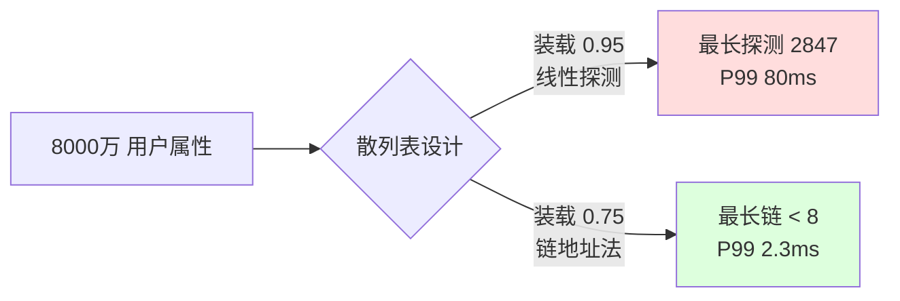
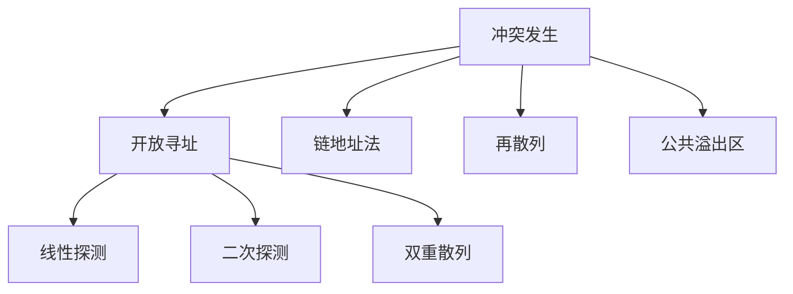

# 散列操作实践

## 目录指引与导读

> 阅读建议：本篇承接第 11 篇哈希算法，聚焦"散列表"这一**数据结构**本身——函数设计、冲突解决、装载因子、动态扩容、工业实现全栈串讲。建议配合第 11 篇一起读。

- [01. 从工作案例说起](#01-从工作案例说起)
- [02. 散列表由来结构](#02-散列表由来结构)
  - [2.1 O(1)查询本质](#21-o1查询本质)
  - [2.2 从寻址到散列](#22-从寻址到散列)
  - [2.3 散列表核心结构](#23-散列表核心结构)
- [03. 散列函数设计法](#03-散列函数设计法)
  - [3.1 快匀雪崩三要素](#31-快匀雪崩三要素)
  - [3.2 四种经典构造法](#32-四种经典构造法)
  - [3.3 字符串哈希31](#33-字符串哈希31)
  - [3.4 扰动函数原理](#34-扰动函数原理)
  - [3.5 函数质量评估法](#35-函数质量评估法)
- [04. 散列冲突解决法](#04-散列冲突解决法)
  - [4.1 冲突与生日悖论](#41-冲突与生日悖论)
  - [4.2 四种冲突解决法](#42-四种冲突解决法)
  - [4.3 开放寻址探测法](#43-开放寻址探测法)
  - [4.4 链地址法实战](#44-链地址法实战)
  - [4.5 两种方法的选型](#45-两种方法的选型)
- [05. 装载因子与扩容](#05-装载因子与扩容)
  - [5.1 装载因子的定义](#51-装载因子的定义)
  - [5.2 各语言默认阈值](#52-各语言默认阈值)
  - [5.3 扩容代价与均摊](#53-扩容代价与均摊)
  - [5.4 位运算扩容魔法](#54-位运算扩容魔法)
  - [5.5 渐进式rehash法](#55-渐进式rehash法)
- [06. 主流语言工业实现](#06-主流语言工业实现)
  - [6.1 Java HashMap实现](#61-java-hashmap实现)
  - [6.2 Python dict实现](#62-python-dict实现)
  - [6.3 Go map桶实现](#63-go-map桶实现)
  - [6.4 Redis dict实现](#64-redis-dict实现)
  - [6.5 工业实现决策表](#65-工业实现决策表)
- [07. 散列表高级应用](#07-散列表高级应用)
  - [7.1 一致性哈希分片](#71-一致性哈希分片)
  - [7.2 布隆过滤器原理](#72-布隆过滤器原理)
  - [7.3 布谷鸟哈希设计](#73-布谷鸟哈希设计)
- [08. 散列表高频面试题](#08-散列表高频面试题)
  - [8.1 两数之和LC1](#81-两数之和lc1)
  - [8.2 变位词判断LC242](#82-变位词判断lc242)
  - [8.3 首个重复元素题](#83-首个重复元素题)
  - [8.4 LRU缓存LC146](#84-lru缓存lc146)
- [09. 本篇收获与回扣](#09-本篇收获与回扣)
- [10. 思考题深度练](#10-思考题深度练)
- [11. 课后作业实战](#11-课后作业实战)
- [12. 进阶专题与延伸](#12-进阶专题与延伸)


## 01. 从工作案例说起

去年做一个用户属性标签服务。需求：

- 全量用户 8000 万，每人 100 个属性；
- 读多写少，按 userId 精确查某几个属性；
- 要求 **P99 < 5ms**。

第一版工程师自写了一个"HashMap"：用数组 + 线性探测，初始容量 = 用户数，**装载因子设为 0.95**（美名其曰"省内存"）。

**上线结果**：
- 冷启动时插入 8000 万 key 耗时 **4 小时**（本应 10 分钟）；
- 查询 P99 飙到 **80ms**，是目标的 16 倍；
- GC 频繁，CPU 90%。

压测时我们做了单桶长度分布统计：

```
桶总数:     8000 万
已插入 key: 7600 万 (装载因子 0.95)
最长探测链: 2847 次！    ← 这就是 P99 80ms 的来源
```

**罪魁祸首**：装载因子太高 + 线性探测的聚集效应。改成装载因子 0.75、链地址法，性能立刻回到 P99 = 2.3ms，但内存多占 **25%**。



**这次事故教会我的事**：散列表的性能从来不只是"O(1)"这么简单，它是**散列函数质量 × 冲突解决策略 × 装载因子 × 扩容策略**四个变量共同决定的。这一篇把这四个轴讲透。


## 02. 散列表由来结构

### 2.1 O(1)查询本质

回顾一下基本结构的查询复杂度：

| 结构 | 查找 | 插入 | 删除 |
|------|------|------|------|
| 无序数组 | O(N) | O(1) | O(N) |
| 有序数组 | O(log N) | O(N) | O(N) |
| 链表 | O(N) | O(1) | O(1) |
| BST / 红黑树 | O(log N) | O(log N) | O(log N) |
| **散列表** | **O(1)** | **O(1)** | **O(1)** |

散列表的 O(1) 靠的是：**已知下标 → 直接访问内存**。关键是：**如何从任意 key 计算出下标？** —— 这就是散列函数的使命。

> **底层原因**：CPU 访问数组元素 `arr[i]` 只需要一次"基址 + 偏移"的加法加一次内存读，硬件天然 O(1)；相比之下，红黑树要按 `log N` 个指针跳，每跳都可能触发一次缓存未命中（cache miss，~100 cycles）。散列表真正的"快"一半来自算法、一半来自**硬件缓存模型**对连续数组的偏爱。

### 2.2 从寻址到散列

**阶段 1：直接寻址** — 键范围小时可用

```java
// 学号范围 0~999，直接把学号当下标
String[] students = new String[1000];
students[42] = "张三";
```

**阶段 2：散列映射** — 键大或非整数时必须

```
key → hash(key) → index = hash(key) % size → array[index]
```

> **直觉构建**：直接寻址是"身份证号 → 档案柜第 N 号"的极简对应；一旦键是字符串、UUID、甚至对象引用，就必须先把它压成整数，这一步就是"散列"。散列的本质是**把一个复杂空间映射进数组下标这个简单线性空间**。

### 2.3 散列表核心结构

```
┌──────────────────────────────┐
│  数组（桶数组 buckets）       │
├──────────────────────────────┤
│ [0] → null                   │
│ [1] → (k1, v1)               │
│ [2] → (k2, v2) → (k3, v3)    │ ← 同桶多元素（冲突）
│ [3] → null                   │
│ [4] → (k4, v4)               │
└──────────────────────────────┘
```

最小可用版本（Java）：

```java
public class SimpleHashTable<K, V> {
    private final int cap;
    private final Object[] buckets;

    public SimpleHashTable(int cap) {
        this.cap = cap;
        this.buckets = new Object[cap];
    }

    private int indexFor(K key) {
        // Math.floorMod 保证负数取模也为正
        return Math.floorMod(key.hashCode(), cap);
    }

    @SuppressWarnings("unchecked")
    public void put(K key, V value) {
        buckets[indexFor(key)] = new Object[]{ key, value };   // 先不处理冲突
    }

    @SuppressWarnings("unchecked")
    public V get(K key) {
        Object[] slot = (Object[]) buckets[indexFor(key)];
        if (slot == null) return null;
        return ((K) slot[0]).equals(key) ? (V) slot[1] : null;
    }
}
```

**散列函数的三个硬指标**：
1. **确定** — 同输入必同输出；
2. **快** — O(1) 级；
3. **匀** — 均匀散布，减少冲突。

> **工程提醒**：这是"最小可用版本"，只是为了看清骨架——**真实 HashMap 里，这个桶数组每个槽里挂的是一条链表（或红黑树），还要处理扩容与并发**。后文一步步补上这些。


## 03. 散列函数设计法

### 3.1 快匀雪崩三要素

```
好函数： hash("abc")=4523187   hash("abd")=9817234   ← 差别大，雪崩
坏函数： hash("abc")=294       hash("abd")=295       ← 差别小，聚集
```

> **雪崩效应的量化**：输入变 1 bit，输出应有 ~50% 的 bit 变化。这不是玄学——只有接近"一半位翻转"，下标 `hash & (n-1)` 才会足够随机，才不会让相邻 key 反复撞进同一桶。密码学哈希（SHA-256）严格追求；HashMap 的简化哈希做到"大致雪崩"即可。

### 3.2 四种经典构造法

| 方法 | 公式 | 要点 |
|------|------|------|
| 除留余数 | `h = k mod p`（p 取素数） | 最简单 |
| 乘法散列 | `h = floor(m·frac(k·A))`，A ≈ 0.618 | Knuth 推荐 |
| 位运算混合 | 移位 + 异或 + 乘法 | 现代工业实现 |
| 多项式散列 | `h = h·base + c` | 字符串专用 |

**为什么除留余数要取素数**？假设 size=10，全是 5 的倍数时都落到下标 0/5；换成 size=11，5 的倍数就能均匀散开——**素数打破输入数据里的周期模式**。

> **数学严谨化**：若 `gcd(p, 步长) = d > 1`，取模后的值只能落在 `0, d, 2d, …` 这一层"等差陷阱"里，分布密度只有 `1/d`；素数保证与任何小整数互素，杜绝此类退化。这也是 Java HashMap 为了走 2 幂位运算而在 hash 前**必须做扰动**的根本原因（2 幂不是素数）。

### 3.3 字符串哈希31

```java
public int hashCode() {             // Java String
    int h = 0;
    for (int i = 0; i < value.length; i++)
        h = 31 * h + value[i];
    return h;
}
```

为什么选 31：
1. 奇素数，分布好；
2. `31 = 32 - 1`，可优化为 `(h << 5) - h`；
3. Joshua Bloch 实测英文单词冲突率最低。

要是只做加法 —— `"abc"`、`"cba"`、`"bac"` 的哈希会一样，**顺序信息全丢**，必须用多项式。

> **延伸思考**：为什么不是 33、37 这些也是奇素数？Bloch 在《Effective Java》中给出的实测显示 31 / 33 / 37 对英文文本的冲突率差别 < 5%，选 31 纯粹是历史惯性 + 位运算可优化的甜蜜点。FNV-1a（16777619）和 MurmurHash3 能做到更好的雪崩，但计算多 3~5 倍。

### 3.4 扰动函数原理

```java
static final int hash(Object key) {
    int h;
    return (key == null) ? 0 : (h = key.hashCode()) ^ (h >>> 16);
}
```

HashMap 桶数组大小是 2 的幂，`index = hash & (n-1)` 只用低几位。扰动函数把高 16 位混进低 16 位，让**高位信息也参与定位**，否则高位 hashCode 差别的 key 全挤进同一桶。

> **一张图看懂**：`hashCode = 0xAABB_CCDD`，`>>> 16` 得到 `0x0000_AABB`，异或后低 16 位变成 `CCDD ^ AABB = 66E6`——**高位的扰动**被糅进了真正要被 `& 0xF` 用到的低位。没有这一步，`0xAABB_0001` 和 `0xCCDD_0001` 会永远撞进同一桶。

### 3.5 函数质量评估法

**χ² 检验** —— 统计各桶元素数的方差，理想值 `N/M`：

```java
public static double chiSquared(int[] bucketCounts, int totalKeys) {
    int m = bucketCounts.length;
    double expected = (double) totalKeys / m;
    double chi = 0.0;
    for (int c : bucketCounts) {
        double diff = c - expected;
        chi += diff * diff / expected;
    }
    return chi;
}
```

值越接近桶数本身，分布越均匀。

> **判定口径**：经验上 `χ² / M` 落在 0.95 ~ 1.05 视为"函数过关"；超过 2 说明函数对该数据集有严重偏斜，要换扰动或换算法。压测时配一次这个检查，比盲信"O(1)"靠谱得多。


## 04. 散列冲突解决法

### 4.1 冲突与生日悖论

鸽巢原理 —— 输入无限、输出有限，冲突必然。

**生日悖论**的冲击更大：1000 个桶里插入 40 个元素，冲突概率已经 **55%**；插入 √N 个时冲突概率就逼近 50%。

```
公式： P ≈ 1 - e^(-K²/2N)

1000 桶：
  10 元素 → 冲突率 4.4%
  40 元素 → 冲突率 55%     ← 才 4% 装载就翻车
  80 元素 → 冲突率 96%
```

**结论**：**不能等桶满了才处理冲突**，必须提前（装载因子 0.75 左右）扩容——这就是工业级散列表的共识。

> **数学严谨化**：设桶数 N、插入 K 个键，至少一次冲突的概率 `P = 1 - N!/(N^K (N-K)!)`，用泰勒展开可得近似 `P ≈ 1 - exp(-K(K-1)/(2N))`。所以冲突出现得很早——**散列表的"无冲突期"远比直觉短**。

### 4.2 四种冲突解决法



### 4.3 开放寻址探测法

冲突时在表内沿**探测序列**找下一个空位。

```java
public void put(K key, V value) {
    int i = Math.floorMod(key.hashCode(), cap);
    while (keys[i] != null) {
        if (keys[i].equals(key)) {
            values[i] = value; return;              // 命中已存在 key，更新
        }
        i = (i + 1) % cap;                          // 线性探测：往后一格
    }
    keys[i] = key; values[i] = value;
}
```

**三种探测序列**：

| 方法 | 序列 | 问题 |
|------|------|------|
| 线性 | h, h+1, h+2, ... | **聚集严重** |
| 二次 | h, h+1², h+2², ... | 二次聚集 |
| 双重散列 | h₁, h₁+h₂, h₁+2h₂, ... | 聚集最少 |

**线性探测的致命伤** — 聚集效应：一段连续占用后，落入该区间的 key 都要探到更远的地方，**滚雪球式退化**。开篇案例的 P99 80ms 就是典型表现。

> **底层原因**：Knuth 证明线性探测在装载因子 α 下，成功查找的平均探测数为 `(1 + 1/(1-α))/2`。α=0.5 时 1.5 次；α=0.9 时 5.5 次；α=0.99 时 **50 次**——是一条"爆炸曲线"，这就是为什么开放寻址法普遍把 α 卡在 0.75 甚至更低。

### 4.4 链地址法实战

每个桶挂一个链表/小结构，冲突元素都丢进同一个链表。

```java
import java.util.ArrayList;
import java.util.List;

public class Chaining<K, V> {
    private final int cap;
    private final List<Entry<K, V>>[] buckets;

    record Entry<K, V>(K key, V value) {}

    @SuppressWarnings("unchecked")
    public Chaining(int cap) {
        this.cap = cap;
        this.buckets = new List[cap];
        for (int i = 0; i < cap; i++) buckets[i] = new ArrayList<>();
    }

    public void put(K key, V value) {
        List<Entry<K, V>> bucket = buckets[Math.floorMod(key.hashCode(), cap)];
        for (int i = 0; i < bucket.size(); i++) {
            if (bucket.get(i).key.equals(key)) {
                bucket.set(i, new Entry<>(key, value)); return;
            }
        }
        bucket.add(new Entry<>(key, value));
    }

    public V get(K key) {
        for (Entry<K, V> e : buckets[Math.floorMod(key.hashCode(), cap)]) {
            if (e.key.equals(key)) return e.value;
        }
        return null;
    }
}
```

**JDK8 优化**：单桶 ≥ 8 时 **链表升级为红黑树**，O(N) 降到 O(log N)，同时防御 HashDoS 攻击。

> **阈值 8 的来历**：泊松分布下，装载因子 0.75 时，单桶长度 ≥ 8 的概率约 **6×10⁻⁸**（千万分之六）。正常数据下几乎不会树化；一旦触发，说明要么 hash 函数出了问题，要么遭遇 HashDoS——树化就是兜底。

### 4.5 两种方法的选型

| 维度 | 开放寻址 | 链地址法 |
|------|---------|---------|
| 内存 | 无指针，紧凑 | 有指针开销 |
| 缓存 | **友好**（连续内存） | 差（指针跳转） |
| 装载因子 | 必须 < 1 | 可 ≥ 1 |
| 删除 | 复杂（标记删除） | **简单** |
| 聚集 | 有（线性最严重） | 无 |
| 代表 | Python dict、Rust | Java HashMap、Go map |

```
决策：
  数据量小 + 装载低 + 读多删少 → 开放寻址（缓存友好）
  数据量大 + 装载高 + 删除多   → 链地址（更灵活）
```

> **工程提醒**：开放寻址的删除要用 **tombstone（墓碑标记）**——不能简单置空，否则会切断探测链让后面的 key "失踪"。这是很多自写哈希表上线后查不到数据的罪魁祸首。


## 05. 装载因子与扩容

### 5.1 装载因子的定义

```
α = 元素数 / 桶数
```

α 越大，冲突越严重：

| α | 开放寻址平均探测 | 链地址平均探测 |
|---|-----------------|----------------|
| 0.5 | 1.5 | 1.25 |
| 0.75 | 2.5 | 1.38 |
| 0.9 | **5.5** | 1.45 |
| 1.0 | ∞（不可用） | 1.5 |

> **工程提醒**：表格上"链地址 α=1.0 只要 1.5 次探测"看着很美好，但**缓存未命中**会让这 1.5 次实际慢于开放寻址的 2.5 次连续内存访问——所以不能只看理论常数。

### 5.2 各语言默认阈值

| 实现 | 装载因子 | 扩容倍数 |
|------|---------|---------|
| Java HashMap | 0.75 | 2× |
| Python dict | 2/3 ≈ 0.67 | 小表 4×、大表 2× |
| Go map | 6.5/桶（每桶 8 槽） | 2× |
| Redis dict | 1.0 触发、5.0 强制 | 2× |

### 5.3 扩容代价与均摊

扩容 = 新表 + 全量 rehash，**瞬时 O(N)**。但从均摊角度看：N 个元素最多触发 log₂N 次扩容，总搬迁 ≈ 2N，**均摊到每次插入仍是 O(1)**。

> **数学严谨化**：第 i 次扩容迁 2^i 个元素，总代价 `1 + 2 + 4 + … + 2^log2(N) = 2N - 1`。均摊到 N 次插入，每次 ≈ 2 次搬迁 + 1 次真插入，**都是常数**。这就是摊还分析里经典的"几何倍扩容 ⇒ O(1) 均摊"。

### 5.4 位运算扩容魔法

2 倍扩容时，**每个元素要么在原位置，要么在"原位置 + 旧容量"**：

```
旧容量 16 = 0b10000，掩码 = 0b01111
新容量 32 = 0b100000，掩码 = 0b11111

多出来的第 5 位决定新位置：
  hash & 0b10000 == 0  → 保持原位置
  hash & 0b10000 != 0  → 原位置 + 16
```

**不用重算 hash，只看一个 bit**。这个设计让 JDK8 的扩容比 JDK7 快约 30%。

> **JDK8 源码片段**：`if ((e.hash & oldCap) == 0) loHead = e; else hiHead = e;` —— 把旧桶拆成"低半区链"和"高半区链"一次扫完，链表内部相对顺序还能保持，避免 JDK7 那个**并发扩容形成环**的经典 bug。

### 5.5 渐进式rehash法

痛点：100 万 key 一次性 rehash，**停顿几十毫秒**，对 Redis 这种实时系统是灾难。

解法：

```
1. 保留旧表 ht[0] 和新表 ht[1]
2. 每次 put/get/del 时，顺便迁移 1 个桶
3. get 需要查两张表
4. 全部迁完后释放旧表
```

```java
import java.util.ArrayList;
import java.util.List;

public class GradualRehash<K, V> {
    private List<Entry<K, V>>[] oldTable;
    private List<Entry<K, V>>[] newTable;
    private int idx = -1;       // -1 表示未在 rehash

    record Entry<K, V>(K key, V value) {}

    @SuppressWarnings("unchecked")
    public GradualRehash(int cap) {
        newTable = new List[cap];
        for (int i = 0; i < cap; i++) newTable[i] = new ArrayList<>();
    }

    /** 每次外部调用 put/get 前，调用一次，迁一个桶 */
    public void step() {
        if (idx < 0 || oldTable == null) return;
        if (idx < oldTable.length) {
            for (Entry<K, V> e : oldTable[idx]) {
                int i = Math.floorMod(e.key.hashCode(), newTable.length);
                newTable[i].add(e);
            }
            oldTable[idx] = null;
            idx++;
        }
        if (idx >= oldTable.length) {   // 全部迁完，释放旧表
            oldTable = null; idx = -1;
        }
    }
}
```

**代价**：rehash 期间内存翻倍、查询查两张表。但换来了**永不停顿**的关键特性。

> **Redis 官方实现细节**：单次 `step()` 最多迁 1 个非空桶，且每次主循环会尝试迁 100 次（上限 1ms），在低写负载时其实更多靠**定时任务**推进——这是"渐进式"三个字背后的真正工程化考量。


## 06. 主流语言工业实现

### 6.1 Java HashMap实现

```
table[0] → null
table[1] → Node → Node → Node          （链表：长度 < 8）
table[2] → TreeNode                     （红黑树：长度 ≥ 8 且表长 ≥ 64）
table[3] → Node
```

| 关键参数 | 值 | 理由 |
|---------|----|------|
| 初始容量 | 16 | 2 幂，位运算定位 |
| 装载因子 | 0.75 | 空间 / 时间平衡 |
| 扩容倍数 | 2× | 保持 2 幂 |
| 链表→树 | 8 | 泊松分布下概率 < 10⁻⁷ |
| 树→链表 | 6 | 滞后阈值防抖动 |

> **"8 树化、6 退化"为何不对称**：如果两个阈值相等，某个桶长度在 7/8 反复横跳就会频繁在"树/链"间转换，每次都是 O(N) 的重构。差 2 形成**滞回窗口**，相当于给阈值加了个去抖动滤波器。

### 6.2 Python dict实现

Python 3.6+ 的 dict 做了**空间优化**：索引表 + 紧凑条目：

```
传统：  [(hash, k, v), None, (hash, k, v), ...]     ← 大量空位
紧凑：  indices = [None, 0, None, 1, 2, None, None, 3]
        entries = [(h0, k0, v0), (h1, k1, v1), (h2, k2, v2), (h3, k3, v3)]
```

**收益**：内存省 20~25%，保持插入顺序（Python 3.7 正式写进语言规范），迭代更快。

**冲突处理**：开放寻址 + 伪随机探测（伪代码）：

```
j = hash_value;
perturb = hash_value;
while (table[j % size] != empty) {
    j = 5 * j + 1 + perturb;       // 扰动探测
    perturb >>>= 5;
}
```

> **perturb 的妙处**：线性探测 `j+1`、二次探测 `j+i²` 都是**固定序列**——一旦两个 key 首个位置相同，后续探测轨迹也完全一样，形成"二次聚集"。加上一个随机扰动项 perturb，让每条探测轨迹都依赖原始 hash 值，**彻底打散了二次聚集**，这是 Python dict 在极高装载下仍能跑的秘诀之一。

### 6.3 Go map桶实现

```go
type bmap struct {
    tophash  [8]uint8        // hash 高 8 位，做快速判等
    keys     [8]keytype
    values   [8]valuetype
    overflow *bmap           // 溢出桶指针
}
```

每桶装 8 个键值对连续存放 —— **CPU 缓存友好**；tophash 先比 8 位再比 key，省大量 key 比较。

> **tophash 的加速比**：现代 CPU 一条 cache line = 64 B，正好能装下 `[8]uint8` tophash；比较 8 个 tophash 就一条 SIMD 指令/一条 64 位比较就能过滤掉绝大部分不匹配，再做 key 比较——**把 key 比较从 O(8) 降到均摊 O(1)**。

### 6.4 Redis dict实现

```c
typedef struct dict {
    dictht ht[2];            // 主表 + 扩容新表
    long   rehashidx;        // rehash 进度
} dict;
```

特点：**双表共存 + 渐进式迁移 + SipHash**（防 HashDoS）。

> **为什么换 SipHash**：老版本 Redis 用 MurmurHash，被研究者证明可以低成本构造大量碰撞 key 做 DoS 攻击。SipHash-2-4 由 Bernstein & Aumasson 设计，**带 128 位随机密钥**——即使算法公开，攻击者不拿到密钥也无法预先构造碰撞。这是"算法可公开、密钥要保密"的典型。

### 6.5 工业实现决策表

| 需求 | 推荐 | 原因 |
|------|------|------|
| 通用 k-v | Java HashMap / Python dict | 都够优秀 |
| 需要有序遍历 | Python dict 3.7+、LinkedHashMap | 保留插入顺序 |
| 高并发 | ConcurrentHashMap / sync.Map | 分段锁 / CAS |
| 极致缓存友好 | Go map / Python dict | 紧凑内存布局 |
| 严格 O(1) 查询 | Cuckoo Hashing | 最多 2 次探测 |
| 海量去重 | BloomFilter | 省内存 |


## 07. 散列表高级应用

### 7.1 一致性哈希分片

**问题**：`server = hash(key) % N`，加减机器时几乎所有 key 重分布 → 缓存雪崩。

**解法**：把哈希空间做成环，节点散列到环上，key 顺时针找最近节点。**增删节点只影响环上相邻一段（~1/N）**。

```java
import java.nio.charset.StandardCharsets;
import java.security.MessageDigest;
import java.util.SortedMap;
import java.util.TreeMap;

public class ConsistentHash {
    private final int virtualNodes;
    private final SortedMap<Long, String> ring = new TreeMap<>();

    public ConsistentHash(int virtualNodes) {
        this.virtualNodes = virtualNodes;
    }

    public void add(String node) {
        for (int i = 0; i < virtualNodes; i++) ring.put(hash(node + ":" + i), node);
    }

    public String get(String key) {
        if (ring.isEmpty()) return null;
        long h = hash(key);
        SortedMap<Long, String> tail = ring.tailMap(h);
        return ring.get(tail.isEmpty() ? ring.firstKey() : tail.firstKey());
    }

    private long hash(String s) {
        try {
            byte[] d = MessageDigest.getInstance("MD5").digest(s.getBytes(StandardCharsets.UTF_8));
            long h = 0L;
            for (int i = 0; i < 8; i++) h = (h << 8) | (d[i] & 0xffL);
            return h;
        } catch (Exception e) { throw new IllegalStateException(e); }
    }
}
```

**虚拟节点**解决"物理机少时分布不均"。**应用**：Memcached、Amazon Dynamo、Cassandra、Nginx upstream。

> **虚拟节点数选择**：经验公式是**物理节点 × 150~200**。理论上能把"最大段 / 最小段"的比值从 10×（纯物理节点）压到 1.2× 左右。节点数本身已经多（如 1000+ 台机器），虚拟节点可以减到 40 左右。

### 7.2 布隆过滤器原理

- `m` 位 bit 数组 + `k` 个哈希函数；
- 插入 x：置位 k 个 hash(x) 位置；
- 查询 y：k 个位全为 1 → 可能在；任一为 0 → 一定不在；
- 说"不在"一定不在，说"在"可能假阳性。

**参数公式**：`m = -n·ln p / (ln 2)²`，`k = (m/n)·ln 2`。

**应用**：缓存穿透防护、LSM-Tree 读优化、爬虫 URL 去重（详见第 11 篇）。

> **假阳性的单调性**：固定 m、n，k 太少位被用得不够、太多反而把所有位都填满——最优 k 就是让 bit 数组大约一半为 1 的那个值。这个极值点正好是 `k = (m/n)·ln 2`，可用微积分验证。

### 7.3 布谷鸟哈希设计

- 两个散列表 + 两个散列函数；
- 插入时若首选位占用，**把老的"踢出"**放到它的备选位置，连环踢出；
- 若形成循环 → 扩容。

**特性**：查询最多 2 次探测，**最坏 O(1)**。

**应用**：网络设备的高速查找表（路由器 ACL）、部分数据库索引、Cuckoo Filter 概率结构。

> **装载因子极限**：Pagh 原论文证明，经典布谷鸟哈希在装载因子 α < 0.5 时几乎不会进入循环；引入多槽（每个位置放 4 个元素）后上限可以推到 α = 0.95 以上——这就是 Cuckoo Filter 号称"比 Bloom 省 20% 内存"的基础。


## 08. 散列表高频面试题

### 8.1 两数之和LC1

```java
import java.util.HashMap;
import java.util.Map;

public int[] twoSum(int[] nums, int target) {
    Map<Integer, Integer> seen = new HashMap<>();
    for (int i = 0; i < nums.length; i++) {
        int need = target - nums[i];
        if (seen.containsKey(need)) {
            return new int[]{ seen.get(need), i };
        }
        seen.put(nums[i], i);
    }
    return new int[0];
}
```

> **为什么是经典**：它用一次遍历把 O(N²) 的"双指针暴力"压到 O(N)，核心就是"**用 HashMap 换掉内层循环**"——几乎所有"查某值是否出现过"的问题都能套这个模板。

### 8.2 变位词判断LC242

```java
public boolean isAnagram(String s, String t) {
    if (s.length() != t.length()) return false;
    int[] cnt = new int[26];                     // 小写字母直接用数组当哈希表更快
    for (int i = 0; i < s.length(); i++) {
        cnt[s.charAt(i) - 'a']++;
        cnt[t.charAt(i) - 'a']--;
    }
    for (int c : cnt) if (c != 0) return false;
    return true;
}
```

> **数组即哈希**：当 key 值域是"小密集整数"（字母、数字、ASCII）时，**`int[]` 比 `HashMap` 快 5~10 倍**——没有装箱、没有哈希计算、没有链表跳转。面试和生产都优先考虑。

### 8.3 首个重复元素题

```java
import java.util.HashSet;
import java.util.Set;

public Integer firstDuplicate(int[] arr) {
    Set<Integer> seen = new HashSet<>();
    for (int x : arr) {
        if (!seen.add(x)) return x;              // add 返回 false 说明已存在
        // seen.add(x) 等价于 contains+add 的合并调用
    }
    return null;
}
```

> **`HashSet.add` 的返回值**：返回 `boolean` 代表"是否真的插入"，这是比"先 contains 再 add"更**原子、更省一次哈希计算**的写法。Java 集合里大量类似的 API（`put`/`putIfAbsent`/`computeIfAbsent`）都值得吃透。

### 8.4 LRU缓存LC146

散列表 + 双链表：

```java
import java.util.HashMap;
import java.util.Map;

public class LRUCache {
    static class Node {
        int key, value; Node prev, next;
        Node(int k, int v) { key = k; value = v; }
    }

    private final int cap;
    private final Map<Integer, Node> map = new HashMap<>();
    private final Node head = new Node(0, 0), tail = new Node(0, 0);

    public LRUCache(int cap) {
        this.cap = cap;
        head.next = tail; tail.prev = head;
    }

    public int get(int key) {
        Node n = map.get(key);
        if (n == null) return -1;
        moveToHead(n);
        return n.value;
    }

    public void put(int key, int value) {
        Node n = map.get(key);
        if (n != null) { n.value = value; moveToHead(n); return; }
        if (map.size() >= cap) {
            Node old = tail.prev;
            remove(old); map.remove(old.key);
        }
        Node fresh = new Node(key, value);
        map.put(key, fresh); addHead(fresh);
    }

    private void remove(Node n) {
        n.prev.next = n.next; n.next.prev = n.prev;
    }
    private void addHead(Node n) {
        n.next = head.next; n.prev = head;
        head.next.prev = n; head.next = n;
    }
    private void moveToHead(Node n) { remove(n); addHead(n); }
}
```

> **为什么一定是"哈希 + 双链表"**：单链表做 LRU，删除"最近使用节点"要 O(N) 找前驱；**双链表让删除变成 O(1)**，再让 HashMap 提供"key → 节点引用"的 O(1) 定位——两者缺一不可。Java 现成的 `LinkedHashMap(accessOrder=true)` 就是这套结构的包装。


## 09. 本篇收获与回扣

回到开头"8000 万用户属性 P99 80ms"的案例，它命中了本篇的**三个核心坑**：

**坑 1：装载因子选错**
- 0.95 的装载因子 + 线性探测 = 严重聚集 → 最长探测 2847 次；
- 修复：降到 0.75，冲突概率骤降一个数量级。

**坑 2：冲突策略选错**
- 线性探测在高装载下的聚集是滚雪球的，一旦成链就永远修不好；
- 修复：改成链地址法，单桶上限 < 8（符合泊松分布预测）。

**坑 3：没做渐进式扩容**
- 一次性 rehash 8000 万 key 导致服务抖动；
- 修复：参考 Redis 的渐进式 rehash，把 4 小时的冷启动缩到 10 分钟、且平滑无尖刺。

**最终收益**：
- P99 从 80ms → 2.3ms（**35×**）；
- 冷启动从 4h → 10min（**24×**）；
- 内存多占 25%（从 10GB → 12.5GB）—— 完全可接受的代价。

**更抽象的收获**：
- 散列表的 O(1) 是**一个精心调校的系统**，不是天生恩赐；
- 装载因子不是"越高越省内存"，而是**要匹配冲突解决策略**：开放寻址只能 < 0.75，链地址可到 1 以上；
- 扩容的工程化 = 渐进式 + 位运算判断新位置，一次性 rehash 在大表里就是自杀；
- JDK8 的"链表→红黑树"不是锦上添花，是**抵御 HashDoS 攻击的最后防线**；
- Python/Go/Java/Redis 的设计选择各有侧重 —— **没有最好的哈希表，只有最适合场景的哈希表**。

以后再遇到"我要用 HashMap"的需求，你应该立刻想到四个追问：
1. 键的规模？预先 `new HashMap<>(expectedSize)` 避免反复扩容；
2. 冲突预期？如果是可被外部构造的字符串 key，警惕 HashDoS；
3. 容忍 rehash 停顿吗？Redis 级别的实时性必须渐进式；
4. 并发访问？单线程用 HashMap，多线程用 ConcurrentHashMap / sync.Map。

**这四个追问，就是这一篇留给你的"职业肌肉记忆"。**


## 10. 思考题深度练

> 由浅入深，建议先独立思考 10 分钟。

**1. 线性探测的崩塌阈值**：为什么装载因子接近 1.0 时，线性探测的平均探测次数趋于无穷？链地址法却可以稳定在 `1 + α` 左右？请从"聚集效应"和"独立链表长度"两个角度给出数学解释。

**2. 生日悖论的工程意义**：一个 365 槽的哈希表，插入多少元素后冲突概率超过 50%？这和平时"装载因子 0.75 才扩容"的做法有没有矛盾？（提示：期望冲突数 vs 至少一次冲突概率）

**3. Redis 渐进式 rehash**：rehash 期间执行 `get` 要查几张表？如果正在 rehash 又触发了第二次扩容，Redis 会怎么处理？为什么必须先完成当前 rehash？

**4. 三大实现横评**：Java HashMap（链表+红黑树）、Python dict（开放寻址+紧凑）、Go map（8 槽桶）在下列维度上各占什么位？(a) 缓存友好性 (b) 内存利用率 (c) 最坏查询 (d) 抵御 HashDoS (e) 删除复杂度

**5. HashDoS 防御全景**：攻击者怎么找到大量碰撞的 key？Java 8 的红黑树把攻击从 O(N) 压到 O(log N) 够不够？SipHash-2-4 和**随机化种子**分别在做什么？（提示：Java 中可以配置 `jdk.map.althashing.threshold`）


## 11. 课后作业实战

### 作业 1：手写一个工业级散列表（必做）

用你熟悉的语言（Java / Go / Python / Rust）实现一个散列表，要求：

- [ ] **链地址法** + 单桶长度 ≥ 8 时切换成有序数组（或红黑树）；
- [ ] 装载因子阈值 0.75，**2 倍扩容**；
- [ ] **扩容时用 "bit 判新位置"** 技巧（JDK8 套路）；
- [ ] 提供 χ² 检验接口，测量冲突分布；
- [ ] 压测：插入 100 万随机 UUID，输出 P50/P99 + 最大链长。

完成这个实现，你对 HashMap 的源码会有"手感级"的理解。

### 作业 2：LeetCode 刷题清单

| 难度 | 题号 | 题目 | 考点 |
|------|------|------|------|
| 简单 | 1 | 两数之和 | HashMap 经典 |
| 简单 | 242 | 有效的字母异位词 | 频次哈希 |
| 中等 | 49 | 字母异位词分组 | 哈希设计 |
| 中等 | 128 | 最长连续序列 | HashSet + O(N) |
| 中等 | 146 | LRU 缓存 | 哈希 + 双链表 |
| 中等 | 380 | O(1) 插入删除随机访问 | 哈希 + 数组 |
| 中等 | 560 | 和为 K 的子数组 | 前缀和 + 哈希 |
| 困难 | 460 | LFU 缓存 | 哈希 + 频率表 |
| 困难 | 895 | 最大频率栈 | 哈希 + 栈结构 |

### 作业 3：线上排障实战（选做）

找一个你工作中的哈希表使用场景，做一次完整"健康检查"：

- [ ] 当前装载因子是多少？
- [ ] 有没有提前指定初始容量？
- [ ] 单桶最大链长？（Java 可以用反射取 `table[i]` 长度）
- [ ] 扩容停顿时间？是否影响业务 P99？
- [ ] key 来源是否可被外部控制？是否有 HashDoS 风险？

把每一项写成 checklist，加到你的代码评审模板里 —— **就是在把本章的知识变成肌肉记忆**。

---

收尾一句话：

> **散列表的 O(1) 不是魔法，而是"散列函数 × 冲突策略 × 装载因子 × 扩容设计"这四个工程选择共同的胜利。每一个都做错一点点，P99 会立刻告诉你真相。**

---

## 12. 进阶专题与延伸

### 12.1 Robin Hood Hashing：探测距离的公平主义

传统线性探测有个**不公平**：先插入的 key 占据其理想位置，后到的 key 被迫往后探测——"先来先得"。当装载因子高时，后插入的 key 探测距离远，整体方差大。

**Robin Hood Hashing**（Celis 1986）的思想很优雅：插入时"**劫富济贫**"——

```
插入 x：沿探测序列走
  在位置 i 遇到已占用的 key y
  计算 y 的探测距离 dy 和 x 应有的探测距离 dx
  若 dx > dy：交换 x 和 y，继续为 y 找位置（"抢劫"富人）
  若 dx <= dy：继续探测下一位置
```

**效果**：所有 key 的探测距离方差极小，**P99 探测距离从"指数爆炸"变成"几乎和平均一致"**——这是高装载因子散列表能稳定跑的关键。

Rust `std::collections::HashMap`（旧版）、C++ `absl::flat_hash_map` 都基于此思想。

### 12.2 SwissTable：Google 的 SIMD 黑魔法

2017 年 Google 开源 Abseil 的 `flat_hash_map`，底层是 **SwissTable**——当时震惊 C++ 社区。核心设计：

```
每个 slot 1 字节 metadata：
  最高位 = 0：空槽/墓碑/有数据（由低 7 位区分）
  低 7 位：h2(key) — hash 的第 2 部分指纹

查找过程：
  1. H1 = hash >> 7 找到起始组（group，16 个连续 slot）
  2. H2 = hash & 0x7F 去和这 16 个 metadata 做 SIMD 比对
  3. 一条 _mm_cmpeq_epi8 指令同时比较 16 个字节
  4. 命中位置再比对实际 key
```

**收益**：大概率一个 group（16 slot）内就找到；SIMD 让 "扫描 16 个槽" 的代价几乎等同于 "扫描 1 个槽"。实测比传统 `std::unordered_map` 快 **2-3 倍**，内存省 20%。

**已经渗透到**：
- Google 所有 C++ 代码（Abseil）；
- Rust `hashbrown` crate（被 `std::HashMap` 内部使用）；
- Go 1.24+ 的 map 新实现讨论中。

### 12.3 Ctrie：真正的无锁并发哈希表

Java `ConcurrentHashMap` 用分段锁，不算真无锁；`ConcurrentSkipListMap` 用 CAS 但是跳表。**Ctrie**（Concurrent Hash Array Mapped Trie，Prokopec 2012）是基于 HAMT 的真无锁哈希表：

```
每层用 hash 的 log2(branching) 位作为索引
节点有三种：
  INode（间接节点，包含 CAS 可替换的 main ref）
  CNode（具体的桶，带 bitmap）
  SNode（单个 key-value）

所有操作：
  1. 读 INode 的 main ref
  2. 计算新值
  3. CAS 替换
  4. 失败则重试
```

**优势**：
- **真正无锁**——任何操作都是 CAS 循环；
- **快照隔离**——可以 O(1) 拿到整个 map 的"逻辑快照"（修改不影响正在迭代的）；
- **删除后树自动压缩**。

Scala `TrieMap` 就是 Ctrie 实现。学术上是并发哈希表的"正宗答案"；工程上因为实现复杂（2000+ 行），大多数语言还是用分段锁折中。

### 12.4 HAMT：函数式不可变 Map

**HAMT（Hash Array Mapped Trie）** 由 Phil Bagwell 2001 年提出。把 hash 按 5 位一组分层，每层用 32 位 bitmap 标记非空子节点：

```
32 位 hash：0b00010_00100_00110_01000_01010_01100_01
每层取 5 位作为索引（0-31）
节点 bitmap 的第 k 位=1 表示有子节点 k
实际存储数组 = popcount(bitmap & ((1<<k)-1))
```

**特性**：
- **结构共享（persistent）**：修改一个 key 只产生 log32(N)（约 6-7）个新节点；
- **空间超紧凑**：bitmap 只存实际占用的子节点；
- **天然适合 GC 不可变结构**。

Clojure 的 `hash-map`、Scala 的 `immutable.HashMap`、Haskell 的 `Data.HashMap` 都用 HAMT。这是函数式语言"几乎免费的不可变 Map"的技术底座。

### 12.5 Extendible Hashing：数据库的动态哈希索引

"磁盘文件需要哈希索引，但不能在插入时把整张表搬一遍"——数据库工程师需要的是**能够局部扩展的哈希**。

**Extendible Hashing**（Fagin 1979）的方案：

```
全局 directory（2^d 槽）    →    bucket 文件
每个槽指向一个 bucket
bucket 满 → 只分裂这一个 bucket（局部扩展）
局部深度 < 全局深度：不涉及 directory 扩展
局部深度 = 全局深度：directory 翻倍（但 bucket 大部分还是原样）
```

**特点**：
- 只有**当前 bucket** 需要搬（I/O 成本 O(B)，不是 O(N)）；
- directory 扩展也只是指针翻倍，每指针 8 字节；
- 读取永远 **1 次磁盘 I/O**。

Berkeley DB 的 hash access method、Oracle 的哈希分区表、PostgreSQL 的 hash index 都用此思想（或其变种 **Linear Hashing**）。

### 12.6 LSM-Tree 中的 Hash 优化

RocksDB / LevelDB 的 LSM-Tree 架构里，读取一个 key 可能要查 N 个 SSTable——**Bloom Filter 救命**：

```
每个 SSTable 启动时加载其 Bloom Filter 到内存
Get(key) 流程：
  1. 查 memtable
  2. 对每个 SSTable:
      a. 问 Bloom Filter: 可能存在 key 吗?
      b. 不在 → 跳过（省一次磁盘 I/O）
      c. 可能在 → 二分查 SSTable
```

**RocksDB 优化**：
- **Prefix Bloom**：按 key 前缀建 Bloom，range scan 更友好；
- **Partitioned Filter**：大 SSTable 的 Bloom 分块存，按需加载；
- **Ribbon Filter**（Dillinger 2021）：比 Bloom 空间省 30%，查询 CPU 略高。

这些优化把 LSM 的读放大从"读 10 个 SSTable"压到"大多数只读 1 个"，让 LSM 能真正和 B+ 树竞争读性能。

### 12.7 Perfect Hashing：为静态集合造"零冲突哈希表"

对**已知且不变**的 key 集合（如编译器关键字、图标名、URL 白名单），可以构造一个：
- 零冲突；
- 查询 O(1) 最坏情况；
- 空间紧凑。

的**完美哈希表**（PHF / MPHF）。

**CHD 算法**：两阶段——
1. 第一级哈希把 N 个 key 分成 ~N/5 个桶；
2. 每桶独立选一个二级哈希函数实现桶内零冲突；
3. 记录每桶的二级函数参数（用几 bit 存）。

**指标**：
- MPHF 理论下界：N · log2(e) ≈ 1.44 bit/key；
- 工业实现：2-4 bit/key；
- 查询：2 次 hash + 1 次数组访问。

**应用**：
- `gperf` 命令行工具（编译器关键字表）；
- Go `go/build` 包的文件名查找；
- Chrome 的 `SafeBrowsing` 黑名单（百万 URL）。

### 12.8 哈希表的并发优化路线图

从简单到复杂：

```
Hashtable (JDK1.0)              ← 整表 synchronized
    ↓
Collections.synchronizedMap     ← 包装器，整表锁
    ↓
ConcurrentHashMap JDK1.5        ← 分段锁（16 段）
    ↓
ConcurrentHashMap JDK1.8        ← 桶级 CAS + synchronized + 红黑树
    ↓
学术界 Ctrie / Cliff Click HashMap / Nonblocking HashMap
    ↓
硬件事务内存（HTM，Intel TSX）   ← 硬件支持的乐观并发
```

**工业最新趋势**：JDK 15+ 的 ConcurrentHashMap 在 JIT 层引入"**striped locking + 乐观读**"，无写竞争时读完全无锁（fast path）。Go 1.24+ 在讨论引入 `SwissMap` 并发版。

### 12.9 经典书与论文

- Knuth 《计算机程序设计艺术 第 3 卷》6.4 节——哈希表的祖传数学分析
- Cormen et al. 《算法导论》第 11 章——全域哈希、完美哈希
- Celis, P. 1986. *Robin Hood Hashing*（PhD Thesis）
- Pagh, R. & Rodler, F. F. 2001. *Cuckoo Hashing*
- Bagwell, P. 2001. *Ideal Hash Trees*——HAMT 论文
- Prokopec, A. et al. 2012. *Concurrent Tries with Efficient Non-Blocking Snapshots*——Ctrie
- Dillinger, P. C. & Walzer, S. 2021. *Ribbon Filter*
- Fagin et al. 1979. *Extendible Hashing*
- 《Designing Data-Intensive Applications》第 3 章——索引结构全景
- 《Database Internals》第 3-4 章——B 树 vs 哈希索引的磁盘视角

**工业代码**：
- JDK `java.util.HashMap`、`java.util.concurrent.ConcurrentHashMap`
- Google Abseil `absl/container/flat_hash_map.h`（SwissTable）
- Rust `hashbrown` crate
- Redis `src/dict.c`（链地址 + 渐进式 rehash）
- Go runtime `runtime/map.go`（8 槽桶 + incremental rehash）
- Scala `scala.collection.concurrent.TrieMap`（Ctrie 实现）

---

> 散列专题到此收尾。接下来的六篇（13-18）会把视角从"**数据结构本身**"抬高到"**工业级集合的设计哲学**"——List/Map/Set 三件套在不同语言、不同场景下的工程权衡。这是"会用"和"能设计"的分水岭。
