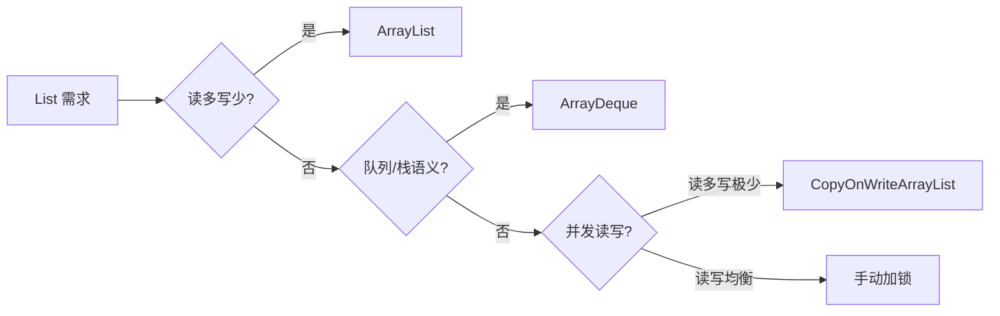
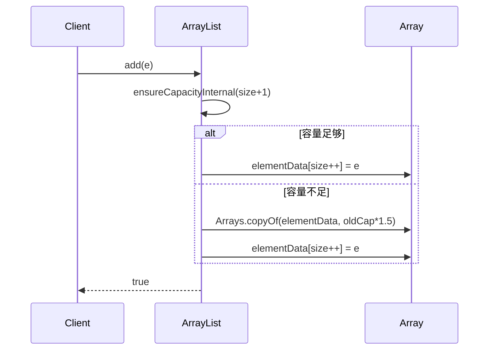
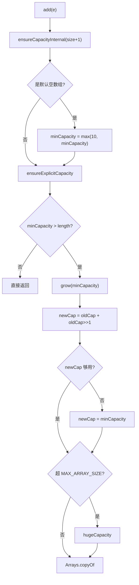

# 13.工业级List设计思想

## 目录指引与导读

> 阅读建议：从"没预估容量导致 P99 抬高"的真实翻车事故切入，逐层拆 ArrayList 的扩容、删除置 null、fail-fast、容量管理。每节都尽量把"源码 + 为什么"配对讲清楚。

- [01. 从工作案例说起](#01-从一个工作案例说起)
- [02. List设计核心挑战](#02-list设计的核心挑战)
- [03. ArrayList存储结构](#03-arraylist底层存储结构)
- [04. 添加元素与扩容](#04-添加元素与自动扩容)
  - [4.1 尾部追加流程](#41-尾部追加)
  - [4.2 扩容核心1.5倍](#42-扩容核心15-倍)
  - [4.3 均摊复杂度证明](#43-均摊复杂度证明)
  - [4.4 指定位置插入法](#44-指定位置插入)
- [05. 删除元素内存泄漏](#05-删除元素与内存泄漏)
  - [5.1 按索引删除法](#51-按索引删除)
  - [5.2 为什么必须置null](#52-为什么必须置-null)
  - [5.3 为何不自动缩容](#53-为什么不自动缩容)
- [06. 随机访问与接口](#06-随机访问与randomaccess)
- [07. 线程安全与快失败](#07-线程安全与fail-fast)
  - [7.1 为什么不安全](#71-为什么不安全)
  - [7.2 fail-fast机制](#72-fail-fast-机制)
  - [7.3 并发替代方案](#73-并发替代方案)
- [08. 容量管理与扩容](#08-容量管理与扩容因子)
  - [8.1 三种初始化方式](#81-三种初始化方式)
  - [8.2 容量扩展链路](#82-ensurecapacity-链路)
  - [8.3 最大容量限制](#83-最大容量)
  - [8.4 空间浪费评估](#84-空间浪费率)
- [09. Array与Linked对比](#09-arraylist-vs-linkedlist工业级对比)
- [10. 本篇收获与回扣](#10-本篇收获与案例回扣)
- [11. 思考题深度练](#11-思考题深度练)
- [12. 课后作业实战](#12-课后作业实战)
- [13. 进阶专题与延伸](#13-进阶专题与延伸)


## 01. 从一个工作案例说起

某电商后台「最近浏览商品」接口：

```java
// 错误写法：没有预估容量
List<Product> recent = new ArrayList<>();
for (Long id : productIds) {           // productIds.size() = 5000
    recent.add(productService.get(id));
}
return recent;
```

压测发现：这一行 `new ArrayList<>()` 背后，JVM 触发了 **25 次扩容**，每次 `Arrays.copyOf` 复制整个底层数组。加上 GC 抖动，P99 从 80ms 抬到 240ms。

改成一行：

```java
List<Product> recent = new ArrayList<>(productIds.size());  // 预分配 5000
```

扩容次数 25 → 0，P99 稳定在 80ms。

**本篇要回答的问题**：

- `new ArrayList<>()` 为什么初始容量不是 10？什么时候变成 10？
- 为什么是 1.5 倍扩容而不是 2 倍？
- `remove` 后为什么要把位置置 null？不置会怎样？
- 为什么 ArrayList 不自动缩容？
- `ConcurrentModificationException` 到底是怎么抛出来的？

## 02. List设计的核心挑战

一个工业级 List 必须同时回答四个问题：

| 维度 | 数组方案（ArrayList） | 链表方案（LinkedList） |
|------|------|------|
| 随机访问 `get(i)` | O(1) 地址计算 | O(N) 从头遍历 |
| 尾部追加 `add(e)` | 均摊 O(1) | O(1) |
| 中间插入/删除 | O(N) 移动元素 | O(1)**已定位后**，定位仍 O(N) |
| 内存开销 | 每元素 8 字节引用 | 每元素 ≈ 40 字节（对象头+prev+next+item） |
| CPU 缓存友好 | 连续内存，命中率高 | 指针跳转，命中率低 |

**工业选择**：ArrayList 在 90% 的场景下胜出。原因是现代 CPU 缓存行（Cache Line）64 字节，连续数组一次加载 8 个引用，而链表每跳一次都可能 cache miss。



## 03. ArrayList底层存储结构

```java
public class ArrayList<E> extends AbstractList<E>
        implements List<E>, RandomAccess, Cloneable, Serializable {

    private static final int DEFAULT_CAPACITY = 10;
    private static final Object[] EMPTY_ELEMENTDATA = {};
    private static final Object[] DEFAULTCAPACITY_EMPTY_ELEMENTDATA = {};

    transient Object[] elementData;  // 真实存储
    private int size;                // 用户可见长度
}
```

**关键区分**：

```
elementData = [A, B, C, null, null, null, null, null, null, null]
              ↑─────────────↑
              size = 3       capacity = elementData.length = 10
```

- `size` 是逻辑长度（用户看到的 `list.size()`）
- `capacity` 是物理长度（底层数组真实大小），不对外暴露
- **延迟初始化**：`new ArrayList()` 时 `elementData` 指向共享空数组，第一次 add 时才分配长度 10 的数组。大量 Spring Bean 里声明但从未使用的 List 字段因此零开销。

## 04. 添加元素与自动扩容

### 4.1 尾部追加

```java
public boolean add(E e) {
    ensureCapacityInternal(size + 1);
    elementData[size++] = e;
    return true;
}
```

两步：**确保容量** + **写入并自增 size**。

### 4.2 扩容核心：1.5 倍

```java
private void grow(int minCapacity) {
    int oldCapacity = elementData.length;
    int newCapacity = oldCapacity + (oldCapacity >> 1);  // 1.5 倍
    if (newCapacity - minCapacity < 0) newCapacity = minCapacity;
    if (newCapacity - MAX_ARRAY_SIZE > 0) newCapacity = hugeCapacity(minCapacity);
    elementData = Arrays.copyOf(elementData, newCapacity);
}
```

**为什么是 1.5 倍？** —— 让「旧内存可被新数组复用」：

```
2 倍扩容容量序列：1 → 2 → 4 → 8 → 16 → 32 → 64
  旧空间累计 = 1+2+4+8+16+32 = 63 < 64
  → 新数组永远无法放进旧位置，内存碎片严重

1.5 倍扩容容量序列：1 → 2 → 3 → 4 → 6 → 9 → 13 → 19 → 28 ...
  几轮后旧空间累计 > 新数组
  → 内存分配器可能把新数组放在旧位置，减少碎片
```

各语言对比：

| 语言 | 扩容因子 | 设计偏向 |
|------|---------|---------|
| Java `ArrayList` | 1.5× | 内存友好 |
| C++ `std::vector` | 2× | 性能优先 |
| Go `slice` | <1024: 2×，≥1024: 1.25× | 自适应 |
| Python `list` | ≈1.125× | 极致省内存 |
| Rust `Vec` | 2× | 性能优先 |

### 4.3 均摊复杂度证明

连续 add N 个元素（初始容量 1，按 2 倍扩容简化计算）：

```
复制总次数 = 1 + 2 + 4 + … + N/2 = N - 1
总工作量 = N 次赋值 + (N-1) 次复制 ≈ 2N
单次均摊 = 2N / N = O(1) ✓
```

### 4.4 指定位置插入

```java
public void add(int index, E element) {
    rangeCheckForAdd(index);
    ensureCapacityInternal(size + 1);
    System.arraycopy(elementData, index, elementData, index + 1, size - index);
    elementData[index] = element;
    size++;
}
```

**头部插入是噩梦**：`add(0, e)` 要移动全部 N 个元素。在热点接口上频繁调用会把 CPU 打穿。



## 05. 删除元素与内存泄漏

### 5.1 按索引删除

```java
public E remove(int index) {
    rangeCheck(index);
    modCount++;
    E oldValue = (E) elementData[index];
    int numMoved = size - index - 1;
    if (numMoved > 0)
        System.arraycopy(elementData, index+1, elementData, index, numMoved);
    elementData[--size] = null;   // 关键：置 null 防内存泄漏
    return oldValue;
}
```

### 5.2 为什么必须置 null？

```
remove(1) 前：[objA, objB, objC, null, null]  size=3

不置 null（错误）：
  elementData[1] = elementData[2] 的操作后
  [objA, objC, objC, null, null]  size=2
                ↑ 这个槽位仍然持有 objC 引用！
  → 即使外部没有任何 objC 的引用，GC 也无法回收它
  → 长生命周期 List 反复增删 → 幽灵引用累积 → OOM

正确（JDK 源码）：
  [objA, objC, null, null, null]  size=2
                ↑ 置 null，GC 可回收
```

《Effective Java》第 7 条专门讲了这个陷阱。

### 5.3 为什么不自动缩容？

删除元素后 ArrayList **永远不缩容**，只有手动 `trimToSize()` 才会。

**原因**：避免"乒乓抖动"。假设阈值是 `size < capacity/2` 时缩一半——当 size 在临界点反复增删，会触发扩容 → 缩容 → 扩容的死循环，性能雪崩。

**工业共识**：

| 语言/容器 | 自动缩容？ |
|----------|----------|
| Java `ArrayList` | ❌ 手动 `trimToSize()` |
| C++ `std::vector` | ❌ 手动 `shrink_to_fit()` |
| Go `slice` | ❌ 手动 `copy` 新切片 |
| Rust `Vec` | ❌ 手动 `shrink_to_fit()` |
| Python `list` | ⚠️ 有限缩容（size < alloc/2 下次分配缩） |

**原则**：可预测的性能 > 最优的内存利用。

## 06. 随机访问与RandomAccess

```java
public E get(int index) {
    rangeCheck(index);
    return (E) elementData[index];
}
```

底层是 **一次地址计算**：

```
目标地址 = elementData 基地址 + index × 8字节（引用大小）
```

不依赖数组长度，时间复杂度 O(1)。

**RandomAccess 标记接口** —— 空接口，但算法层会据此分岔：

```java
// Collections.binarySearch 源码
if (list instanceof RandomAccess || list.size() < THRESHOLD)
    return indexedBinarySearch(list, key);   // 用 get(i)
else
    return iteratorBinarySearch(list, key);  // 用迭代器
```

**遍历规则**：

```java
// ArrayList（RandomAccess）
for (int i = 0; i < list.size(); i++) list.get(i);   // 推荐

// LinkedList（非 RandomAccess）
for (E e : list) { ... }                              // 推荐
// 错误：LinkedList 用 get(i) 遍历是 O(N²)
```

## 07. 线程安全与fail-fast

### 7.1 为什么不安全

`add` 看似一行，实则 **非原子**：

```java
elementData[size++] = e;
// 拆解：
//  1. 读 size
//  2. 写 elementData[size]
//  3. size += 1
```

两个线程并发：

```
T1: 读 size=5
T2: 读 size=5
T1: elementData[5]=e1, size=6
T2: elementData[5]=e2, size=6   ← e1 被覆盖，size 只涨 1
```

### 7.2 fail-fast 机制

```java
private class Itr implements Iterator<E> {
    int expectedModCount = modCount;

    public E next() {
        if (modCount != expectedModCount)
            throw new ConcurrentModificationException();
        // ...
    }
}
```

**每次结构性修改**（add/remove）都会 `modCount++`。迭代器在创建时记录期望值，每次 next 检查是否被篡改。

**注意**：

- fail-fast 是 **尽力而为**，不是严格保证（modCount 非 volatile，可能看不到其他线程修改）
- `list.remove(obj)` 在循环里必须用 `Iterator.remove()`，否则必抛

### 7.3 并发替代方案

| 方案 | 原理 | 读 | 写 | 场景 |
|------|------|----|----|------|
| `Vector` | synchronized 每个方法 | 慢 | 慢 | 已废弃 |
| `Collections.synchronizedList` | 包装类 + synchronized | 慢 | 慢 | 简单同步 |
| `CopyOnWriteArrayList` | 写时复制整个数组 | 无锁 O(1) | O(N) | 读多写极少 |
| `ReentrantLock` 手动 | 细粒度控制 | 可控 | 可控 | 复杂场景 |

**CopyOnWriteArrayList 的代价**：每次写都复制整个底层数组，写多场景会 OOM。实践中只用于「配置、监听器列表」这种写频率 <1%的场景。

## 08. 容量管理与扩容因子

### 8.1 三种初始化方式

```java
new ArrayList<>();          // 空数组，首次 add 时膨胀到 10
new ArrayList<>(1000);      // 直接分配 1000
new ArrayList<>(someColl);  // 按 someColl.size() 分配并拷贝
```

### 8.2 ensureCapacity 链路



### 8.3 最大容量

```java
private static final int MAX_ARRAY_SIZE = Integer.MAX_VALUE - 8;
```

减 8 是给数组对象头预留空间。某些 JVM 实现会拒绝分配 `Integer.MAX_VALUE` 长度的数组。

### 8.4 空间浪费率

```
最坏（刚扩容完）：capacity = 1.5×size，浪费率 33%
最好（将要扩容）：capacity = size，浪费率 0%
平均：约 16.7%
```

对比 LinkedList：存 Integer 时每元素 40 字节 vs 真实需求 16 字节（含对象头），**浪费率 >60%**。ArrayList 的「浪费」其实非常克制。

## 09. ArrayList vs LinkedList工业级对比

| 维度 | ArrayList | LinkedList | 实测差距 |
|------|-----------|------------|---------|
| `get(i)` | O(1) | O(N) | 100 万元素随机访问，AL 快 1000× |
| 尾部 add | 均摊 O(1) | O(1) | 接近 |
| 头部 add | O(N) 移动 | O(1) 改指针 | LL 快，但规模 <1000 时被缓存抹平 |
| 中间 add | O(N) 移动 | 定位 O(N) + 改指针 O(1) | 常常 AL 更快（arraycopy 走 CPU 指令优化） |
| 遍历 | 缓存友好 | cache miss 多 | 100 万元素 AL 快 5-10× |
| 每元素内存 | 8 字节引用 | ≈ 40 字节 | LL 多 5× |

**Java 社区共识**：**几乎永远不要用 LinkedList**。

- 需要队列/栈 → `ArrayDeque`
- 需要链表语义 → 自己写（LinkedList 不暴露 Node API，真正的链表优势用不上）
- 大多数场景 → `ArrayList`

## 10. 本篇收获与案例回扣

回到开篇 5000 元素的扩容案例，现在可以回答：

| 现象 | 根因 |
|------|------|
| 25 次扩容 | 默认容量 10，1.5 倍：10→15→22→33→49→73→109→163→244→366→549→823→1234→1851→2776→4164→6246→… |
| 每次 Arrays.copyOf 耗时 | 复制操作走 System.arraycopy（native），但 GC 要收 25 个废弃数组 |
| 预分配后稳定 80ms | 零扩容，零废弃数组，GC 压力消失 |

**学完你能做的事**：

1. **容量预估**：任何已知规模的 List 都要用 `new ArrayList<>(size)`
2. **选对容器**：读多 → ArrayList；队列/栈 → ArrayDeque；读多写极少的并发场景 → CopyOnWriteArrayList
3. **避免头部插入**：批量头插请改用 `ArrayDeque` 或反向构造后 reverse
4. **排查 OOM**：长生命周期 List 反复增删 → 检查是否有人继承重写了 remove 漏掉 null
5. **处理 CME**：遍历中删除一律用 `Iterator.remove()` 或 `removeIf`
6. **懂源码懂面试**：1.5 倍、延迟初始化、fail-fast、trimToSize 都能讲清原理而不是背答案

## 11. 思考题深度练

1. **初始容量陷阱**：`new ArrayList<>()` 立即调用 `list.ensureCapacity(100)`，此时底层数组长度是多少？为什么？
2. **扩容次数计算**：初始容量 10，连续 `add` 1000 次，总共触发几次扩容？每次扩容后容量是多少？总共复制了多少次元素？
3. **浅拷贝陷阱**：两个 ArrayList 共享同一个 `Map<String,Object>` 元素，其中一个 list 调 `remove` 再 `add` 触发扩容，另一个 list 会不会受影响？为什么？
4. **CME 边界**：以下代码是否抛 `ConcurrentModificationException`？为什么？
   ```java
   List<Integer> list = new ArrayList<>(List.of(1,2,3,4,5));
   for (Integer i : list) {
       if (i == 4) list.remove(i);
   }
   ```
   把 4 改成 5 呢？
5. **缩容设计**：如果你重新设计 ArrayList，要不要加自动缩容？什么阈值？怎么避免抖动？

## 12. 课后作业实战

### 作业 1：基础 —— 手写 MyArrayList

```
要求：
  实现 add/get/set/remove(int)/size/trimToSize 六个方法
  默认容量 10，1.5 倍扩容
  remove 时置 null
  边界检查抛 IndexOutOfBoundsException
```

### 作业 2：进阶 —— 实现 SnapshotArrayList

```
要求：
  读接口无锁（类似 CopyOnWriteArrayList）
  写接口只复制数组，不用 synchronized，改用 volatile + CAS
  对比 CopyOnWriteArrayList 的实现，分析差异
```

### 作业 3：实战 —— 扩容压测

```
要求：
  对比 new ArrayList<>() 和 new ArrayList<>(N) 在 N=100/1万/100万 时
  的 add 性能与 GC 次数（用 JMH + -verbose:gc）
  画出扩容次数-总耗时曲线，解释 1.5 倍背后的均摊 O(1)
```

### LeetCode 刷题清单

| 题号 | 题名 | 考点 |
|------|------|------|
| 26 | 删除有序数组中的重复项 | 双指针 + 原地修改 |
| 27 | 移除元素 | 快慢指针 |
| 88 | 合并两个有序数组 | 从后往前避免移动 |
| 905 | 按奇偶排序数组 | 双指针分区 |
| 1089 | 复写零 | arraycopy 思想 |

---

## 13. 进阶专题与延伸

### 13.1 ArrayList 扩容因子 1.5 vs 2 的深层考量

不同语言动态数组用的扩容因子有差别：

| 实现 | 扩容因子 | 空间回收友好度 |
|------|---------|---------------|
| Java ArrayList | 1.5 | **高** |
| C++ `std::vector`（libstdc++/MSVC） | 2.0 | 低 |
| C++ `std::vector`（libc++/Clang） | 2.0 | 低 |
| Go `slice` | 2.0（<1024）/ 1.25（≥1024） | 中 |
| Python `list` | ~1.125 | 极高 |

**为什么 Facebook `folly::fbvector` 选 1.5 而不是 2？**

- **2 倍扩容无法重用旧内存**：每次新数组 = 旧数组 × 2，需要"所有历史分配之和 + 1"的连续空间才能原地扩展；
- **1.5 倍扩容可以重用**：历史分配之和 $1 + 1.5 + 1.5^2 + ... + 1.5^{k-1} = 2(1.5^k - 1) > 1.5^k$，也就是旧块总和**大于**下一次需要的大小——分配器可以把旧块合并再用。

Andrei Alexandrescu 在 CppCon 2014 演讲 *Three Optimization Tips for C++* 专门讲过这一点——`fbvector` 因此在内存敏感场景比 `std::vector` 性能好 15-30%。

### 13.2 Python list 为何用 ~1.125 倍

CPython 源码 `Objects/listobject.c` 的 `list_resize`：

```c
new_allocated = (size_t)newsize + (newsize >> 3) + (newsize < 9 ? 3 : 6);
```

约 **1.125 倍**。这个极小的扩容因子让 Python list 的**空间利用率接近 90%**，代价是扩容更频繁。

**Python 选择此因子的原因**：
1. Python 对象普遍大（16+ 字节），1.125 vs 2.0 能节省大量内存；
2. Python 的 `PyMem_Realloc` 会尝试原地扩展——因子越小，原地成功率越高；
3. Python 程序大量使用小 list（dict/set 内部、函数参数），小扩容更划算。

### 13.3 Go slice 的三字段与扩容行为

Go 的 slice 是一个三字段 struct：`{ptr, len, cap}`：

```go
s := make([]int, 3, 10)   // len=3, cap=10
s = append(s, 4)          // len=4, cap=10，原数组原地增长
s = append(s, 5, 6, 7, 8, 9, 10, 11)  // 超出 cap 触发扩容
```

Go 1.18+ 的扩容规则：
- 当前 cap < 256：翻倍；
- cap ≥ 256：`newcap = cap + (cap + 3*256) / 4`（约 1.25 倍）；
- 最后按 size class 对齐（mallocgc 的桶大小）。

**坑点**：slice 作为参数传递是**值传递**（传三字段），但底层数组是共享的：

```go
func modify(s []int) {
    s[0] = 999     // ← 影响调用方
    s = append(s, 1)  // ← 不影响调用方的 len
}
```

这是 Go 新手最容易踩的陷阱——**slice 不是指针也不是值，而是"描述符"**。

### 13.4 CopyOnWriteArrayList 的应用场景与局限

JUC 的 `CopyOnWriteArrayList` 是读多写少场景的利器：

```java
public boolean add(E e) {
    final ReentrantLock lock = this.lock;
    lock.lock();
    try {
        Object[] elements = getArray();
        int len = elements.length;
        Object[] newElements = Arrays.copyOf(elements, len + 1);   // 整个数组复制
        newElements[len] = e;
        setArray(newElements);
        return true;
    } finally {
        lock.unlock();
    }
}
```

**适用场景**：
- Spring 的 `ApplicationListener` 列表——启动后几乎不变，高频触发；
- Netty 的 `pipeline.addLast`——初始化时配置一次，运行期只读；
- 监控系统的 alarm 规则——规则列表低频更新、高频查询。

**绝对不要用的场景**：
- 订单列表、会话列表这种**写密集**的业务——每次 add 都 O(N) 复制整个数组；
- 超大列表（10 万+）——单次写开销巨大，GC 压力爆表。

### 13.5 Arrays.asList、List.of、Collections.unmodifiableList 的区别

Java 里"创建不可变 List"有四五种方式，细节差别巨大：

| 方式 | 可变？ | 支持 null？ | 可序列化？ | 备注 |
|------|--------|-------------|-----------|------|
| `Arrays.asList(1,2,3)` | 值可改，大小不可改 | 支持 | 是 | 底层是 `Arrays$ArrayList`，数组共享 |
| `List.of(1,2,3)` (JDK 9+) | **完全不可变** | **不支持**！ | 是 | 优化的 `ImmutableCollections.List12` 或 `ListN` |
| `Collections.unmodifiableList(l)` | 视图只读，原 list 可改 | 支持 | 是 | 装饰器模式 |
| `ImmutableList.of(...)`（Guava） | 完全不可变 | 不支持 | 是 | 按元素数有多种实现优化 |
| `new ArrayList<>(Arrays.asList(...))` | 完全可变 | 支持 | 是 | 最常见写法 |

**坑**：
- `Arrays.asList(intArr)` 返回 `List<int[]>` 不是 `List<Integer>`——基本类型数组要先装箱或用 Stream；
- `List.of` 包含 `null` 直接 NPE；
- `unmodifiableList` 只是视图，**原 list 的修改仍会反映到只读 list**（不安全的"不可变"）。

### 13.6 LinkedList 真正的工业替代：ArrayDeque

阿里《Java 开发手册》规定"禁用 LinkedList"，因为：
- 几乎所有场景 ArrayList 或 ArrayDeque 都更快；
- LinkedList 的节点开销大（每节点 ~40 字节）；
- CPU 缓存极不友好。

**ArrayDeque** 用环形数组实现双端队列，提供了 LinkedList 唯一能打的"双端 O(1) 操作"且性能高 3-5 倍：

```java
Deque<Integer> stack = new ArrayDeque<>();   // 替代 Stack
stack.push(1); stack.push(2); stack.pop();

Deque<Integer> queue = new ArrayDeque<>();   // 替代 LinkedList 做队列
queue.offer(1); queue.poll();

Deque<Integer> dq = new ArrayDeque<>();      // 替代 LinkedList 做双端
dq.addFirst(1); dq.addLast(2);
```

**性能对比**（100 万次操作）：

| 场景 | LinkedList | ArrayDeque | 快多少 |
|------|-----------|------------|--------|
| 头插 | 25ms | 8ms | 3x |
| 尾插 | 27ms | 9ms | 3x |
| 随机访问 | 几百到几千 ms | 不支持 | — |
| 顺序遍历 | 18ms | 3ms | 6x |

### 13.7 持久化数据结构：Immutable List 的 O(log N) 魔法

函数式语言里 List 通常是**持久化（persistent）**——每次修改不破坏旧版本，新旧版本通过结构共享共存：

```clojure
(def v1 [1 2 3 4 5])
(def v2 (conj v1 6))      ; v2 = [1 2 3 4 5 6], v1 仍是 [1 2 3 4 5]
(= v1 v2)                 ; false
```

**底层实现**：Clojure 的 `PersistentVector` 用 32 叉 Trie（参考 Bagwell 的 HAMT），修改 = 沿路径复制 log32(N)（≤ 7）层节点。

**复杂度**：
- 随机访问：`O(log32 N)` ≈ 常数（树高 ≤ 7）；
- 修改：`O(log32 N)` 复制；
- 空间：旧版本和新版本共享大部分节点。

Scala `Vector`、Haskell `Data.Sequence`、JavaScript 的 Immutable.js 都基于此思想。

### 13.8 Unrolled Linked List：链表的 cache 优化

普通链表每节点 1 个元素，CPU 缓存命中率低。**Unrolled Linked List** 每节点存一个小数组（如 16 个元素）：

```
普通链表: [1]→[2]→[3]→[4]→[5]→[6]
Unrolled: [1,2,3,4]→[5,6,_,_]
```

**收益**：
- **缓存命中率高**（连续数组部分）；
- **空间开销小**（指针数量少）；
- **插入删除仍 O(1)**（定位后）。

Python 的 `collections.deque` 就用类似思路——每块 64 字节内存，双向链接。这也是 `deque` 两端 O(1) 操作却性能远胜 `LinkedList` 的原因。

### 13.9 经典书与论文

- Sedgewick & Wayne 《算法（第 4 版）》第 1 章：动态数组与均摊分析
- Cormen et al. 《算法导论》第 17 章：动态表与均摊分析
- Alexandrescu, A. 2014. *Three Optimization Tips for C++*（CppCon 演讲，fbvector 的设计）
- Bagwell, P. 2002. *Ideal Hash Trees* & *Fast And Space Efficient Trie Searches*——持久化 Vector 基础
- 《Java 开发手册》（阿里巴巴）集合章节——企业级 List 使用规范
- Doug Lea. *A Java Fork/Join Framework*——CopyOnWrite 系列的设计思想
- Effective Java（Joshua Bloch）第 26-29 条：集合与泛型

**工业代码**：
- JDK `ArrayList.java`、`ArrayDeque.java`、`CopyOnWriteArrayList.java`
- Guava `ImmutableList`、`Lists`
- Eclipse Collections（前身 GS Collections）——性能优于 JDK 的集合库
- Python CPython `Objects/listobject.c`
- Go runtime `runtime/slice.go`
- Clojure `PersistentVector.java`、`PersistentList.java`
- Facebook `folly/FBVector.h`（C++）

---

> List 设计篇讲完，下一篇 Map 设计会把同样的分析方法用在 `HashMap/TreeMap` 上——**同样是"按键取值"，不同的数据结构决定了完全不同的性能曲线**。