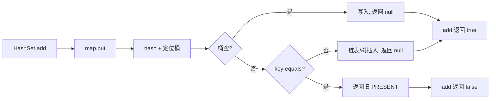
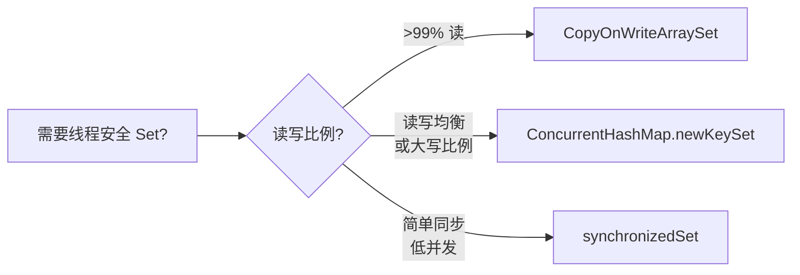

# 集合设计纲要

## 目录指引与导读

> 阅读建议：爬虫 URL 去重事故 → Set 存在的根本价值 → HashSet 为何委托 HashMap → hashCode/equals 契约 → 跨语言 Set 工业实现全景。

- [01. 从工作案例说起](#01-从一个工作案例说起)
- [02. 为什么需要Set](#02-为什么需要set)
- [03. HashSet委托设计](#03-hashset委托hashmap的设计)
- [04. hashCode契约规则](#04-hashcode与equals契约)
- [05. add与contains实现](#05-add与contains的o1)
- [06. Set家族横向对比](#06-set家族对比)
- [07. 并发Set的选型](#07-并发set选型)
- [08. 跨语言Set实现](#08-跨语言set实现)
- [09. Set的工业应用](#09-set的工业应用)
- [10. 本篇收获与回扣](#10-本篇收获与案例回扣)
- [11. 思考题深度练](#11-思考题)
- [12. 课后作业实战](#12-课后作业)
- [13. 进阶专题与延伸](#13-进阶专题与延伸)


## 01. 从一个工作案例说起

爬虫系统线上故障：每天爬 500 万 URL，新人用 `List<String> visited` 维护「已爬过的 URL」防重复。

```java
// 错误：List.contains 是 O(N)
List<String> visited = new ArrayList<>();

void crawl(String url) {
    if (visited.contains(url)) return;   // 500 万 × 500 万 = 25 万亿次比较
    visited.add(url);
    // ...
}
```

**后果**：跑到第 10 万条 URL 时，`contains` 已经耗时 50ms，QPS 从 1000 掉到 20。到 500 万时，CPU 100% 死转。

改成 HashSet：

```java
Set<String> visited = new HashSet<>();

void crawl(String url) {
    if (!visited.add(url)) return;        // add 返回 false 说明已存在，O(1)
    // ...
}
```

单次判重从 50ms 降到 0.01ms，QPS 稳定在 8000+。

**紧接着又出事**：同事把自定义 `UrlEntry` 放进 HashSet，只重写了 `equals` 没写 `hashCode`，结果「同一个 URL 被加了 3 次」。

**本篇要回答的问题**：

- HashSet 为什么能 O(1) 去重？代价是什么？
- 为什么 HashSet 直接"抄"了一份 HashMap？`PRESENT` 是什么？
- `hashCode()` 和 `equals()` 的契约是什么？违反会怎样？
- LinkedHashSet 和 TreeSet 适合什么场景？
- 并发场景下 `Collections.synchronizedSet` 还是 `ConcurrentHashMap.newKeySet()`？

## 02. 为什么需要Set

Set 的本质：**无重复元素的集合 + 快速成员判断**。

对比不同结构实现「去重 + contains」：

| 结构 | contains | add | 去重 | 100 万元素 contains |
|------|---------|-----|------|--------------------|
| 无序数组/List | O(N) | O(1) | 插入时 O(N) | ~10ms |
| 有序数组 | O(log N) 二分 | O(N) | O(log N) | ~0.1ms 但插入慢 |
| 链表 | O(N) | O(1) | O(N) | ~50ms |
| 红黑树（TreeSet） | O(log N) | O(log N) | O(log N) | ~0.5ms |
| **哈希表（HashSet）** | **O(1)** | **O(1)** | **O(1)** | **~0.01ms** |
| 位图（EnumSet/BitSet） | O(1) | O(1) | O(1) | ~1ns（最快） |

**HashSet 是默认选择**，但当元素是有限枚举时 `EnumSet` 更快；需要有序遍历时 `TreeSet` 不可替代。

## 03. HashSet委托HashMap的设计

### 3.1 源码三行看懂

```java
public class HashSet<E> extends AbstractSet<E> implements Set<E>, Cloneable, Serializable {
    private transient HashMap<E, Object> map;
    private static final Object PRESENT = new Object();

    public HashSet() { map = new HashMap<>(); }

    public boolean add(E e)      { return map.put(e, PRESENT) == null; }
    public boolean remove(Object o) { return map.remove(o) == PRESENT; }
    public boolean contains(Object o) { return map.containsKey(o); }
    public int size()            { return map.size(); }
    public Iterator<E> iterator(){ return map.keySet().iterator(); }
}
```

### 3.2 为什么用委托而不是自己写？

**复用优于重写**。HashMap 已经解决了：

- 扰动函数与位运算取模
- 冲突链表、红黑树转化
- 动态扩容与 2 倍增长
- 迭代器 fail-fast

HashSet 只用一行 `map.put(e, PRESENT)` 就全部继承。代价是每个元素多一个指向 `PRESENT` 的 8 字节引用。



### 3.3 PRESENT 为什么是静态共享对象？

```java
private static final Object PRESENT = new Object();
```

- **节省内存**：100 万元素 HashSet 共享同一个 PRESENT 实例，而非 100 万个
- **使用 `==` 比较**：`map.remove(o) == PRESENT` 比 equals 快（一条 CPU 指令）

## 04. hashCode与equals契约

### 4.1 三条硬性规则

```
规则 1：a.equals(b) == true  →  a.hashCode() == b.hashCode()  (必须)
规则 2：a.hashCode() == b.hashCode()  不要求  equals           (允许冲突)
规则 3：equals 比较依赖的字段，在 add 之后不能改变             (不可变性)
```

### 4.2 违反契约的三种灾难

**灾难 1：只重写 equals 不重写 hashCode**

```java
class Point {
    int x, y;
    public boolean equals(Object o) {
        return o instanceof Point p && p.x == x && p.y == y;
    }
    // 忘记重写 hashCode → 用 Object 默认（基于内存地址）
}

Set<Point> set = new HashSet<>();
set.add(new Point(1, 2));
set.contains(new Point(1, 2));   // false！
// 两个逻辑相等的对象 hashCode 不同，被分到不同桶，equals 根本没被调用
```

**灾难 2：可变字段参与 hashCode**

```java
class User {
    String name;
    int hashCode() { return name.hashCode(); }
}

User u = new User("Alice");
set.add(u);
u.name = "Bob";             // hashCode 变了
set.contains(u);            // false
set.remove(u);              // false
// → u 永远躺在旧桶，无法访问、无法删除，内存泄漏
```

**灾难 3：hashCode 不均匀**

```java
class BadHash {
    int id;
    public int hashCode() { return 1; }   // 所有对象都散到同一个桶
}
// add 100 万个 → 100 万长的链表 / 红黑树
// contains 从 O(1) 退化为 O(N) 或 O(log N)
```

### 4.3 正确姿势

```java
record Point(int x, int y) { }  // Java 14+ record 自动生成正确的 equals/hashCode

// 或手写：
class Point {
    final int x, y;                                    // final 保证不可变
    @Override public int hashCode() { return Objects.hash(x, y); }
    @Override public boolean equals(Object o) {
        return o instanceof Point p && p.x == x && p.y == y;
    }
}
```

## 05. add与contains的O(1)

### 5.1 add 完整路径

```
HashSet.add(e)
 → map.put(e, PRESENT)
   → hash = (e.hashCode()) ^ (e.hashCode() >>> 16)   // 扰动
   → index = hash & (table.length - 1)               // 定位桶
   → 桶空 → 直接放入，返回 null  →  add 返回 true
   → 桶非空 → 遍历链表/红黑树：
        找到 equals 相同 → 返回旧 PRESENT →  add 返回 false
        未找到 → 追加节点，返回 null     →  add 返回 true
```

### 5.2 contains 的三层过滤

```java
public boolean contains(Object o) { return map.containsKey(o); }
// → getNode(hash(o), o) != null
```

桶内查找时按 **hash → `==` → equals** 三层过滤：

```
第 1 层：int hash 比较（CPU 一条指令）
第 2 层：引用 == 比较（同对象直接命中）
第 3 层：equals 比较（最贵，但前两层已淘汰大部分）
```

**性能实测**（100 万元素中查 1 个）：

| 结构 | 耗时 | 倍数 |
|------|------|------|
| ArrayList.contains | 10ms | 1× |
| HashSet.contains | 20ns | 500,000× |

## 06. Set家族对比

| 维度 | HashSet | LinkedHashSet | TreeSet | EnumSet |
|------|---------|---------------|---------|---------|
| 底层 | HashMap | LinkedHashMap | TreeMap（红黑树） | 位向量 long[] |
| 顺序 | 无序 | 插入顺序 | 自然/Comparator | enum 声明顺序 |
| add/contains | O(1) | O(1) | O(log N) | O(1) 位操作 |
| 允许 null | 1 个 | 1 个 | ❌（排序比较 NPE） | ❌ |
| 内存 | 中 | 中+ | 较高 | 极小 |
| 典型场景 | 去重 | 去重且要保序 | 要排序遍历 | 枚举标记位 |

### LinkedHashSet 的额外指针

```
HashMap.Node 的扩展版：多了 before / after
桶结构 + 贯穿所有元素的双向链表

哈希桶: [0]→NodeC  [2]→NodeA  [3]→NodeB
插入链: NodeA ⇄ NodeB ⇄ NodeC  （遍历沿此链走）
```

### EnumSet —— 被低估的性能王者

```java
Set<DayOfWeek> weekends = EnumSet.of(SATURDAY, SUNDAY);
```

底层用 `long` 的位表示：

```
long bits = 0b0000000...0000011      // 位 0, 1 表示 SAT, SUN
add(SUNDAY):    bits |= 1 << 0
contains(FRI):  (bits >> 4) & 1
```

64 个枚举值只用一个 long，128 个用 long[2]。add/contains/remove 全部一条位运算。**永远优先考虑 EnumSet 处理枚举集合**。

## 07. 并发Set选型

### 7.1 三种方案

```java
// 方案 1：包装类（历史遗留）
Set<String> s1 = Collections.synchronizedSet(new HashSet<>());

// 方案 2：CopyOnWrite（读多写极少）
Set<String> s2 = new CopyOnWriteArraySet<>();

// 方案 3：推荐默认
Set<String> s3 = ConcurrentHashMap.newKeySet();
```

### 7.2 性能对比（16 线程 × 100 万次）

| 实现 | 读（contains） | 写（add） | 迭代安全 |
|------|--------------|----------|---------|
| `synchronizedSet` | 慢（全局锁） | 慢 | 需手动锁 |
| `CopyOnWriteArraySet` | 最快（无锁） | 极慢（复制全数组） | 快照 |
| `ConcurrentHashMap.newKeySet` | 快 | 快（桶级锁/CAS） | 弱一致 |

**选择决策树**：



## 08. 跨语言Set实现

| 语言 | 实现 | 有序? | 备注 |
|------|------|------|------|
| Java `HashSet` | HashMap | 否 | 基于链表+红黑树 |
| Java `LinkedHashSet` | LinkedHashMap | 插入序 | 双向链表 |
| Java `TreeSet` | TreeMap | 排序 | 红黑树 |
| C++ `std::unordered_set` | 桶+链表 | 否 | |
| C++ `std::set` | 红黑树 | 排序 | |
| Go `map[T]struct{}` | 哈希表 | 否 | `struct{}` 零字节 |
| Rust `HashSet` | Swiss Table | 否 | SIMD 并行比较元数据 |
| Python `set` | 开放寻址 | 否 | 缓存友好 |
| JavaScript `Set` | 哈希表 | **插入序** | 唯一保证插入序的主流语言 |

Go 的惯用法：

```go
set := make(map[string]struct{})
set["hello"] = struct{}{}
_, exists := set["hello"]
delete(set, "hello")
```

为什么用 `struct{}` 不用 `bool`？`struct{}` 占 0 字节，`bool` 占 1 字节，百万级元素差 1MB。

## 09. Set的工业应用

### 9.1 去重

```java
// List 去重并保序
List<String> unique = new ArrayList<>(new LinkedHashSet<>(withDuplicates));
```

### 9.2 集合运算

```java
Set<Long> myFollows = ...;
Set<Long> yourFollows = ...;

Set<Long> common = new HashSet<>(myFollows);
common.retainAll(yourFollows);     // 交集 = 共同关注

Set<Long> diff = new HashSet<>(yourFollows);
diff.removeAll(myFollows);         // 差集 = 推荐给我关注的人

Set<Long> all = new HashSet<>(myFollows);
all.addAll(yourFollows);           // 并集
```

### 9.3 黑名单/权限校验

```java
Set<String> blacklist = Set.copyOf(loadFromDB());   // 不可变 Set
if (blacklist.contains(userId)) reject(req);        // O(1)
```

### 9.4 布隆过滤器前置

当 Set 规模达到亿级，内存放不下时，用 BloomFilter 前置过滤：

```java
BloomFilter<String> bloom = BloomFilter.create(Funnels.stringFunnel(UTF_8), 100_000_000, 0.001);
Set<String> exactSet = new HashSet<>();     // 只存确认项

if (bloom.mightContain(url)) {
    if (exactSet.contains(url)) return;     // 二次精确判断
}
bloom.put(url);
exactSet.add(url);
```

## 10. 本篇收获与案例回扣

回到开篇爬虫案例：

| 现象 | 根因 |
|------|------|
| List 版本 QPS 从 1000 掉到 20 | `contains` O(N)，元素越多越慢 |
| HashSet 版本稳定 8000+ QPS | 平均 O(1)，与规模无关 |
| 自定义 UrlEntry 重复插入 | 只重写 equals 没重写 hashCode，分散到不同桶 |

**学完你能做的事**：

1. **去重首选 HashSet**：不要用 List.contains 循环去重
2. **自定义对象放 Set**：用 record 或同时重写 hashCode + equals，字段 final
3. **按需选家族**：去重 HashSet，保序 LinkedHashSet，排序 TreeSet，枚举 EnumSet
4. **并发场景**：默认 `ConcurrentHashMap.newKeySet()`，读极多写极少 `CopyOnWriteArraySet`
5. **集合运算**：retainAll / removeAll / addAll 实现交、差、并集
6. **亿级规模**：BloomFilter 前置 + HashSet 精确层

## 11. 思考题

1. **PRESENT 为什么是静态常量**：如果每个 HashSet 实例有自己的 PRESENT，100 万元素会多占多少内存？为什么 JDK 选择静态共享？
2. **hashCode 陷阱**：某类把 `hashCode()` 实现为 `return id.hashCode() + System.currentTimeMillis()`，把这种对象放进 HashSet 会发生什么？
3. **LinkedHashSet 内存**：相比 HashSet，LinkedHashSet 每个元素多付出多少字节？什么场景值得付这个代价？
4. **TreeSet 的 null**：TreeSet 不支持 null，但可以通过 `Comparator.nullsFirst(...)` 让它支持。这样做有什么风险？
5. **EnumSet 的 64 限制**：enum 超过 64 个值时 EnumSet 如何处理？性能还会是 O(1) 吗？

## 12. 课后作业

### 作业 1：基础 —— 手写 MyHashSet

```
要求：
  用数组 + 链表实现，不依赖 HashMap
  支持 add/remove/contains/size/iterator
  构造 10 万随机 Integer 测试，对比 JDK HashSet 正确性和性能
```

### 作业 2：进阶 —— hashCode 质量量化

```
要求：
  设计 3 种 hashCode 实现（常量、id%10、Objects.hash(id, name)）
  各插入 10 万对象到 HashSet
  用反射读取 table 数组，统计桶长度分布（最大、平均、标准差）
  画柱状图说明"hashCode 必须均匀"的重要性
```

### 作业 3：实战 —— 爬虫去重选型

```
场景：单机爬虫，1 亿 URL，内存受限 2GB
要求：
  方案 A：HashSet<String> —— 测算内存，评估可行性
  方案 B：BloomFilter 前置 + HashSet 精确层 —— 测假阳率与命中率
  方案 C：Redis Set 远程去重
  JMH + 堆内存分析对比三者，写决策报告
```

### LeetCode 刷题清单

| 题号 | 题名 | 考点 |
|------|------|------|
| 136 | 只出现一次的数字 | 异或/Set |
| 217 | 存在重复元素 | HashSet 经典 |
| 349 | 两个数组的交集 | retainAll |
| 350 | 两个数组的交集 II | Map 计数 |
| 128 | 最长连续序列 | HashSet + O(N) 扫描 |
| 202 | 快乐数 | Set 判断环 |

---

## 13. 进阶专题与延伸

### 13.1 Set 的三种典型实现对照

| Set 类 | 底层 | 有序？ | 特性 |
|--------|------|--------|------|
| HashSet | HashMap | 无 | 最快，乱序 |
| LinkedHashSet | LinkedHashMap | **插入顺序** | O(1) 且可预测遍历 |
| TreeSet | TreeMap（红黑树） | **按 key 排序** | 支持 `subSet/floor/ceiling` |
| EnumSet | 位向量 | 按枚举 ordinal 顺序 | **极致性能**，64 元素内单 long |
| ConcurrentSkipListSet | ConcurrentSkipListMap | 有序 | 并发有序 |

**EnumSet 的魔法**：当枚举 ≤ 64 个元素时，Set 压缩为一个 long 值，每个 bit 代表一个枚举是否存在：
```java
EnumSet<DayOfWeek> weekend = EnumSet.of(SATURDAY, SUNDAY);
// 内部 = 0b01100000 (7 位 bit 表示 7 天)
weekend.contains(SATURDAY);  // 一次位运算 ≈ 1ns
```
这是 JDK 集合框架里**唯一的"位向量 Set"**——任何包含枚举 key 的场景都应优先考虑 EnumSet。

### 13.2 Bitmap / BitSet：整数 Set 的极致压缩

存储"1 亿个 int 的去重 Set"：

| 方案 | 内存 |
|------|------|
| HashSet\<Integer\> | 4 GB |
| int[]（排序后去重） | 400 MB |
| BitSet（Java） | **12 MB** |

```java
BitSet set = new BitSet(100_000_000);
set.set(42);                 // 第 42 位 = 1
boolean has = set.get(42);   // 一次位读
set.cardinality();           // 计算 1 的个数（popcount）
```

**原理**：每个 bit 表示一个整数是否存在，空间密度最高。适用于：
- 用户签到日历（366 bit 表示一年）；
- 权限位（32 位 flag）；
- 数据库位图索引（Oracle、MySQL 索引）。

**Roaring Bitmap**（Chambi et al. 2016）：BitSet 的进化版，稀疏区域用数组、稠密区域用 bitmap——自适应压缩。Apache Druid、Spark、Lucene、Elasticsearch 内部全部使用。

### 13.3 BloomFilter vs CuckooFilter：概率 Set 的对比

超大规模去重用概率 Set——接受极低误判率换取 10-100x 内存节省：

| 特性 | Bloom Filter | Cuckoo Filter |
|------|--------------|---------------|
| 支持删除 | **否** | 是 |
| 空间（0.1% 误判） | ~14.4 bit/elem | ~12 bit/elem |
| 查询 hash 次数 | k ≈ 7-10 | 2 |
| 缓存命中率 | 低（k 个随机位置） | 高（2 个 bucket） |
| Count 能力 | Counting Bloom 支持 | 原生支持 |

**Redis 的选择**：RedisBloom 模块同时提供 `BF.*`（Bloom）和 `CF.*`（Cuckoo），2019 年后推荐 Cuckoo。

### 13.4 Set 运算的性能思考

JDK 的 `Set.retainAll / removeAll / addAll` 实现有几个非对称陷阱：

```java
Set<String> big = ...;        // 10 万元素
Set<String> small = ...;      // 10 元素

// ❌ 遍历大集合，对每元素在小集合查询
big.retainAll(small);          // O(big.size)

// ✓ 反过来：遍历小的，生成新的
Set<String> result = new HashSet<>();
for (String s : small) if (big.contains(s)) result.add(s);
                              // O(small.size)
```

JDK 的 retainAll 实现默认按照 **caller 集合**迭代——永远**遍历较小的一边**才快。Guava `Sets.intersection(a, b)` 已经做了此优化。

### 13.5 ConcurrentSkipListSet：无锁有序 Set

```java
NavigableSet<Long> sessions = new ConcurrentSkipListSet<>();
sessions.add(sessionId);
Long oldest = sessions.first();           // O(log N)，无锁读
NavigableSet<Long> expired = sessions.headSet(cutoff);   // 范围视图
```

**特点**：
- 基于 ConcurrentSkipListMap，每节点 CAS 独立链入链出；
- 支持 `NavigableSet` 全部有序操作；
- 并发读完全无锁，并发写竞争极低。

**典型场景**：分布式 session 过期清理、高频交易订单簿（按价格排序）、K8s 事件时间队列。

### 13.6 不可变 Set 与结构共享

**JDK 9+ `Set.of`**：
```java
Set<String> permissions = Set.of("read", "write", "execute");   // 不可变
```
内部使用 `ImmutableCollections.SetN`——通过"最小扰动"把小 Set（≤2 元素）优化为 `Set12` 特化类，零堆分配。

**Guava `ImmutableSet`**：更强，支持链式构建、结构共享：
```java
ImmutableSet<String> a = ImmutableSet.of("x", "y", "z");
ImmutableSet<String> b = ImmutableSet.<String>builder().addAll(a).add("w").build();
// b 和 a 共享 x/y/z 的存储（内部引用共享）
```

### 13.7 数学上的 Set：multiset 与 bag

数学上 Set 不允许重复。工业上常需要"**带计数的 Set**"：

| 需求 | 选型 |
|------|------|
| 记录每个元素出现次数 | Guava `Multiset` / Apache Commons `Bag` |
| 需要并发 | Guava `ConcurrentHashMultiset` |
| 按频率排序取 TopN | Guava `ImmutableMultiset` |

```java
Multiset<String> wordCount = HashMultiset.create();
for (String word : words) wordCount.add(word);
int n = wordCount.count("hello");          // 次数
// TopN 高频词
Multisets.copyHighestCountFirst(wordCount).entrySet().stream().limit(10);
```

### 13.8 Set 在数据库索引中的投影

数据库里的"唯一索引"本质就是一个持久化的 Set：

```sql
CREATE UNIQUE INDEX idx_email ON users(email);
-- 插入重复 email 抛错：约束违反
```

底层实现：B+ 树索引 + 唯一性检查。

**对比**：
- Redis `SADD`：HashSet；
- Redis `ZADD`：TreeSet；
- MySQL `UNIQUE`：B+ 树；
- Elasticsearch `_id` 字段：HashMap + 反向索引。

### 13.9 经典书与论文

- Cormen et al. 《算法导论》第 11、13 章（哈希集合、有序集合）
- Broder & Mitzenmacher 2003. *Network Applications of Bloom Filters*
- Fan et al. 2014. *Cuckoo Filter*
- Chambi et al. 2016. *Better Bitmap Performance with Roaring Bitmaps*
- Pugh 1990. *Skip Lists*
- Knuth 《计算机程序设计艺术 第 4A 卷》7.1.3 节：位向量技巧

**工业代码**：
- JDK `HashSet`、`LinkedHashSet`、`TreeSet`、`EnumSet`、`BitSet`
- Guava `Sets`、`ImmutableSet`、`Multiset`
- `RoaringBitmap` Java 库（`org.roaringbitmap`）
- `SparseBitSet`（Brett Wooldridge）
- Redis `src/t_set.c`（intset / listpack / hashtable 混合编码）

---

> Set 设计讲完，下三篇（16-18）转到"**实际应用与设计**"视角——不再讨论底层结构，而是从业务场景反推合适的 List/Map/Set 用法。这类内容最贴近工程，也最考验"**对需求的提炼能力**"。