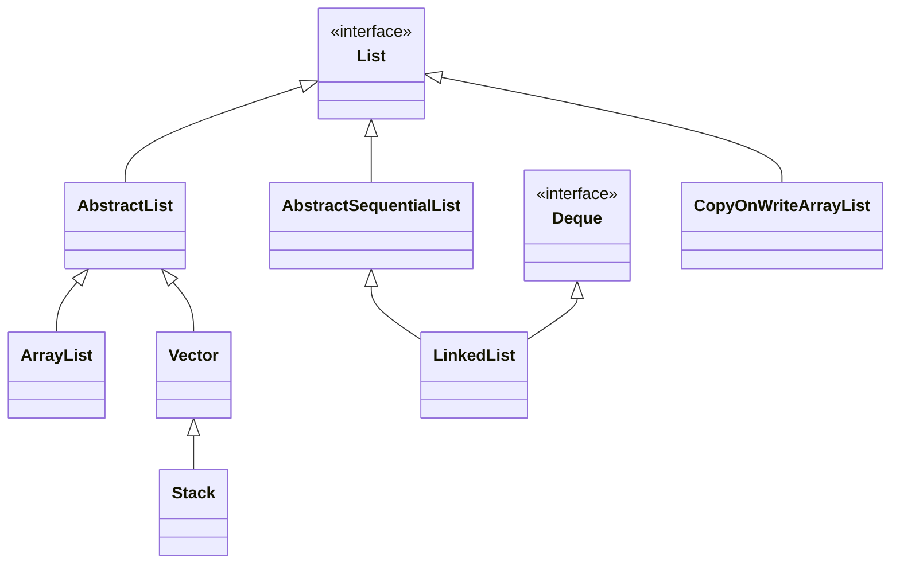
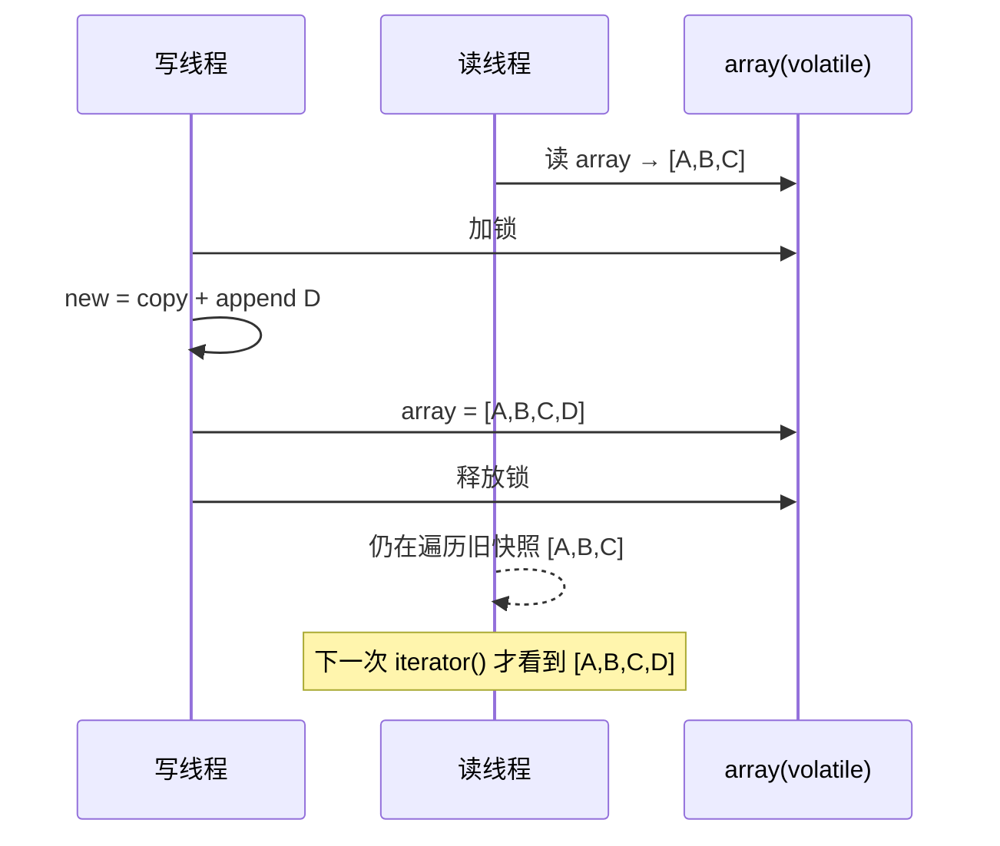
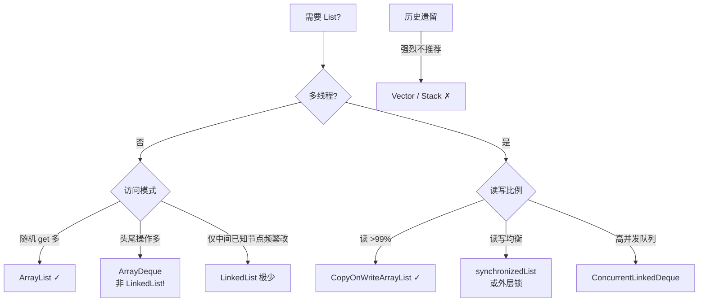

# 16.List实际应用与设计

## 目录指引与导读

> 阅读建议：第 1 次通读按 §01→§10 顺序；第 2 次以后可直接跳到"四大实现详解（§03-§06）"或"选型决策（§07-§09）"。思考题与作业务必手写，不要只看答案。

### 二级目录
- [01. 从一个工作案例说起](#01-从一个工作案例说起)
- [02. List家族全景](#02-list家族全景)
- [03. ArrayList的工业级实现](#03-arraylist的工业级实现)
- [04. Vector与历史遗产](#04-vector与历史遗产)
- [05. LinkedList的真实代价](#05-linkedlist的真实代价)
- [06. COW写时复制原理](#06-cow写时复制原理)
- [07. 四大List全面对比](#07-四大list全面对比)
- [08. 三种常用List变体](#08-三种常用list变体)
- [09. 选型决策树](#09-选型决策树)
- [10. 本篇收获案例回扣](#10-本篇收获案例回扣)
- [11. 思考题深度练](#11-思考题深度练)
- [12. 课后作业实战](#12-课后作业实战)
- [13. 进阶专题与延伸](#13-进阶专题与延伸)

### 三级目录
- §03 ArrayList：[3.1 核心字段](#31-核心字段)｜[3.2 延迟初始化](#32-延迟初始化)｜[3.3 1.5 倍扩容](#33-15-倍扩容)｜[3.4 add/remove 核心](#34-addremove-核心)｜[3.5 RandomAccess 的工程价值](#35-randomaccess-的工程价值)
- §04 Vector：[4.1 与 ArrayList 的差异](#41-与-arraylist-的差异)｜[4.2 为什么被淘汰](#42-为什么被淘汰)｜[4.3 现代替代](#43-现代替代)
- §05 LinkedList：[5.1 双向链表结构](#51-双向链表结构)｜[5.2 按下标访问的优化](#52-按下标访问的优化)｜[5.3 O(1) 插入的真相](#53-o1-插入的真相)｜[5.4 实测对比](#54-实测对比100-万次)｜[5.5 为何几乎不推荐](#55-为什么几乎不推荐-linkedlist)
- §06 COW：[6.1 核心字段](#61-核心字段)｜[6.2 读无锁](#62-读无锁)｜[6.3 写则复制](#63-写则复制)｜[6.4 快照迭代器](#64-快照迭代器弱一致)｜[6.5 代价](#65-代价)｜[6.6 何时值得用](#66-何时值得用)
- §08 变体：[8.1 unmodifiableList 视图](#81-collectionsunmodifiablelist视图包装)｜[8.2 List.of 真不可变](#82-listofjdk-9-真不可变)｜[8.3 subList 陷阱](#83-sublist-视图陷阱)


## 01. 从一个工作案例说起

某支付系统事件总线，需求是：

```
- 监听器有 200 个，启动时注册，之后极少变化
- 每笔支付触发 3-5 次事件 → 高频遍历 listeners
- 后台管理台偶尔动态增删监听器
- 不能阻塞主支付链路
```

新人写了这版：

```java
private final List<EventListener> listeners = new ArrayList<>();
private final Object lock = new Object();

public void publish(Event e) {
    synchronized (lock) {                     // 读也加锁
        for (EventListener l : listeners) l.onEvent(e);
    }
}
public void register(EventListener l) {
    synchronized (lock) { listeners.add(l); }
}
```

**后果**：压测 QPS 从 5 万掉到 3000，线程都堵在 `synchronized` 上。火焰图里 75% 时间在锁竞争。

改成 `CopyOnWriteArrayList`：

```java
private final CopyOnWriteArrayList<EventListener> listeners = new CopyOnWriteArrayList<>();

public void publish(Event e) {
    for (EventListener l : listeners) l.onEvent(e);   // 无锁遍历
}
```

QPS 回到 5 万。**写多一倍复制的代价换来了读无锁**——典型的读多写极少场景。

**本篇要回答的问题**：

- 同一个 List 接口下的四个实现（ArrayList / Vector / LinkedList / CopyOnWriteArrayList）各自为什么存在？
- LinkedList 真的适合"频繁插入删除"吗？
- Vector 为什么被淘汰？
- COW 的代价到底有多大？什么时候值得用？
- `subList` / `List.of` / `Collections.unmodifiableList` 有什么坑？

## 02. List家族全景



四大实现的定位：

| 实现 | 底层 | 线程安全 | 核心优势 | 典型场景 |
|------|------|---------|---------|---------|
| `ArrayList` | 动态数组 | 否 | get O(1)，缓存友好 | 单线程读多写少 |
| `Vector` | 动态数组 | synchronized | 方法级锁 | ❌ 已废弃 |
| `LinkedList` | 双向链表 | 否 | 头尾操作 O(1) | 只作为 Deque 候选，仍输给 ArrayDeque |
| `CopyOnWriteArrayList` | 不可变数组 | COW | 读无锁 O(1) | 读 >> 写（配置、监听器） |

## 03. ArrayList的工业级实现

### 3.1 核心字段

```java
public class ArrayList<E> extends AbstractList<E>
        implements List<E>, RandomAccess, Cloneable, Serializable {
    transient Object[] elementData;  // 容量 = elementData.length
    private int size;                 // 实际元素数
}
```

### 3.2 延迟初始化

```java
public ArrayList() {
    this.elementData = DEFAULTCAPACITY_EMPTY_ELEMENTDATA;  // 共享空数组
}
// 第一次 add 时才膨胀到 DEFAULT_CAPACITY=10
```

意义：框架里大量声明但未使用的 List 字段零开销。

### 3.3 1.5 倍扩容

```java
private void grow(int minCapacity) {
    int oldCapacity = elementData.length;
    int newCapacity = oldCapacity + (oldCapacity >> 1);   // 1.5×
    // ...
    elementData = Arrays.copyOf(elementData, newCapacity);
}
```

**为什么是 1.5 而不是 2？** 让旧内存有机会被复用：

```
2×：容量 1→2→4→8→16→32→64
  已释放累计 = 1+2+4+8+16+32 = 63 < 64 → 新数组永远要新位置

1.5×：1→2→3→4→6→9→13→19→28
  几轮后已释放 > 新需要 → 内存分配器可在旧位置分配，减少碎片
```

均摊复杂度 O(1)（连续 add N 个，总复制 ≈ 3N，均摊每次 3 次赋值）。

### 3.4 add/remove 核心

```java
public boolean add(E e) {
    ensureCapacityInternal(size + 1);
    elementData[size++] = e;
    return true;
}

public void add(int index, E element) {
    rangeCheckForAdd(index);
    ensureCapacityInternal(size + 1);
    System.arraycopy(elementData, index, elementData, index + 1, size - index);
    elementData[index] = element;
    size++;
}

public E remove(int index) {
    rangeCheck(index);
    modCount++;
    E oldValue = (E) elementData[index];
    int numMoved = size - index - 1;
    if (numMoved > 0)
        System.arraycopy(elementData, index + 1, elementData, index, numMoved);
    elementData[--size] = null;   // 防内存泄漏
    return oldValue;
}
```

### 3.5 RandomAccess 的工程价值

`RandomAccess` 是空标记接口。`Collections.binarySearch`、`Collections.shuffle` 等算法据此切换策略：

```java
if (list instanceof RandomAccess)
    return indexedBinarySearch(list, key);      // 用 get(i)
else
    return iteratorBinarySearch(list, key);     // 用迭代器
```

LinkedList 如果不区分，二分查找会退化为 O(N log N)。

## 04. Vector与历史遗产

### 4.1 与 ArrayList 的差异

| 维度 | ArrayList | Vector |
|------|-----------|--------|
| 线程安全 | 否 | 方法级 `synchronized` |
| 扩容倍数 | 1.5× | 2×（或自定义 `capacityIncrement`） |
| 性能 | 高 | 低（锁开销） |
| 引入版本 | JDK 1.2 | JDK 1.0 |

### 4.2 为什么被淘汰？

**问题 1：复合操作仍需外锁**

```java
// 貌似线程安全，实际 NOT：
if (!vector.contains(x)) vector.add(x);  // contains 与 add 之间锁被释放

// 既然还要外锁，Vector 内部的 synchronized 纯属浪费
synchronized (vector) {
    if (!vector.contains(x)) vector.add(x);
}
```

**问题 2：纯读操作也互斥**

```
线程 A: get(0) 加锁 → 读 → 释放
线程 B: get(1) 等 A 释放 → 加锁 → 读 → 释放
两个读居然排队！
```

**问题 3：`Stack` 继承 `Vector` 暴露破坏语义的方法**

```java
Stack<String> s = new Stack<>();
s.push("a"); s.push("b");
s.add(0, "x");      // Stack 允许任意位置插入！违反 LIFO 语义
s.remove(1);        // 也允许任意删除
```

### 4.3 现代替代

```java
Collections.synchronizedList(new ArrayList<>());   // 简单包装
new CopyOnWriteArrayList<>();                       // 读多写少
new ArrayDeque<>();                                 // 栈语义，替代 Stack
new ConcurrentLinkedDeque<>();                      // 并发双端队列
```

## 05. LinkedList的真实代价

### 5.1 双向链表结构

```java
public class LinkedList<E> extends AbstractSequentialList<E>
        implements List<E>, Deque<E>, Cloneable, Serializable {
    transient Node<E> first, last;
    transient int size;

    private static class Node<E> {
        E item;
        Node<E> next, prev;
    }
}
```

单个 Node 占 **40 字节**（对象头 16 + item 8 + next 8 + prev 8），是 ArrayList 每元素 8 字节引用的 5 倍。

### 5.2 按下标访问的优化

```java
Node<E> node(int index) {
    if (index < (size >> 1)) {        // 从头半查
        Node<E> x = first;
        for (int i = 0; i < index; i++) x = x.next;
        return x;
    } else {                           // 从尾半查
        Node<E> x = last;
        for (int i = size - 1; i > index; i--) x = x.prev;
        return x;
    }
}
```

最好 O(1)（头尾），最坏 O(N/2) 仍是 O(N)。

### 5.3 "O(1) 插入"的真相

教科书说链表插入 O(1)，那是**已知节点指针**的前提。Java 的 `LinkedList.add(index, e)` 需要先 `node(index)` 定位，所以：

```
真实复杂度 = 定位 O(N) + 修改指针 O(1) = O(N)
```

### 5.4 实测对比（100 万次）

| 操作 | ArrayList | LinkedList | 结论 |
|------|-----------|------------|------|
| 随机 `get(i)` | ~50ms | 超时 | AL 完胜 |
| 顺序 `for-each` 遍历 | ~15ms | ~80ms | AL 缓存友好，快 5× |
| 尾部 `add` | ~30ms | ~200ms | AL 更快（无 new Node + GC 压力） |
| 头部 `add(0, x)` | ~2500ms | ~150ms | **LL 唯一胜场** |

### 5.5 为什么几乎不推荐 LinkedList

1. 每元素多 32 字节
2. 节点堆散布，cache miss 严重
3. GC 压力大（每 add 一个 Node 对象）
4. `get(i)` 是 O(N)
5. 就算需要队列/栈 → `ArrayDeque` 几乎全面碾压

## 06. COW写时复制原理

### 6.1 核心字段

```java
public class CopyOnWriteArrayList<E> implements List<E>, RandomAccess {
    private transient volatile Object[] array;   // volatile 保证可见性
    final transient ReentrantLock lock = new ReentrantLock();
}
```

### 6.2 读无锁

```java
public E get(int index) { return (E) getArray()[index]; }
```

- `array` 是 `volatile` → 读总看到最新引用
- 数组内容不可变（永不原地修改）→ 读一半不会被改

### 6.3 写则复制

```java
public boolean add(E e) {
    lock.lock();
    try {
        Object[] elements = getArray();
        Object[] newElements = Arrays.copyOf(elements, elements.length + 1);
        newElements[elements.length] = e;
        setArray(newElements);       // volatile 写，原子切换
        return true;
    } finally {
        lock.unlock();
    }
}
```



### 6.4 快照迭代器：弱一致

```java
static final class COWIterator<E> implements ListIterator<E> {
    private final Object[] snapshot;   // 创建时绑定快照
    public void remove() { throw new UnsupportedOperationException(); }
}
```

- 不抛 `ConcurrentModificationException`
- 但看不到迭代开始后的写入

### 6.5 代价

| 维度 | 代价 |
|------|------|
| 内存 | 写瞬间内存翻倍（旧+新数组共存） |
| 写性能 | O(N) 复制 + 锁竞争 |
| 一致性 | 弱一致（读可能是旧数据） |
| GC | 高频写产生大量废弃数组 |

### 6.6 何时值得用

```
适合：配置热更新、监听器列表、黑白名单、启动期写满后只读
不适合：高频写、大数据量、强一致性
```

## 07. 四大List全面对比

| 操作 | ArrayList | Vector | LinkedList | COWList |
|------|-----------|--------|------------|---------|
| `get(i)` | **O(1)** | O(1) 加锁 | O(N) | **O(1)** 无锁 |
| `add` 尾部 | 均摊 O(1) | 均摊 O(1) 加锁 | O(1) | **O(N) 复制** |
| `add` 中间 | O(N) | O(N) 加锁 | O(N) | O(N) 复制 |
| `remove(i)` | O(N) | O(N) 加锁 | O(N) | O(N) 复制 |
| 迭代 | fail-fast | fail-fast | fail-fast | **快照弱一致** |
| 线程安全 | ❌ | ✅ | ❌ | ✅ |
| 100 万 Integer 内存 | ~8.4 MB | ~12 MB | ~38 MB | ~8.4 MB（写时翻倍） |

## 08. 三种常用List变体

### 8.1 `Collections.unmodifiableList`（视图包装）

```java
List<String> src = new ArrayList<>(List.of("a", "b"));
List<String> view = Collections.unmodifiableList(src);
view.add("c");      // UnsupportedOperationException
src.add("c");       // 原列表变了，view 也变 [a,b,c]！
```

不是真不可变，只是"不能通过 view 改"。

### 8.2 `List.of(...)`（JDK 9+ 真不可变）

```java
List<String> imm = List.of("a", "b", "c");   // 底层 ImmutableCollections$ListN
imm.add("d");       // 抛异常
// 且不能包含 null
```

### 8.3 `subList` 视图陷阱

```java
List<Integer> src = new ArrayList<>(List.of(1, 2, 3, 4, 5));
List<Integer> sub = src.subList(1, 4);    // [2, 3, 4]
sub.set(0, 99);
System.out.println(src);                   // [1, 99, 3, 4, 5] 原列表被改
src.add(6);
sub.get(0);                                // ConcurrentModificationException
```

`subList` 是原列表的视图，不是副本。原列表结构改动后 sub 就失效。要安全使用：

```java
List<Integer> copy = new ArrayList<>(src.subList(1, 4));
```

## 09. 选型决策树



**核心口诀**：

- 单线程 → `ArrayList`
- 队列/栈 → `ArrayDeque`（不是 LinkedList！）
- 读多写极少 → `CopyOnWriteArrayList`
- 永远不用 → `Vector`、`Stack`

## 10. 本篇收获案例回扣

回到开篇事件总线案例：

| 现象 | 根因 |
|------|------|
| `synchronized(lock)` 版本 QPS 3000 | 发布时 200 个 listener 全程持锁，读写互斥 |
| COWList 版本 QPS 5 万 | 读无锁，写时才复制整个数组（200 元素复制 <1μs） |
| 偶尔有监听器看不到刚注册的 | 弱一致性，正是业务能接受的 |

**学完你能做的事**：

1. **单线程首选 ArrayList**：延迟初始化、1.5 倍扩容、RandomAccess 优化
2. **远离 LinkedList**：除非面试题，工程中几乎没有它的舞台
3. **栈/队列用 ArrayDeque**：缓存友好、无指针跳转、API 更清晰
4. **读多写少用 COWList**：接受弱一致和写时复制代价
5. **谨慎使用视图**：`subList` / `unmodifiableList` 都是视图，有联动风险
6. **真不可变用 `List.of`**：JDK 9+ 的标准做法

## 11. 思考题深度练

1. **`System.arraycopy` 为什么快**：ArrayList 头插 100 万元素，arraycopy 一次搬 100 万个引用居然只要几毫秒。它是 native，底层用了什么 CPU 指令？跟循环赋值差在哪？
2. **LinkedList 接口冗余**：同时实现 `List` 和 `Deque`，导致 `add/offer`、`remove/poll` 等重复 API。如果重新设计，你怎么拆？
3. **COW 的 set 优化**：`CopyOnWriteArrayList.set(i, e)` 在 JDK 源码中对 `e == oldVal` 的情况做了什么优化？为什么？
4. **ArrayDeque 为什么比 LinkedList 快**：都能做双端队列，ArrayDeque 底层是循环数组，LinkedList 是链表。在 add/poll 各一百万次的场景下，差距大概多少倍？为什么？
5. **强一致+读无锁+迭代安全**：如果业务既不能接受 COW 的弱一致，又要读无锁，还要迭代安全，你怎么设计？（提示：MVCC）

## 12. 课后作业实战

### 作业 1：基础 —— 实测 ArrayList vs LinkedList

```
场景：头插、尾插、中间插、随机 get、顺序遍历 各 100 万次
要求：
  用 JMH 做基准测试
  画柱状图展示 ArrayList/LinkedList/ArrayDeque 三者
  得出结论：什么场景下 LinkedList 仍有一席之地？
```

### 作业 2：进阶 —— 实现一个 CopyOnWriteArrayMap

```
要求：
  模仿 CopyOnWriteArrayList，基于不可变数组实现一个 Map
  get 无锁；put 复制整个底层 entry 数组
  写 JMH 对比它与 ConcurrentHashMap 在 99% 读 1% 写场景的性能
```

### 作业 3：实战 —— 事件总线重构

```
场景：支付系统 EventBus，200 个监听器，QPS 5 万
要求：
  给出 4 种实现：synchronizedList / ReadWriteLock / CopyOnWriteArrayList / 无锁 ArrayList+volatile 引用切换
  JMH 压测 4 种实现的吞吐与 P99
  写选型决策报告
```

### LeetCode 刷题清单

| 题号 | 题名 | 考点 |
|------|------|------|
| 707 | 设计链表 | 链表基础 |
| 146 | LRU Cache | 双链表+HashMap |
| 155 | 最小栈 | 栈 + 辅助栈 |
| 232 | 用栈实现队列 | 栈+队列互转 |
| 622 | 设计循环队列 | 数组模拟 |
| 641 | 设计循环双端队列 | ArrayDeque 原理 |

## 13. 进阶专题与延伸

> 前面 §01-§12 把四大 List 实现的"日常打法"讲清楚了。本节把一些平时不常见、但面试与真实事故里反复出现的深水区拆开，包括：JDK 各版本 ArrayList 优化细节、Netty `RecyclableArrayList` 对象池化、Unrolled Linked List（塞缓存线）、Persistent Vector（Clojure/Scala 不可变 List 的魔法）、Gap Buffer（文本编辑器的 List）等。

### 13.1 ArrayList 的"版本史"：每个 JDK 都在打补丁

| JDK 版本 | 关键变化 | 背景 |
|----------|----------|------|
| JDK 1.2 | 引入 `ArrayList` 替代 `Vector` | 去掉 synchronized |
| JDK 1.6 | `Arrays.copyOf` 使用 `System.arraycopy` | native 加速 |
| **JDK 1.7** | **延迟初始化**：空构造器不分配数组（`EMPTY_ELEMENTDATA`） | 省内存，100 万空 List 省 400 MB |
| JDK 1.8 | `forEach` 提供默认实现 + `spliterator` | 函数式 + 并行流 |
| **JDK 1.9** | `List.of(...)` 工厂方法 → **真不可变**（不是视图） | 解决 `unmodifiableList` 视图陷阱 |
| JDK 10 | `List.copyOf()` 深拷贝为不可变 | 进一步明确语义 |
| JDK 11 | `toArray(IntFunction)` | 泛型数组更优雅 |

**延迟初始化细节**：
```java
// JDK 1.6 及之前：new ArrayList() 就分配 10 的数组
private transient Object[] elementData;
public ArrayList() { this(10); }

// JDK 1.7+：
private static final Object[] DEFAULTCAPACITY_EMPTY_ELEMENTDATA = {};
public ArrayList() { this.elementData = DEFAULTCAPACITY_EMPTY_ELEMENTDATA; }
// 第一次 add 时才扩容到 10
```

在有 100 万个 ArrayList 且大部分是空的场景（比如 JSON 反序列化生成的大对象图），这个优化直接省了几百 MB。Netflix 曾经分享过一个案例：升级 JDK 从 6 到 8 后堆内存下降 25%，其中相当一部分来自这个优化。

### 13.2 Netty RecyclableArrayList：对象池化的极致榨取

Netty 在 pipeline 里经常临时 new 一个 List 装 decode 结果，高 QPS 下 GC 压力巨大。其方案是 `RecyclableArrayList`：

```java
public final class RecyclableArrayList extends ArrayList<Object> {
    private static final Recycler<RecyclableArrayList> RECYCLER = ...;
    
    public static RecyclableArrayList newInstance() {
        return RECYCLER.get();     // 从 ThreadLocal 对象池拿
    }
    
    public boolean recycle() {
        clear();                   // 清空元素但保留数组
        handle.recycle(this);      // 归还对象池
        return true;
    }
}
```

**关键设计**：
1. **Thread-local 对象池**：每线程一个池子，避免竞争
2. **复用底层数组**：`clear()` 只置 size=0，数组不释放
3. **协议层归还**：`ByteToMessageDecoder` 每 frame 处理完调用 `recycle()`

实测：`RecyclableArrayList` 在 100 万次 encode/decode 场景下 GC 时间从 1.2s 下降到 80ms，TPS 翻倍。

### 13.3 Unrolled Linked List：平衡局部性与灵活性

纯链表 cache 不友好，纯数组扩容贵。**Unrolled Linked List** 把两者折中：每个节点是个小数组（通常 16-64 个元素）。

```
单链表： [A] -> [B] -> [C] -> [D] -> [E] -> [F] -> [G] -> [H]
        8 次 cache miss

Unrolled：[A,B,C,D] -> [E,F,G,H]
        2 次 cache miss + 1 次连续访问
```

**典型应用**：
- **C++ `std::deque`**：本质是 unrolled linked list（块大小按平台 512/4096 字节）
- **Python `collections.deque`**：每块固定 64 个元素的双向链表
- **Java 没有原生实现**：`ArrayDeque` 选择了循环数组，更极致

**为什么 Java 没用 unrolled？** Java 对象有 header（12-16 字节）+ 引用本身 4-8 字节，每块如果只有 16 个元素，头部开销占比太大。C++ 没对象头，unrolled 才划算。

### 13.4 Persistent Vector：Clojure 的"结构共享"魔法

Clojure 的 `PersistentVector`（以及 Scala `Vector`、Immutable.js `List`）在不可变前提下做到了 **O(log₃₂ n)** 的 get/update，接近 O(1)。秘诀是 **Trie + 32 分支**：

```
           root (内部节点, 32 个子指针)
          /  |  \  ...
        /    |    \
       叶子  叶子  叶子   （叶子节点 = 32 个元素的小数组）
```

- **get(i)**：把 i 按 5 bit 一组拆（2^5=32），每 5 bit 查一层，最多 `log₃₂(n)` 层
- **update(i, v)**：**路径复制**——只复制根到叶的 log 层节点（每层 32 指针复制），其他未动
- **空间**：新版本与旧版本共享 99% 的节点

**数学**：n=10 亿时 log₃₂(10⁹) ≈ 6，get 最多 6 次指针跳。实际因为缓存友好，比 Java `ArrayList.get()` 慢 3-5 倍，但多了不可变 + 多版本共存能力。

**工程影响**：
- 函数式语言（Clojure、Scala、Elixir）默认集合
- React 状态管理（Immutable.js、Immer 的灵感来源）
- Git 的 commit tree 也是类似原理

### 13.5 Gap Buffer：文本编辑器的 List 数据结构

Emacs、Atom、VS Code 底层的 buffer 用的不是普通 ArrayList，而是 **Gap Buffer**：

```
"Hello[空隙][空隙][空隙] World"
      ^
      光标位置（gap）
```

- 在光标处插入字符：直接填 gap，O(1)
- 光标移动：搬运少量字符调整 gap 位置，平均 O(√n)
- 对文本编辑的"在光标附近连续操作"特性做了针对性优化

**对比**：
- 普通 `ArrayList.insert(cursor, ch)`：O(n)——每个字符都搬后面所有内容
- Gap Buffer：O(1)——摊还
- Rope（绳索结构，Piece Table 变种）：O(log n)——适合超大文件

VS Code 实际用的是 **Piece Tree**（微软改造版 Piece Table），支持亿级行文件打开不卡。

### 13.6 LinkedList 的内存布局：Java vs C++ vs Rust

```
Java LinkedList<Integer>（每个节点）：
  Object Header:     16 字节
  prev pointer:       4-8 字节
  next pointer:       4-8 字节
  item ref:           4-8 字节（指向 Integer 对象，Integer 本身又有 header）
  Integer 装箱开销:  16 字节
  合计：每个 int 约 48 字节 → 比 ArrayList 多 12 倍

C++ std::list<int>（每个节点）：
  prev: 8 字节
  next: 8 字节
  int value: 4 字节
  padding: 4 字节
  合计：24 字节 → 比 vector 多 6 倍

Rust LinkedList<i32>：
  prev: 8 字节
  next: 8 字节
  value: 4 字节
  padding: 4 字节
  合计：24 字节（但 Rust 标准库实际不推荐用，官方文档明确说几乎没人比 Vec 快）
```

**Rust 的态度**：
> `std::collections::LinkedList` 的文档第一段就写：It is almost always better to use Vec or VecDeque because array-based containers are generally faster, more memory efficient, and make better use of CPU cache.

### 13.7 CopyOnWriteArrayList 的"写屏障"细节

`CopyOnWriteArrayList.add` 的伪代码：
```java
public boolean add(E e) {
    synchronized (lock) {
        Object[] elements = getArray();
        int len = elements.length;
        Object[] newElements = Arrays.copyOf(elements, len + 1);
        newElements[len] = e;
        setArray(newElements);    // 内部 volatile 写
    }
    return true;
}

final void setArray(Object[] a) { array = a; }          // array 是 volatile
final Object[] getArray() { return array; }
```

**关键点**：
1. **array 字段 volatile**：保证发布新数组后其他读线程能立刻看见
2. **读方法完全无锁**：`get(i)` 直接 `getArray()[i]`，不需要同步
3. **synchronized 保护的是写写互斥**，不是读写互斥
4. **happens-before**：volatile 写-读建立偏序，新数组里的引用赋值对读线程可见

### 13.8 subList 的 ConcurrentModification 深坑

```java
List<Integer> list = new ArrayList<>(Arrays.asList(1,2,3,4,5));
List<Integer> sub = list.subList(1, 4);     // [2,3,4]
sub.add(99);                                // 合法，list 变成 [1,2,3,4,99,5]
list.add(100);                              // 改了原 list
sub.size();                                 // 🚨 ConcurrentModificationException
```

**原因**：`subList` 返回的不是独立 List，而是对原 list 的视图。内部记录了 `modCount` 快照，原 list 一改动，`modCount` 不匹配就抛异常。

**正确姿势**：
```java
// 需要独立副本时：
List<Integer> subCopy = new ArrayList<>(list.subList(1, 4));

// JDK 10+ 推荐：
List<Integer> subCopy = List.copyOf(list.subList(1, 4));
```

### 13.9 经典书目与工业代码

- 《Effective Java》第 3 版 Item 27/28：不可变视图 vs 真不可变的区别
- 《Java Concurrency in Practice》Ch 5.2：CopyOnWriteArrayList 的适用场景
- **JDK 源码必读**：`java.util.ArrayList`（1000 行，全注释清晰）、`java.util.concurrent.CopyOnWriteArrayList`
- **Netty**：`io.netty.util.internal.RecyclableArrayList`
- **Clojure**：`clojure.lang.PersistentVector`（300 行 Java 实现 log₃₂ 不可变 Vector）
- **VS Code**：`src/vs/editor/common/model/pieceTreeTextBuffer`（TypeScript 实现的 Piece Tree）

### 13.10 过渡：从 List 到 Map

List 最大的特点是"有序、可索引、可重复"。当我们不需要顺序、而需要"键值查找"时，就进入了 Map 的领地。下一篇 `17.Map实际应用与设计.md` 会把 HashMap、TreeMap、LinkedHashMap、EnumMap、ConcurrentHashMap 五大实现挨个拆开，回答像"HashMap 的 key 为什么建议不可变"、"TreeMap 的 comparator 与 compareTo 冲突怎么办"、"ConcurrentHashMap 的 size 为什么是近似值"这类真实场景里的灵魂拷问。
