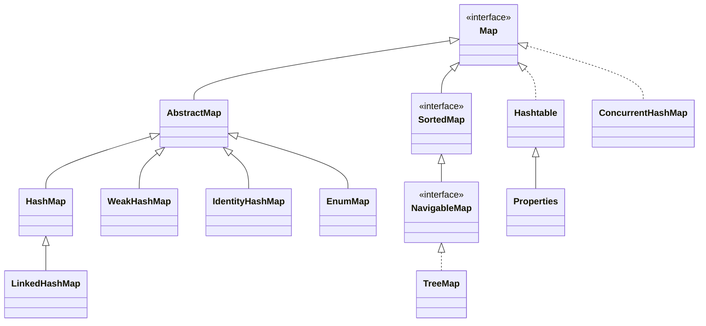
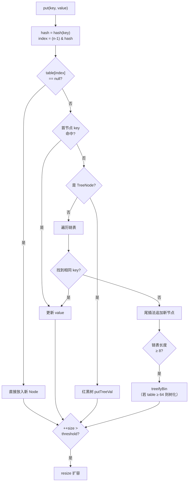
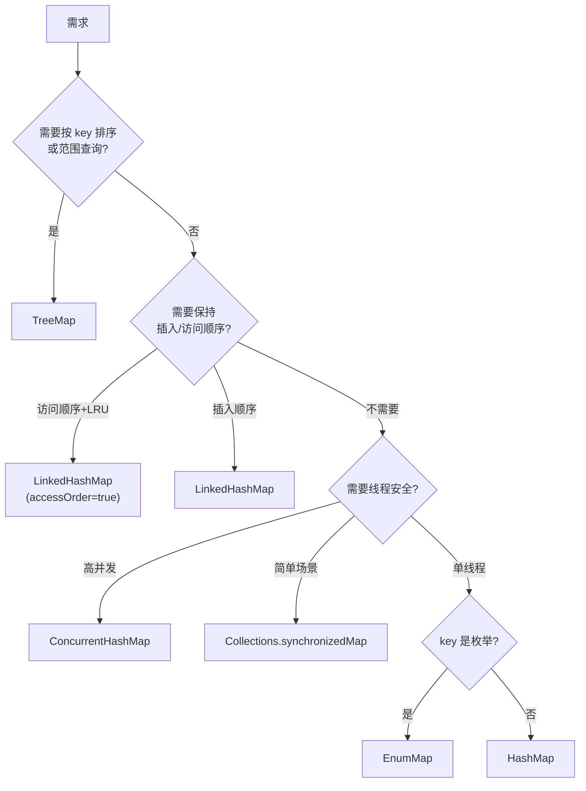

# 17.Map实际应用与设计

> 本篇以一次线上缓存雪崩事故为引子，剖析 Map 家族五大实现——HashMap、LinkedHashMap、TreeMap、ConcurrentHashMap、Hashtable 的设计思想、核心原理与工业级应用，理解每种 Map 背后的工程取舍。

## 目录指引与导读

> 阅读建议：第 1 次按 §01→§10 顺序通读；之后可直接跳"§03 HashMap 三层结构"、"§06 ConcurrentHashMap 并发演进"两个核心章节；面试前重点看 §10 案例回扣 + §11 思考题。

### 二级目录
- [01. 从一个工作案例说起](#01-从一个工作案例说起)
- [02. Map家族全景与选型](#02-map家族全景与选型)
- [03. HashMap最核心实现](#03-hashmap最核心实现)
- [04. LinkedHashMap有序版](#04-linkedhashmap有序版)
- [05. TreeMap红黑树有序](#05-treemap红黑树有序)
- [06. CHM高并发工业级](#06-chm高并发工业级)
- [07. Hashtable历史遗留](#07-hashtable历史遗留)
- [08. 特殊用途Map三种](#08-特殊用途map三种)
- [09. 全面对比选型决策](#09-全面对比选型决策)
- [10. 本篇收获案例回扣](#10-本篇收获案例回扣)
- [11. 思考题深度练习](#11-思考题深度练习)
- [12. 课后作业实战](#12-课后作业实战)
- [13. 进阶专题与延伸](#13-进阶专题与延伸)

### 三级目录
- §03 HashMap：[3.1 三层存储](#31-三层存储结构)｜[3.2 核心字段](#32-核心字段)｜[3.3 扰动函数](#33-哈希扰动函数)｜[3.4 put 流程](#34-put-完整流程)｜[3.5 扩容拆分](#35-扩容容量翻倍--链表拆分)｜[3.6 实际应用](#36-实际应用)
- §06 CHM：[6.1 为什么需要](#61-为什么需要它)｜[6.2 JDK 7 分段锁](#62-jdk-7分段锁)｜[6.3 JDK 8 桶级锁](#63-jdk-8cas--synchronized-桶级锁)｜[6.4 size 分散计数](#64-size-的分散计数)｜[6.5 实际应用](#65-实际应用开篇案例的修复依据)


## 01. 从一个工作案例说起

### 1.1 线上事故：computeIfAbsent 不当使用引发的缓存击穿

某社交 App 的推荐 Feed 接口，用户信息使用 `HashMap` 做本地缓存：

```java
// 原始代码：看似人畜无害
private static final Map<Long, User> userCache = new HashMap<>();

public User getUser(long userId) {
    User user = userCache.get(userId);
    if (user == null) {
        user = userDao.loadById(userId);   // 数据库加载
        userCache.put(userId, user);
    }
    return user;
}
```

**某天大促，Feed 接口 QPS 冲到 8 万，事故接踵而至**：

- **现象 1**：多台机器 CPU 飙到 100%，线程打满，服务不可用。
- **现象 2**：jstack 发现大量线程卡在 `HashMap.get`，栈帧一模一样。
- **现象 3**：数据库同一个 userId 被查询上万次，慢查询告警雪崩。

### 1.2 定位问题：HashMap 在并发下的死循环

JDK 7 多线程同时 `put` 触发扩容，链表在转移过程中形成环：

```
线程 A 在扩容中对链表 A→B 反转为 B→A；
线程 B 也同时在扩容中再次反转：A→B→A，形成环；
之后任意 get 命中这个桶 → while(e != null) 无限循环 → CPU 100%。
```

同时"先查再写"不是原子操作，1 万个请求同时未命中缓存时，1 万次 DB 查询并发打到数据库，这就是**缓存击穿**。

### 1.3 修复方案

```java
// 修复：ConcurrentHashMap + computeIfAbsent 的原子复合操作
private static final Map<Long, User> userCache = new ConcurrentHashMap<>(16384);

public User getUser(long userId) {
    return userCache.computeIfAbsent(userId, id -> userDao.loadById(id));
    // 同一 key 并发访问时，只有一个线程进入 lambda，其他线程等待结果
}
```

修复后 QPS 8 万稳定 P99 12ms，DB 查询量从百万级降到万级。

**这个事故背后藏着 Map 的全部精华**：为什么 HashMap 会死循环？`computeIfAbsent` 的原子性怎么实现？ConcurrentHashMap 锁粒度细到什么程度？本篇逐一拆解。


## 02. Map家族全景与选型

### 2.1 家族关系图



### 2.2 核心实现定位

| 实现 | 底层结构 | 有序性 | 线程安全 | Null key/value | 典型场景 |
|------|---------|--------|---------|----------------|---------|
| HashMap | 数组+链表+红黑树 | 无序 | 否 | 允许 | 通用键值存储 |
| LinkedHashMap | HashMap+双向链表 | 插入/访问序 | 否 | 允许 | LRU 缓存 |
| TreeMap | 红黑树 | Key 自然序 | 否 | 不允许 null key | 有序字典 |
| ConcurrentHashMap | 数组+链表+红黑树 | 无序 | 是 | 不允许 | 高并发场景 |
| Hashtable | 数组+链表 | 无序 | 是（synchronized） | 不允许 | 已废弃 |


## 03. HashMap最核心实现

### 3.1 三层存储结构

```
HashMap 的数据结构 = 数组 + 链表 + 红黑树

              0     1     2     3     4     5     6     7
table:    [null] [Node] [null] [Node] [null] [null] [Node] [null]
                  │             │                    │
                 Node          Node                 Node
                  │             │                    │
                 Node          null                TreeNode
                  │                                 / \
                 null                         TreeNode TreeNode

桶为空 → null
冲突少 → 链表（≤8 个节点）
冲突多 → 红黑树（>8 且 table.length ≥ 64 时转换）
```

### 3.2 核心字段

```java
public class HashMap<K,V> extends AbstractMap<K,V> {
    static final int DEFAULT_INITIAL_CAPACITY = 1 << 4;  // 默认容量 16
    static final float DEFAULT_LOAD_FACTOR = 0.75f;      // 默认负载因子
    static final int TREEIFY_THRESHOLD = 8;              // 链表→红黑树阈值
    static final int UNTREEIFY_THRESHOLD = 6;            // 红黑树→链表阈值
    static final int MIN_TREEIFY_CAPACITY = 64;          // 树化的最小表容量

    transient Node<K,V>[] table;  // 哈希桶数组
    transient int size;           // 键值对数量
    int threshold;                // 扩容阈值 = capacity × loadFactor
    final float loadFactor;       // 负载因子
}
```

### 3.3 哈希扰动函数

```java
static final int hash(Object key) {
    int h;
    return (key == null) ? 0 : (h = key.hashCode()) ^ (h >>> 16);
}
```

**为什么要把高 16 位异或到低 16 位？**

```
table 大小为 16 时，定位桶：
  index = (n - 1) & hash = 0x0000000F & hash
  只有 hash 的低 4 位参与运算！高 28 位完全被忽略。

扰动前：只有高位不同的 key 会被映射到同一个桶
  key1.hashCode() = 0xAAAA0001 → index = 1
  key2.hashCode() = 0xBBBB0001 → index = 1  ← 碰撞！

扰动后：高 16 位信息被混入低 16 位
  h ^ (h >>> 16) 让高位信息参与到低位运算
  key1: 0xAAAA0001 ^ 0x0000AAAA = 0xAAAAAAAA → index 不同
  key2: 0xBBBB0001 ^ 0x0000BBBB = 0xBBBBBBBA → index 不同

一次异或操作，零成本把碰撞率大幅降低。
```

### 3.4 put 完整流程



### 3.5 扩容：容量翻倍 + 链表拆分

```java
// 扩容后每个节点要么在原位置，要么在 "原位置+旧容量"
// 只需要看 hash 值的一个 bit 即可判断

Node<K,V> loHead = null, loTail = null;  // 留在原位
Node<K,V> hiHead = null, hiTail = null;  // 移到新位
do {
    if ((e.hash & oldCap) == 0) {
        if (loTail == null) loHead = e; else loTail.next = e;
        loTail = e;
    } else {
        if (hiTail == null) hiHead = e; else hiTail.next = e;
        hiTail = e;
    }
} while ((e = next) != null);
```

**为什么这么巧？因为容量是 2 的幂**：

```
旧容量 16: index = hash & 0b01111 (低 4 位)
新容量 32: index = hash & 0b11111 (低 5 位)
区别：只多看了 hash 的第 5 位（即 oldCap 那一位）
  第 5 位 = 0 → 新 index = 旧 index（留在原位）
  第 5 位 = 1 → 新 index = 旧 index + 16（移到新位）
不重新计算 hash，一次位运算搞定。
```

### 3.6 实际应用

```java
// 场景1：预估容量，避免扩容抖动
Map<Long, User> userCache = new HashMap<>(1024);

// 场景2：词频统计
Map<String, Integer> wordCount = new HashMap<>();
for (String word : words) {
    wordCount.merge(word, 1, Integer::sum);
}

// 场景3：分组
Map<String, List<Order>> ordersByCity = orders.stream()
    .collect(Collectors.groupingBy(Order::getCity));
```


## 04. LinkedHashMap有序版

### 4.1 在 HashMap 基础上加"有序链"

LinkedHashMap 继承自 HashMap，每个 Entry 额外维护 `before` / `after` 指针：

```java
static class Entry<K,V> extends HashMap.Node<K,V> {
    Entry<K,V> before, after;  // 双向链表指针
}
```

```
HashMap 视角：
  table[0] → Node → Node → null
  table[3] → Node → null

LinkedHashMap 额外双向链表（按插入顺序）：
  head ⇄ [A] ⇄ [B] ⇄ [C] ⇄ [D] ⇄ tail

即使 A、B、C、D 散落在不同桶中，双向链表把它们按插入顺序串起来。
```

### 4.2 两种排序模式

```java
// 模式1：按插入顺序（默认）
Map<String, Integer> insert = new LinkedHashMap<>();
// 模式2：按访问顺序（accessOrder=true）
Map<String, Integer> access = new LinkedHashMap<>(16, 0.75f, true);
access.put("banana", 2);
access.put("apple", 1);
access.get("banana");  // banana 被移到链表尾
// 遍历顺序：apple → banana（最近访问在尾部）
```

### 4.3 用 LinkedHashMap 实现 LRU

```java
public class LRUCache<K, V> extends LinkedHashMap<K, V> {
    private final int maxSize;
    public LRUCache(int maxSize) {
        super(maxSize, 0.75f, true);  // accessOrder = true
        this.maxSize = maxSize;
    }
    @Override
    protected boolean removeEldestEntry(Map.Entry<K, V> eldest) {
        return size() > maxSize;  // 超容量就删最久未访问的
    }
}
```

**为什么优雅**：LinkedHashMap 已维护访问顺序双向链表，每次 get/put 自动把节点移到尾部，头部永远是最久未访问的元素。整个 LRU 缓存 = 5 行代码，O(1) get + O(1) put。

### 4.4 实际应用

```java
// 配置项保持插入顺序（JSON/YAML 解析常用）
Map<String, Object> config = new LinkedHashMap<>();

// 最近浏览记录
Map<String, Long> recent = new LinkedHashMap<>(16, 0.75f, true) {
    protected boolean removeEldestEntry(Map.Entry e) { return size() > 50; }
};

// 去重且保持顺序
List<String> unique = new ArrayList<>(new LinkedHashSet<>(raw));
```


## 05. TreeMap红黑树有序

### 5.1 核心设计

TreeMap 底层是一棵红黑树，按 key 的自然顺序（或自定义 Comparator）排列：

```java
public class TreeMap<K,V> extends AbstractMap<K,V>
        implements NavigableMap<K,V> {
    private final Comparator<? super K> comparator;
    private transient Entry<K,V> root;
    static final class Entry<K,V> implements Map.Entry<K,V> {
        K key; V value;
        Entry<K,V> left, right, parent;
        boolean color = BLACK;
    }
}
```

### 5.2 操作复杂度与核心能力

| 操作 | 复杂度 | 说明 |
|------|--------|------|
| get/put/remove | O(log N) | 红黑树查找+修复 |
| firstKey/lastKey | O(log N) | 沿左/右子树到底 |
| floorKey/ceilingKey | O(log N) | 查找最近的 ≤/≥ 给定 key |

**HashMap 做不到的操作**：

```java
TreeMap<Integer, String> scores = new TreeMap<>();
scores.put(95, "Alice"); scores.put(87, "Bob");
scores.put(92, "Charlie"); scores.put(78, "David");

scores.firstKey();          // 78
scores.subMap(85, 96);      // {87=Bob, 92=Charlie, 95=Alice}
scores.floorEntry(90);      // 87=Bob（≤90 的最大 key）
scores.ceilingEntry(90);    // 92=Charlie（≥90 的最小 key）
scores.descendingMap();     // 逆序视图
```

### 5.3 选型

```
TreeMap：需要按 key 排序 / 范围查询 / 最近邻查询
HashMap：只需 get/put/remove，追求 O(1) 极致性能
```

### 5.4 实际应用

```java
// 排行榜
TreeMap<Integer, List<String>> board = new TreeMap<>(Comparator.reverseOrder());

// 价格区间筛选
TreeMap<Double, Product> priceIdx = new TreeMap<>();
priceIdx.subMap(100.0, 500.0);

// IP 路由表：floorEntry 找 ≤ 给定 IP 的最大网段
TreeMap<Long, String> routeTable = new TreeMap<>();
```


## 06. CHM高并发工业级

### 6.1 为什么需要它

```java
// HashMap 多线程下的致命问题（JDK 7）：
// 两个线程同时 put 触发扩容 → 链表形成环 → get 死循环 → CPU 100%

// Collections.synchronizedMap：所有读写共用一把大锁，完全串行化
// 100 个线程读也要排队 → 性能灾难
```

### 6.2 JDK 7：分段锁

```
ConcurrentHashMap
  └── Segment[0..15]   （16 个段，每段一把锁）
        ├── Segment[0] → HashEntry[] table + lock
        ├── Segment[1] → HashEntry[] table + lock
        └── ...

并发度 = Segment 数量（默认 16）
写不同 Segment → 互不影响
读 → volatile 无锁
写同一个 Segment → 竞争该段的锁
```

### 6.3 JDK 8：CAS + synchronized 桶级锁

```java
// 锁粒度从 Segment（段）缩小到 Node（桶）
final V putVal(K key, V value, boolean onlyIfAbsent) {
    int hash = spread(key.hashCode());
    for (Node<K,V>[] tab = table;;) {
        Node<K,V> f; int n, i, fh;
        if (tab == null || (n = tab.length) == 0)
            tab = initTable();                         // CAS 初始化
        else if ((f = tabAt(tab, i = (n-1) & hash)) == null) {
            // 桶为空：CAS 放入新节点（无锁！）
            if (casTabAt(tab, i, null, new Node<>(hash, key, value, null))) break;
        }
        else if ((fh = f.hash) == MOVED)
            tab = helpTransfer(tab, f);                // 协助扩容
        else {
            synchronized (f) {                         // 只锁一个桶！
                if (tabAt(tab, i) == f) { /* 链表或红黑树插入 */ }
            }
        }
    }
    addCount(1L, binCount);
    return null;
}
```

**JDK 7 vs JDK 8**：

| 维度 | JDK 7 分段锁 | JDK 8 CAS+synchronized |
|------|-------------|----------------------|
| 锁粒度 | Segment（含多个桶） | 单个桶（Node） |
| 最大并发度 | 16（固定） | 桶数量（动态增长） |
| 空桶写入 | 需要段锁 | CAS 无锁 |
| 非空桶写入 | 段锁 | synchronized 桶头 |
| 内存 | 16 个 Segment 对象 | 无额外对象 |

### 6.4 size() 的分散计数

```java
// 借鉴 LongAdder：baseCount + CounterCell[] 分散统计
private transient volatile long baseCount;
private transient volatile CounterCell[] counterCells;

public int size() {
    long n = sumCount();  // baseCount + Σ counterCells[i].value
    return (n < 0L) ? 0 : (n > Integer.MAX_VALUE) ? Integer.MAX_VALUE : (int)n;
}
// 低竞争：CAS 更新 baseCount
// 高竞争：每个线程更新自己的 CounterCell，最后求和
```

### 6.5 实际应用（开篇案例的修复依据）

```java
// 场景1：高并发计数器
ConcurrentHashMap<String, LongAdder> metrics = new ConcurrentHashMap<>();
metrics.computeIfAbsent("api.calls", k -> new LongAdder()).increment();

// 场景2：缓存（带原子性计算，防缓存击穿）
ConcurrentHashMap<String, User> cache = new ConcurrentHashMap<>();
User user = cache.computeIfAbsent(userId, id -> loadFromDB(id));
// computeIfAbsent 保证原子性：同一 key 只会调用一次 loadFromDB

// 场景3：线程安全 Set
Set<String> concurrentSet = ConcurrentHashMap.newKeySet();

// 场景4：批量并行操作（JDK 8+）
cache.forEach(4, (k, v) -> process(k, v));
long sum = cache.reduceValuesToLong(4, User::getAge, 0L, Long::sum);
```


## 07. Hashtable历史遗留

```java
// 方法级 synchronized，不允许 null key/value
public synchronized V put(K key, V value) {
    if (value == null) throw new NullPointerException();
    // ...
}
```

| 对比 | HashMap | Hashtable |
|------|---------|-----------|
| 线程安全 | 否 | 是（synchronized） |
| null key/value | 允许 | 不允许 |
| 初始容量 | 16 | 11 |
| 扩容 | 2 倍 | 2N+1 |
| 哈希计算 | 扰动函数 | 直接 hashCode |
| 推荐 | ✅ | ❌ 已废弃 |

**一句话总结**：Hashtable 之于 ConcurrentHashMap，就像 Vector 之于 ArrayList——历史遗留，请勿使用。


## 08. 特殊用途Map三种

### 8.1 WeakHashMap：自动清理的缓存

```java
// key 是弱引用，key 没有其他强引用时 GC 会回收
WeakHashMap<Object, String> cache = new WeakHashMap<>();
Object key = new Object();
cache.put(key, "data");
key = null; System.gc();   // entry 自动清除
```

**适用场景**：类元数据缓存、ClassLoader 关联数据、ThreadLocal 底层。

### 8.2 IdentityHashMap：用 == 代替 equals

```java
IdentityHashMap<String, Integer> map = new IdentityHashMap<>();
String s1 = new String("hello"), s2 = new String("hello");
map.put(s1, 1); map.put(s2, 2);
System.out.println(map.size());  // 2（普通 HashMap 会是 1）
```

**适用场景**：序列化框架追踪对象引用、拓扑排序标记已访问节点。

### 8.3 EnumMap：枚举专用极致性能

```java
// 内部用数组实现，下标 = enum.ordinal()
EnumMap<DayOfWeek, String> schedule = new EnumMap<>(DayOfWeek.class);
// put: vals[key.ordinal()] = value;   → O(1)，无哈希
// get: return vals[key.ordinal()];    → O(1)，无哈希
```


## 09. 全面对比选型决策

### 9.1 性能对比

| 操作 | HashMap | LinkedHashMap | TreeMap | ConcurrentHashMap |
|------|---------|---------------|---------|-------------------|
| get/put/remove | O(1) | O(1) | O(log N) | O(1) |
| 有序遍历 | ❌ | 插入/访问序 | Key 排序 | ❌ |
| 范围查询 | ❌ | ❌ | ✅ | ❌ |
| 并发安全 | ❌ | ❌ | ❌ | ✅ |

### 9.2 选型决策树



### 9.3 跨语言对比

| 语言 | 无序 Map | 有序 Map | 并发 Map |
|------|---------|---------|---------|
| Java | HashMap | TreeMap / LinkedHashMap | ConcurrentHashMap |
| Go | map（迭代顺序随机化） | 无内置 | sync.Map |
| Python | dict（3.7+ 保持插入序） | SortedDict（第三方） | 无内置 |
| Rust | HashMap | BTreeMap | DashMap（第三方） |
| C++ | unordered_map | map（红黑树） | concurrent_unordered_map（TBB） |

**Go 的独特设计**：map 迭代顺序**故意随机化**，防止开发者依赖迭代顺序。


## 10. 本篇收获案例回扣

回到开篇的**缓存击穿+死循环**事故：

| 问题 | 原因 | 本篇答案 |
|------|------|---------|
| 为什么 CPU 100%？ | HashMap 并发 put 触发扩容，链表成环，get 死循环 | §3.5 扩容机制：单线程设计，无法应对并发迁移 |
| 为什么要用 ConcurrentHashMap？ | 桶级锁 + CAS 无锁空桶写入，读 volatile 无锁 | §6.3 JDK 8 细粒度锁，100 线程读零竞争 |
| computeIfAbsent 的原子性哪里来？ | 同一桶 synchronized 串行化，保证 lambda 只执行一次 | §6.3 + §6.5 解决缓存击穿的关键 |
| 为什么要预估容量 16384？ | 8 万用户 / 0.75 ≈ 10.6 万，避免运行期扩容抖动 | §3.2 threshold = capacity × loadFactor |

**本篇核心收获**：

- **三层存储**：数组 + 链表 + 红黑树的组合，在碰撞少时 O(1)、碰撞多时退化到 O(log N)。
- **扰动函数**：`h ^ (h >>> 16)` 一次异或把高位信息混入低位，零成本降低碰撞率。
- **2 倍扩容的魔法**：节点要么留在原位，要么移到 `原位+oldCap`，一次位运算搞定。
- **并发演进**：Hashtable 全表锁 → JDK 7 分段锁 → JDK 8 桶级锁 + CAS，粒度越来越细。
- **复合原子操作**：`computeIfAbsent` / `merge` / `putIfAbsent` 才是高并发下的正确姿势。
- **选型哲学**：顺序→LinkedHashMap，排序→TreeMap，并发→ConcurrentHashMap，枚举→EnumMap。


## 11. 思考题深度练习

> 由浅入深，建议先独立思考再查阅资料。

**1. 基础理解**：HashMap 允许 null key（最多 1 个），TreeMap 不允许 null key。请从底层实现原理解释：HashMap 如何处理 null key 的哈希值？TreeMap 为什么无法处理？

**2. 设计分析**：LinkedHashMap 的 `removeEldestEntry` 在每次 `put` 之后被调用。如果一次性 `putAll(100 个元素)`，maxSize=10，这个方法会被调用多少次？最终 Map 里有多少元素？

**3. 并发深入**：ConcurrentHashMap 的 `computeIfAbsent` 是原子操作，但下面代码仍有并发问题，为什么？如何改？

```java
if (!map.containsKey(key)) {
    map.put(key, computeValue(key));
}
```

**4. 性能陷阱**：1000 万条数据的 HashMap，所有 key 的 `hashCode()` 都返回相同值，get 的时间复杂度是多少？JDK 8 前后有什么区别？如何防御这种 HashDoS 攻击？

**5. 架构思考**：设计一个支持"过期时间"的 Map（类似 Redis EXPIRE）：`put(key, value, ttl)` 带过期时间，`get(key)` 自动清除过期数据。对比惰性删除 vs 定时删除两种清理策略的优缺点。


## 12. 课后作业实战

### 作业 1：写一个 JDK 原理对比实验

分别用 `HashMap`、`Hashtable`、`Collections.synchronizedMap(new HashMap<>())`、`ConcurrentHashMap` 跑 32 线程×每线程 10 万次 put/get 的压测，记录：

- 吞吐量（ops/s）
- P99 延迟
- 是否出现异常/死循环

写一份总结表，用数据证明"为什么生产用 ConcurrentHashMap"。

### 作业 2：实现一个线程安全带 TTL 的本地缓存

需求：

- `put(K key, V value, long ttlMs)` / `get(K key)` / `remove(K key)` API
- 同一 key 并发 get 不命中时，loader 函数**只执行一次**（防缓存击穿）
- 过期 key 支持**惰性删除**（get 时检查）+ **定时清理**（后台线程）
- 容量达上限后按 **LRU** 淘汰

提示：`ConcurrentHashMap<K, Entry<V>>` + `LinkedHashMap(accessOrder=true)` + `ScheduledExecutorService` + `computeIfAbsent`。

### 作业 3：LeetCode Map 刷题清单

| # | 题目 | 考点 |
|---|------|------|
| 1 | Two Sum | HashMap 空间换时间 |
| 146 | LRU Cache | LinkedHashMap / 手写双链表 |
| 460 | LFU Cache | 两级 HashMap + 双链表 |
| 380 | Insert Delete GetRandom O(1) | HashMap + ArrayList |
| 381 | Insert Delete GetRandom O(1) - Duplicates allowed | HashMap<Integer,Set<Integer>> |
| 706 | Design HashMap | 手写 HashMap（拉链法） |
| 355 | Design Twitter | HashMap + 小顶堆合并 |
| 895 | Maximum Frequency Stack | HashMap + 按频次 Stack |
| 981 | Time Based Key-Value Store | TreeMap floorEntry |
| 1146 | Snapshot Array | TreeMap 实现版本查询 |

要求：每题先独立实现，再对照题解分析复杂度，特别关注 LRU/LFU 的 O(1) 技巧。

## 13. 进阶专题与延伸

> 前面已经把 `HashMap / LinkedHashMap / TreeMap / ConcurrentHashMap / Hashtable` 五大实现的"日常打法"讲透。这节继续往深挖：HashDoS 攻击、HashMap 死循环的往事、高性能替代品（Fastutil/Koloboke/Eclipse Collections）、只读场景的完美散列 MPHF、Facebook 的 F14、Google 的 SwissTable、Caffeine 的 W-TinyLFU、持久化 HAMT。

### 13.1 HashDoS：为什么 JDK 8 必须引入红黑树化

**攻击原理**：攻击者精心构造一批 key 让它们的 `hashCode()` 相同（哈希碰撞），HashMap 所有元素落到同一个桶。查询退化为 O(n) 链表遍历。

**历史事件**：
- **2011 年 28C3 大会**：安全研究者 Alexander "alech" Klink 公开 HashDoS 攻击 PHP/Java/Python/Ruby/ASP.NET。2 MB 恶意 POST body 能让 Tomcat CPU 100% 持续数分钟。
- **CVE-2011-4858**：Apache Tomcat 所有版本受影响
- **Java 应对**：JDK 7u40 引入 **alternative hashing**（String 的备用哈希）；JDK 8 正式引入 **红黑树化**（单桶超 8 个元素转红黑树，O(n)→O(log n)）

**仍然不是完美防御**：
- 如果攻击者能让 key 的 `compareTo` 也退化（相同 hash 且不可比较的对象），红黑树也会退化回链表
- 彻底防御需要 **随机化哈希种子**（SipHash），但 JDK 至今没全局启用（性能考量），Python 3.4+ 默认启用

### 13.2 HashMap 的死循环事故：并发误用的代价

**JDK 1.7 的经典 bug**：并发 `put` 触发扩容时，链表 `transfer` 使用头插法，可能形成环。之后 `get` 某个不存在的 key 会死循环，CPU 打满。

```java
// JDK 1.7 transfer 的核心代码（简化）
void transfer(Entry[] newTable) {
    for (Entry<K,V> e : table) {
        while (e != null) {
            Entry<K,V> next = e.next;         // ← 线程 A 执行到这里被切换
            int i = indexFor(e.hash, newTable.length);
            e.next = newTable[i];             // ← 头插法
            newTable[i] = e;
            e = next;
        }
    }
}
// 两个线程同时 transfer，被切换后 e.next 和 next 的指向交叉 → 形成 A→B→A 环
```

**JDK 1.8 修复**：改用 **尾插法 + 链表拆分成 lo/hi 两条**，避免环。但 JDK 8 的 HashMap 并发 put 仍会丢数据（size 计数错、entry 覆盖），**线程安全仍需 ConcurrentHashMap**。

### 13.3 Facebook F14：紧凑型 HashMap

Facebook 开源的 `F14ValueMap` / `F14NodeMap`（Folly 库）是目前工业界最极致的 C++ HashMap：
- **F14**：F = "Folly"，14 = 每个 chunk 存 14 个元素（配合 16 字节 SSE 寄存器：14 tag + 2 元数据）
- **SIMD 并行 tag 比较**：一次 `_mm_cmpeq_epi8` 比对 14 个 7 位 tag，95% 的 miss 被 1 条 SIMD 指令排除
- **空间**：比 `std::unordered_map` 小 40%，快 2 倍
- **演讲**：FB 工程师 Nathan Bronson 在 CppCon 2019 的 "Open-sourcing F14" 详细拆解

### 13.4 Google SwissTable：标准库革命

Google 内部的 `absl::flat_hash_map`（开源到 Abseil）是 **Rust HashMap、Go 1.14+ map** 的原型：
- 每个 group 16 字节，存 16 个 **控制字节**（1 字节元数据：空 / 已删 / 占用+tag）
- 查询时 SIMD 一条指令比对 16 个 slot
- CppCon 2017 Matt Kulukundis "Designing a Fast, Efficient, Cache-friendly Hash Table, Step by Step" 全场起立鼓掌

**Rust 标准库**（`std::collections::HashMap`）用的就是这个（hashbrown crate 是 SwissTable 的 Rust 移植），从 2018 年起 Rust 的 HashMap 性能就碾压 C++ `unordered_map`。

### 13.5 HAMT：持久化 Map 的基石

**Hash Array Mapped Trie**（HAMT）是 Clojure、Scala、Immutable.js 不可变 Map 的核心：
- Trie 每层 32 个分支（32 = 2^5，hash 按 5 bit 分组）
- 每层节点用 **位图压缩**：32 位的 bitmap 表示哪些子指针存在
- **get**：O(log₃₂ n) ≈ 常数
- **put**：路径复制，只复制 log₃₂(n) 个节点
- **空间**：新旧版本共享 99%+ 节点

**真实应用**：
- Clojure `PersistentHashMap`（300 行 Java 源码）
- Scala 2.13 重写的 `HashMap`（immutable.HashMap ← HAMT / CHAMP 改进版）
- Akka 的分布式状态管理
- 函数式数据库 Datomic 的 index

### 13.6 Caffeine：Guava Cache 的现代替代

Ben Manes（前 Google 工程师）的 **Caffeine** 已经取代 Guava Cache 成为 JVM 本地缓存事实标准，Spring Boot 2.0+ 默认选用：

```java
LoadingCache<Long, User> cache = Caffeine.newBuilder()
    .maximumSize(10_000)
    .expireAfterWrite(Duration.ofMinutes(10))
    .recordStats()
    .build(userId -> userDao.loadById(userId));
```

**核心优势**：
- **W-TinyLFU 淘汰算法**：命中率比 LRU 高 15-30%（论文 "TinyLFU: A Highly Efficient Cache Admission Policy"）
- **异步刷新**：`refreshAfterWrite` 后台刷新，不阻塞当前请求
- **ConcurrentLinkedHashMap 演进而来**：作者自己的前作
- **与 Spring Cache 深度集成**：`@Cacheable` 直接可用

**性能**：同等容量下，Caffeine 比 Guava Cache 吞吐高 3-5 倍，P99 低 60%。

### 13.7 Fastutil / Koloboke / Eclipse Collections：特化版

JDK `HashMap<Integer, Integer>` 每个 entry 至少 48 字节（两个 Integer 装箱 + entry header + 指针），存 1000 万个 entry 要 500 MB+ 堆内存 + GC 噩梦。

**原生类型特化版**：
| 库 | 实现 | 特点 |
|----|------|------|
| Fastutil | `Int2IntOpenHashMap` | 开放寻址，无装箱，空间省 4 倍 |
| Koloboke | `HashIntIntMap` | 同上，作者是前 Oracle HotSpot 工程师，微基准更快 |
| Eclipse Collections | `IntIntHashMap` | IBM 开源，API 设计更现代（Stream 友好） |
| Agrona | `Int2IntHashMap` | Aeron/LMAX Disruptor 生态，off-heap 友好 |

**实测**：1000 万 int→int 映射，`HashMap<Integer,Integer>` 占 500 MB，`Int2IntOpenHashMap` 只占 96 MB。

### 13.8 TreeMap 的"近邻查找"：时序数据的神器

TreeMap 的四个"近邻查找"方法，在业务里低估但极其好用：

```java
TreeMap<Long, Snapshot> history = new TreeMap<>();

// 场景：找某时间点最近的快照
history.floorEntry(timestamp)         // 小于等于 timestamp 的最大 key
history.ceilingEntry(timestamp)       // 大于等于 timestamp 的最小 key
history.lowerEntry(timestamp)         // 严格小于
history.higherEntry(timestamp)        // 严格大于
```

**典型应用**：
- **LeetCode 981 Time Based Key-Value Store**：完美匹配
- **金融 K 线数据**：找某时刻的价格快照
- **滑动窗口限流**：按时间戳查区间计数
- **Redis ZSET**：底层也是有序（跳表 + hash）

### 13.9 EnumMap 的位魔法：Effective Java 的最爱

```java
enum Color { RED, GREEN, BLUE }
EnumMap<Color, Integer> map = new EnumMap<>(Color.class);
map.put(RED, 1);
// 底层：Integer[] values = new Integer[3]; values[RED.ordinal()] = 1;
```

- **空间**：只用一个 Object[] 数组，几乎零开销
- **时间**：`map.get(RED)` = `values[0]`，单次数组访问 O(1) + 无 hash 计算
- **迭代顺序**：按枚举声明顺序（天然有序）

Effective Java Item 37 明确说：**"never use ordinal() as an array index; use EnumMap instead"**——因为 EnumMap 已经帮你做了。

### 13.10 MPHF：只读场景的完美散列

如果 key 集合在构建时已知且不变（比如 DNS zone、字典、URL 路由表），**Minimal Perfect Hash Function** 能做到：
- **零碰撞**：每个 key 唯一映射到一个 slot
- **n 个 key 只占 n 个 slot**（加载因子 100%）
- **每个 key 仅需 2.5-4 位额外空间**（BDZ/CHD 算法）

**工业应用**：
- CDN 路由表（Cloudflare 用 CHD）
- IP 归属地库（纯真 IP、GeoIP2 的索引）
- 汇编器/编译器的关键字表（gperf 生成器）

Rust 的 `phf` crate、C 的 `gperf`、Java 的 `PFP`（无流行实现）。Google 内部的 `cmph` 库存在十几年仍是主流。

### 13.11 经典书目与源码

- **《Effective Java》第 3 版** Item 11（equals 的陷阱）、Item 37（EnumMap）、Item 82（并发 Map）
- **《Java Concurrency in Practice》** 第 5.2 章（ConcurrentHashMap 原理）
- **《Hacker's Delight》** Ch 5（哈希函数的数学）
- **Doug Lea 的 CHM 论文** "Classes for Concurrent Hash Table Access"
- **Matt Kulukundis CppCon 2017**：SwissTable 演讲（YouTube 可搜）
- **源码必读**：
  - `java.util.HashMap`（2400 行，JDK 8）
  - `java.util.concurrent.ConcurrentHashMap`（6300 行，Doug Lea 亲笔）
  - `clojure.lang.PersistentHashMap`（300 行，Java 实现的 HAMT）
  - Caffeine 源码 `com.github.benmanes.caffeine.cache.BoundedLocalCache`

### 13.12 过渡：从 Map 到 Set

Map 存的是"键→值"，Set 存的是"键"（值被忽略）。Java 里几乎所有 Set 实现都是包装 Map：`HashSet = HashMap + dummy value`、`TreeSet = TreeMap`、`LinkedHashSet = LinkedHashMap`。但这种"简单包装"背后也有设计哲学上的考量。下一篇 `18.Set实际应用与设计.md` 会把 Set 家族的实际应用（去重、交并差、权限判断、Bloom Filter 替代）和 Set 独有的坑（equals/hashCode 契约、TreeSet 的 Comparator 陷阱）讲透。