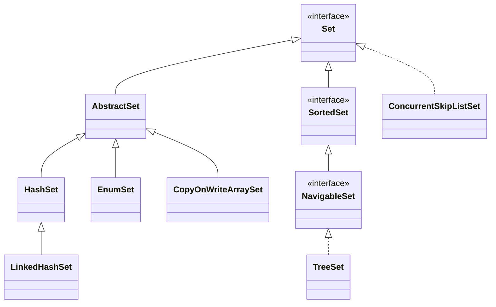
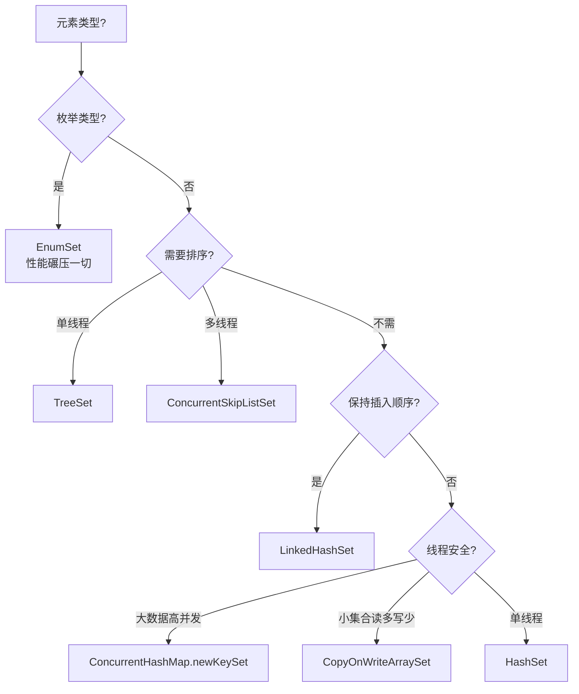

# 18.Set实际应用与设计

> 本篇以一次海量 URL 去重踩坑为引子，剖析 Set 家族的核心实现——HashSet、LinkedHashSet、TreeSet、CopyOnWriteArraySet、EnumSet 及并发 Set 的设计思想、核心原理与工业级应用，理解 Set 背后的工程取舍。

## 目录指引与导读

> 阅读建议：第 1 次按 §01→§10 顺序通读；之后可直接跳到"§03 HashSet 委托设计"或"§06 EnumSet 位向量"两个最具启发的章节；面试前重点看 §10 案例回扣 + §11 思考题。

### 二级目录
- [01. 从一个工作案例说起](#01-从一个工作案例说起)
- [02. Set家族全景](#02-set家族全景)
- [03. HashSet委托优雅设计](#03-hashset委托优雅设计)
- [04. LinkedHashSet有序版](#04-linkedhashset有序版)
- [05. TreeSet红黑树有序](#05-treeset红黑树有序)
- [06. EnumSet位向量极致](#06-enumset位向量极致)
- [07. 并发Set三种实现](#07-并发set三种实现)
- [08. 全面对比选型决策](#08-全面对比选型决策)
- [09. 高级话题与变体](#09-高级话题与变体)
- [10. 本篇收获案例回扣](#10-本篇收获案例回扣)
- [11. 思考题深度练习](#11-思考题深度练习)
- [12. 课后作业实战](#12-课后作业实战)
- [13. 进阶专题与延伸](#13-进阶专题与延伸)


## 01. 从一个工作案例说起

### 1.1 线上事故：URL 去重内存爆炸

某垂直搜索爬虫每天抓取约 2 亿条 URL，业务方要求"已抓过的 URL 不重复抓"。最初版本：

```java
// 原始方案：HashSet 直接存 URL 字符串
private static final Set<String> visited = new HashSet<>();

public boolean tryVisit(String url) {
    return visited.add(url);   // 返回 true 表示首次访问
}
```

**某个清晨运维告警**：

- 爬虫机器 40GB 堆内存耗尽，连续 Full GC，服务不可用。
- jmap 显示 `HashMap.Node[]` 占了 32GB，活的 URL 条目约 1.2 亿。
- 每条 URL 平均 80 字符，**理论只需要 ~10GB**，为什么 HashSet 撑到了 32GB？

### 1.2 定位问题：HashSet 的真实内存开销

```
每个 HashSet 元素的实际内存占用：
  HashMap.Node 对象头      16 B
  hash 字段                4 B
  key 引用                 8 B
  value 引用 (→PRESENT)    8 B
  next 引用                8 B
  对齐填充                 4 B
  ─────────────────────
  小计                    48 B
  + String 对象头 (16B) + char[] 引用 (8B) + 实际字符数组头 (16B+字节数)
  总计单条 URL 约 180-220 字节

1.2 亿 × 200 B ≈ 24 GB （还要算 HashMap 数组本身 + 负载因子冗余）
```

**结论**：HashSet 存字符串的真实内存开销是裸数据的 2-3 倍。

### 1.3 修复方案

最终架构采用**三级去重**：

```java
// 第1级：布隆过滤器（前置过滤，容忍 0.1% 误判）
BloomFilter<String> bloom = BloomFilter.create(
    Funnels.stringFunnel(UTF_8), 10_000_000_000L, 0.001);
// 内存：~18 GB，可容纳 100 亿 URL

// 第2级：HashSet<Long>（URL 做 MurmurHash128 取低 64 位）
Set<Long> visited = ConcurrentHashMap.newKeySet(200_000_000);
// 单条 Long 约 48B，2 亿 → ~10 GB

// 第3级：疑似重复时回源 HBase 精确确认
```

修复后单机常驻 28GB，QPS 稳定在 15 万。

**这个事故藏着 Set 的关键知识点**：HashSet 为什么委托 HashMap？内存开销从哪来？EnumSet/BitSet 为什么快上百倍？本篇逐一拆解。


## 02. Set家族全景

### 2.1 集合的数学本质

```
集合 Set = 一组不重复的无序元素，支持三个核心操作：
  x ∈ S ?           → contains(x)
  S = S ∪ {x}       → add(x)
  S = S \ {x}       → remove(x)

集合运算：
  并集  A ∪ B         交集  A ∩ B
  差集  A \ B         对称差 A △ B
```

### 2.2 家族关系图



### 2.3 家族对照

| 实现 | 底层 | 有序性 | 线程安全 | 典型场景 |
|------|------|--------|---------|---------|
| HashSet | HashMap | 无 | 否 | 通用去重 |
| LinkedHashSet | LinkedHashMap | 插入序 | 否 | 去重保持顺序 |
| TreeSet | TreeMap（红黑树） | 自然序 | 否 | 范围/近邻查询 |
| EnumSet | 位向量（long / long[]） | 枚举序 | 否 | 枚举集合 |
| CopyOnWriteArraySet | COWArrayList | 插入序 | 是 | 极小集合+读多写少 |
| ConcurrentHashMap.newKeySet | CHM | 无 | 是 | 通用高并发去重 |
| ConcurrentSkipListSet | 跳表 | 自然序 | 是 | 有序并发场景 |


## 03. HashSet委托优雅设计

### 3.1 一个 PRESENT 打天下

HashSet 全部的秘密就一行代码——**它是一个只用 key 的 HashMap**：

```java
public class HashSet<E> extends AbstractSet<E> implements Set<E> {
    private transient HashMap<E,Object> map;
    private static final Object PRESENT = new Object();  // 占位值

    public HashSet() { map = new HashMap<>(); }
    public boolean add(E e)          { return map.put(e, PRESENT) == null; }
    public boolean remove(Object o)  { return map.remove(o) == PRESENT; }
    public boolean contains(Object o){ return map.containsKey(o); }
    public int size()                { return map.size(); }
}
```

**设计思想：委托模式**

```
HashMap 已经解决了：高效哈希、链表+红黑树冲突解决、动态扩容、扰动函数。
HashSet 只需要一层薄薄委托，就获得 HashMap 的全部能力。
代价：每个元素多 8B 指向 PRESENT 的引用。
收益：零重复代码、自动获得 HashMap 的所有后续优化（如红黑树升级）。
```

### 3.2 为什么不用 null 作为 value？

```java
// 如果用 null：
map.put("key1", null);   // 返回 null（新插入）
map.put("key1", null);   // 返回 null（已存在，旧值也是 null）
// 无法区分"新插入"还是"已存在"，add() 无法判断返回 true/false

// 用 PRESENT：
map.put("key1", PRESENT);  // 返回 null → add 返回 true
map.put("key1", PRESENT);  // 返回 PRESENT → add 返回 false
```

**PRESENT 是 static final**：所有 HashSet 实例共享同一个 PRESENT 对象，对象本身只占 16B。每个 Entry 的 value 引用（8B）都指向它。

### 3.3 hashCode 与 equals 契约

HashSet 正确工作的前提是元素正确实现 `hashCode()` 和 `equals()`：

```
契约：
  1. a.equals(b) == true  ⇒  a.hashCode() == b.hashCode()  （必须）
  2. a.hashCode() == b.hashCode()  ⇏  a.equals(b)           （允许碰撞）
```

```java
// 违反契约的后果：
class BadKey {
    int id;
    @Override public boolean equals(Object o) {
        return this.id == ((BadKey) o).id;   // 只比较 id
    }
    // 忘了重写 hashCode → 默认用内存地址
}
Set<BadKey> set = new HashSet<>();
set.add(new BadKey(1));
set.contains(new BadKey(1));  // false！hashCode 不同 → 定位到不同桶
```

**正确写法**：

```java
@Override public int hashCode() {
    return Objects.hash(id, name);   // 与 equals 使用相同字段
}
```

### 3.4 实际应用

```java
// 去重
Set<String> unique = new HashSet<>(Arrays.asList("a", "b", "a", "c"));

// 快速成员检测
if (blacklist.contains(userId)) reject();

// 集合运算
Set<String> a = new HashSet<>(Arrays.asList("a", "b", "c", "d"));
Set<String> b = new HashSet<>(Arrays.asList("c", "d", "e"));
Set<String> inter = new HashSet<>(a); inter.retainAll(b);   // 交集
Set<String> union = new HashSet<>(a); union.addAll(b);      // 并集
Set<String> diff  = new HashSet<>(a); diff.removeAll(b);    // 差集
```


## 04. LinkedHashSet有序版

### 4.1 实现原理

LinkedHashSet 继承自 HashSet，底层委托 **LinkedHashMap**：

```java
public class LinkedHashSet<E> extends HashSet<E> {
    public LinkedHashSet() {
        super(16, .75f, true);  // 第3参数 true 切换底层为 LinkedHashMap
    }
}
// HashSet 的包内构造器：
HashSet(int cap, float lf, boolean dummy) {
    map = new LinkedHashMap<>(cap, lf);
}
```

### 4.2 HashSet vs LinkedHashSet

| 维度 | HashSet | LinkedHashSet |
|------|---------|---------------|
| 底层 | HashMap | LinkedHashMap |
| 插入顺序 | 不保证 | 保持 |
| 内存 | 较少 | 每节点多 before/after 指针（+16B） |
| 插入性能 | 略快 | 略慢（维护链表） |
| 遍历性能 | 较慢（跳过空桶） | 较快（沿链表遍历） |

### 4.3 实际应用

```java
// 去重且保持首次出现顺序
List<String> ordered = new ArrayList<>(new LinkedHashSet<>(input));

// JSON 序列化字段顺序（很多 JSON 库内部用 LinkedHashSet）
```


## 05. TreeSet红黑树有序

### 5.1 核心设计（同样是委托）

```java
public class TreeSet<E> extends AbstractSet<E> implements NavigableSet<E> {
    private transient NavigableMap<E,Object> m;  // 通常是 TreeMap
    private static final Object PRESENT = new Object();

    public TreeSet() { this(new TreeMap<E,Object>()); }
    public boolean add(E e) { return m.put(e, PRESENT) == null; }
}
```

### 5.2 有序集合的独特操作

```java
TreeSet<Integer> scores = new TreeSet<>(Arrays.asList(78, 92, 85, 95, 88));

scores.first();         // 78
scores.last();          // 95
scores.floor(90);       // 88（≤90 的最大）
scores.ceiling(90);     // 92（≥90 的最小）
scores.lower(88);       // 85（<88 的最大）
scores.higher(88);      // 92（>88 的最小）
scores.subSet(80, 96);  // [85, 88, 92, 95]
scores.pollFirst();     // 弹出 78
```

### 5.3 自定义排序

```java
// 按字符串长度排序
TreeSet<String> byLen = new TreeSet<>(Comparator.comparingInt(String::length));
// 复合排序：先长度，再字典序
TreeSet<String> mix = new TreeSet<>(
    Comparator.comparingInt(String::length).thenComparing(Comparator.naturalOrder()));
```

### 5.4 复杂度与场景

| 操作 | HashSet | TreeSet |
|------|---------|--------|
| add/remove/contains | O(1) | O(log N) |
| first/last/floor/ceiling | ❌ | O(log N) |
| 范围查询 | ❌ | O(log N + K) |

```java
// 下一个假期
TreeSet<LocalDate> holidays = new TreeSet<>();
LocalDate next = holidays.ceiling(LocalDate.now());

// 成绩分档（60/70/80/90/100）
TreeSet<Integer> levels = new TreeSet<>(Arrays.asList(0, 60, 70, 80, 90));
int level = levels.floor(85);   // 80 → 良好
```


## 06. EnumSet位向量极致

### 6.1 设计思想

当元素是枚举时，可以用**位向量**：每个枚举值对应一个 bit，1 表示存在。

```java
enum Permission { READ, WRITE, EXECUTE, DELETE, ADMIN }

// 内部表示：一个 long 就能装 64 个枚举值
// READ=0, WRITE=1, EXECUTE=2, DELETE=3, ADMIN=4
// 集合 {READ, EXECUTE} 的二进制：...00101

EnumSet<Permission> perms = EnumSet.of(Permission.READ, Permission.EXECUTE);
perms.contains(Permission.READ);   // (bits & (1L<<0)) != 0  → 一条 AND 指令
perms.add(Permission.WRITE);       // bits |= (1L<<1)        → 一条 OR 指令
perms.remove(Permission.READ);     // bits &= ~(1L<<0)       → 一条 AND+NOT
```

### 6.2 两种内部实现

```java
public static <E extends Enum<E>> EnumSet<E> noneOf(Class<E> type) {
    Enum<?>[] universe = getUniverse(type);
    return (universe.length <= 64)
        ? new RegularEnumSet<>(type, universe)   // 一个 long
        : new JumboEnumSet<>(type, universe);    // long[]
}
```

### 6.3 性能对比（数量级差距）

```
存储 30 个枚举值：
  HashSet<Permission>: 30×48B 节点 + 64×8B 桶数组 ≈ 2 KB
  EnumSet<Permission>: 一个 long = 8 B
  → 内存差距 250×

contains 操作：
  HashSet:  哈希计算 + 可能链表遍历 ≈ 20-50 ns
  EnumSet:  一条 AND 指令 ≈ 1 ns
  → 性能差距 20-50×
```

### 6.4 实际应用

```java
// 权限管理
EnumSet<Permission> perms = EnumSet.of(Permission.READ, Permission.WRITE);
if (perms.containsAll(EnumSet.of(Permission.READ, Permission.EXECUTE))) { ... }

// 工作日 / 周末
EnumSet<DayOfWeek> work = EnumSet.range(DayOfWeek.MONDAY, DayOfWeek.FRIDAY);
EnumSet<DayOfWeek> weekend = EnumSet.complementOf(work);   // 补集
```


## 07. 并发Set三种实现

### 7.1 ConcurrentHashMap.newKeySet()（JDK 8+ 首选）

```java
Set<String> set = ConcurrentHashMap.newKeySet();
// 内部就是 ConcurrentHashMap 的 key 集合，继承 CHM 的全部并发性能
// O(1) add/contains，桶级锁，无全表锁
```

### 7.2 CopyOnWriteArraySet

```java
public class CopyOnWriteArraySet<E> extends AbstractSet<E> {
    private final CopyOnWriteArrayList<E> al;
    public boolean add(E e)          { return al.addIfAbsent(e); }
    public boolean contains(Object o){ return al.contains(o); }  // O(N)！
}
```

**注意**：`contains` 是 **O(N)**。只适合"极小数据量（<100）+ 读远多于写"，如监听器列表。

### 7.3 ConcurrentSkipListSet

```java
// 基于跳表的并发有序 Set
ConcurrentSkipListSet<Integer> s = new ConcurrentSkipListSet<>();
// 线程安全 + 有序 + O(log N)
```

### 7.4 选型

| 实现 | 有序 | contains | 适用场景 |
|------|------|----------|---------|
| ConcurrentHashMap.newKeySet() | 否 | O(1) | 通用高并发去重 ✅ |
| CopyOnWriteArraySet | 否 | O(N) | 极小集合 + 读多写少 |
| ConcurrentSkipListSet | 是 | O(log N) | 并发 + 有序 |
| Collections.synchronizedSet | 否 | O(1) | 简单场景 |


## 08. 全面对比选型决策

### 8.1 性能对比

| 维度 | HashSet | LinkedHashSet | TreeSet | EnumSet | COWArraySet |
|------|---------|---------------|---------|---------|-------------|
| 底层 | HashMap | LinkedHashMap | TreeMap | 位向量 | COWArrayList |
| 有序 | ❌ | 插入序 | 自然序 | 枚举序 | 插入序 |
| add | O(1) | O(1) | O(log N) | O(1) 位运算 | O(N) |
| contains | O(1) | O(1) | O(log N) | O(1) 位运算 | O(N) |
| 内存 | 中 | 较高 | 较高 | **极低** | 低 |
| null | ✅ | ✅ | ❌ | ❌ | ✅ |
| 线程安全 | ❌ | ❌ | ❌ | ❌ | ✅ |

### 8.2 选型决策树



### 8.3 跨语言对比

| 语言 | 无序 Set | 有序 Set | 并发 Set | 特殊 Set |
|------|---------|---------|---------|---------|
| Java | HashSet | TreeSet | CHM.newKeySet | EnumSet / LinkedHashSet |
| Go | `map[T]struct{}` | 无内置 | `sync.Map` 包装 | — |
| Python | `set` | 无内置（SortedSet） | 无内置 | `frozenset`（不可变） |
| Rust | HashSet | BTreeSet | dashmap | — |
| C++ | unordered_set | set（红黑树） | TBB | bitset |
| JS | Set | 无内置 | — | WeakSet |

**Go 惯用法**：`map[string]struct{}`，`struct{}` 零字节，等价于 Set：

```go
visited := make(map[string]struct{})
visited["url1"] = struct{}{}
if _, ok := visited["url1"]; ok { /* 已访问 */ }
```


## 09. 高级话题与变体

### 9.1 不可变 Set（JDK 9+）

```java
Set<String> s = Set.of("a", "b", "c");
s.add("d");   // UnsupportedOperationException
// 特点：不允许 null、重复会抛异常、遍历顺序每次 JVM 启动随机化（防依赖）
```

### 9.2 BitSet：超大规模整数去重

当元素是整数且范围已知，HashSet 的内存开销巨大，换成 **BitSet**：

```java
BitSet bits = new BitSet(1_000_000_000);   // 10 亿
bits.set(12345);
bits.get(12345);   // true

// 内存对比：
//   BitSet:        10 亿 bit = 125 MB
//   HashSet<Integer>: 10 亿 × 48B ≈ 48 GB
//   差距 ~400×
```

### 9.3 BloomFilter：可容忍误判的海量去重

开篇案例的第 1 级过滤器。核心特性：

- 只会**误判为存在**（false positive），不会漏判。
- k 个哈希函数 + m 位 BitArray，误判率可调。
- 空间效率：100 亿元素、1% 误判率仅需 ~12 GB。


## 10. 本篇收获案例回扣

回到开篇的**URL 去重内存爆炸**事故：

| 问题 | 原因 | 本篇答案 |
|------|------|---------|
| HashSet 为什么占那么多内存？ | 每条元素 48B 节点 + PRESENT + String 对象头 | §3.1 委托设计的空间代价 |
| 能否用更省内存的结构？ | 哈希后只存 Long；或超大规模用 BitSet/BloomFilter | §9.2 / §9.3 |
| 为什么不换 CopyOnWriteArraySet？ | contains 是 O(N)，爬虫场景查询密集会雪崩 | §7.2 |
| 怎么并发写入？ | ConcurrentHashMap.newKeySet() 桶级锁 + O(1) | §7.1 |

**本篇核心收获**：

- **委托之美**：HashSet 通过 PRESENT 占位把 Set 收敛成 HashMap 的 key 视图，零重复代码且自动继承 HashMap 的所有优化。
- **契约与正确性**：`hashCode` 和 `equals` 必须同步实现，否则 Set 直接"失效"。
- **位向量的威力**：EnumSet 比 HashSet 快 20-50×、省内存 250×，BitSet 更是在海量整数场景快 400×。
- **有序 vs 无序**：TreeSet 的 `floor/ceiling/subSet` 是 HashSet 根本做不到的，但代价是 O(log N)。
- **并发 Set 三剑客**：CHM.newKeySet 首选，CopyOnWriteArraySet 只适合极小集合，ConcurrentSkipListSet 对应有序场景。
- **超大规模去重范式**：BloomFilter 预过滤 + HashSet<Long> 精确集 + 回源校验，工业级三级架构。


## 11. 思考题深度练习

> 由浅入深，建议先独立思考再查阅资料。

**1. 基础理解**：HashSet 的 `add` 返回 `boolean`。请从源码层面解释：它如何通过 `map.put(e, PRESENT) == null` 来判断"新插入"还是"已存在"？此处的 `==` 能否替换为 `equals`？为什么？

**2. 内存分析**：HashMap.Node 每个约 48B（对齐后），存储 100 万 `Long` 对象的 HashSet 大约占多少内存？与 `long[]` 数组（8MB）相比膨胀了多少倍？如果改成 EnumSet 或 BitSet 呢？

**3. 设计对比**：Python 的 `set` 直接基于开放寻址哈希表独立实现，不像 Java 委托给 HashMap。请分析两种策略在内存、性能、可维护性上的取舍。

**4. 并发一致性**：`ConcurrentHashMap.newKeySet()` 的迭代是**弱一致性**——不会抛 `ConcurrentModificationException`，但也不保证看到迭代开始后的修改。如果你要实现一个**强一致性**的并发 Set（迭代能看到所有已完成的修改），可以怎么做？代价是什么？

**5. 架构设计**：设计一个分布式去重系统，100 亿 URL（单机 HashSet 约 480GB 放不下）。对比三种方案：(1) 单层 BloomFilter（有误判）；(2) 分片 Hash（一致性哈希多机 HashSet）；(3) BloomFilter + 分片精确 Set 二级校验。分别分析内存、准确率、延迟、成本。


## 12. 课后作业实战

### 作业 1：HashSet 与 HashMap 的内存/性能实测

基准测试：分别用 `HashSet<Long>`、`HashMap<Long,Object>`、`long[]`、`BitSet` 存储 1000 万个递增整数，测量：

- 存储完成后 `-XX:+HeapDumpOnOutOfMemoryError` 的堆大小
- `contains(x)` 1 亿次耗时
- 遍历全部元素耗时

用数据证明"为什么大规模整数集合应该用 BitSet/EnumSet 而非 HashSet"。

### 作业 2：实现一个线程安全的 LRU Set

需求：

- `add(E)` / `contains(E)` / `remove(E)` / `iterator()` API
- 容量达上限按最久未访问淘汰（LRU）
- 必须线程安全、无 `ConcurrentModificationException`
- `contains` 和 `add` 都是 O(1)

提示：`LinkedHashSet` + `ReadWriteLock`，或基于 `ConcurrentHashMap` + 双向链表自行实现。

### 作业 3：LeetCode Set 刷题清单

| # | 题目 | 考点 |
|---|------|------|
| 217 | Contains Duplicate | HashSet 基础 |
| 219 | Contains Duplicate II | HashSet + 窗口 |
| 220 | Contains Duplicate III | TreeSet 的 floor/ceiling |
| 349 | Intersection of Two Arrays | Set 交集 |
| 350 | Intersection of Two Arrays II | HashMap 计数 |
| 128 | Longest Consecutive Sequence | HashSet O(N) 优化 |
| 202 | Happy Number | HashSet 检测循环 |
| 36 | Valid Sudoku | 9×9 个 HashSet |
| 187 | Repeated DNA Sequences | HashSet + 滑动窗口 |
| 352 | Data Stream as Disjoint Intervals | TreeSet + 区间合并 |
| 716 | Max Stack | TreeSet 支持 O(log N) popMax |

要求：先独立实现，再对照题解分析复杂度；重点体会"HashSet vs TreeSet 的取舍"和"Set + 其他结构的组合"。

## 13. 进阶专题与延伸

> 前面 §01-§12 覆盖了 Set 家族六大实现和常见应用。本节继续深挖：大规模去重的工业方案（Bloom / Cuckoo / HyperLogLog 的定位）、位图压缩极限（Roaring Bitmap）、Redis 的三种 Set、持久化 Set、Guava `Sets` 工具类、以及 Set 运算（交并差）的工程陷阱。

### 13.1 大规模去重的三个层次：精确 vs 近似的取舍

| 需求 | 规模 | 方案 | 空间 | 误判 |
|------|------|------|------|------|
| 精确 + 少量 | < 1000 万 | HashSet / TreeSet | ~48 B/个 | 0 |
| 精确 + 整数稠密 | 无限 | BitSet / RoaringBitmap | ~1 bit/个 | 0 |
| 近似 + 海量 | 无限 | Bloom Filter | ~10 bit/个（1% 误判） | 有 FP 无 FN |
| 近似 + 海量 + 可删 | 无限 | Cuckoo Filter | ~13 bit/个 | 有 FP 无 FN |
| 近似 + 计数基数 | 无限 | HyperLogLog | 12 KB 定长 | ±0.81% |

**开篇案例重解**：2 亿 URL 去重：
- 方案 A：HashSet → 堆爆炸（32 GB 不够）
- 方案 B：**Bloom Filter（1% 误判）→ 250 MB**，误判的 URL 多爬一次不伤业务
- 方案 C：**Redis SET + 分片** → 精确但多机器
- 方案 D：**二级去重** = Bloom Filter 前置过滤 + Redis SET 二级精确校验

### 13.2 Roaring Bitmap：压缩位图的王者

传统 `BitSet` 存稀疏整数集合时空间浪费严重（存 `{1, 10亿}` 要 125 MB）。**Roaring Bitmap** 把 32 位整数拆成"高 16 位（桶号）+ 低 16 位（桶内偏移）"，每个桶自适应选择三种存储：

| 密度 | 存储方式 | 空间 |
|------|---------|------|
| 稀疏（<4096 个） | `short[]` 数组（存偏移） | 2 B × 元素数 |
| 中等 | `uint16_t[65536]` 位图 | 8 KB |
| 密集（>61440 个） | 反向存 `short[]` 缺失的位置 | 2 B × 缺失数 |

**工业应用**：
- **Apache Druid / ClickHouse / Lucene / Spark**：列式存储的倒排索引底层
- **Elasticsearch 6.0+**：filter cache 默认 Roaring
- **Netflix**：用户观影记录去重（亿级用户 × 亿级片库）
- **论文**：Chambi et al. "Better bitmap performance with Roaring bitmaps"（2014）

**Java 引入方式**：`org.roaringbitmap:RoaringBitmap`（4000+ star，2016 年起稳定）：
```java
RoaringBitmap rb = new RoaringBitmap();
rb.add(1); rb.add(2); rb.add(100_0000_0000L);
boolean hit = rb.contains(1);
RoaringBitmap and = RoaringBitmap.and(rb1, rb2);  // 交集 O(n/64)
```

### 13.3 Cuckoo Filter：能删的 Bloom Filter

Bloom Filter 一大缺陷：**不支持 remove**（几个 key 共用同一 bit，清了其他 key 就误毙）。**Cuckoo Filter**（CMU 2014 论文）引入两个候选桶 + 踢出机制：
- 每个元素存短指纹（8-12 bit）到两个候选桶之一
- 冲突时把占位元素踢到它的"另一个候选桶"（Cuckoo Hashing）
- **支持 delete**、空间比 Bloom 省 20%、查询更快

**工业应用**：
- **CockroachDB**：replica 的成员检查
- **TiKV**：LSM-Tree 的 SST 文件过滤
- **Redis 6.2+ RedisBloom 模块**：`CF.ADD / CF.DEL / CF.EXISTS` 原生命令

### 13.4 Redis 的三种 Set：业务取舍的教科书

Redis 提供三种"去重"结构，各有最佳场景：

| 命令前缀 | 实现 | 空间 | 场景 |
|----------|------|------|------|
| `SADD/SISMEMBER/SINTER` | hash 表 / intset | 每元素 ~50 B | 精确 + 需要交并差 |
| `SETBIT/GETBIT` | 位图 | 1 bit/位 | 签到、活跃用户（ID 密集） |
| `PFADD/PFCOUNT` | HyperLogLog | 12 KB 定长 | UV 统计（只要基数，不要成员） |
| `BF.ADD/BF.EXISTS` | Bloom/Cuckoo | ~10 bit/个 | 黑名单、去重（可接受误判） |

**真实场景题**：微博每天 2 亿 DAU，统计"今天 UV"：
- SET：20 KB × 2 亿 ≈ 40 GB ❌
- HyperLogLog：12 KB ≈ 忽略不计 ✅（误差 0.81%）
- 场景：产品经理要精确的不止一次，每次都被数据团队以"你想知道真实值还是业务值"说服

### 13.5 EnumSet 的位向量源码：不止 long

```java
// EnumSet 是抽象类，运行时选择两个实现之一：
RegularEnumSet   → 当 enum 常量 ≤ 64 个：用单个 long（1 bit 1 个 enum）
JumboEnumSet     → 当 enum 常量 > 64 个：用 long[] 数组（每 64 个一段）
```

**核心操作的位运算**（RegularEnumSet）：
```java
public boolean add(E e) {
    long oldElements = elements;
    elements |= (1L << ((Enum) e).ordinal());   // 置位
    boolean result = (elements != oldElements);
    // ...
    return result;
}

public boolean contains(Object e) {
    return (elements & (1L << ((Enum) e).ordinal())) != 0;  // 测位
}
```

**惊人的运算速度**：EnumSet 求交集 = `a.elements & b.elements`（一条 CPU 指令），**比 HashSet 的 retainAll 快上百倍**。Effective Java Item 36 明确推荐用 EnumSet 替代 `int` 位标记：
```java
// 糟糕的老式代码
public static final int STYLE_BOLD = 1 << 0;
public static final int STYLE_ITALIC = 1 << 1;
text.applyStyles(STYLE_BOLD | STYLE_ITALIC);

// 现代写法
enum Style { BOLD, ITALIC, UNDERLINE }
text.applyStyles(EnumSet.of(Style.BOLD, Style.ITALIC));
```

### 13.6 Set 运算的性能陷阱

`a.retainAll(b)` 的时间复杂度取决于实现：

| 左操作数 | 右操作数 | 复杂度 | 说明 |
|----------|----------|--------|------|
| HashSet(m) | HashSet(n) | O(m) | 遍历 a 检查 b.contains |
| HashSet(m) | List(n) | **O(m × n)** ❌ | 每个 a 元素都要线性扫 List |
| TreeSet(m) | TreeSet(n) | O(m log n) | 每个都要 O(log n) |
| EnumSet | EnumSet | **O(1)** | 位与 |
| BitSet(m) | BitSet(n) | O((m+n)/64) | 按字比对 |

**踩坑**：
```java
// 糟糕：list 是 ArrayList，retainAll 退化为 O(m × n)
Set<Integer> a = ...;  // 10 万元素
List<Integer> list = ...;  // 10 万元素
a.retainAll(list);     // → 100 亿次比较，分钟级

// 正确：先转 HashSet
a.retainAll(new HashSet<>(list));
```

JDK 源码里 `AbstractCollection.retainAll` 根本不管右操作数是什么类型，直接调 `c.contains(e)`。用错会让面试官摇头。

### 13.7 Guava Sets 工具类：函数式 Set 运算

Guava 的 `com.google.common.collect.Sets` 提供**惰性视图**：
```java
Set<Integer> a = ImmutableSet.of(1, 2, 3, 4);
Set<Integer> b = ImmutableSet.of(3, 4, 5, 6);

Sets.SetView<Integer> union = Sets.union(a, b);         // 惰性
Sets.SetView<Integer> inter = Sets.intersection(a, b);
Sets.SetView<Integer> diff  = Sets.difference(a, b);
Sets.SetView<Integer> sym   = Sets.symmetricDifference(a, b);

// 这些操作都是 O(1)！只有真正迭代/size 时才计算
union.copyInto(new HashSet<>());   // 需要具体值时才落地
```

相比 `a.addAll(b)` 真的拷贝，`Sets.union` 只保留两个引用，节省内存。

### 13.8 ConcurrentSkipListSet vs CopyOnWriteArraySet

两种并发 Set 的截然不同取舍：

| 维度 | ConcurrentSkipListSet | CopyOnWriteArraySet |
|------|----------------------|---------------------|
| 底层 | ConcurrentSkipListMap | CopyOnWriteArrayList |
| 有序 | 是（key 排序） | 按插入顺序 |
| 读 | 无锁 + CAS | 完全无锁 |
| 写 | CAS 修改 skiplist | 复制整个数组 |
| 适用元素量 | 任意 | < 1000 |
| 适用写比例 | 任意 | 写极少（< 5%） |
| 内存 | 正常 | 每次写复制 |

**记忆口诀**：
- 元素少 + 读多写极少 → **COW**
- 元素多 + 读写都频繁 → **SkipList**
- 海量整数 ID → **RoaringBitmap**（但不是标准 Set 接口）

### 13.9 持久化 Set：Clojure / Scala 的版本化集合

Clojure 的 `PersistentHashSet` 和 Scala 的 `immutable.HashSet` 都基于 **HAMT / CHAMP**（第 17 篇已详述）：
- 每次 `conj(e)` / `disj(e)` 返回**新 Set**，不改旧版本
- 通过 **结构共享** 做到 O(log₃₂ n) ≈ O(1)
- 无并发问题（不可变对象天生线程安全）

**典型业务场景**：版本化的配置系统、事件溯源（Event Sourcing）的状态快照、时间旅行调试。

### 13.10 经典书目与源码

- **《Effective Java》第 3 版** Item 10/11（equals/hashCode 契约）、Item 36（EnumSet 替位图）
- **《Java Concurrency in Practice》** 5.2.3（并发 Set）
- **源码必读**：
  - `java.util.HashSet`（300 行，极简）
  - `java.util.EnumSet` / `RegularEnumSet`（400 行，位运算范例）
  - `java.util.BitSet`（1500 行，值得逐行读）
  - `org.roaringbitmap.RoaringBitmap`（几千行，但结构清晰）
- **论文**：
  - Chambi et al. "Better bitmap performance with Roaring bitmaps" (2014)
  - Fan et al. "Cuckoo Filter: Practically Better Than Bloom" (CMU 2014)
  - Flajolet et al. "HyperLogLog: the analysis of a near-optimal cardinality estimation algorithm" (2007)

### 13.11 过渡：到选型汇总

讲完 List、Map、Set 的工业实现，下一篇 `19.集合选型与性能对比.md` 会把 Java Collections Framework 的 **二十多个实现** 放到一张总图里，配上 JMH 实测数据：不同数据量、不同读写比、不同 key 类型下，究竟该选哪个。这是面试 + 调优都离不开的"速查手册"，务必收藏反复翻。
