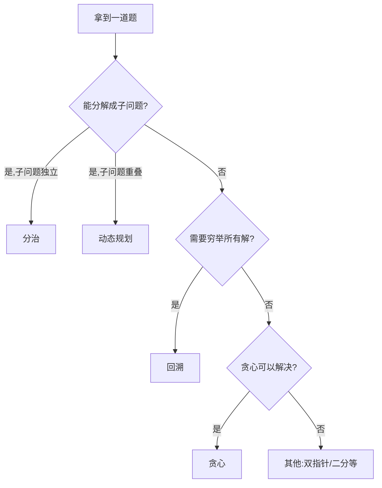

# 算法思想·五大范式

> 数据结构和算法是"招式"，算法思想是"内功"——掌握范式，方能以不变应万变。

---

## 📖 篇目

| # | 篇目 | 核心内容 | 配套刷题 |
|:--:|------|------|:--:|
| 20 | 分治思想的实战 | 分解-解决-合并，归并排序 | 17.分治 |
| 21 | 贪心思想的边界 | 局部最优推导全局最优 | 18.贪心 |
| 22 | 回溯剪枝的艺术 | 选择-递归-撤销框架 | 19.回溯 |
| 23 | 动态规划范式 | 状态定义、转移方程、空间优化 | 20.动规 |
| 24 | 位运算思想集锦 | 异或、n&(n-1)、状态压缩 | 21.位运算 |

---

## 🎯 五大范式速查

| 范式 | 核心思想 | 典型应用 |
|------|------|------|
| 分治 | 大问题拆成小问题，递归解决后合并 | 归并排序、快速排序 |
| 贪心 | 每步选当前最优，不回溯 | 区间调度、跳跃游戏 |
| 回溯 | 穷举所有可能，剪枝加速 | 全排列、N皇后 |
| 动态规划 | 记录子问题结果，避免重复计算 | 背包问题、编辑距离 |
| 位运算 | 利用二进制特性高效计算 | 只出现一次的数字 |

---

## 📐 如何选择算法范式？

> **学习建议**：先精读本栏 5 篇文章建立范式框架，再到刷题区（17-22）大量练习。
