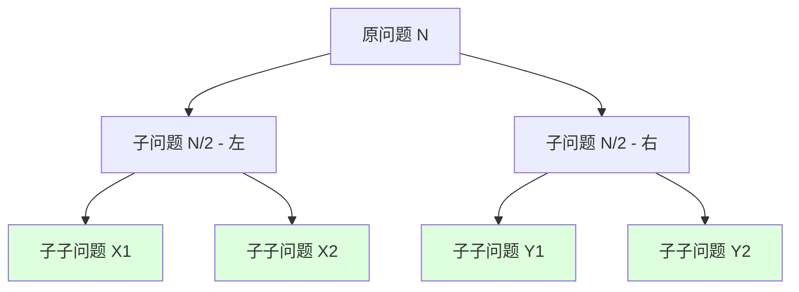
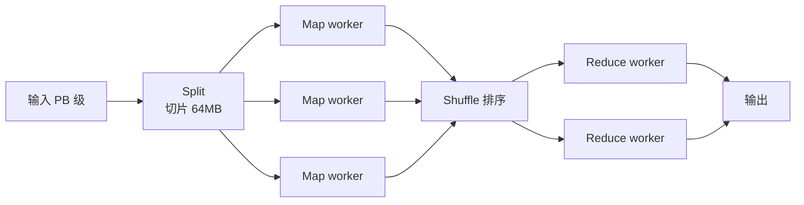
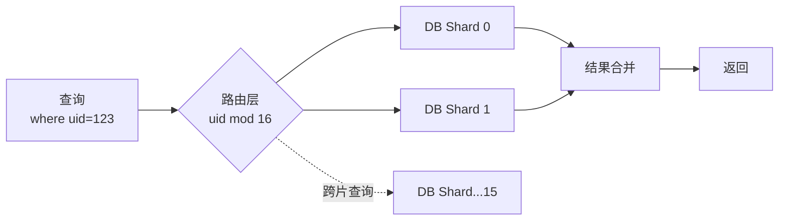

# 20.分治思想的实战

## 目录指引与导读

> 阅读建议：本篇覆盖"分治思想起源 → 三段式范式 → 经典算法精读 → 主定理速判 → 工业落地（MapReduce/Fork-Join/Spark） → 何时分治失灵"，从一次"10 亿日志归并被 OOM 打爆"的真实事故出发，把分治从教科书拉到生产线。**学完这篇，你能用同一套思路解释归并排序、MapReduce 和数据库分库分表的本质**。

- [01. 从工作案例说起](#01-从工作案例说起)
- [02. 分治本质与起源](#02-分治本质与起源)
  - [2.1 一句话定义分治](#21-一句话定义分治)
  - [2.2 三大成立条件](#22-三大成立条件)
  - [2.3 与递归 DP 区别](#23-与递归-dp-区别)
- [03. 分治三段式范式](#03-分治三段式范式)
  - [3.1 拆分 Divide](#31-拆分-divide)
  - [3.2 求解 Conquer](#32-求解-conquer)
  - [3.3 合并 Combine](#33-合并-combine)
- [04. 五大经典分治算法](#04-五大经典分治算法)
  - [4.1 归并排序复盘](#41-归并排序复盘)
  - [4.2 快速排序剖析](#42-快速排序剖析)
  - [4.3 最近点对问题](#43-最近点对问题)
  - [4.4 矩阵乘 Strassen](#44-矩阵乘-strassen)
  - [4.5 大整数乘法](#45-大整数乘法)
- [05. 主定理速判复杂度](#05-主定理速判复杂度)
- [06. 工业级分治架构](#06-工业级分治架构)
  - [6.1 MapReduce 哲学](#61-mapreduce-哲学)
  - [6.2 Fork-Join 框架](#62-fork-join-框架)
  - [6.3 Spark 的 Stage](#63-spark-的-stage)
  - [6.4 分库分表本质](#64-分库分表本质)
- [07. 分治失灵的边界](#07-分治失灵的边界)
- [08. 本篇收获与回扣](#08-本篇收获与回扣)
- [09. 思考题深度练](#09-思考题深度练)
- [10. 课后作业实战](#10-课后作业实战)
- [11. 进阶专题与延伸](#11-进阶专题与延伸)


## 01. 从工作案例说起

两年前，我们做风控日志分析平台，每天落地约 **10 亿条事件日志**，需要按用户 ID 全局归并排序后写入数仓。同事的第一版代码长这样：

```java
// 反面教材：全量加载到内存做 Collections.sort
public List<Event> mergeAll(List<Path> files) {
    List<Event> all = new ArrayList<>();
    for (Path f : files) {
        all.addAll(readAll(f));                    // 一次性加载所有文件
    }
    Collections.sort(all, Comparator.comparing(Event::getUserId));
    return all;
}
```

**线上炸点**：

- 日志文件 240 个，单文件压缩后 1.2 GB，解压后约 8 GB；
- 全量加载需要 **1.9 TB 内存**——直接 OOM；
- 退化为单机切片处理后，单次跑批 **6 小时**，赶不上次日报表。

复盘后改用 **K 路归并 + 外部排序**，整个流程其实就是教科书级的"分治三段式"：


```java
// 正解：外部归并排序，分治三段式
public void externalSort(List<Path> files, Path output) throws IOException {
    // ① Divide：把每个大文件切成可装入内存的 chunk
    // ② Conquer：每个 chunk 在内存里排序后落盘成 run
    List<Path> runs = new ArrayList<>();
    for (Path f : files) {
        try (Stream<Event> s = streamRead(f)) {
            Iterators.partition(s.iterator(), CHUNK_SIZE).forEachRemaining(chunk -> {
                chunk.sort(Comparator.comparing(Event::getUserId));
                runs.add(spillToDisk(chunk));      // 落盘成有序 run
            });
        }
    }
    // ③ Combine：K 路归并，最小堆每次取 K 个 run 头部最小元素
    PriorityQueue<RunCursor> pq = new PriorityQueue<>(
        Comparator.comparing(c -> c.peek().getUserId()));
    runs.forEach(r -> pq.offer(new RunCursor(r)));
    try (Writer w = openWriter(output)) {
        while (!pq.isEmpty()) {
            RunCursor c = pq.poll();
            w.write(c.next());
            if (c.hasNext()) pq.offer(c);
        }
    }
}
```

**收益**：

- 内存峰值 **1.9 TB → 8 GB**，可在普通服务器跑；
- 总耗时 **6 小时 → 32 分钟**；
- 之后这套流程被复用到日志检索、用户行为漏斗，节省机器 12 台。

**这次事故教会我的事**：分治不是用来"显得算法功底好"的，**它是处理"数据规模超过单机处理能力"的唯一通用解法**。这一篇就把分治从思想到工程化全讲透。


## 02. 分治本质与起源

### 2.1 一句话定义分治

**分治 = 把规模为 N 的问题，拆成 a 个规模为 N/b 的同构子问题，子问题独立求解后合并。**

数学上对应递归式：

$$T(N) = a \cdot T(N/b) + f(N)$$

其中：
- `a` 是子问题个数（归并排序里 a=2、Strassen 里 a=7）；
- `b` 是规模缩减比（通常是 2）；
- `f(N)` 是拆分 + 合并的代价。

> **历史溯源**：分治思想最早可追溯到**欧几里得算法**（公元前 300 年）——求 gcd 时把"gcd(a, b)"化成"gcd(b, a mod b)"，规模缩减。但**作为算法范式**被系统化是 1945 年**冯·诺依曼**为 EDVAC 设计**归并排序**时正式提出的；1962 年**Hoare** 发明快速排序，把分治推向巅峰。**70 年的历史，撑起了现代计算的半壁江山**。

### 2.2 三大成立条件

不是所有问题都能分治，必须同时满足：

| 条件 | 含义 | 反例 |
|------|------|------|
| **子问题同构** | 子问题与原问题是同类型、同算法 | "判断回文"无法拆成"两个小回文" |
| **子问题独立** | 子问题之间无重叠、无依赖 | LCS（重叠子问题）→ 必须 DP |
| **结果可合并** | 合并代价 < 原问题直接求解代价 | 全局最短路径合并代价 = 重新跑一遍，无意义 |

> **判别口诀**："**能拆 + 独立 + 好合**"三个都对才能分治；缺独立性 → DP；缺合并性 → 暴搜。这是判断"该用什么范式"的**第一性原理**。

### 2.3 与递归 DP 区别



注意：分治的子问题树是**严格的树**（子问题间没有连边），而 DP 的子问题图是**DAG**（子问题会被多次复用）。

| 维度 | 分治 | DP | 普通递归 |
|------|------|------|---------|
| 子问题图 | **树** | DAG | 树（但深度可能爆炸） |
| 子问题重叠 | 否 | **是** | 可能（不缓存） |
| 是否需要 memo | **不需要** | 必须 | 不缓存 |
| 典型代表 | 归并 / 快排 / FFT | 背包 / LCS | 朴素斐波那契 |

> **回扣 23 篇**：动态规划 = 分治 + 缓存；当你发现分治的子问题被反复求解，就该升级成 DP——比如朴素斐波那契是分治（指数级），加上 memo 就变 DP（线性）。**范式之间是连续的，关键看子问题图的形状**。


## 03. 分治三段式范式

写分治算法靠"**Divide → Conquer → Combine**"三段式骨架。每一段都有套路。

### 3.1 拆分 Divide

**拆分要满足"均衡"**——子问题规模尽量相等，否则复杂度退化。

| 拆分方式 | 例子 | 复杂度结果 |
|---------|------|----------|
| 对半拆 | 归并、二分 | 平衡，O(N log N) |
| 不均衡拆 | 快排最坏（pivot 选最值） | 退化 O(N²) |
| 多路拆 | 三路快排、外部 K 路归并 | 树高变低，常数更优 |
| 按维度拆 | KD 树、最近点对（按 x 拆） | 适合多维数据 |

> **工程教训**：分治的常数项主要藏在拆分代价里。一个反复出现的 bug 是"用 `subList` 拆数组"——`subList` 是视图，不复制；但快排里如果误用了拷贝拆分（如 `Arrays.copyOfRange`），会把 O(N log N) 拖到 O(N² log N)。**拆分一定要 in-place**。

### 3.2 求解 Conquer

子问题求解通常就是**递归调用自己**。两个细节：

1. **递归终止条件**：子问题规模够小时，**切到迭代或暴力解**。归并排序在 N ≤ 16 时切插入排序，能省 15% 时间——这是 JDK `DualPivotQuicksort` 的实战经验。
2. **递归深度控制**：N = 10⁹ 时，二分递归深度约 30 层；但**快排最坏是 N 层**，必须用"递归改迭代 + 显式栈"或"内省排序兜底切堆排"防爆栈。

```java
// 归并排序的"小数组优化"——JDK 里的真实写法
private static final int INSERTION_SORT_THRESHOLD = 16;
static void mergeSort(int[] a, int lo, int hi) {
    if (hi - lo <= INSERTION_SORT_THRESHOLD) {
        insertionSort(a, lo, hi);                  // 切到插入排序
        return;
    }
    int mid = (lo + hi) >>> 1;
    mergeSort(a, lo, mid);
    mergeSort(a, mid, hi);
    merge(a, lo, mid, hi);
}
```

> **为什么小数组要切到插入排序？** 因为递归本身有函数调用开销，N 很小时，**O(N²) 的插入排序常数比 O(N log N) 的归并还小**。这就是"渐进复杂度"和"实际性能"的差异——**理论的 N₀ 拐点，工程上必须实测**。

### 3.3 合并 Combine

合并是分治算法的**核心瓶颈**——它的复杂度直接决定整体复杂度。

```java
// 归并的合并步骤：双指针 O(N)
static void merge(int[] a, int lo, int mid, int hi) {
    int[] tmp = new int[hi - lo];
    int i = lo, j = mid, k = 0;
    while (i < mid && j < hi) {
        tmp[k++] = a[i] <= a[j] ? a[i++] : a[j++];   // 注意 <=，保证稳定
    }
    while (i < mid) tmp[k++] = a[i++];
    while (j < hi) tmp[k++] = a[j++];
    System.arraycopy(tmp, 0, a, lo, tmp.length);
}
```

> **为什么用 `<=` 而不是 `<`？** 这是归并排序"稳定性"的灵魂细节：左半区相等元素**优先取出**，相对顺序就被保留。把 `<=` 改成 `<` 就立即变成不稳定排序——这种"一字之差，性质全变"的细节是分治工程化的精髓。


## 04. 五大经典分治算法

### 4.1 归并排序复盘

```cpp
// C++ 版，竞赛风
void mergeSort(vector<int>& a, int l, int r) {
    if (r - l <= 1) return;
    int m = (l + r) >> 1;
    mergeSort(a, l, m);
    mergeSort(a, m, r);
    inplace_merge(a.begin() + l, a.begin() + m, a.begin() + r);
}
```

**核心特征**：

- 时间 `T(N) = 2T(N/2) + O(N) = O(N log N)`，**最坏=平均=最优**；
- 空间 O(N)（合并需要辅助数组）；
- **稳定**排序；
- 适合**链表**（合并时只改指针，无需额外空间）；
- 适合**外部排序**（K 路归并是大数据排序的核心）。

> **历史地位**：归并排序是冯·诺依曼为了证明"自动计算机能跑递归算法"而设计的——**它是分治范式的诞生地**。

### 4.2 快速排序剖析

```java
// 三数取中 + 随机化的工程版快排
static void quickSort(int[] a, int lo, int hi) {
    if (hi - lo <= 16) { insertionSort(a, lo, hi); return; }
    int pivot = medianOf3(a, lo, (lo + hi) >>> 1, hi - 1);   // 三数取中
    int p = partition(a, lo, hi, pivot);
    quickSort(a, lo, p);
    quickSort(a, p + 1, hi);
}
```

**核心特征**：

- 时间：平均 O(N log N)、**最坏 O(N²)**（输入已排序 + pivot 选最值）；
- 空间：O(log N) 递归栈；
- **不稳定**；
- 实测**比归并快 2-3 倍**——常数小、内存局部性好；
- JDK 用**双轴快排**（DualPivotQuicksort），C++ STL 用**内省排序**（递归深度超阈切堆排）防最坏情况。

| 维度 | 归并 | 快排 |
|------|------|------|
| 拆分代价 | O(1) | O(N) |
| 合并代价 | O(N) | O(1) |
| 总复杂度 | O(N log N) | O(N log N) |
| 缓存命中 | 一般 | **好**（in-place） |
| 稳定性 | **稳定** | 不稳定 |
| 适用场景 | 外排、链表、稳定要求 | 内存中通用排序 |

> **为何快排实测快于归并？** 关键在合并代价的"虚实"——归并的 O(N) 合并是**真实写入**辅助数组，而快排的合并是 O(1) 的"什么都不做"（partition 已就地完成）。**复杂度相同，常数差 3 倍**——这就是缓存友好的力量。

### 4.3 最近点对问题

**问题**：N 个二维点，求最近的两个点的距离。

**暴力**：O(N²) 枚举所有对。

**分治**：O(N log N)——按 x 坐标拆成左右半，分别求解，再处理跨界点对。

```java
// 最近点对，分治版核心思路
double closest(Point[] px, Point[] py, int lo, int hi) {
    if (hi - lo <= 3) return brute(px, lo, hi);    // 小规模暴力
    int mid = (lo + hi) >>> 1;
    double midX = px[mid].x;
    double dl = closest(px, py, lo, mid);
    double dr = closest(px, py, mid, hi);
    double d = Math.min(dl, dr);
    // 关键：跨界检查只考虑 |x - midX| < d 的点，且按 y 排序后只检查后续 7 个
    Point[] strip = streamStrip(py, midX, d);
    for (int i = 0; i < strip.length; i++) {
        for (int j = i + 1; j < Math.min(i + 8, strip.length); j++) {
            d = Math.min(d, dist(strip[i], strip[j]));
        }
    }
    return d;
}
```

> **几何精髓**：跨界检查为何"只看 7 个点"就够？因为在宽 2d 高 d 的矩形里，按几何鸽巢原理至多放 8 个点；按 y 排序后第 i 个点只需和后续 7 个比对，平均 O(N) 完成跨界。**这是分治在计算几何里的经典精彩**——LeetCode、Google 笔试常考。

### 4.4 矩阵乘 Strassen

**问题**：两个 N×N 矩阵相乘。

**朴素**：O(N³)。

**Strassen 1969**：把 2×2 矩阵乘法从 8 次乘降到 **7 次乘**（用更多加法换乘法），递归推广得：

$$T(N) = 7T(N/2) + O(N^2) = O(N^{\log_2 7}) \approx O(N^{2.807})$$

```
原始 2×2 乘法需要 8 次乘：
  C11 = A11·B11 + A12·B21
  C12 = A11·B12 + A12·B22
  C21 = A21·B11 + A22·B21
  C22 = A21·B12 + A22·B22

Strassen 用 7 个临时积 + 一堆加减：
  M1 = (A11 + A22)(B11 + B22)
  M2 = (A21 + A22) B11
  ... 共 7 项
  C11 = M1 + M4 - M5 + M7
  ...
```

> **理论意义**：Strassen 第一次证明了"矩阵乘法**不是** Θ(N³)"——这开启了一整个研究方向。后续 Coppersmith-Winograd（O(N^2.376)）、Le Gall 2014（O(N^2.3728639)），最新进展已逼近 O(N^2.371552)。**理论极限的下界至今未知**——这是计算机科学最迷人的开放问题之一。
>
> **工程现实**：Strassen 的常数巨大，**N < 100 时仍跑不过朴素**。它在工程上的实际用途是 BLAS 库的"超大矩阵"路径，以及 GPU 矩阵核心的优化思路。

### 4.5 大整数乘法

**问题**：两个 N 位大整数相乘。

**朴素**：O(N²)。

**Karatsuba 1960**：把 1 次大乘法变成 3 次半规模乘法 + 加减，得 O(N^log₂3) ≈ O(N^1.585)。

```
设 x = x1·B^m + x0, y = y1·B^m + y0
朴素 4 次乘： x·y = x1·y1·B^{2m} + (x1·y0 + x0·y1)·B^m + x0·y0
Karatsuba 3 次乘：
  z2 = x1·y1
  z0 = x0·y0
  z1 = (x1+x0)(y1+y0) - z2 - z0     ← 关键：z1 由前两个推出
  x·y = z2·B^{2m} + z1·B^m + z0
```

> **历史趣闻**：Karatsuba 当时只有 23 岁，他的导师 Kolmogorov 此前刚在课上声称"O(N²) 是大整数乘法下界"。Karatsuba 一周后给出反例——这成了**算法史上最经典的"打老师脸"事件**。Kolmogorov 立刻撤回讲座结论，把 Karatsuba 的方法在期刊上推广。**真正的科学精神就是被新证据打脸时勇于改口**。
>
> **工程接力**：Karatsuba → Toom-Cook (k 路) → Schönhage-Strassen (FFT, O(N log N log log N)) → Harvey-van der Hoeven 2019 (O(N log N))，至此达到理论下界。**Java 的 BigInteger 在 N > 80 位时切到 Karatsuba，N > 240 位时切到 Toom-Cook 3**——大整数乘法的演进史就是分治范式不断深挖的史诗。


## 05. 主定理速判复杂度

> 主定理（Master Theorem）是分治复杂度分析的"万能钥匙"。在 [01.数据结构算法指导.md](01.数据结构算法指导.md) 的 11.1 节有完整推导，本节给**速查表**。

设递归式 $T(N) = a \cdot T(N/b) + f(N)$，令 $c = \log_b a$：

| 情况 | 条件 | 结论 | 直觉 |
|------|------|------|------|
| 1 | $f(N) = O(N^{c-\varepsilon})$ | $T(N) = \Theta(N^c)$ | **叶子主导**（拆分代价小） |
| 2 | $f(N) = \Theta(N^c \log^k N)$ | $T(N) = \Theta(N^c \log^{k+1} N)$ | **均匀分布** |
| 3 | $f(N) = \Omega(N^{c+\varepsilon})$ + 正则条件 | $T(N) = \Theta(f(N))$ | **根主导**（合并代价大） |

**速查表**（背下这张表，分治题秒答）：

| 算法 | a | b | f(N) | c=log_b a | 情况 | 复杂度 |
|------|---|---|------|----------|------|-------|
| 二分查找 | 1 | 2 | O(1) | 0 | 2 | **O(log N)** |
| 归并排序 | 2 | 2 | O(N) | 1 | 2 | **O(N log N)** |
| 快速排序（平均） | 2 | 2 | O(N) | 1 | 2 | **O(N log N)** |
| 朴素矩阵乘 | 8 | 2 | O(N²) | 3 | 1 | **O(N³)** |
| Strassen | 7 | 2 | O(N²) | log₂7≈2.81 | 1 | **O(N^2.81)** |
| Karatsuba | 3 | 2 | O(N) | log₂3≈1.585 | 1 | **O(N^1.585)** |
| 最近点对 | 2 | 2 | O(N log N) | 1 | 2 (k=1) | **O(N log² N)** |
| 树遍历 | 2 | 2 | O(1) | 1 | 1 | **O(N)** |

> **使用心法**：拿到分治算法，先识别 a/b/f → 算 c → 比较 f 与 N^c → 套表得复杂度。**全程 30 秒**，比画递归树快 10 倍。


## 06. 工业级分治架构

分治不只在算法里。**整个分布式计算的基石**就是分治范式。

### 6.1 MapReduce 哲学

Google 2004 年发表的 MapReduce 论文，本质就是把分治范式做成了**通用编程模型**：



| 分治阶段 | MapReduce 阶段 |
|---------|---------------|
| Divide | **Split**（输入切片） |
| Conquer | **Map**（每片本地处理） |
| Combine | **Shuffle + Reduce**（按 key 归并） |

**经典案例：词频统计 WordCount**

```java
// Map：把每个单词发为 (word, 1)
class TokenizerMapper extends Mapper<Object, Text, Text, IntWritable> {
    public void map(Object key, Text value, Context ctx) {
        for (String w : value.toString().split("\\s+")) {
            ctx.write(new Text(w), new IntWritable(1));
        }
    }
}
// Reduce：合并同 key 的 value
class IntSumReducer extends Reducer<Text, IntWritable, Text, IntWritable> {
    public void reduce(Text key, Iterable<IntWritable> values, Context ctx)
            throws IOException, InterruptedException {
        int sum = 0;
        for (IntWritable v : values) sum += v.get();
        ctx.write(key, new IntWritable(sum));
    }
}
```

> **本质洞察**：MapReduce **= 分治三段式 + 自动并行 + 自动容错**。它对开发者屏蔽了"网络传输/失败重试/数据本地性"，让分治从单机扩到几千节点。**Google 用 MapReduce 在 2008 年完成 PB 级排序，本质就是把单机外排放到 4000 台机器上跑——同样的归并排序，同样的分治三段式**。

### 6.2 Fork-Join 框架

JDK 7 引入的 `ForkJoinPool` 把分治带到了**单机多核**：

```java
class MergeSortTask extends RecursiveAction {
    private final int[] a;
    private final int lo, hi;

    public MergeSortTask(int[] a, int lo, int hi) {
        this.a = a; this.lo = lo; this.hi = hi;
    }

    @Override
    protected void compute() {
        if (hi - lo <= 1024) {                     // 阈值切换为顺序
            Arrays.sort(a, lo, hi);
            return;
        }
        int mid = (lo + hi) >>> 1;
        MergeSortTask left = new MergeSortTask(a, lo, mid);
        MergeSortTask right = new MergeSortTask(a, mid, hi);
        invokeAll(left, right);                    // fork 并行执行
        merge(a, lo, mid, hi);
    }
}

// 使用
ForkJoinPool.commonPool().invoke(new MergeSortTask(arr, 0, arr.length));
```

**Fork-Join 的核心机制**：

1. **工作窃取（Work Stealing）**：每个 worker 有自己的双端队列，自己 push/pop 任务在前端，其它空闲 worker 从尾端"偷"任务——**避免锁竞争**。
2. **阈值切换（Sequential Threshold）**：子任务规模够小时直接顺序计算，避免任务调度开销 > 计算开销。
3. **并行流（Parallel Stream）**：JDK 8 的 `list.parallelStream()` 底层就是 ForkJoinPool。

> **工业经验**：阈值通常设为 **CPU 缓存能容纳的规模**（如 L1 32KB 装 4096 个 int）——这样子任务不会再因为 cache miss 退化。这是"算法 + 硬件"协同优化的精彩典范。

### 6.3 Spark 的 Stage

Spark 把 MapReduce 的"两阶段"扩展为"DAG + Stage"，本质仍是分治：

| Spark 概念 | 分治对应 |
|-----------|---------|
| Partition | 拆分粒度 |
| Narrow Dependency（map/filter） | 子问题独立 |
| Wide Dependency（groupBy/join） | 跨分区合并 |
| Stage | 同一组可并行的子问题 |
| Shuffle | 合并阶段的"重新分组" |

> **关键洞察**：Spark 的 **Catalyst 优化器**会重排 DAG，**把宽依赖尽量放到最后**——这是分治"延迟合并"的工程化：尽量让子问题独立运行，最后才付合并成本。**写 Spark 代码时刻意避免不必要的 `groupBy`/`join`**，本质就是减少跨分区合并次数。

### 6.4 分库分表本质

垂直/水平分库分表（Sharding）也是分治：



**分治三段式映射**：

- **Divide**：路由层按 sharding key 拆分查询；
- **Conquer**：每个分片本地执行 SQL；
- **Combine**：在网关层合并结果（聚合、排序、分页）。

> **工程深坑**：跨分片的"分页 + 排序"是分治合并的反例——理论上需要 N 个分片各取 offset+limit 条全部拉回再排序，**P99 直接爆炸**。这就是为什么 ShardingSphere 等中间件强制"分片键必须命中"——本质是回避"昂贵的合并代价"。**分治的合并阶段决定了系统的天花板**。


## 07. 分治失灵的边界

什么时候不能用分治？三个典型反例：

### 反例一：子问题重叠 → 用 DP

```java
// 朴素斐波那契（分治版），fib(40) 算 11 亿次
long fib(int n) {
    if (n <= 1) return n;
    return fib(n - 1) + fib(n - 2);                // 子问题 fib(n-2) 被算了无数次
}
```

修复：加 memo → 升级成 DP。本质是**子问题图从树退化成 DAG**。

### 反例二：合并代价过高 → 用全局算法

最长路径问题——分治后合并需要枚举所有跨界路径，合并代价 = 重新求解，毫无收益。这类问题用 **DP（DAG 上）或 Floyd（一般图）**。

### 反例三：子问题无法独立 → 用贪心 / 流

霍夫曼编码 = 每次取频率最小的两个节点合并。看似分治，但**每一步都依赖全局最小**——这是贪心范式，不是分治。

| 反例 | 本质问题 | 应换的范式 |
|------|---------|----------|
| 朴素斐波那契 | 子问题重叠 | DP |
| 最长路径 / LCS | 合并代价 = 求解代价 | DP |
| 霍夫曼 / Dijkstra | 依赖全局最优 | 贪心 + 优先队列 |
| 滑动窗口最大值 | 子区间答案不可独立 | 单调队列 |

> **判别口诀**：拿到题，先问"**能不能拆 + 拆完独立 + 合并便宜**"，三问全 yes 才上分治。**否则换范式**。


## 08. 本篇收获与回扣

回到开头那个 10 亿日志归并的事故：

| 维度 | 全量加载 sort | 外部归并（分治） |
|------|--------------|----------------|
| 内存峰值 | 1.9 TB（OOM） | **8 GB** |
| 总耗时 | 6 小时 | **32 分钟** |
| 算法范式 | 朴素 N log N | 分治 + 外排 |
| 是否可扩展 | 不可（单机内存上限） | **可（K 路归并任意扩展）** |

**这一篇我们解决了**：

1. **分治本质**：把规模 N 的问题拆成 a 个规模 N/b 的同构子问题，独立求解后合并。
2. **三大成立条件**："能拆 + 独立 + 好合"——这是判断该用什么范式的第一性原理。
3. **三段式范式**：Divide / Conquer / Combine，每段都有套路（均衡拆分、阈值切换、稳定合并）。
4. **五大经典算法**：归并 / 快排 / 最近点对 / Strassen / Karatsuba——分治范式的代表作。
5. **主定理速判**：T(N) = aT(N/b) + f(N)，30 秒得复杂度。
6. **工业级分治**：MapReduce / Fork-Join / Spark / 分库分表——**分布式计算的统一范式**。
7. **分治失灵的边界**：子问题重叠 → DP；合并代价高 → 全局算法；依赖全局 → 贪心。

**首尾呼应**：开头的事故是"单机分治内存不够"，解决方法是**把分治从内存搬到磁盘 + 多机**——这正是 MapReduce 的来源。**学好分治 = 同时掌握了算法和分布式系统的根基**。


## 09. 思考题深度练

> 先独立思考 5 分钟再看参考答案。

1. **稳定性细节**：归并合并里 `<= ` 和 `<` 一字之差，会让稳定性发生什么变化？为什么实际工程几乎不会用不稳定的归并？
2. **快排最坏**：为什么"对已排序数组用快排"会退化成 O(N²)？JDK 的 DualPivotQuicksort 用什么策略避免？
3. **主定理直觉**：当合并代价 f(N) 远大于子问题之和时（情况 3），整体复杂度等于 f(N)——能用一个具体算法举例说明这种情形吗？
4. **MapReduce 极限**：为什么 MapReduce 不擅长**迭代式机器学习**（如梯度下降）？Spark 是怎么解决这个问题的？
5. **Strassen 工程化**：N=10 时朴素矩阵乘比 Strassen 快 4 倍，N=10000 时 Strassen 比朴素快 100 倍——这个拐点是怎么算出来的？给个估算思路。

<details>
<summary>参考答案（点击展开）</summary>

1. `<=` 时左半区相等元素优先取出，**保留相对顺序 → 稳定**；改成 `<` 后右半区相等元素优先取出，相对顺序破坏 → 不稳定。工程上稳定性几乎免费（一个比较符号），所以**默认就要稳定**——MySQL 排序、Java `Arrays.sort` 对象数组、Kafka 分区内顺序都依赖稳定排序。
2. 已排序数组+pivot 选首元素时，每次拆分都是 (N-1, 0)，递归 N 层 → O(N²)。DualPivotQuicksort 用**双轴 + 五区间分割 + 智能 pivot 选择**：5 个等距采样点选 1/3、2/3 位置作为双 pivot，已排序数组也不会退化。
3. 例：朴素矩阵乘 T(N) = 8T(N/2) + O(N²)，c = 3，f(N) = O(N²) → 情况 1（叶子主导）。**情况 3 例**：T(N) = 2T(N/2) + O(N²)，f(N) = N² 远大于 N^1，整体 O(N²) ——比如**树形 DP 在每个节点做 O(子树规模²) 的合并**。
4. MapReduce 每轮迭代都要把中间结果写 HDFS，迭代 100 轮就要写 100 次磁盘——**IO 瓶颈**。Spark 用 RDD + 内存缓存（`cache()`/`persist()`），中间结果保留在内存，迭代 ML 算法快 10-100 倍。**这就是为什么 Spark 取代 MapReduce 成为主流**。
5. 拐点估算：朴素 c₁·N³，Strassen c₂·N^2.81，c₂/c₁ ≈ 7（Strassen 加法多）。临界点 c₁·N³ = c₂·N^2.81 → N^0.19 = 7 → N ≈ 7^(1/0.19) ≈ 7^5.26 ≈ 50000+。**实际工程库（GotoBLAS、OpenBLAS）的 Strassen 切换阈值通常在 N=2048~4096**——远高于教科书直觉，因为还要考虑**缓存命中和向量化指令**。

</details>


## 10. 课后作业实战

### 作业一：LeetCode 必刷清单（10 道）

| 难度 | 题号 | 题名 | 分治考点 |
|------|------|------|---------|
| 中 | 53 | 最大子序和 | 分治 vs Kadane DP 对比 |
| 中 | 215 | 数组中第 K 大 | 快速选择（分治变体） |
| 中 | 169 | 多数元素 | Boyer-Moore vs 分治 |
| 中 | 240 | 搜索二维矩阵 II | 二维分治 |
| 中 | 241 | 不同的运算优先级 | 表达式分治 |
| 中 | 932 | 漂亮数组 | 构造分治 |
| 难 | 23 | 合并 K 个升序链表 | K 路归并（卷一开篇案例的简化版） |
| 难 | 218 | 天际线 | 分治 + 多路归并 |
| 难 | 327 | 区间和的个数 | 归并排序 + 计数 |
| 难 | 493 | 翻转对 | 归并排序统计逆序对 |

### 作业二：自行实现一个外部归并排序

要求：

- 输入：一个包含 1 亿个 64 位整数的二进制文件（约 800 MB）；
- 内存限制：**64 MB 堆空间**；
- 输出：全局升序的二进制文件；
- 加分：用 ForkJoinPool 并行化 Run 生成阶段，记录加速比；
- 加分：实测 K = 8 / 16 / 32 路归并的耗时，画出 K vs 耗时曲线（验证最优 K）。

### 作业三：分治架构反思

去你公司任何一个生产系统，用分治视角自查：

- [ ] 哪些批处理任务可以从单机改写成 MapReduce/Spark？
- [ ] 哪些查询是"跨分片聚合排序"？合并代价是否成为瓶颈？
- [ ] 哪些地方误用了 `parallelStream` 但任务粒度太小，反而比串行慢？
- [ ] 是否有"已排序输入 + 朴素快排"的隐藏定时炸弹？

> **写一篇内部技术分享**：用分治视角重新解释你们系统的某个核心模块（如订单导出、报表计算）——这是检验"是否真的学会"的最直接方法。


## 11. 进阶专题与延伸

学完本篇后，建议沿以下路径继续深挖：

1. **FFT 快速傅里叶变换**：分治在多项式乘法的极致应用，O(N²) → O(N log N)，是信号处理、大整数乘法、字符串匹配的根基。
2. **CDQ 分治**：处理"三维偏序 / 动态逆序对"的高级技巧，竞赛常用。
3. **决策树与点分治**：树上路径问题的分治化，配合树的重心选择。
4. **并行分治理论**：PRAM 模型、NC 复杂度类——把分治推到理论极限。
5. **MapReduce 论文精读**：Google 2004 原论文，理解分布式分治的工程设计；后续可读 Spark RDD 论文（Zaharia 2012）。
6. **Fork-Join 源码**：JDK 的 `ForkJoinPool`、`WorkQueue`、`scan()` 的 work-stealing 实现——理解工业级并行分治。

**经典书与论文**：

- Cormen et al. 《算法导论》第 4 章：递归式与主定理
- Sedgewick & Wayne 《算法（第 4 版）》第 2.2、2.3 节：归并/快排的工程化
- Aho, Hopcroft, Ullman 《The Design and Analysis of Computer Algorithms》（1974）——分治范式的奠基之作
- Dean & Ghemawat 2004. *MapReduce: Simplified Data Processing on Large Clusters*——必读论文
- Zaharia et al. 2012. *Resilient Distributed Datasets*——Spark RDD 论文

---

> 衔接下一篇 → [21.贪心思想的边界](21.贪心思想的边界.md)：当问题不能拆成独立子问题时，能否每一步都"贪一口"就拿到全局最优？什么时候可以贪、什么时候必死？
