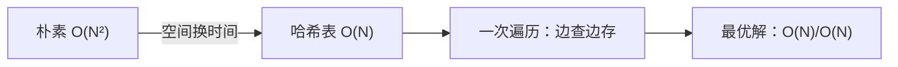
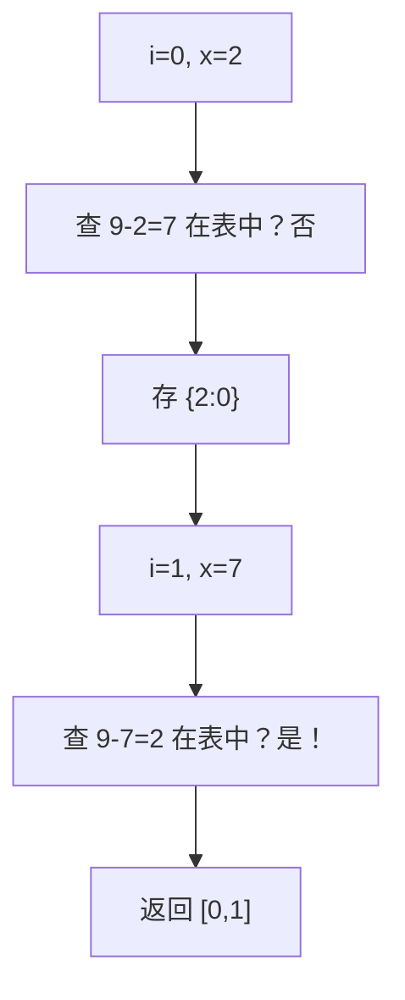

# A001 两数之和（Two Sum）

> LeetCode 1 · ⭐ · 哈希映射
>
> LeetCode 第一题，面试出场率最高的题目。看似简单，却能考察哈希表的理解深度——从 O(N²) 到 O(N) 的思维跃迁。

---

## 01. 题目描述

给定整数数组 `nums` 和整数目标值 `target`，在该数组中找出和为目标值的两个整数，返回它们的数组下标。每种输入只会对应一个答案，且同一元素不能使用两次。

**示例**：

```
输入：nums = [2,7,11,15], target = 9
输出：[0,1]
解释：nums[0] + nums[1] = 2 + 7 = 9
```

---

## 02. 题目分析：把直觉变成算法

### 2.1 核心公式

对每个元素 `x`，需要找另一个元素 `y`：

$$y = target - x$$

问题转化为：**快速判断 `target - x` 是否已经在之前遍历过的元素中出现过**。

### 2.2 朴素做法

双层循环，对每个元素扫描后面的所有元素。

- 时间：O(N²)——每个元素都要扫描剩余部分
- 空间：O(1)

N ≤ 10⁴ 时 O(N²) ≈ 10⁸ 次操作，可能超时（OJ 要求通常 < 10⁸）。

### 2.3 优化方向：空间换时间

观察：每次都需要"回头找"之前遍历过的一个值。这恰好是哈希表的天然应用场景——O(1) 查找。

### 2.4 解法演进



---

## 03. 解法一：暴力枚举（O(N²)）

```java
public int[] twoSum(int[] nums, int target) {
    for (int i = 0; i < nums.length; i++)
        for (int j = i + 1; j < nums.length; j++)
            if (nums[i] + nums[j] == target)
                return new int[]{i, j};
    return new int[0];
}
```

**复杂度**：时间 O(N²)，空间 O(1)。数据量稍大就无法通过。

---

## 04. 解法二：哈希表（O(N)，最优）

### 4.1 思路

遍历数组时，将每个元素的**值和下标**存入哈希表。对当前元素 `x`，O(1) 查找 `target - x` 是否已在表中。



### 4.2 代码

**Java**：
```java
public int[] twoSum(int[] nums, int target) {
    Map<Integer, Integer> map = new HashMap<>();
    for (int i = 0; i < nums.length; i++) {
        int y = target - nums[i];
        if (map.containsKey(y))
            return new int[]{map.get(y), i};
        map.put(nums[i], i);
    }
    return new int[0];
}
```

**Python**：
```python
def twoSum(self, nums: List[int], target: int) -> List[int]:
    seen = {}
    for i, x in enumerate(nums):
        y = target - x
        if y in seen:
            return [seen[y], i]
        seen[x] = i
```

**C++**：
```cpp
vector<int> twoSum(vector<int>& nums, int target) {
    unordered_map<int, int> mp;
    for (int i = 0; i < nums.size(); i++) {
        int y = target - nums[i];
        if (mp.count(y)) return {mp[y], i};
        mp[nums[i]] = i;
    }
    return {};
}
```

### 4.3 复杂度

| 维度 | 值 |
|------|-----|
| 时间 | O(N)，一次遍历 + O(1) 哈希查找 |
| 空间 | O(N)，哈希表存最多 N 个元素 |

---

## 05. 三解法对比与选型

| 维度 | 暴力枚举 | 两遍哈希 | 一遍哈希（最优） |
|------|:---:|:---:|:---:|
| 时间复杂度 | O(N²) | O(N) | O(N) |
| 空间复杂度 | O(1) | O(N) | O(N) |
| 代码行数 | ~8 行 | ~12 行 | ~10 行 |
| 适用场景 | N < 1000 | 通用 | **面试标准答案** |

### 选型建议

```
面试场景：
  先提暴力 O(N²)（展示基本思路）
  然后优化到哈希 O(N)（展示优化能力）
  加分项 → 讨论哈希冲突对复杂度的影响（展示底层理解）
```

---

## 06. 深入思考：为什么哈希表是 O(1)？

### 哈希冲突的影响

Java HashMap 在冲突较多时退化为红黑树（链表长度 ≥ 8），查找退化到 O(logN)。

极端情况：如果故意构造所有 key 映射到同一个桶，查找退化为 O(logN)，总复杂度 O(NlogN)。

但在随机数据下，均匀分布的哈希函数保证 O(1) 摊还时间。

### 与两数之和系列的联系

```
两数之和 O(N) ─── 哈希表
      ↓ 升级
三数之和 O(N²) ─── 排序+双指针
      ↓ 推广
四数之和 O(N³) ─── 排序+双指针+剪枝
      ↓ 泛化
N数之和         ─── 排序+(N-2)循环+双指针
```

---

## 07. 总结

| 核心启示 | 说明 |
|---------|------|
| 空间换时间 | 哈希表 O(1) 查找替代 O(N) 扫描 |
| 边遍历边查询 | 不需要预处理，一次遍历同时完成"查"和"存" |
| 哈希方法论 | 凡是"查找是否存在"的问题，优先想哈希表 |

**相关题目**：[A002 三数之和](002-A-三数之和.md)、[H002 搜索插入位置](H002-搜索插入位置.md)、[I005 两数之和 II](I005-两数之和II.md)
