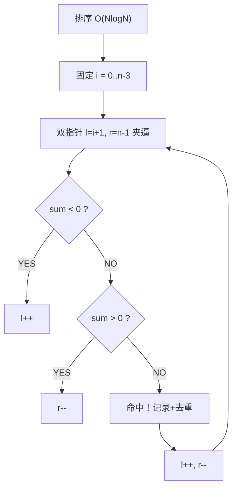

# A002 三数之和（3Sum）

> LeetCode 15 · ⭐⭐ · 排序+双指针
>
> 从两数之和的哈希思路升级到排序+双指针夹逼——这是处理"多数之和"问题的方法论转折点。去重是这道题的难点。

---

## 01. 题目描述

判断是否存在三元组 `[nums[i], nums[j], nums[k]]` 满足 `i != j, i != k, j != k` 且和为 0。返回所有不重复的三元组。

**示例**：

```
输入：nums = [-1,0,1,2,-1,-4]
输出：[[-1,-1,2],[-1,0,1]]
解释：不同的三元组是 [-1,-1,2] 和 [-1,0,1]
```

---

## 02. 题目分析

### 2.1 延续两数之和的思路？

两数之和用哈希 O(N)，三数之和如果也哈希：

```
固定 a → 对 b+c = -a 用两数之和的哈希法
```

这样 O(N²) 时间 + O(N) 空间，但**去重极其麻烦**——哈希表中的组合可能有重复。

### 2.2 排序+双指针：为何更优？

排序后数组有序，双指针可以从两端夹逼。核心优势：

| 维度 | 哈希法 | 排序+双指针 |
|------|:---:|:---:|
| 时间复杂度 | O(N²) | O(N²) |
| 空间复杂度 | O(N) | **O(logN)**（排序栈） |
| 去重难度 | 复杂 | **天然有序，跳重即可** |
| 扩展性 | 难以泛化 | 轻松泛化到 N 数之和 |

### 2.3 为什么用排序+双指针而非哈希？

关键原因：**有序数组去重只需要跳过相邻相同值——《O(1) 操作》。哈希法需要在结果集里判重，复杂度显著上升**。



---

## 03. 解法一：排序+双指针

### 3.1 流程演示

```
排序后：[-4, -1, -1, 0, 1, 2]

i=0(-4): l=1(-1), r=5(2)  sum=-3<0 → l++
i=0(-4): l=2(-1), r=5(2)  sum=-3<0 → l++
i=0(-4): l=3(0),  r=5(2)  sum=-2<0 → l++
i=0(-4): l=4(1),  r=5(2)  sum=-1<0 → l++ → l==r 结束

i=1(-1): 与i=0相等 → 跳过（去重）

i=2(-1): l=3(0), r=5(2)   sum=1>0 → r--
i=2(-1): l=3(0), r=4(1)   sum=0 → 命中 [-1,0,1]
         l跳过重复,r跳过重复 → l=5,r=3 → 结束

结果：[[-1,-1,2], [-1,0,1]]
```

### 3.2 去重三处（核心难点）

| 位置 | 条件 | 含义 |
|------|------|------|
| 固定值 i | `i>0 && nums[i]==nums[i-1]` | 同一固定值只处理一次 |
| 左指针 l | 命中后跳过 `==` 相邻 | 同值只记录一次 |
| 右指针 r | 同上 | 同上 |

### 3.3 剪枝优化

`nums[i] > 0` 时直接 break——已排序，后面的数都 >0，不可能三数和为 0。

### 3.4 代码

**Java**：
```java
public List<List<Integer>> threeSum(int[] nums) {
    Arrays.sort(nums);
    List<List<Integer>> res = new ArrayList<>();
    int n = nums.length;
    for (int i = 0; i < n - 2; i++) {
        if (nums[i] > 0) break;                        // 剪枝
        if (i > 0 && nums[i] == nums[i - 1]) continue;  // i去重
        int l = i + 1, r = n - 1;
        while (l < r) {
            int sum = nums[i] + nums[l] + nums[r];
            if (sum == 0) {
                res.add(Arrays.asList(nums[i], nums[l], nums[r]));
                while (l < r && nums[l] == nums[l + 1]) l++; // l去重
                while (l < r && nums[r] == nums[r - 1]) r--; // r去重
                l++; r--;
            } else if (sum < 0) l++;
            else r--;
        }
    }
    return res;
}
```

**Python**：
```python
def threeSum(self, nums: List[int]) -> List[List[int]]:
    nums.sort()
    res, n = [], len(nums)
    for i in range(n - 2):
        if nums[i] > 0: break
        if i > 0 and nums[i] == nums[i - 1]: continue
        l, r = i + 1, n - 1
        while l < r:
            s = nums[i] + nums[l] + nums[r]
            if s == 0:
                res.append([nums[i], nums[l], nums[r]])
                while l < r and nums[l] == nums[l + 1]: l += 1
                while l < r and nums[r] == nums[r - 1]: r -= 1
                l += 1; r -= 1
            elif s < 0: l += 1
            else: r -= 1
    return res
```

**C++**：
```cpp
vector<vector<int>> threeSum(vector<int>& nums) {
    sort(nums.begin(), nums.end());
    vector<vector<int>> res;
    int n = nums.size();
    for (int i = 0; i < n - 2; i++) {
        if (nums[i] > 0) break;
        if (i > 0 && nums[i] == nums[i - 1]) continue;
        int l = i + 1, r = n - 1;
        while (l < r) {
            int s = nums[i] + nums[l] + nums[r];
            if (s == 0) {
                res.push_back({nums[i], nums[l], nums[r]});
                while (l < r && nums[l] == nums[l + 1]) l++;
                while (l < r && nums[r] == nums[r - 1]) r--;
                l++; r--;
            } else if (s < 0) l++;
            else r--;
        }
    }
    return res;
}
```

**复杂度**：时间 O(N²)，空间 O(logN)（排序栈）。

---

## 04. 解法对比

| 解法 | 时间 | 空间 | 去重难度 | 推荐度 |
|------|:---:|:---:|:---:|:---:|
| 暴力三重循环 | O(N³) | O(1) | 简单 | ❌ |
| 哈希 | O(N²) | O(N) | 困难 | ❌ |
| **排序+双指针** | **O(N²)** | **O(logN)** | **简单** | ✅ |

---

## 05. 总结

| 核心启示 | 说明 |
|---------|------|
| 排序+双指针 | 将 O(N³) 降到 O(N²)，天然去重 |
| 三处去重 | i/l/r 各一处，缺一不可 |
| 剪枝 | `nums[i] > 0` 直接 break |
| 方法论转折 | 哈希 → 双指针，开辟了"N 数之和"系列 |

**相关题目**：[A003 最接近的三数之和](003-A-最接近的三数之和.md)、[A004 四数之和](004-A-四数之和.md)、[A001 两数之和](001-A-两数之和.md)
