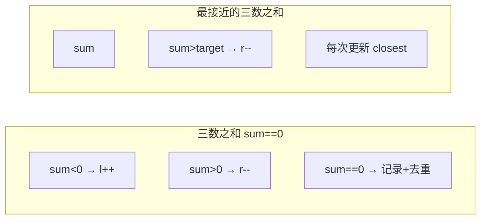

# A003 最接近的三数之和（3Sum Closest）

> LeetCode 16 · ⭐⭐ · 排序+双指针
>
> 三数之和的孪生题。"等于 0"变成"最接近 target"，框架完全一致。此题展示：算法框架不变，只改判断条件即可应对变形题。

---

## 01. 题目描述

给定整数数组 `nums` 和目标值 `target`，找出三个整数使得它们的和与 `target` 最接近。返回和。假定每组输入恰好一个解。

**示例**：

```
输入：nums = [-1,2,1,-4], target = 1
输出：2
解释：-1 + 2 + 1 = 2，与 target=1 差值为 1，最接近
```

---

## 02. 题目分析：从"等号"到"绝对值"

### 2.1 A003 vs A002 对比



| | A002 三数之和 | A003 最接近 |
|------|:---:|:---:|
| 判定条件 | `sum == 0` | `abs(sum-target)` 最小 |
| 记录时机 | 仅 `==0` 时 | **每次都更新** |
| 提前返回 | 可（命中 0） | 仅 `==target` 可返回 |
| 去重 | 三处去重 | i 去重即可 |

### 2.2 为什么去重需求降低？

A003 只求一个值（最接近的和），不是求所有组合。即使有重复 i 值，结果也不会少——只影响效率。所以只需对 i 去重。

### 2.3 双指针方向

$$sum < target \rightarrow l\text{++} \quad\text{(需要更大的和)}$$
$$sum > target \rightarrow r\text{--} \quad\text{(需要更小的和)}$$

---

## 03. 代码

**Java**：
```java
public int threeSumClosest(int[] nums, int target) {
    Arrays.sort(nums);
    int closest = nums[0] + nums[1] + nums[2];
    int n = nums.length;
    for (int i = 0; i < n - 2; i++) {
        if (i > 0 && nums[i] == nums[i - 1]) continue;   // i去重
        int l = i + 1, r = n - 1;
        while (l < r) {
            int sum = nums[i] + nums[l] + nums[r];
            // 更新最近值
            if (Math.abs(sum - target) < Math.abs(closest - target))
                closest = sum;
            if (sum < target) l++;
            else if (sum > target) r--;
            else return sum;                              // 精确命中
        }
    }
    return closest;
}
```

**Python**：
```python
def threeSumClosest(self, nums: List[int], target: int) -> int:
    nums.sort()
    closest = nums[0] + nums[1] + nums[2]
    n = len(nums)
    for i in range(n - 2):
        if i > 0 and nums[i] == nums[i - 1]: continue
        l, r = i + 1, n - 1
        while l < r:
            s = nums[i] + nums[l] + nums[r]
            if abs(s - target) < abs(closest - target):
                closest = s
            if s < target: l += 1
            elif s > target: r -= 1
            else: return s
    return closest
```

**C++**：
```cpp
int threeSumClosest(vector<int>& nums, int target) {
    sort(nums.begin(), nums.end());
    int closest = nums[0] + nums[1] + nums[2];
    int n = nums.size();
    for (int i = 0; i < n - 2; i++) {
        if (i > 0 && nums[i] == nums[i - 1]) continue;
        int l = i + 1, r = n - 1;
        while (l < r) {
            int s = nums[i] + nums[l] + nums[r];
            if (abs(s - target) < abs(closest - target))
                closest = s;
            if (s < target) l++;
            else if (s > target) r--;
            else return s;
        }
    }
    return closest;
}
```

**复杂度**：时间 O(N²)，空间 O(logN)。

---

## 04. 总结

**核心启示**：把"判断条件"抽象化——A002 判断 `== 0`，A003 判断"距离最小"。双指针的方向控制逻辑完全不变：

```
sum < target → l++
sum > target → r--
精确命中 → 立即返回（最优解）
```

**相关题目**：[A002 三数之和](002-A-三数之和.md)、[A004 四数之和](004-A-四数之和.md)
