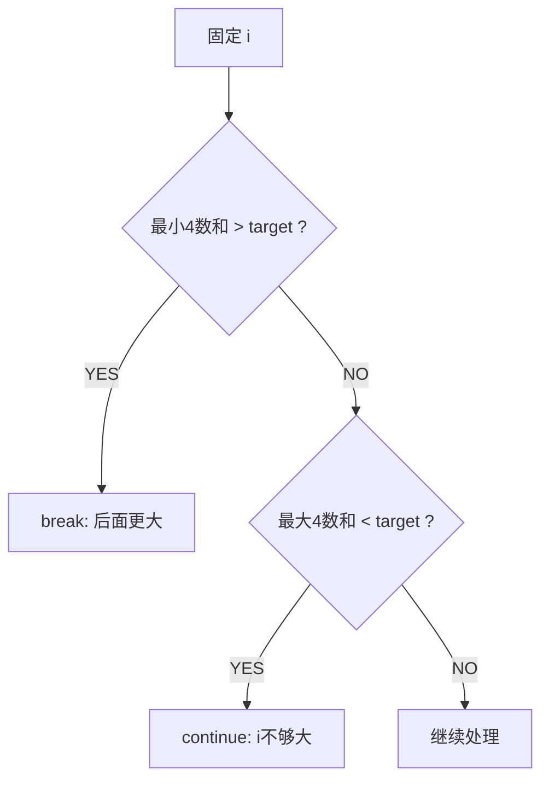

# A004 四数之和（4Sum）

> LeetCode 18 · ⭐⭐ · 排序+双指针+剪枝
>
> 三数之和加一层循环。此题真正的价值不在"多一层"，而在**剪枝技术**——它是 N 数之和从 O(N³) 到可用的关键。

---

## 01. 题目描述

找出所有和为 target 的不重复四元组。

**示例**：

```
输入：nums = [1,0,-1,0,-2,2], target = 0
输出：[[-2,-1,1,2],[-2,0,0,2],[-1,0,0,1]]
```

---

## 02. 题目分析

### 2.1 框架：N 数之和模式

```
排序 → for i → for j → while(l<r) 双指针夹逼
```

| N | 循环层数 | 复杂度 |
|:---:|:---:|:---:|
| 2（A001） | 0层循环 + 哈希/双指针 | O(N) / O(NlogN) |
| 3（A002） | 1层循环 + 双指针 | O(N²) |
| 4（A004） | 2层循环 + 双指针 | O(N³) |
| N | (N-2)层循环 + 双指针 | O(N^(N-2)) |

### 2.2 剪枝（性能倍增的关键）



| 剪枝 | 条件 | 为什么 |
|------|------|--------|
| 最小>target | `nums[i]+nums[i+1]+nums[i+2]+nums[i+3] > target` | 最小的四个和都超了 |
| 最大<target | `nums[i]+nums[n-3]+nums[n-2]+nums[n-1] < target` | i 参加的最大组合都不够 |

### 2.3 溢出陷阱

四数相加可能爆 int（每数最大 10⁹，四数最大 4×10⁹ > 2¹¹¹）。用 `long` 计算。

---

## 03. 代码

**Java**：
```java
public List<List<Integer>> fourSum(int[] nums, int target) {
    Arrays.sort(nums);
    List<List<Integer>> res = new ArrayList<>();
    int n = nums.length;
    if (n < 4) return res;

    for (int i = 0; i < n - 3; i++) {
        // 剪枝1
        if ((long)nums[i]+nums[i+1]+nums[i+2]+nums[i+3] > target) break;
        // 剪枝2
        if ((long)nums[i]+nums[n-3]+nums[n-2]+nums[n-1] < target) continue;
        if (i > 0 && nums[i] == nums[i - 1]) continue;

        for (int j = i + 1; j < n - 2; j++) {
            if ((long)nums[i]+nums[j]+nums[j+1]+nums[j+2] > target) break;
            if ((long)nums[i]+nums[j]+nums[n-2]+nums[n-1] < target) continue;
            if (j > i + 1 && nums[j] == nums[j - 1]) continue;

            int l = j + 1, r = n - 1;
            while (l < r) {
                long sum = (long)nums[i]+nums[j]+nums[l]+nums[r];
                if (sum == target) {
                    res.add(Arrays.asList(nums[i],nums[j],nums[l],nums[r]));
                    while (l < r && nums[l] == nums[l+1]) l++;
                    while (l < r && nums[r] == nums[r-1]) r--;
                    l++; r--;
                } else if (sum < target) l++;
                else r--;
            }
        }
    }
    return res;
}
```

**Python**：
```python
def fourSum(self, nums: List[int], target: int) -> List[List[int]]:
    nums.sort()
    res, n = [], len(nums)
    if n < 4: return res
    for i in range(n - 3):
        if nums[i] + nums[i+1] + nums[i+2] + nums[i+3] > target: break
        if nums[i] + nums[n-3] + nums[n-2] + nums[n-1] < target: continue
        if i > 0 and nums[i] == nums[i-1]: continue
        for j in range(i+1, n-2):
            if nums[i]+nums[j]+nums[j+1]+nums[j+2] > target: break
            if nums[i]+nums[j]+nums[n-2]+nums[n-1] < target: continue
            if j > i+1 and nums[j] == nums[j-1]: continue
            l, r = j+1, n-1
            while l < r:
                s = nums[i]+nums[j]+nums[l]+nums[r]
                if s == target:
                    res.append([nums[i],nums[j],nums[l],nums[r]])
                    while l < r and nums[l] == nums[l+1]: l += 1
                    while l < r and nums[r] == nums[r-1]: r -= 1
                    l += 1; r -= 1
                elif s < target: l += 1
                else: r -= 1
    return res
```

**C++**：
```cpp
vector<vector<int>> fourSum(vector<int>& nums, int target) {
    sort(nums.begin(), nums.end());
    vector<vector<int>> res;
    int n = nums.size();
    if (n < 4) return res;
    for (int i = 0; i < n - 3; i++) {
        if ((long)nums[i]+nums[i+1]+nums[i+2]+nums[i+3] > target) break;
        if ((long)nums[i]+nums[n-3]+nums[n-2]+nums[n-1] < target) continue;
        if (i > 0 && nums[i] == nums[i-1]) continue;
        for (int j = i+1; j < n-2; j++) {
            if ((long)nums[i]+nums[j]+nums[j+1]+nums[j+2] > target) break;
            if ((long)nums[i]+nums[j]+nums[n-2]+nums[n-1] < target) continue;
            if (j > i+1 && nums[j] == nums[j-1]) continue;
            int l = j+1, r = n-1;
            while (l < r) {
                long s = (long)nums[i]+nums[j]+nums[l]+nums[r];
                if (s == target) {
                    res.push_back({nums[i],nums[j],nums[l],nums[r]});
                    while (l<r && nums[l]==nums[l+1]) l++;
                    while (l<r && nums[r]==nums[r-1]) r--;
                    l++; r--;
                } else if (s < target) l++;
                else r--;
            }
        }
    }
    return res;
}
```

**复杂度**：时间 O(N³)，空间 O(logN)。

---

## 04. 总结

| 核心启示 | 说明 |
|---------|------|
| 框架泛化 | N 数之和 = 排序 + (N-2) 循环 + 双指针 |
| 剪枝必杀技 | 最小/最大和预判，提前 break/continue |
| 溢出防范 | 多元素求和用 `long` |
| 五数之和+ | 继续加循环即可，但 O(N⁴) 起——剪枝更重要 |

**相关题目**：[A002 三数之和](002-A-三数之和.md)、[A003 最接近的三数之和](003-A-最接近的三数之和.md)
