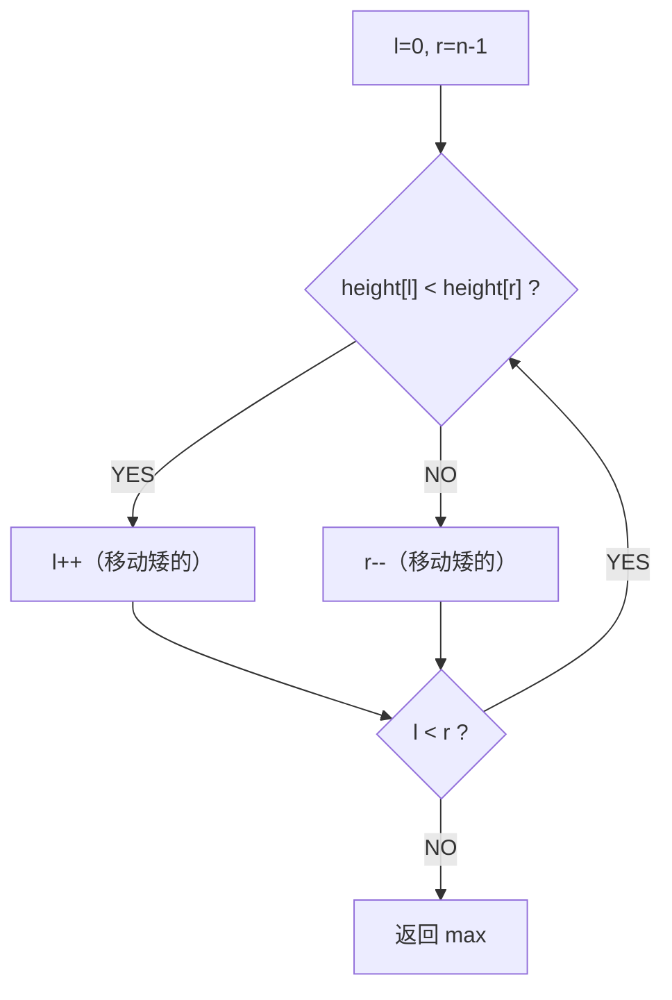
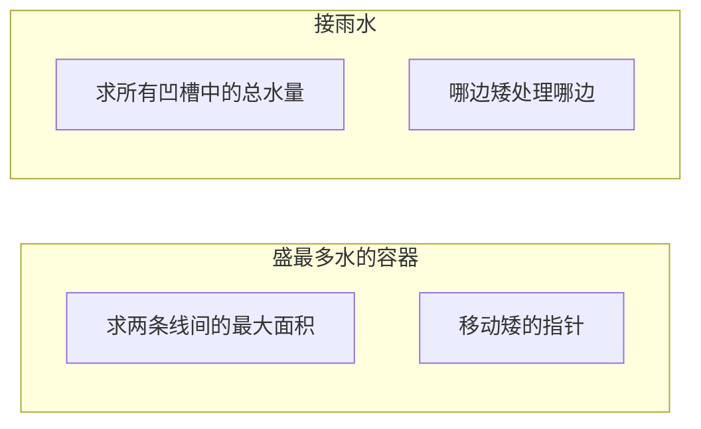

# A005 盛最多水的容器（Container With Most Water）

> LeetCode 11 · ⭐⭐ · 双指针 / 贪心
>
> "为什么移动较短的指针不会错过最优解？"——这道题的精髓不在代码，在数学证明。

---

## 01. 题目描述

给定长度为 n 的数组 `height`，n 条垂直线。找出两条线与 x 轴共同构成的容器可以容纳最多的水。

**示例**：

```
输入：[1,8,6,2,5,4,8,3,7]
输出：49
解释：height[1]=8 和 height[8]=7，宽度=7，面积=49
```

---

## 02. 题目分析

### 2.1 面积公式

$$area = \min(height[l],\; height[r]) \times (r - l)$$

面积由**短板高度**和**宽度**共同决定。

### 2.2 朴素做法：O(N²)

枚举所有组合 (l, r)，计算面积取最大。N ≤ 10⁵ 时 O(N²) ≈ 10¹⁰，必超时。

### 2.3 双指针为何可行？

初始 l=0, r=n-1（宽度最大）。每次移动较短的指针：



### 2.4 数学证明

假设 `height[l] < height[r]`：

- **固定 l，移动 r**：宽度减小，高度 ≤ height[l]（短板效应）→ 面积 ≤ 当前 → 一定不更优 ❌
- **固定 r，移动 l**：宽度减小，但新高度可能 > height[l] → 面积可能增大 ✅

**结论**：移动较短的指针永远不会错过最优解。

---

## 03. 动态演示

```
height = [1, 8, 6, 2, 5, 4, 8, 3, 7]

l=0(1), r=8(7):  h=1, w=8, area=8,   1<7 → l++
l=1(8), r=8(7):  h=7, w=7, area=49,  8>7 → r--  ← max
l=1(8), r=7(3):  h=3, w=6, area=18,  8>3 → r--
l=1(8), r=6(8):  h=8, w=5, area=40,  8==8 → r--
l=1(8), r=5(4):  h=4, w=4, area=16,  8>4 → r--
l=1(8), r=4(5):  h=5, w=3, area=15,  8>5 → r--
l=1(8), r=3(2):  h=2, w=2, area=4,   8>2 → r--
l=1(8), r=2(6):  h=6, w=1, area=6,   8>6 → r--  → l==r 结束

最大：49
```

---

## 04. 代码

**Java**：
```java
public int maxArea(int[] height) {
    int l = 0, r = height.length - 1, max = 0;
    while (l < r) {
        int h = Math.min(height[l], height[r]);
        max = Math.max(max, h * (r - l));
        if (height[l] < height[r]) l++;
        else r--;
    }
    return max;
}
```

**Python**：
```python
def maxArea(self, height: List[int]) -> int:
    l, r, ans = 0, len(height) - 1, 0
    while l < r:
        h = min(height[l], height[r])
        ans = max(ans, h * (r - l))
        if height[l] < height[r]: l += 1
        else: r -= 1
    return ans
```

**C++**：
```cpp
int maxArea(vector<int>& height) {
    int l = 0, r = height.size() - 1, ans = 0;
    while (l < r) {
        int h = min(height[l], height[r]);
        ans = max(ans, h * (r - l));
        height[l] < height[r] ? l++ : r--;
    }
    return ans;
}
```

**复杂度**：时间 O(N)，空间 O(1)。

---

## 05. 盛水容器 vs 接雨水



| | A005 盛水容器 | A006 接雨水 |
|------|:---:|:---:|
| 求什么 | 最大面积（选两条线） | 总水量（所有凹槽） |
| 双指针 | 移动矮的 | 哪边矮处理哪边 |
| 因水条件 | 只需两条线 | 需要凹槽形状 |
| 难度 | ⭐⭐ | ⭐⭐⭐ |

---

## 06. 总结

| 核心启示 | 说明 |
|---------|------|
| 移动矮指针 | 数学可证明不遗漏最优解 |
| 贪心本质 | 当前宽度已最大，通过"舍弃矮边"寻找可能更大的高度 |
| 双指针模式 | 两边向中间收缩，O(N) 解决问题 |

**相关题目**：[A006 接雨水](006-A-接雨水.md)
