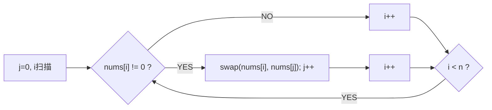

# A007 移动零（Move Zeroes）

> LeetCode 283 · ⭐ · 双指针
>
> 双指针的经典入门题。原地操作 + 保持相对顺序——三种写法，效率差异显著。

---

## 01. 题目描述

将所有 0 移到数组末尾，同时保持非零元素的相对顺序。必须原地操作。

**示例**：

```
输入：[0,1,0,3,12]
输出：[1,3,12,0,0]
```

---

## 02. 题目分析：三种写法的演变

### 2.1 双指针模型

| 指针 | 含义 | 移动条件 |
|------|------|---------|
| `i`（快） | 遍历数组每个元素 | 每次循环 +1 |
| `j`（慢） | 下一个非零元素应放的位置 | 写入非零后 +1 |



### 2.2 三种思路对比

```
思路一：遇到 0 删除，末尾补 0
  → 数组删除 O(N) → 总 O(N²) ❌ 删除操作太重

思路二：非零填入前面，后面统一填 0
  → 两次遍历 → O(N) ✅ 但写两次

思路三：交换法
  → 一次遍历 → O(N) ✅ 最佳
```

---

## 03. 解法对比

### 解法二：覆盖法（两次遍历）

```java
public void moveZeroes(int[] nums) {
    int j = 0;
    // 第一遍：非零前移
    for (int i = 0; i < nums.length; i++)
        if (nums[i] != 0) nums[j++] = nums[i];
    // 第二遍：尾部填 0
    while (j < nums.length) nums[j++] = 0;
}
```

### 解法三：交换法（一次遍历，最优）

```java
public void moveZeroes(int[] nums) {
    for (int i = 0, j = 0; i < nums.length; i++)
        if (nums[i] != 0) {
            int tmp = nums[i];
            nums[i] = nums[j];
            nums[j++] = tmp;
        }
}
```

---

## 04. 代码

**Java**：
```java
public void moveZeroes(int[] nums) {
    for (int i = 0, j = 0; i < nums.length; i++)
        if (nums[i] != 0) {
            int tmp = nums[i]; nums[i] = nums[j]; nums[j++] = tmp;
        }
}
```

**Python**：
```python
def moveZeroes(self, nums: List[int]) -> None:
    j = 0
    for i in range(len(nums)):
        if nums[i] != 0:
            nums[i], nums[j] = nums[j], nums[i]
            j += 1
```

**C++**：
```cpp
void moveZeroes(vector<int>& nums) {
    for (int i = 0, j = 0; i < nums.size(); i++)
        if (nums[i] != 0) swap(nums[i], nums[j++]);
}
```

**复杂度**：O(N)/O(1)。

---

## 05. 与其他双指针题的对比

| 题目 | 双指针模式 | 关键条件 |
|------|---------|---------|
| A007 移动零 | 快慢指针 | `nums[i] != 0` 时处理 |
| A008 删除重复项 | 快慢指针 | `nums[i] != nums[slow]` |
| A009 删除重复项II | 快慢指针 | `nums[i] != nums[slow-2]` |
| A011 荷兰国旗 | 三指针 | `==0/1/2` 分别处理 |

**本质**：快指针扫描，慢指针维护"已处理区"的边界。

---

## 06. 总结

**相关题目**：[A008 删除重复项](008-A-删除有序数组中的重复项.md)、[A011 荷兰国旗](011-A-颜色分类.md)
