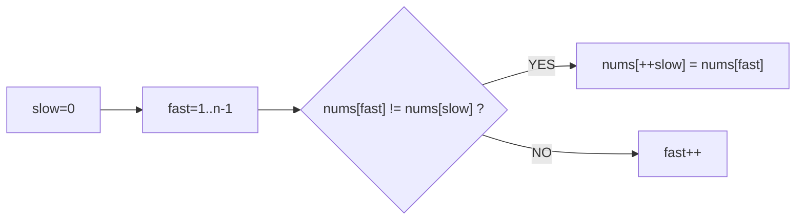

# A008 删除有序数组中的重复项（Remove Duplicates）

> LeetCode 26 · ⭐ · 双指针
>
> 移动零的姊妹题——快慢指针，"遇到不同的就写入"。泛化到"保留 k 个"只需要一行改动。

---

## 01. 题目描述

原地删除有序数组中的重复项，使每个元素只出现一次，返回新长度。

**示例**：

```
输入：nums = [0,0,1,1,1,2,2,3,3,4]
输出：5, nums = [0,1,2,3,4,_,_,_,_,_]
```

---

## 02. 题目分析

### 2.1 双指针模型

| 指针 | 含义 |
|------|------|
| `slow` | 已去重区的末尾下标 |
| `fast` | 扫描指针 |



`slow` 始终指向**已去重序列的最后一个元素**。遇到不同元素就写入 `++slow` 位置。

### 2.2 泛化：保留 k 个重复

```java
public int removeDuplicates(int[] nums, int k) {
    int slow = 0;
    for (int n : nums)
        if (slow < k || n != nums[slow - k])
            nums[slow++] = n;
    return slow;
}
```

A008：k=1；A009：k=2。

---

## 03. 代码

**Java**：
```java
public int removeDuplicates(int[] nums) {
    int slow = 0;
    for (int fast = 1; fast < nums.length; fast++)
        if (nums[fast] != nums[slow])
            nums[++slow] = nums[fast];
    return slow + 1;
}
```

**Python**：
```python
def removeDuplicates(self, nums: List[int]) -> int:
    slow = 0
    for fast in range(1, len(nums)):
        if nums[fast] != nums[slow]:
            slow += 1
            nums[slow] = nums[fast]
    return slow + 1
```

**C++**：
```cpp
int removeDuplicates(vector<int>& nums) {
    int slow = 0;
    for (int fast = 1; fast < nums.size(); fast++)
        if (nums[fast] != nums[slow])
            nums[++slow] = nums[fast];
    return slow + 1;
}
```

**复杂度**：O(N)/O(1)。

---

## 04. 双指针题型总结

| 题目 | slow 含义 | 判断条件 |
|------|---------|---------|
| A007 移动零 | 下个非零位置 | `nums[i] != 0` |
| A008 保留1个 | 已去重末尾 | `nums[i] != nums[slow]` |
| A009 保留2个 | 已去重末尾 | `i < 2 \|\| nums[i] != nums[slow-2]` |

**本质**：全是同一个快慢指针模板，只改判断条件。

**相关题目**：[A007 移动零](007-A-移动零.md)、[A009 保留2个](009-A-删除有序数组中的重复项II.md)
