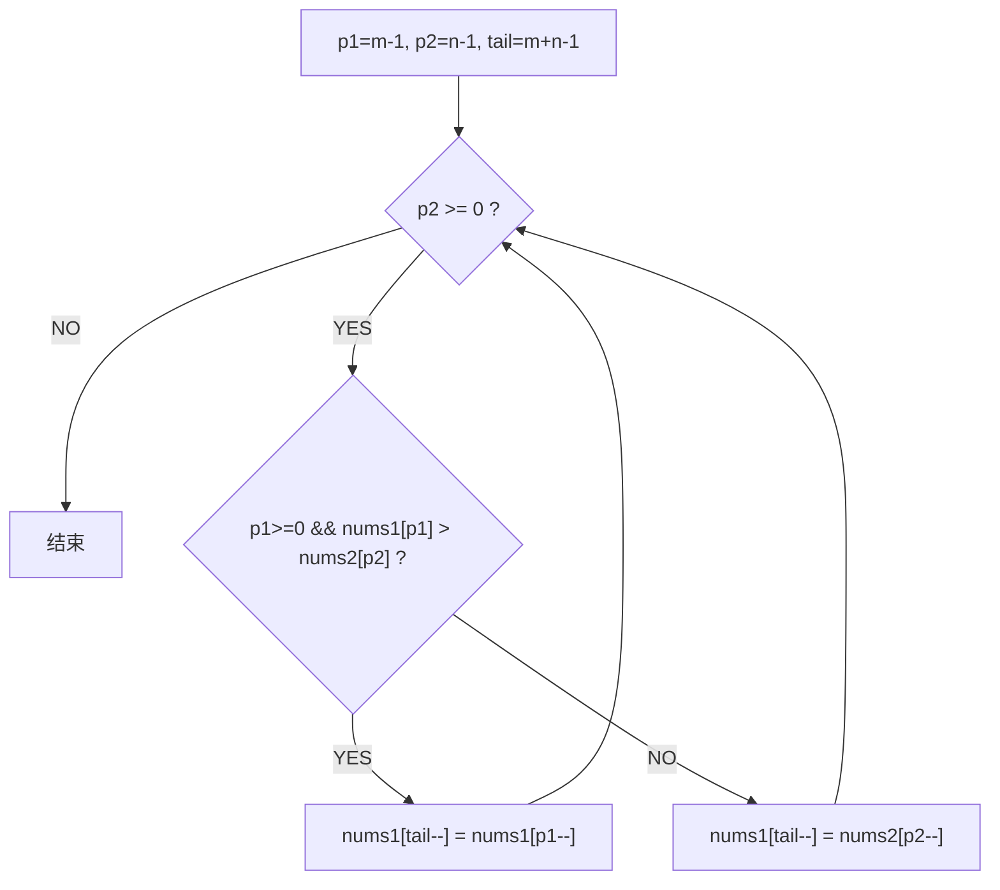

# A010 合并两个有序数组（Merge Sorted Array）

> LeetCode 88 · ⭐ · 逆向双指针
>
> 正向合并需要额外空间，反向合并则原地完成。此题展示了"改变遍历方向"来规避覆盖——这种逆向思维在多处算法优化中出现。

---

## 01. 题目描述

将 `nums2` 合并到 `nums1` 中。`nums1` 长度 m+n，末尾有 n 个 0 作为预留空间。

**示例**：

```
输入：nums1 = [1,2,3,0,0,0], m = 3, nums2 = [2,5,6], n = 3
输出：[1,2,2,3,5,6]
```

---

## 02. 题目分析

### 2.1 正向合并的问题

从前往后填会覆盖 nums1 未处理的元素：

```
nums1 = [1,2,3,0,0,0]
         ↑p1        ↑tail
nums2 = [2,5,6]
         ↑p2

比较 1<2 → nums1[0]=1（不覆盖，还好）
比较 2<3 → nums1[1]=2（不覆盖）
比较 3≥2 → nums1[2]=2（覆盖了原本的3！）
```

### 2.2 逆向双指针



tail 指向 nums1 末尾**空位**，永远不会覆盖未处理数据。

### 2.3 动态演示

```
nums1 = [1,2,3,0,0,0]
nums2 = [2,5,6]
p1=2, p2=2, tail=5

① 3>6? NO  → nums1[5]=6, p2=1, tail=4
② 3>5? NO  → nums1[4]=5, p2=0, tail=3
③ 3>2? YES → nums1[3]=3, p1=1, tail=2
④ 2>2? NO  → nums1[2]=2, p2=-1, tail=1
p2<0 → 结束

结果：[1,2,2,3,5,6]
```

**关键**：while 条件用 `p2 >= 0` 而非 `tail >= 0`——只要 nums2 还有元素就需要继续填充。

---

## 03. 代码

**Java**：
```java
public void merge(int[] nums1, int m, int[] nums2, int n) {
    int p1 = m - 1, p2 = n - 1, tail = m + n - 1;
    while (p2 >= 0) {
        if (p1 >= 0 && nums1[p1] > nums2[p2])
            nums1[tail--] = nums1[p1--];
        else
            nums1[tail--] = nums2[p2--];
    }
}
```

**Python**：
```python
def merge(self, nums1: List[int], m: int, nums2: List[int], n: int) -> None:
    p1, p2, tail = m - 1, n - 1, m + n - 1
    while p2 >= 0:
        if p1 >= 0 and nums1[p1] > nums2[p2]:
            nums1[tail] = nums1[p1]; p1 -= 1
        else:
            nums1[tail] = nums2[p2]; p2 -= 1
        tail -= 1
```

**C++**：
```cpp
void merge(vector<int>& nums1, int m, vector<int>& nums2, int n) {
    int p1 = m - 1, p2 = n - 1, tail = m + n - 1;
    while (p2 >= 0)
        if (p1 >= 0 && nums1[p1] > nums2[p2])
            nums1[tail--] = nums1[p1--];
        else
            nums1[tail--] = nums2[p2--];
}
```

**复杂度**：时间 O(m+n)，空间 O(1)。

---

## 04. 总结

| 核心启示 | 说明 |
|---------|------|
| 逆向思维 | 正向覆盖数据 → 反向避免覆盖 |
| 指针设计 | 用 `tail` 从后往前填（空位安全） |
| 终止条件 | `p2 >= 0` 而非 `tail >= 0` |
| 应用场景 | 原地合并、数组移位、内存紧凑操作 |

**相关题目**：[B006 合并两个有序链表](B006-合并两个有序链表.md)
