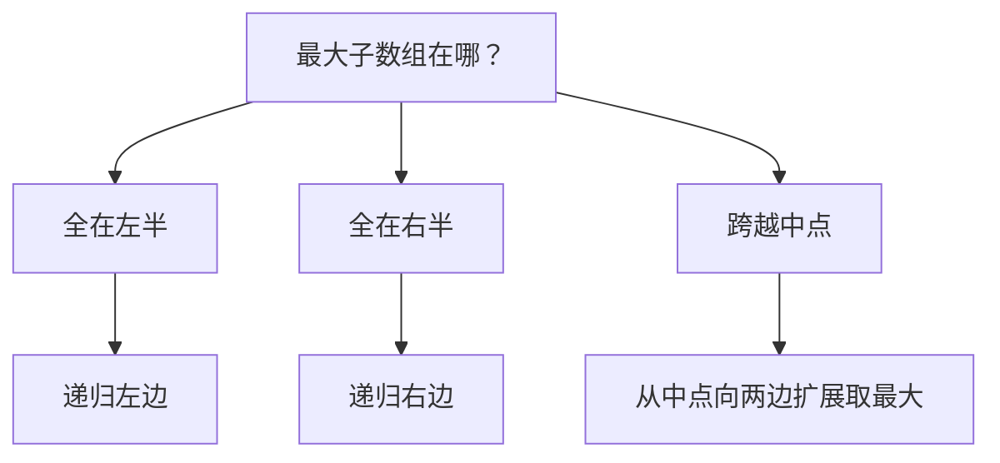
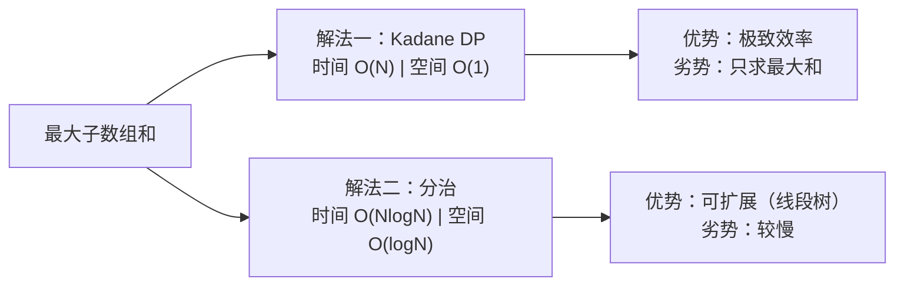

# A012 最大子数组和（Maximum Subarray）

> LeetCode 53 · ⭐⭐ · DP / 分治
>
> Kadane 算法的 DP 公式只有一行——`cur = max(x, cur+x)`。但背后隐藏的是"最优子结构"的思想飞跃。分治法虽不是最优，却展示了《算法导论》中经典的"跨越中点"分析范式。

---

## 01. 题目描述

找出具有最大和的连续子数组，返回其最大和。

**示例 1**：

```
输入：nums = [-2,1,-3,4,-1,2,1,-5,4]
输出：6
解释：连续子数组 [4,-1,2,1] 的和最大，为 6
```

**示例 2**：

```
输入：nums = [1]
输出：1
```

**示例 3**：

```
输入：nums = [5,4,-1,7,8]
输出：23  ([5,4,-1,7,8] 整个数组)
```

**约束**：
- `1 <= nums.length <= 10^5`
- `-10^4 <= nums[i] <= 10^4`

---

## 02. 题目分析：最优子结构的诞生

### 2.1 核心问题

这个问题有两个"直觉陷阱"：

| 直觉 | 为什么错 |
|------|---------|
| 选所有正数 | 如果正数被负数隔开，不如整个跳过 |
| 滑动窗口 | 没有单调性——加一个负数后和变小，但再加正数可能变大 |

### 2.2 DP 思路：重新定义状态

关键洞察：**不要想"哪个子数组"，想"以谁结尾"**。

定义 `dp[i]`：**以 `nums[i]` 结尾**的最大子数组和。

$$dp[i] = \max(nums[i],\; dp[i-1] + nums[i])$$

翻译成人话：要么独自成段（前面的不要了），要么接在前面的最大子数组后面。

### 2.3 为什么"以谁结尾"是正确状态定义？

因为任何一个子数组必须以某个元素结尾。把所有"以 i 结尾"的最优解求出来，取最大值就是全局最优解——这就是**最优子结构**。

### 2.4 手推示例

```
nums = [-2, 1, -3, 4, -1, 2, 1, -5, 4]

i=0: dp[0] = max(-2, 无) = -2                  → max = -2
i=1: dp[1] = max(1, -2+1) = max(1, -1) = 1     → max = 1
i=2: dp[2] = max(-3, 1-3) = max(-3, -2) = -2   → max = 1
i=3: dp[3] = max(4, -2+4) = max(4, 2) = 4      → max = 4
i=4: dp[4] = max(-1, 4-1) = max(-1, 3) = 3     → max = 4
i=5: dp[5] = max(2, 3+2) = max(2, 5) = 5       → max = 5
i=6: dp[6] = max(1, 5+1) = max(1, 6) = 6       → max = 6  ←
i=7: dp[7] = max(-5, 6-5) = max(-5, 1) = 1     → max = 6
i=8: dp[8] = max(4, 1+4) = max(4, 5) = 5       → max = 6

最终答案：6
```

### 2.5 空间压缩

注意到 `dp[i]` 只依赖 `dp[i-1]`，用一个变量 `cur` 滚动即可。

---

## 03. 解法一：动态规划（Kadane 算法，O(N)/O(1)）

### 3.1 代码

**Java**：
```java
public int maxSubArray(int[] nums) {
    int max = nums[0], cur = nums[0];
    for (int i = 1; i < nums.length; i++) {
        cur = Math.max(nums[i], cur + nums[i]);
        max = Math.max(max, cur);
    }
    return max;
}
```

**Python**：
```python
def maxSubArray(self, nums: List[int]) -> int:
    max_sum = cur = nums[0]
    for x in nums[1:]:
        cur = max(x, cur + x)
        max_sum = max(max_sum, cur)
    return max_sum
```

**C++**：
```cpp
int maxSubArray(vector<int>& nums) {
    int ans = nums[0], cur = nums[0];
    for (int i = 1; i < nums.size(); i++) {
        cur = max(nums[i], cur + nums[i]);
        ans = max(ans, cur);
    }
    return ans;
}
```

**复杂度**：时间 O(N)，一次遍历。空间 O(1)，仅两个变量。

---

## 04. 解法二：分治（O(NlogN)/O(logN)）

### 4.1 思路

最大子数组必然属于以下三种情况之一：



跨越中点的情况：从中点向左到 `l` 取最大后缀和，从中点+1向右到 `r` 取最大前缀和，两者相加。

### 4.2 分治递归树

```
              [-2,1,-3,4,-1,2,1,-5,4]
             /                       \
    [-2,1,-3,4,-1]              [2,1,-5,4]
    /           \               /         \
[-2,1,-3]    [4,-1]        [2,1]        [-5,4]
  /    \      /   \        /  \         /    \
[-2,1] [-3] [4] [-1]    [2] [1]      [-5]  [4]
 /   \
[-2] [1]
```

### 4.3 代码

**Java**：
```java
public int maxSubArray(int[] nums) {
    return divide(nums, 0, nums.length - 1);
}

int divide(int[] nums, int l, int r) {
    if (l == r) return nums[l];                    // 单元素

    int m = l + (r - l) / 2;
    int leftMax  = divide(nums, l, m);             // 左半的最优解
    int rightMax = divide(nums, m + 1, r);         // 右半的最优解
    int crossMax = crossSum(nums, l, m, r);        // 跨越中点的最优解

    return Math.max(Math.max(leftMax, rightMax), crossMax);
}

int crossSum(int[] nums, int l, int m, int r) {
    // 从中点向左扩展，取最大后缀和
    int leftSum = Integer.MIN_VALUE, sum = 0;
    for (int i = m; i >= l; i--) {
        sum += nums[i];
        leftSum = Math.max(leftSum, sum);
    }
    // 从中点+1向右扩展，取最大前缀和
    int rightSum = Integer.MIN_VALUE;
    sum = 0;
    for (int i = m + 1; i <= r; i++) {
        sum += nums[i];
        rightSum = Math.max(rightSum, sum);
    }
    return leftSum + rightSum;
}
```

**Python**：
```python
def maxSubArray(self, nums: List[int]) -> int:
    def divide(l, r):
        if l == r: return nums[l]
        m = (l + r) // 2
        left = divide(l, m)
        right = divide(m + 1, r)
        cross = cross_sum(l, m, r)
        return max(left, right, cross)

    def cross_sum(l, m, r):
        ls = float('-inf'); s = 0
        for i in range(m, l - 1, -1): s += nums[i]; ls = max(ls, s)
        rs = float('-inf'); s = 0
        for i in range(m + 1, r + 1): s += nums[i]; rs = max(rs, s)
        return ls + rs

    return divide(0, len(nums) - 1)
```

**C++**：
```cpp
int maxSubArray(vector<int>& nums) {
    return divide(nums, 0, nums.size() - 1);
}
int divide(vector<int>& nums, int l, int r) {
    if (l == r) return nums[l];
    int m = l + (r - l) / 2;
    int L = divide(nums, l, m), R = divide(nums, m + 1, r);
    int crossL = INT_MIN, sum = 0;
    for (int i = m; i >= l; i--) { sum += nums[i]; crossL = max(crossL, sum); }
    int crossR = INT_MIN; sum = 0;
    for (int i = m + 1; i <= r; i++) { sum += nums[i]; crossR = max(crossR, sum); }
    return max({L, R, crossL + crossR});
}
```

**复杂度**：时间 O(NlogN)（递归树深度 logN，每层合并 O(N)）。空间 O(logN)。

---

## 05. 两解法对比



| 维度 | Kadane DP | 分治 |
|------|:---:|:---:|
| 时间复杂度 | **O(N)** | O(NlogN) |
| 空间复杂度 | **O(1)** | O(logN) |
| 代码行数 | ~6 行 | ~25 行 |
| 能否扩展到"任意区间查询" | ❌ | ✅（线段树基础） |
| 面试推荐 | **首选** | 加分项 |
| 思想深度 | 最优子结构 | 分治递归 |

### 选型建议

```
第一遍 → 写 Kadane DP（标准答案）
第二遍 → 提分治法（展示算法功底）
加分项 → 讨论分治如何扩展到 RMQ（区间最大子数组和查询）
```

---

## 06. 总结

### 核心公式

$$dp[i] = \max(nums[i],\; dp[i-1] + nums[i])$$

### DP 思维递进

```
原始思路：找哪个子数组最大？（难，组合爆炸）
       ↓ 重新定义状态
以 i 结尾的最大子数组和？（最优子结构，可 O(N) 递推）
       ↓ 滚动变量
O(N) 时间 + O(1) 空间
```

### 从这道题学到的

| 启示 | 说明 |
|------|------|
| 最优子结构 | 把"全局最优"分解为"以每个位置结尾的最优" |
| 状态压缩 | `dp[i]` 只依赖 `dp[i-1]` → 省掉整个数组 |
| 分治的通用性 | 虽非最优但展示了递归解题的框架 |

**相关题目**：[A013 乘积最大子数组](013-A-乘积最大子数组.md)、[N019 最大正方形](019-A-最大正方形.md)、[N008 最长递增子序列](N008-最长递增子序列.md)
