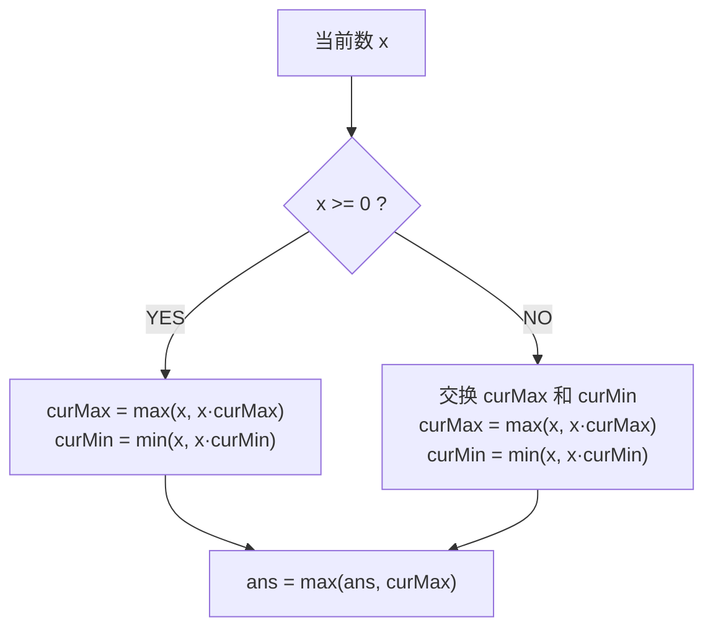
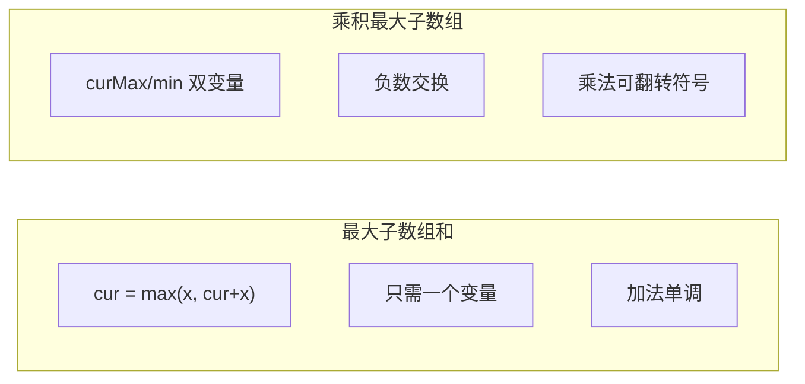

# A013 乘积最大子数组（Maximum Product Subarray）

> LeetCode 152 · ⭐⭐ · DP
>
> 加法的 Kadane 只需一个变量，乘法的 Kadane 需要两个——`curMax` 和 `curMin`。负负得正让最小值"咸鱼翻身"。

---

## 01. 题目描述

找出数组中乘积最大的连续子数组，返回乘积。

**示例 1**：

```
输入：nums = [2,3,-2,4]
输出：6
解释：子数组 [2,3] 的乘积 = 6
```

**示例 2**：

```
输入：nums = [-2,0,-1]
输出：0
```

**示例 3**：

```
输入：nums = [-2,3,-4]
输出：24
解释：整个数组 [-2,3,-4] 的乘积 = (-2)×3×(-4) = 24
```

**约束**：
- `1 <= nums.length <= 2 * 10^4`
- `-10 <= nums[i] <= 10`

---

## 02. 题目分析：为什么不能直接套 Kadane？

### 2.1 A012 Kadane 的本质

A012 的公式 `cur = max(x, cur+x)` 成立，是因为**加法具有单调性**：正数加正数更大，正数加负数更小但不会"反转"。

### 2.2 乘法的不同

乘法中 **负数 × 负数 = 正数**（符号翻转）。这导致"当前最小值"可能在遇到下一个负数时**翻身变成最大值**。

```
示例：[-2, 3, -4]

i=0: curMax=-2, curMin=-2
i=1: curMax=max(3, -2×3)=3,   curMin=min(3, -2×3)=-6
i=2: curMax=max(-4, 3×-4, -6×-4)=max(-4, -12, 24)=24  ← -6×-4 翻身！
```

**如果没有 curMin 会怎样？**

```
只用 curMax：
i=2: curMax = max(-4, 3×-4) = max(-4, -12) = -4  ← 丢掉了 24！
```

### 2.3 核心洞察



### 2.4 完整状态转移

$$curMax[i] = \max(nums[i],\; curMax[i-1] \times nums[i],\; curMin[i-1] \times nums[i])$$

$$curMin[i] = \min(nums[i],\; curMax[i-1] \times nums[i],\; curMin[i-1] \times nums[i])$$

简化实现：遇负数先交换 curMax 和 curMin。

---

## 03. 解法一：双变量 DP（O(N)/O(1)）

### 3.1 手动推演

```
nums = [2, 3, -2, 4]

i=0: x=2,  curMax=2, curMin=2,                       ans=2
i=1: x=3,  x≥0 → curMax=max(3,2×3)=6, curMin=min(3,2×3)=3,  ans=6
i=2: x=-2, x<0 → swap: curMax=3,curMin=6
           curMax=max(-2,3×-2)=-2, curMin=min(-2,6×-2)=-12,  ans=6
i=3: x=4,  curMax=max(4,-2×4)=4,   curMin=min(4,-12×4)=-48,  ans=6

ans=6
```

```
nums = [-2, 3, -4]

i=0: x=-2, curMax=-2, curMin=-2,                             ans=-2
i=1: x=3,  x≥0 → curMax=max(3,-2×3)=3, curMin=min(3,-2×3)=-6,  ans=3
i=2: x=-4, x<0 → swap: curMax=-6,curMin=3
           curMax=max(-4,-6×-4)=24, curMin=min(-4,3×-4)=-12,   ans=24

ans=24  ← 关键：-6×-4=24 翻身！
```

### 3.2 代码

**Java**：
```java
public int maxProduct(int[] nums) {
    int ans = nums[0], curMax = nums[0], curMin = nums[0];
    for (int i = 1; i < nums.length; i++) {
        if (nums[i] < 0) {          // 负数使大小关系翻转
            int t = curMax; curMax = curMin; curMin = t;
        }
        curMax = Math.max(nums[i], curMax * nums[i]);
        curMin = Math.min(nums[i], curMin * nums[i]);
        ans = Math.max(ans, curMax);
    }
    return ans;
}
```

**Python**：
```python
def maxProduct(self, nums: List[int]) -> int:
    ans = cur_max = cur_min = nums[0]
    for x in nums[1:]:
        if x < 0:
            cur_max, cur_min = cur_min, cur_max   # 负数翻转
        cur_max = max(x, cur_max * x)
        cur_min = min(x, cur_min * x)
        ans = max(ans, cur_max)
    return ans
```

**C++**：
```cpp
int maxProduct(vector<int>& nums) {
    int ans = nums[0], curMax = nums[0], curMin = nums[0];
    for (int i = 1; i < nums.size(); i++) {
        if (nums[i] < 0) swap(curMax, curMin);
        curMax = max(nums[i], curMax * nums[i]);
        curMin = min(nums[i], curMin * nums[i]);
        ans = max(ans, curMax);
    }
    return ans;
}
```

**复杂度**：时间 O(N)，空间 O(1)。

---

## 04. 解法二：双向扫描（选读）

遇到 0 时分割。分别从左到右、从右到左扫描，乘积遇 0 归 1。

```java
public int maxProduct(int[] nums) {
    int max = nums[0], prod = 1;
    for (int n : nums) { prod *= n; max = Math.max(max, prod); if (n == 0) prod = 1; }
    prod = 1;
    for (int i = nums.length-1; i >= 0; i--) { prod *= nums[i]; max = Math.max(max, prod); if (nums[i] == 0) prod = 1; }
    return max;
}
```

---

## 05. 两解法对比

| 维度 | 双变量 DP | 双向扫描 |
|------|:---:|:---:|
| 时间复杂度 | O(N) | O(N) |
| 空间复杂度 | O(1) | O(1) |
| 直观性 | ⭐⭐⭐ | ⭐⭐⭐⭐ |
| 泛化性 | **可泛化到含0场景** | 需要特殊处理0 |

---

## 06. A012 vs A013 对比



| | A012 最大和 | A013 最大积 |
|------|:---:|:---:|
| 状态数 | 1 个 (cur) | 2 个 (curMax, curMin) |
| 符号翻转 | 不需要 | **核心技巧** |
| 遇 0 | 自然处理 | 需注意 |
| 难度 | ⭐⭐ | ⭐⭐ |

---

## 07. 总结

| 核心启示 | 说明 |
|---------|------|
| 为什么需要 curMin | 负数 × 负数 = 正数，最小值可能翻身 |
| 负数交换技巧 | 用 swap 代替同时计算 max 和 min 的 3-way compare |
| DP 泛化 | 不是简单套 Kadane，而是理解"什么因素会影响最优解" |

**相关题目**：[A012 最大子数组和](012-A-最大子数组和.md)、[N019 最大正方形](019-A-最大正方形.md)
