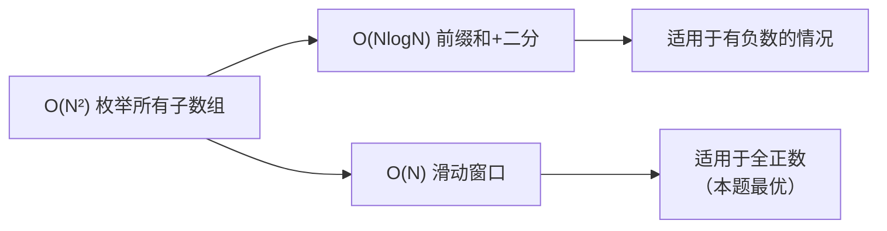
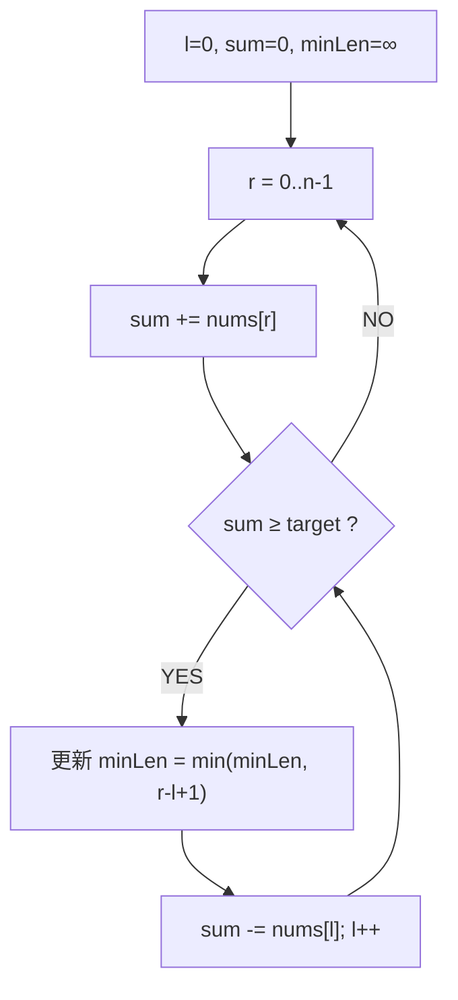
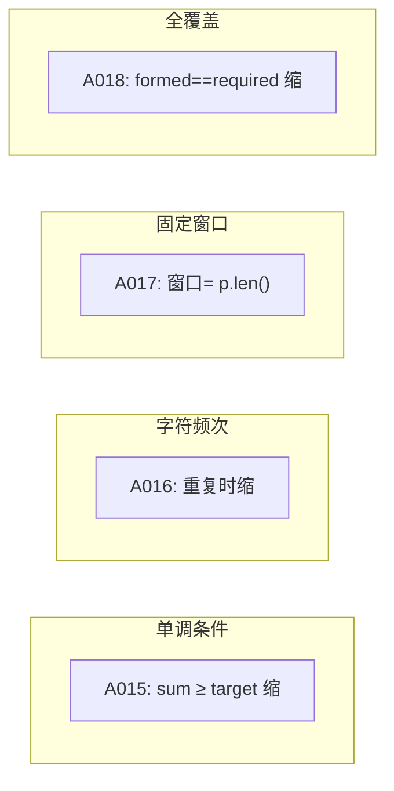

# A015 长度最小的子数组（Minimum Size Subarray Sum）

> LeetCode 209 · ⭐⭐ · 滑动窗口
>
> 滑动窗口的入门题。"右扩累加，满足条件左缩"——这道模板题写熟后，所有滑动窗口题都是它的变体。前缀和+二分是另一种思路。

---

## 01. 题目描述

找出和 ≥ target 的长度最小的连续子数组，返回其长度。若不存在返回 0。

**示例 1**：

```
输入：target = 7, nums = [2,3,1,2,4,3]
输出：2
解释：子数组 [4,3] 的和 = 7 ≥ 7，长度 2 最小。
```

**示例 2**：

```
输入：target = 4, nums = [1,4,4]
输出：1
```

**示例 3**：

```
输入：target = 11, nums = [1,1,1,1,1,1,1,1]
输出：0
```

**约束**：
- `1 <= target <= 10^9`
- `1 <= nums.length <= 10^5`
- `1 <= nums[i] <= 10^4`

---

## 02. 题目分析：两种思考路径

### 2.1 为什么不能用 DP？

A012 的 Kadane 公式是 `cur = max(x, cur+x)`——因为可以"舍弃"前面的负数。但这里要求 **sum ≥ target**，不是取最大——没有单调性。

### 2.2 解法演进



---

## 03. 解法一：滑动窗口（O(N)/O(1)）

### 3.1 核心思路



### 3.2 全流程演示

```
target = 7, nums = [2,3,1,2,4,3]

r=0, sum=2:                 2 < 7  → 继续
r=1, sum=5:                 5 < 7  → 继续
r=2, sum=6:                 6 < 7  → 继续
r=3, sum=8:  sum≥7 → minLen=4,  sum-=2 (l=0) → sum=6, l=1
             sum=6 < 7  → 继续
r=4, sum=10: sum≥7 → minLen=4,  sum-=3 (l=1) → sum=7, l=2
             sum=7≥7 → minLen=3, sum-=1 (l=2) → sum=6, l=3  ← minLen更新到3
             sum=6 < 7  → 继续
r=5, sum=9:  sum≥7 → minLen=3,  sum-=2 (l=3) → sum=7, l=4
             sum=7≥7 → minLen=2, sum-=4 (l=4) → sum=3, l=5  ← minLen更新到2！
             sum=3 < 7  → 结束

最终答案：2
```

### 3.3 代码

**Java**：
```java
public int minSubArrayLen(int target, int[] nums) {
    int l = 0, sum = 0, minLen = Integer.MAX_VALUE;
    for (int r = 0; r < nums.length; r++) {
        sum += nums[r];
        while (sum >= target) {
            minLen = Math.min(minLen, r - l + 1);
            sum -= nums[l++];
        }
    }
    return minLen == Integer.MAX_VALUE ? 0 : minLen;
}
```

**Python**：
```python
def minSubArrayLen(self, target: int, nums: List[int]) -> int:
    l = s = 0
    ans = len(nums) + 1
    for r, x in enumerate(nums):
        s += x
        while s >= target:
            ans = min(ans, r - l + 1)
            s -= nums[l]
            l += 1
    return 0 if ans > len(nums) else ans
```

**C++**：
```cpp
int minSubArrayLen(int target, vector<int>& nums) {
    int l = 0, sum = 0, ans = INT_MAX;
    for (int r = 0; r < nums.size(); r++) {
        sum += nums[r];
        while (sum >= target) {
            ans = min(ans, r - l + 1);
            sum -= nums[l++];
        }
    }
    return ans == INT_MAX ? 0 : ans;
}
```

**复杂度**：时间 O(N)，空间 O(1)。每个元素最多入窗出窗各一次。

---

## 04. 解法二：前缀和 + 二分（O(NlogN)，选读）

### 4.1 思路

预处理前缀和 `pre[i]`（单调递增，因为 nums[i] ≥ 0）。对每个起点 `i`，二分查找第一个 `pre[j] - pre[i] ≥ target` 的 `j`。

```java
public int minSubArrayLen(int target, int[] nums) {
    int n = nums.length, minLen = n + 1;
    int[] pre = new int[n + 1];
    for (int i = 0; i < n; i++) pre[i + 1] = pre[i] + nums[i];

    for (int i = 0; i < n; i++) {
        int need = pre[i] + target;                     // 需要的和
        int j = Arrays.binarySearch(pre, need);         // 找第一个 ≥ need 的位置
        if (j < 0) j = -j - 1;                          // binarySearch 的"找不到"语义
        if (j <= n) minLen = Math.min(minLen, j - i);
    }
    return minLen > n ? 0 : minLen;
}
```

### 4.2 两解法对比

| 维度 | 滑动窗口 | 前缀和+二分 |
|------|:---:|:---:|
| 时间复杂度 | O(N) | O(NlogN) |
| 空间复杂度 | O(1) | O(N) |
| 适用条件 | 元素全 ≥ 0 | **任意正负元素均可** |
| 面试推荐 | ✅ | 加分项 |

---

## 05. 滑动窗口 vs 其他题型



| 题目 | 收缩条件 | 关键技巧 |
|------|---------|---------|
| A015 最小子数组 | `sum >= target` | 基本模板 |
| A016 无重复最长 | 出现重复 | `int[128]` 字符集 |
| A017 异位词 | 窗口固定 | 频率数组 |
| A018 最小覆盖 | `formed == required` | formed 计数 |

---

## 06. 总结

| 核心启示 | 说明 |
|---------|------|
| 滑动窗口模板 | 右扩累加，满足条件左缩——四道题同一框架 |
| O(N) 复杂度 | 每个元素最多入窗出窗各一次（摊还分析） |
| 前缀和+二分 | 数组含负数时滑窗失效的备选方案 |

**相关题目**：[A016 无重复最长](016-A-无重复字符的最长子串.md)、[A018 最小覆盖子串](018-A-最小覆盖子串.md)
