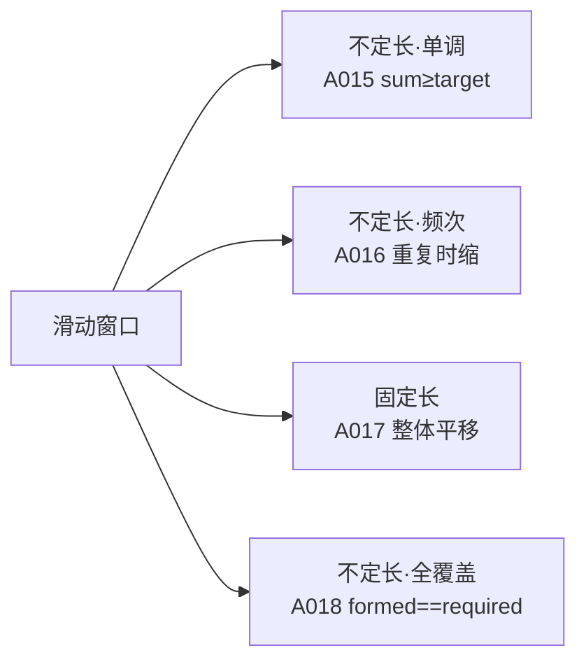
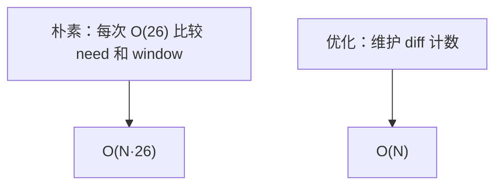

# A017 找到字符串中所有字母异位词

> LeetCode 438 · ⭐⭐ · 滑动窗口
>
> 滑动窗口第三种形态——**固定窗口大小**。不像 A015/A016 收缩窗口，A017 是"整体平移"。

## 01. 题目

找到 s 中所有是 p 的字母异位词的子串起始索引。`s="cbaebabacd", p="abc"` → `[0,6]` ("cba"和"bac")

## 02. 题目分析

### 滑动窗口四种形态



### A017 的特殊之处

窗口大小 = `p.length()`，**从不收缩**。每次右移一位：加入 `s[r]` 频率，减去 `s[r-n]` 频率。

### 朴素 vs 优化



优化做法：用一个 `diff` 变量记录"有多少个字符的频率不匹配"。只在增/减刚好匹配时更新 diff。

## 03. 解法一：朴素滑动窗口（O(N·26)）

```java
public List<Integer> findAnagrams(String s, String p) {
    List<Integer> res = new ArrayList<>();
    int m = s.length(), n = p.length();
    if (m < n) return res;
    int[] need = new int[26], window = new int[26];
    for (char c : p.toCharArray()) need[c - 'a']++;
    for (int i = 0; i < n; i++) window[s.charAt(i) - 'a']++;
    if (Arrays.equals(need, window)) res.add(0);
    for (int i = n; i < m; i++) {
        window[s.charAt(i) - 'a']++;
        window[s.charAt(i - n) - 'a']--;
        if (Arrays.equals(need, window)) res.add(i - n + 1);
    }
    return res;
}
```

**Python**：
```python
def findAnagrams(self, s: str, p: str) -> List[int]:
    m, n = len(s), len(p)
    if m < n: return []
    need = [0] * 26; window = [0] * 26
    for c in p: need[ord(c) - 97] += 1
    for i in range(n): window[ord(s[i]) - 97] += 1
    res = [0] if need == window else []
    for i in range(n, m):
        window[ord(s[i]) - 97] += 1
        window[ord(s[i - n]) - 97] -= 1
        if need == window: res.append(i - n + 1)
    return res
```

**C++**：
```cpp
vector<int> findAnagrams(string s, string p) { vector<int> res; int m=s.size(),n=p.size(); if(m<n) return res; vector<int> need(26),window(26); for(char c:p) need[c-'a']++; for(int i=0;i<n;i++) window[s[i]-'a']++; if(need==window) res.push_back(0); for(int i=n;i<m;i++){ window[s[i]-'a']++; window[s[i-n]-'a']--; if(need==window) res.push_back(i-n+1); } return res; }
```

**复杂度**：O(N·26)/O(1)。

## 04. 解法二：diff 计数优化（O(N)）

```java
public List<Integer> findAnagrams(String s, String p) {
    List<Integer> res = new ArrayList<>();
    int m = s.length(), n = p.length();
    if (m < n) return res;
    int[] cnt = new int[26];
    for (int i = 0; i < n; i++) { cnt[s.charAt(i) - 'a']++; cnt[p.charAt(i) - 'a']--; }
    int diff = 0;
    for (int c : cnt) if (c != 0) diff++;
    if (diff == 0) res.add(0);
    for (int i = n; i < m; i++) {
        int in = s.charAt(i) - 'a', out = s.charAt(i - n) - 'a';
        if (cnt[in] == 0) diff++; cnt[in]++; if (cnt[in] == 0) diff--;
        if (cnt[out] == 0) diff++; cnt[out]--; if (cnt[out] == 0) diff--;
        if (diff == 0) res.add(i - n + 1);
    }
    return res;
}
```

## 05. 总结

| 题目 | 窗口大小 | 收缩条件 | 时间 |
|------|:---:|---------|:---:|
| A015 | 不定长 | `sum >= target` | O(N) |
| A016 | 不定长 | 重复 | O(N) |
| A017 | **固定长** | 从不收缩 | O(N·26) / O(N) |
| A018 | 不定长 | `formed == required` | O(N) |

**相关**：[A018 最小覆盖](018-A-最小覆盖子串.md)、[A015 最小子数组](015-A-长度最小的子数组.md)
