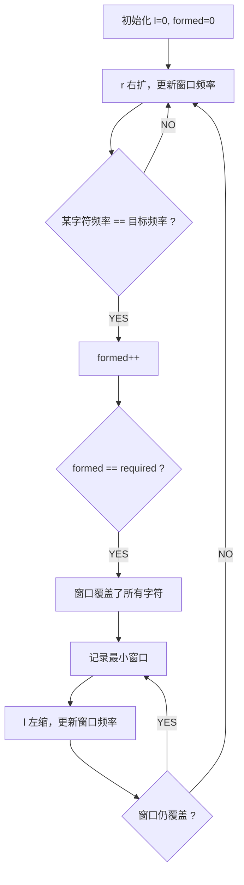
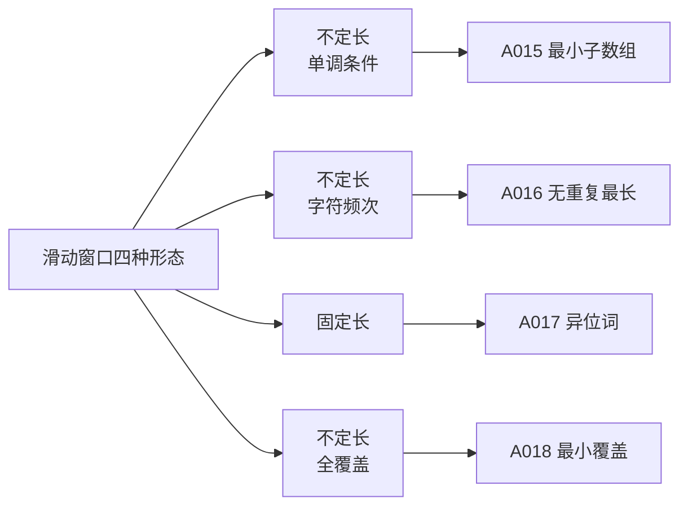

# A018 最小覆盖子串（Minimum Window Substring）

> LeetCode 76 · ⭐⭐⭐ · 滑动窗口
>
> 滑动窗口的终极大 Boss。"formed 计数"是这道题的画龙点睛之笔——避免了每次 O(26) 数组比较。

---

## 01. 题目描述

返回 `s` 中涵盖 `t` 所有字符的最小子串。若不存在返回空串。

**示例 1**：

```
输入：s = "ADOBECODEBANC", t = "ABC"
输出："BANC"
```

**示例 2**：

```
输入：s = "a", t = "a"
输出："a"
```

**示例 3**：

```
输入：s = "a", t = "aa"
输出：""
```

**约束**：
- `1 <= s.length, t.length <= 10^5`
- `s` 和 `t` 由英文字母组成

---

## 02. 题目分析：从朴素到最优

### 2.1 朴素思路

枚举所有子串 O(N²)，每个子串检查是否覆盖 t 的字符 O(N) → O(N³)。

### 2.2 滑动窗口思路



### 2.3 核心技巧：formed 计数（为什么不用 Arrays.equals？）

朴素做法：每次检查窗口是否覆盖 t → `Arrays.equals(need, window)` → O(26)。

```java
// 朴素：每次 O(26) 比较
while (Arrays.equals(need, window)) { ... }  // ❌ 慢

// 优化：用 formed 计数，O(1) 判断
while (formed == required) { ... }            // ✅ 快
```

`formed` 的含义：**有多少个字符已经满足了目标频率**。

```
t = "ABC" → need = {A:1, B:1, C:1} → required = 3

当 window[A] 从 0→1：window[A]==need[A]==1 → formed++ (formed=1)
当 window[B] 从 0→1：window[B]==need[B]==1 → formed++ (formed=2)
当 window[C] 从 0→1：window[C]==need[C]==1 → formed++ (formed=3)

formed == required → 窗口覆盖了所有字符！
```

### 2.4 窗口滑动全流程演示

```
s = "ADOBECODEBANC", t = "ABC"
need = {A:1, B:1, C:1}, required = 3

r=0,A: win[A]=1==need[A]=1 → formed=1  (窗口: A)
r=1,D: win[D]=1                          (窗口: AD)
r=2,O: win[O]=1                          (窗口: ADO)
r=3,B: win[B]=1==need[B]=1 → formed=2   (窗口: ADOB)
r=4,E: win[E]=1                          (窗口: ADOBE)
r=5,C: win[C]=1==need[C]=1 → formed=3   (窗口: ADOBEC, formed==3!)

→ 窗口 [0..5]="ADOBEC", len=6
  收缩 l=0,A: win[A]=0<need[A] → formed=2  (窗口: DOBEC)

r=6,O: win[O]=2                          (窗口: DOBECO)
r=7,D: win[D]=2                          (窗口: DOBECOD)
r=8,E: win[E]=2                          (窗口: DOBECODE)
r=9,B: win[B]=2                          (窗口: DOBECODEB)
r=10,A: win[A]=1==need[A] → formed=3    (窗口: DOBECODEBA, formed==3!)

→ 窗口 [1..10]="DOBECODEBA", len=10 (不如6)
  收缩 l=1: D不在t中, win[D]=1, 仍覆盖
  收缩 l=2: O不在t中, win[O]=1, 仍覆盖
  收缩 l=3: win[B]=1==need[B]... 仍=1, formed=3  (窗口: BECODEBA)
  收缩 l=4: E不在t中
  收缩 l=5: win[C]=0<need[C] → formed=2 结束收缩

r=11,N: ...  (窗口: ECODEBAN)
r=12,C: win[C]=1==need[C] → formed=3  (窗口: ECODEBANC, formed==3!)

→ 窗口 [5..12]="ECODEBANC", len=8
  收缩...最终找到 [9..12]="BANC", len=4 ← 最优！

最终答案："BANC"
```

---

## 03. 代码

**Java**：
```java
public String minWindow(String s, String t) {
    int[] need = new int[128];
    for (char c : t.toCharArray()) need[c]++;
    int required = 0;
    for (int n : need) if (n > 0) required++;

    int l = 0, formed = 0;
    int[] window = new int[128];
    int minLen = Integer.MAX_VALUE, start = 0;

    for (int r = 0; r < s.length(); r++) {
        char c = s.charAt(r);
        window[c]++;
        if (need[c] > 0 && window[c] == need[c]) formed++;

        while (formed == required) {
            if (r - l + 1 < minLen) {
                minLen = r - l + 1;
                start = l;
            }
            char lc = s.charAt(l);
            window[lc]--;
            if (need[lc] > 0 && window[lc] < need[lc]) formed--;
            l++;
        }
    }
    return minLen == Integer.MAX_VALUE ? "" : s.substring(start, start + minLen);
}
```

**Python**：
```python
def minWindow(self, s: str, t: str) -> str:
    need = [0] * 128
    for c in t: need[ord(c)] += 1
    required = sum(1 for n in need if n > 0)

    window = [0] * 128
    l = formed = 0
    min_len, start = float('inf'), 0

    for r, c in enumerate(s):
        window[ord(c)] += 1
        if need[ord(c)] > 0 and window[ord(c)] == need[ord(c)]:
            formed += 1
        while formed == required:
            if r - l + 1 < min_len:
                min_len = r - l + 1
                start = l
            lc = s[l]
            window[ord(lc)] -= 1
            if need[ord(lc)] > 0 and window[ord(lc)] < need[ord(lc)]:
                formed -= 1
            l += 1

    return "" if min_len == float('inf') else s[start:start + min_len]
```

**C++**：
```cpp
string minWindow(string s, string t) {
    vector<int> need(128), window(128);
    for (char c : t) need[c]++;
    int required = 0;
    for (int n : need) if (n > 0) required++;

    int l = 0, formed = 0, minLen = INT_MAX, start = 0;
    for (int r = 0; r < s.size(); r++) {
        char c = s[r]; window[c]++;
        if (need[c] > 0 && window[c] == need[c]) formed++;
        while (formed == required) {
            if (r - l + 1 < minLen) { minLen = r - l + 1; start = l; }
            char lc = s[l]; window[lc]--;
            if (need[lc] > 0 && window[lc] < need[lc]) formed--;
            l++;
        }
    }
    return minLen == INT_MAX ? "" : s.substr(start, minLen);
}
```

**复杂度**：时间 O(N)，空间 O(1)（128个字符）。

---

## 04. 滑动窗口题型总览



| 题目 | 窗口类型 | 收缩条件 | 优化技巧 |
|------|---------|---------|---------|
| A015 | 不定长 | `sum >= target` | 基本滑动窗口 |
| A016 | 不定长 | `set.contains(c)` | `int[128]` 代替 Set |
| A017 | 固定长 | 窗口 == p.len() | 频率数组直接比较 |
| A018 | 不定长 | `formed == required` | **formed 计数** |

---

## 05. 总结

| 核心启示 | 说明 |
|---------|------|
| formed 计数 | O(1) 判断窗口覆盖，代替 O(26) 数组比较 |
| 双指针+哈希 | 窗口增长右扩，满足条件左缩 |
| 128 数组 | 字符集小，用数组代替 HashMap 更高效 |
| 滑动窗口模板 | 右扩更新 → 满足条件时左缩 → 更新最优 |

**相关题目**：[A015 最小子数组](015-A-长度最小的子数组.md)、[A016 无重复最长](016-A-无重复字符的最长子串.md)、[A017 异位词](017-A-找到字符串中所有字母异位词.md)
