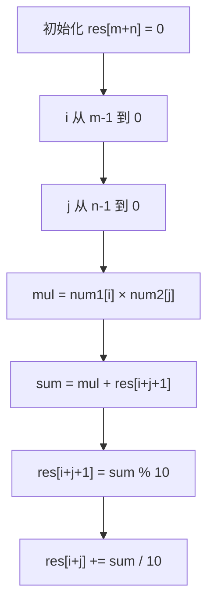

# A019 字符串相乘（Multiply Strings）

> LeetCode 43 · ⭐⭐ · 大数模拟
>
> 大数乘法的核心在于"位置映射"。`num1[i] × num2[j] → res[i+j+1]` 这个公式一旦理解，大数乘法迎刃而解。

## 01. 题目

`"123" × "456" = "56088"`。不能使用 BigInteger。

## 02. 题目分析

### 2.1 竖式乘法回顾

```
     1 2 3
   × 4 5 6
   -------
     7 3 8   ← 123×6
   6 1 5     ← 123×5
 4 9 2       ← 123×4
 ---------
 5 6 0 8 8
```

### 2.2 关键洞察：位置映射

`num1[i]` 和 `num2[j]` 的乘积影响 `res[i+j]`（进位）和 `res[i+j+1]`（个位）。

$$num1[i] \times num2[j] \rightarrow \begin{cases} res[i+j] &\text{(进位)} \\ res[i+j+1] &\text{(个位)} \end{cases}$$

结果数组长度最大为 `m + n`。

### 2.3 推导过程



## 03. 代码

**Java**：
```java
public String multiply(String num1, String num2) {
    if ("0".equals(num1) || "0".equals(num2)) return "0";
    int m = num1.length(), n = num2.length();
    int[] res = new int[m + n];
    for (int i = m - 1; i >= 0; i--)
        for (int j = n - 1; j >= 0; j--) {
            int mul = (num1.charAt(i) - '0') * (num2.charAt(j) - '0');
            int p1 = i + j, p2 = i + j + 1;
            int sum = mul + res[p2];
            res[p2] = sum % 10;
            res[p1] += sum / 10;
        }
    StringBuilder sb = new StringBuilder();
    for (int num : res) if (!(sb.length() == 0 && num == 0)) sb.append(num);
    return sb.toString();
}
```

**Python**：
```python
def multiply(self, num1: str, num2: str) -> str:
    if num1 == "0" or num2 == "0": return "0"
    m, n = len(num1), len(num2)
    res = [0] * (m + n)
    for i in range(m - 1, -1, -1):
        for j in range(n - 1, -1, -1):
            mul = (ord(num1[i]) - 48) * (ord(num2[j]) - 48)
            p1, p2 = i + j, i + j + 1
            s = mul + res[p2]
            res[p2] = s % 10
            res[p1] += s // 10
    i = 0
    while i < len(res) and res[i] == 0: i += 1
    return ''.join(str(x) for x in res[i:])
```

**C++**：
```cpp
string multiply(string num1, string num2) {
    if (num1 == "0" || num2 == "0") return "0";
    int m = num1.size(), n = num2.size();
    vector<int> res(m + n, 0);
    for (int i = m - 1; i >= 0; i--)
        for (int j = n - 1; j >= 0; j--) {
            int mul = (num1[i]-'0') * (num2[j]-'0');
            int p1 = i+j, p2 = i+j+1;
            int sum = mul + res[p2];
            res[p2] = sum % 10;
            res[p1] += sum / 10;
        }
    string ans;
    for (int x : res) if (!(ans.empty() && x == 0)) ans += (x + '0');
    return ans;
}
```

**复杂度**：O(MN)/O(M+N)。

## 04. 总结

| 核心要点 | 说明 |
|---------|------|
| 位置映射 | `num1[i] × num2[j] → res[i+j+1]` |
| 进位处理 | 先加到 `res[p2]`，再向前进位到 `res[p1]` |
| 结果长度 | 最多 m+n 位 |
| 去掉前导零 | 跳过开头的 0 |

**相关题目**：[P004 字符串相加](P004-字符串相加.md)
