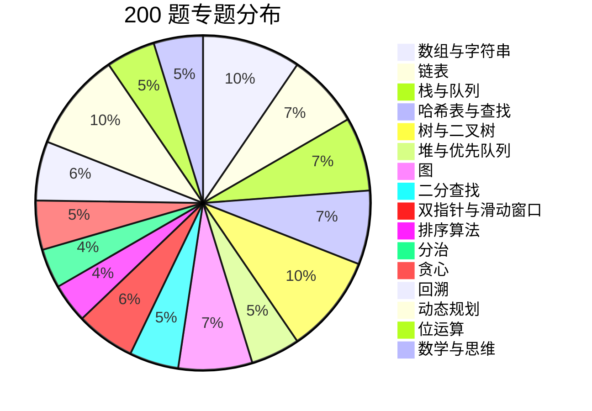

# 200 道经典算法题库

> 本卷为数据结构与算法专栏的"终考卷"，收录 **200 道** 覆盖全专栏的经典算法题。按专题编排，涵盖数组、链表、树、图、DP 等主流方向，附 LeetCode 题号与难度标记。

---

## 难度标记说明

| 标记 | 含义 |
|------|------|
| ⭐ | 简单（入门级，掌握基本操作） |
| ⭐⭐ | 中等（常见面试题，需要一定技巧） |
| ⭐⭐⭐ | 困难（综合性强，涉及多种技巧） |

---

## 一、数组与字符串（20 题）

> 索引 → [01.数组与字符串](01.数组与字符串.md)

| 编号 | 题目 | LeetCode | 难度 | 核心考点 |
|:---:|------|:---:|:---:|------|
| A001 | 两数之和 | 1 | ⭐ | 哈希映射 |
| A002 | 三数之和 | 15 | ⭐⭐ | 排序+双指针 |
| A003 | 最接近的三数之和 | 16 | ⭐⭐ | 排序+双指针 |
| A004 | 四数之和 | 18 | ⭐⭐ | 排序+双指针+剪枝 |
| A005 | 盛最多水的容器 | 11 | ⭐⭐ | 双指针 |
| A006 | 接雨水 | 42 | ⭐⭐⭐ | 双指针/单调栈/DP |
| A007 | 移动零 | 283 | ⭐ | 双指针 |
| A008 | 删除有序数组中的重复项 | 26 | ⭐ | 双指针 |
| A009 | 删除有序数组中的重复项 II | 80 | ⭐⭐ | 双指针 |
| A010 | 合并两个有序数组 | 88 | ⭐ | 逆向双指针 |
| A011 | 颜色分类（荷兰国旗） | 75 | ⭐⭐ | 三指针 |
| A012 | 最大子数组和 | 53 | ⭐⭐ | DP/分治 |
| A013 | 乘积最大子数组 | 152 | ⭐⭐ | DP |
| A014 | 和为 K 的子数组 | 560 | ⭐⭐ | 前缀和+哈希 |
| A015 | 长度最小的子数组 | 209 | ⭐⭐ | 滑动窗口 |
| A016 | 无重复字符的最长子串 | 3 | ⭐⭐ | 滑动窗口+集合 |
| A017 | 找到字符串中所有字母异位词 | 438 | ⭐⭐ | 滑动窗口 |
| A018 | 最小覆盖子串 | 76 | ⭐⭐⭐ | 滑动窗口 |
| A019 | 字符串相乘 | 43 | ⭐⭐ | 大数模拟 |
| A020 | 字符串转换整数 (atoi) | 8 | ⭐⭐ | 模拟/状态机 |

---

## 二、链表（15 题）

> 索引 → [02.链表](02.链表.md)

| 编号 | 题目 | LeetCode | 难度 | 核心考点 |
|:---:|------|:---:|:---:|------|
| B001 | 反转链表 | 206 | ⭐ | 指针操作 |
| B002 | 反转链表 II | 92 | ⭐⭐ | 区间反转 |
| B003 | K 个一组翻转链表 | 25 | ⭐⭐⭐ | 分组反转 |
| B004 | 环形链表 | 141 | ⭐ | 快慢指针 |
| B005 | 环形链表 II（找入口） | 142 | ⭐⭐ | 快慢指针+数学 |
| B006 | 合并两个有序链表 | 21 | ⭐ | 归并 |
| B007 | 合并 K 个升序链表 | 23 | ⭐⭐⭐ | 优先队列/分治 |
| B008 | 删除链表的倒数第 N 个结点 | 19 | ⭐⭐ | 双指针 |
| B009 | 相交链表 | 160 | ⭐ | 双指针 |
| B010 | 回文链表 | 234 | ⭐ | 快慢指针+反转 |
| B011 | 排序链表 | 148 | ⭐⭐ | 归并排序 |
| B012 | 复制带随机指针的链表 | 138 | ⭐⭐ | 哈希映射/节点交错 |
| B013 | 两数相加 | 2 | ⭐⭐ | 模拟进位 |
| B014 | 重排链表 | 143 | ⭐⭐ | 找中点+反转+合并 |
| B015 | LRU 缓存 | 146 | ⭐⭐ | 哈希+双向链表 |

---

## 三、栈与队列（15 题）

> 索引 → [03.栈与队列](03.栈与队列.md)

| 编号 | 题目 | LeetCode | 难度 | 核心考点 |
|:---:|------|:---:|:---:|------|
| C001 | 有效的括号 | 20 | ⭐ | 栈匹配 |
| C002 | 最长有效括号 | 32 | ⭐⭐⭐ | 栈/DP |
| C003 | 括号生成 | 22 | ⭐⭐ | 回溯 |
| C004 | 用栈实现队列 | 232 | ⭐ | 双栈 |
| C005 | 用队列实现栈 | 225 | ⭐ | 双队列/单队列 |
| C006 | 最小栈 | 155 | ⭐ | 辅助栈 |
| C007 | 逆波兰表达式求值 | 150 | ⭐⭐ | 后缀表达式 |
| C008 | 基本计算器 II | 227 | ⭐⭐ | 栈模拟运算 |
| C009 | 柱状图中最大的矩形 | 84 | ⭐⭐⭐ | 单调栈 |
| C010 | 每日温度 | 739 | ⭐⭐ | 单调栈 |
| C011 | 下一个更大元素 II | 503 | ⭐⭐ | 单调栈+循环 |
| C012 | 滑动窗口最大值 | 239 | ⭐⭐⭐ | 单调队列 |
| C013 | 字符串解码 | 394 | ⭐⭐ | 栈辅助 |
| C014 | 去除重复字母 | 316 | ⭐⭐⭐ | 单调栈+贪心 |
| C015 | 设计循环队列 | 622 | ⭐⭐ | 循环队列 |

---

## 四、哈希表与查找（15 题）

> 索引 → [04.哈希表与查找](04.哈希表与查找.md)

| 编号 | 题目 | LeetCode | 难度 | 核心考点 |
|:---:|------|:---:|:---:|------|
| D001 | 字母异位词分组 | 49 | ⭐⭐ | 哈希+排序/计数 |
| D002 | 最长连续序列 | 128 | ⭐⭐ | 哈希+边界探测 |
| D003 | 缺失的第一个正数 | 41 | ⭐⭐⭐ | 原地哈希 |
| D004 | 同构字符串 | 205 | ⭐ | 双射映射 |
| D005 | 单词规律 | 290 | ⭐ | 双射映射 |
| D006 | 快乐数 | 202 | ⭐ | 哈希判环 |
| D007 | 两个数组的交集 II | 350 | ⭐ | 哈希计数 |
| D008 | 根据字符出现频率排序 | 451 | ⭐⭐ | 哈希+排序/桶 |
| D009 | 前 K 个高频元素 | 347 | ⭐⭐ | 哈希+堆/桶排序 |
| D010 | 重复的 DNA 序列 | 187 | ⭐⭐ | 哈希+滑动窗口 |
| D011 | 设计哈希集合 | 705 | ⭐ | 链地址法 |
| D012 | 设计哈希映射 | 706 | ⭐ | 链地址法 |
| D013 | O(1) 时间插入、删除和获取随机元素 | 380 | ⭐⭐ | 哈希+动态数组 |
| D014 | 直线上最多的点数 | 149 | ⭐⭐⭐ | 哈希+斜率 |
| D015 | 存在重复元素 III | 220 | ⭐⭐⭐ | 桶哈希/滑动窗口 |

---

## 五、树与二叉树（20 题）

> 索引 → [05.树与二叉树](05.树与二叉树.md)

| 编号 | 题目 | LeetCode | 难度 | 核心考点 |
|:---:|------|:---:|:---:|------|
| E001 | 二叉树的前序遍历 | 144 | ⭐ | 递归/迭代 |
| E002 | 二叉树的中序遍历 | 94 | ⭐ | 递归/迭代/Morris |
| E003 | 二叉树的后序遍历 | 145 | ⭐ | 递归/迭代 |
| E004 | 二叉树的层序遍历 | 102 | ⭐⭐ | BFS |
| E005 | 二叉树的锯齿形层序遍历 | 103 | ⭐⭐ | BFS+方向 |
| E006 | 二叉树的最大深度 | 104 | ⭐ | DFS/BFS |
| E007 | 对称二叉树 | 101 | ⭐ | DFS/迭代 |
| E008 | 翻转二叉树 | 226 | ⭐ | 递归 |
| E009 | 二叉树的直径 | 543 | ⭐ | DFS+后序 |
| E010 | 二叉树的最近公共祖先 | 236 | ⭐⭐ | DFS+条件判断 |
| E011 | 从前序与中序遍历构造二叉树 | 105 | ⭐⭐ | 分治+区间 |
| E012 | 从中序与后序遍历构造二叉树 | 106 | ⭐⭐ | 分治+区间 |
| E013 | 验证二叉搜索树 | 98 | ⭐⭐ | 中序+范围约束 |
| E014 | 将有序数组转换为二叉搜索树 | 108 | ⭐ | 分治+中点 |
| E015 | 二叉树的右视图 | 199 | ⭐⭐ | BFS/DFS |
| E016 | 路径总和 III | 437 | ⭐⭐ | 前缀和+DFS |
| E017 | 把二叉搜索树转换为累加树 | 538 | ⭐⭐ | 逆中序 |
| E018 | 二叉树展开为链表 | 114 | ⭐⭐ | 前序+迭代 |
| E019 | 二叉树中的最大路径和 | 124 | ⭐⭐⭐ | 后序+贡献值 |
| E020 | 序列化与反序列化二叉树 | 297 | ⭐⭐⭐ | BFS/前序 |

---

## 六、堆与优先队列（10 题）

> 索引 → [06.堆与优先队列](06.堆与优先队列.md)

| 编号 | 题目 | LeetCode | 难度 | 核心考点 |
|:---:|------|:---:|:---:|------|
| F001 | 数组中的第 K 个最大元素 | 215 | ⭐⭐ | 快选/堆 |
| F002 | 数据流的中位数 | 295 | ⭐⭐⭐ | 双堆 |
| F003 | 最小的 K 个数 | 面试题17.14 | ⭐⭐ | 堆/快选 |
| F004 | 前 K 个高频单词 | 692 | ⭐⭐ | 堆+字典序 |
| F005 | 丑数 II | 264 | ⭐⭐ | 多路归并堆 |
| F006 | 有序矩阵中第 K 小的元素 | 378 | ⭐⭐ | 多路归并/二分 |
| F007 | 查找和最小的 K 对数字 | 373 | ⭐⭐ | 多路归并堆 |
| F008 | 重构字符串 | 767 | ⭐⭐ | 最大堆贪心 |
| F009 | 任务调度器 | 621 | ⭐⭐ | 桶思想/堆 |
| F010 | IPO（最大资本） | 502 | ⭐⭐⭐ | 贪心+双堆 |

---

## 七、图（15 题）

> 索引 → [07.图](07.图.md)

| 编号 | 题目 | LeetCode | 难度 | 核心考点 |
|:---:|------|:---:|:---:|------|
| G001 | 岛屿数量 | 200 | ⭐⭐ | DFS/BFS/并查集 |
| G002 | 岛屿的最大面积 | 695 | ⭐⭐ | DFS/BFS |
| G003 | 被围绕的区域 | 130 | ⭐⭐ | 边界DFS |
| G004 | 太平洋大西洋水流问题 | 417 | ⭐⭐ | DFS边界 |
| G005 | 克隆图 | 133 | ⭐⭐ | DFS/BFS+哈希 |
| G006 | 课程表（环检测） | 207 | ⭐⭐ | 拓扑排序 |
| G007 | 课程表 II | 210 | ⭐⭐ | 拓扑排序+顺序 |
| G008 | 网络延迟时间 | 743 | ⭐⭐ | Dijkstra |
| G009 | K 站中转内最便宜的航班 | 787 | ⭐⭐ | Bellman-Ford/BFS |
| G010 | 单词接龙 | 127 | ⭐⭐⭐ | BFS+建图 |
| G011 | 除法求值 | 399 | ⭐⭐ | 并查集/图DFS |
| G012 | 冗余连接 | 684 | ⭐⭐ | 并查集 |
| G013 | 省份数量 | 547 | ⭐⭐ | 并查集/DFS |
| G014 | 找到最终的安全状态 | 802 | ⭐⭐ | 拓扑排序/DFS三色 |
| G015 | 重新安排行程 | 332 | ⭐⭐⭐ | 欧拉路径/Hierholzer |

---

## 八、二分查找（10 题）

> 索引 → [08.二分查找](08.二分查找.md)

| 编号 | 题目 | LeetCode | 难度 | 核心考点 |
|:---:|------|:---:|:---:|------|
| H001 | 二分查找 | 704 | ⭐ | 基础二分 |
| H002 | 搜索插入位置 | 35 | ⭐ | 二分边界 |
| H003 | 在排序数组中查找元素的第一个和最后一个位置 | 34 | ⭐⭐ | 左右边界二分 |
| H004 | 搜索旋转排序数组 | 33 | ⭐⭐ | 转折点二分 |
| H005 | 搜索旋转排序数组 II | 81 | ⭐⭐ | 含重复值的旋转二分 |
| H006 | 寻找旋转排序数组中的最小值 | 153 | ⭐⭐ | 二分找拐点 |
| H007 | 寻找峰值 | 162 | ⭐⭐ | 二分爬坡 |
| H008 | 寻找两个正序数组的中位数 | 4 | ⭐⭐⭐ | 二分找第K小 |
| H009 | x 的平方根 | 69 | ⭐ | 二分/牛顿 |
| H010 | 分割数组的最大值 | 410 | ⭐⭐⭐ | 二分答案 |

---

## 九、双指针与滑动窗口（12 题）

> 索引 → [09.双指针与滑动窗口](09.双指针与滑动窗口.md)

| 编号 | 题目 | LeetCode | 难度 | 核心考点 |
|:---:|------|:---:|:---:|------|
| I001 | 验证回文串 | 125 | ⭐ | 双指针 |
| I002 | 判断子序列 | 392 | ⭐ | 双指针 |
| I003 | 反转字符串 | 344 | ⭐ | 双指针 |
| I004 | 反转字符串中的元音字母 | 345 | ⭐ | 双指针 |
| I005 | 两数之和 II | 167 | ⭐⭐ | 有序数组双指针 |
| I006 | 平方数之和 | 633 | ⭐⭐ | 双指针 |
| I007 | 区间列表的交集 | 986 | ⭐⭐ | 双区间指针 |
| I008 | 至多包含两个不同字符的最长子串 | 159 | ⭐⭐ | 滑动窗口 |
| I009 | 长度最小的子数组 | 209 | ⭐⭐ | 滑动窗口 |
| I010 | 替换后的最长重复字符 | 424 | ⭐⭐ | 滑动窗口 |
| I011 | 最大连续 1 的个数 III | 1004 | ⭐⭐ | 滑动窗口 |
| I012 | 串联所有单词的子串 | 30 | ⭐⭐⭐ | 滑动窗口+哈希 |

---

## 十、排序算法（8 题）

> 索引 → [10.排序算法](10.排序算法.md)

| 编号 | 题目 | LeetCode | 难度 | 核心考点 |
|:---:|------|:---:|:---:|------|
| J001 | 快速排序（手写） | - | ⭐⭐ | 分区+递归 |
| J002 | 归并排序（手写） | - | ⭐⭐ | 分治+合并 |
| J003 | 堆排序（手写） | - | ⭐⭐ | 建堆+调整 |
| J004 | 数组中的逆序对 | 剑指51 | ⭐⭐⭐ | 归并统计 |
| J005 | 最大间距 | 164 | ⭐⭐⭐ | 桶排序/基数排序 |
| J006 | 计算右侧小于当前元素的个数 | 315 | ⭐⭐⭐ | 归并/树状数组 |
| J007 | 摆动排序 II | 324 | ⭐⭐ | 桶排序/荷兰旗 |
| J008 | 使数组唯一的最小增量 | 945 | ⭐⭐ | 排序/计数 |

---

## 十一、分治思想（8 题）

> 索引 → [11.分治](11.分治.md)

| 编号 | 题目 | LeetCode | 难度 | 核心考点 |
|:---:|------|:---:|:---:|------|
| K001 | 为运算表达式设计优先级 | 241 | ⭐⭐ | 分治+递归 |
| K002 | 不同的二叉搜索树 II | 95 | ⭐⭐ | 分治+卡特兰 |
| K003 | 漂亮数组 | 932 | ⭐⭐ | 分治构造 |
| K004 | 有序链表转换二叉搜索树 | 109 | ⭐⭐ | 快慢指针+分治 |
| K005 | 数组中的第 K 个最大元素 | 215 | ⭐⭐ | 快速选择 |
| K006 | 最接近原点的 K 个点 | 973 | ⭐⭐ | 快速选择/堆 |
| K007 | 天际线问题 | 218 | ⭐⭐⭐ | 分治/扫描线 |
| K008 | 最小区间 | 632 | ⭐⭐⭐ | 多路归并 |

---

## 十二、贪心算法（10 题）

> 索引 → [12.贪心](12.贪心.md)

| 编号 | 题目 | LeetCode | 难度 | 核心考点 |
|:---:|------|:---:|:---:|------|
| L001 | 跳跃游戏 | 55 | ⭐⭐ | 贪心/最远可达 |
| L002 | 跳跃游戏 II | 45 | ⭐⭐ | 贪心+区间 |
| L003 | 分发饼干 | 455 | ⭐ | 排序+贪心 |
| L004 | 无重叠区间 | 435 | ⭐⭐ | 区间调度 |
| L005 | 用最少数量的箭引爆气球 | 452 | ⭐⭐ | 区间调度 |
| L006 | 合并区间 | 56 | ⭐⭐ | 排序+贪心 |
| L007 | 划分字母区间 | 763 | ⭐⭐ | 贪心+哈希 |
| L008 | 加油站 | 134 | ⭐⭐ | 贪心/总和 |
| L009 | 摆动序列 | 376 | ⭐⭐ | 贪心/DP |
| L010 | 根据身高重建队列 | 406 | ⭐⭐ | 贪心+排序 |

---

## 十三、回溯算法（12 题）

> 索引 → [13.回溯](13.回溯.md)

| 编号 | 题目 | LeetCode | 难度 | 核心考点 |
|:---:|------|:---:|:---:|------|
| M001 | 全排列 | 46 | ⭐⭐ | 回溯+visited |
| M002 | 全排列 II | 47 | ⭐⭐ | 回溯+去重 |
| M003 | 子集 | 78 | ⭐⭐ | 回溯/位运算 |
| M004 | 子集 II | 90 | ⭐⭐ | 回溯+排序去重 |
| M005 | 组合总和 | 39 | ⭐⭐ | 回溯+可重复 |
| M006 | 组合总和 II | 40 | ⭐⭐ | 回溯+剪枝去重 |
| M007 | 组合 | 77 | ⭐⭐ | 回溯+剪枝 |
| M008 | 电话号码的字母组合 | 17 | ⭐⭐ | 回溯 |
| M009 | 分割回文串 | 131 | ⭐⭐ | 回溯+剪枝 |
| M010 | 复原 IP 地址 | 93 | ⭐⭐ | 回溯+剪枝 |
| M011 | N 皇后 | 51 | ⭐⭐⭐ | 回溯+约束 |
| M012 | 解数独 | 37 | ⭐⭐⭐ | 回溯+状态压缩 |

---

## 十四、动态规划（20 题）

> 索引 → [14.动态规划](14.动态规划.md)

| 编号 | 题目 | LeetCode | 难度 | 核心考点 |
|:---:|------|:---:|:---:|------|
| N001 | 爬楼梯 | 70 | ⭐ | 基础DP/斐波那契 |
| N002 | 打家劫舍 | 198 | ⭐⭐ | 线性DP |
| N003 | 打家劫舍 II | 213 | ⭐⭐ | 环形DP |
| N004 | 打家劫舍 III | 337 | ⭐⭐ | 树形DP |
| N005 | 不同路径 | 62 | ⭐⭐ | 网格DP |
| N006 | 不同路径 II | 63 | ⭐⭐ | 网格DP+障碍 |
| N007 | 最小路径和 | 64 | ⭐⭐ | 网格DP |
| N008 | 最长递增子序列 | 300 | ⭐⭐ | DP+二分 |
| N009 | 最长公共子序列 | 1143 | ⭐⭐ | 双串DP |
| N010 | 编辑距离 | 72 | ⭐⭐⭐ | 双串DP |
| N011 | 零钱兑换 | 322 | ⭐⭐ | 完全背包 |
| N012 | 零钱兑换 II | 518 | ⭐⭐ | 完全背包（组合数） |
| N013 | 分割等和子集 | 416 | ⭐⭐ | 0-1背包 |
| N014 | 目标和 | 494 | ⭐⭐ | 0-1背包变形 |
| N015 | 完全平方数 | 279 | ⭐⭐ | 完全背包 |
| N016 | 单词拆分 | 139 | ⭐⭐ | 线性DP+哈希 |
| N017 | 最长回文子串 | 5 | ⭐⭐ | 区间DP/中心扩展 |
| N018 | 回文子串 | 647 | ⭐⭐ | 区间DP/中心扩展 |
| N019 | 最大正方形 | 221 | ⭐⭐ | 网格DP |
| N020 | 正则表达式匹配 | 10 | ⭐⭐⭐ | 双串DP |

---

## 十五、位运算（10 题）

> 索引 → [15.位运算](15.位运算.md)

| 编号 | 题目 | LeetCode | 难度 | 核心考点 |
|:---:|------|:---:|:---:|------|
| O001 | 只出现一次的数字 | 136 | ⭐ | 异或 |
| O002 | 只出现一次的数字 II | 137 | ⭐⭐ | 位统计/状态机 |
| O003 | 只出现一次的数字 III | 260 | ⭐⭐ | 异或+分组 |
| O004 | 2 的幂 | 231 | ⭐ | 位运算技巧 |
| O005 | 位 1 的个数 | 191 | ⭐ | n&(n-1) |
| O006 | 颠倒二进制位 | 190 | ⭐ | 逐位反转 |
| O007 | 数字范围按位与 | 201 | ⭐⭐ | 公共前缀 |
| O008 | 两整数之和 | 371 | ⭐⭐ | 位运算模拟加法 |
| O009 | 汉明距离 | 461 | ⭐ | 异或+计数 |
| O010 | 比特位计数 | 338 | ⭐ | DP+位运算 |

---

## 十六、数学与思维题（10 题）

> 索引 → [16.数学与思维](16.数学与思维.md)

| 编号 | 题目 | LeetCode | 难度 | 核心考点 |
|:---:|------|:---:|:---:|------|
| P001 | 整数反转 | 7 | ⭐⭐ | 溢出处理 |
| P002 | 回文数 | 9 | ⭐ | 反转一半 |
| P003 | 罗马数字转整数 | 13 | ⭐ | 模拟/哈希 |
| P004 | 字符串相加 | 415 | ⭐ | 大数模拟 |
| P005 | 多数元素 | 169 | ⭐ | Boyer-Moore投票 |
| P006 | 除自身以外数组的乘积 | 238 | ⭐⭐ | 前缀积+后缀积 |
| P007 | 下一个排列 | 31 | ⭐⭐ | 字典序 |
| P008 | 旋转图像 | 48 | ⭐⭐ | 矩阵变换 |
| P009 | 螺旋矩阵 | 54 | ⭐⭐ | 边界控制 |
| P010 | 搜索二维矩阵 II | 240 | ⭐⭐ | Z字形搜索 |

---

## 专题分布总览

---

## 建议刷题顺序

| 阶段 | 内容 | 题量 | 目标 |
|:---:|------|:---:|------|
| 入门 | 数组与字符串 + 链表 | 35 | 掌握基本数据结构操作 |
| 进阶 | 栈队列 + 哈希 + 树 | 50 | 理解抽象数据类型 |
| 提高 | 图 + 堆 + 二分 | 35 | 掌握高级数据结构 |
| 精通 | 双指针滑窗 + 排序 | 20 | 掌握算法技巧 |
| 深入 | 分治 + 贪心 + 回溯 | 30 | 理解算法范式 |
| 强化 | 动态规划 + 位运算 | 30 | 攻克最难考点 |

---

## 使用说明

- **每题结构**：题目描述 → 示例 → 思路分析 → 代码（Java/C++）→ 复杂度分析 → 相关题目
- **星标优先**：面试冲刺首选 ⭐⭐ 题，竞赛/Hard 模式加做 ⭐⭐⭐
- **一题多解**：关键题目提供多种解法对比（如接雨水：双指针 / 单调栈 / DP）
