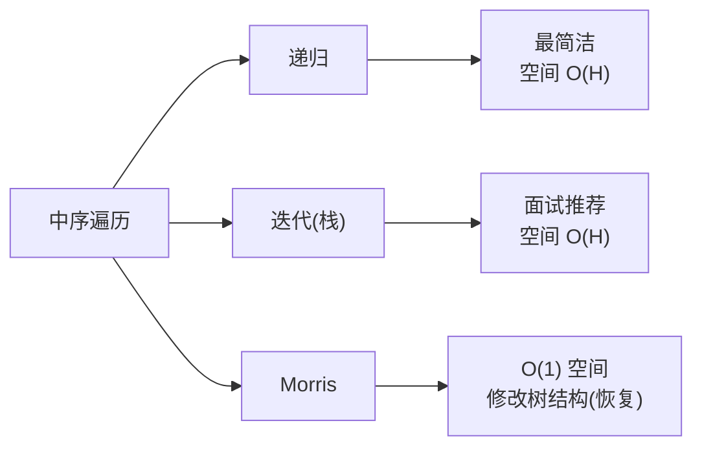

# E002 二叉树的中序遍历（Inorder Traversal）

> LeetCode 94 · ⭐ · 递归 / 迭代 / Morris
>
> BST 的中序遍历是严格递增序列，这是验证 BST 的基础。三种写法中，迭代版面试出现率最高。

---

## 01. 题目描述

给定二叉树的根节点 `root`，返回其节点值的**中序遍历**（左→根→右）。

**示例**：

```
输入：root = [1,null,2,3]
输出：[1,3,2]

    1
     \
      2
     /
    3
```

---

## 02. 题目分析

### 2.1 递归

```
递归左子树 → 访问根 → 递归右子树
```

一行改动即从前序变中序。

### 2.2 迭代（"一路向左"）

中序迭代比前序稍复杂：需要先一路向左走到底，弹栈访问，再转向右子树。

```
cur = root
while (cur != null || stack 非空):
    while (cur != null):       // 一路向左
        stack.push(cur)
        cur = cur.left
    cur = stack.pop()          // 弹栈访问
    访问 cur
    cur = cur.right            // 转向右子树
```

### 2.3 Morris（O(1) 空间）

利用空闲右指针建立临时线索。最节省空间，适合内存受限环境。

---

## 03. 解法一：递归

**Java**：
```java
public List<Integer> inorderTraversal(TreeNode root) {
    List<Integer> res = new ArrayList<>();
    dfs(root, res);
    return res;
}
void dfs(TreeNode node, List<Integer> res) {
    if (node == null) return;
    dfs(node.left, res);
    res.add(node.val);
    dfs(node.right, res);
}
```

**Python**：
```python
def inorderTraversal(self, root: Optional[TreeNode]) -> List[int]:
    def dfs(node):
        if not node: return
        dfs(node.left)
        res.append(node.val)
        dfs(node.right)
    res = []
    dfs(root)
    return res
```

**复杂度**：O(N) / O(H)。

---

## 04. 解法二：迭代（一路向左）

```java
public List<Integer> inorderTraversal(TreeNode root) {
    List<Integer> res = new ArrayList<>();
    Deque<TreeNode> stack = new ArrayDeque<>();
    TreeNode cur = root;
    while (cur != null || !stack.isEmpty()) {
        while (cur != null) {          // 一路向左走到尽头
            stack.push(cur);
            cur = cur.left;
        }
        cur = stack.pop();             // 弹栈访问
        res.add(cur.val);
        cur = cur.right;               // 转向右子树
    }
    return res;
}
```

**Python**：
```python
def inorderTraversal(self, root: Optional[TreeNode]) -> List[int]:
    res, stack, cur = [], [], root
    while stack or cur:
        while cur:
            stack.append(cur)
            cur = cur.left
        cur = stack.pop()
        res.append(cur.val)
        cur = cur.right
    return res
```

**C++**：
```cpp
vector<int> inorderTraversal(TreeNode* root) {
    vector<int> res;
    stack<TreeNode*> st;
    TreeNode* cur = root;
    while (cur || !st.empty()) {
        while (cur) { st.push(cur); cur = cur->left; }
        cur = st.top(); st.pop();
        res.push_back(cur->val);
        cur = cur->right;
    }
    return res;
}
```

**复杂度**：O(N) / O(H)。

---

## 05. 解法三：Morris 遍历（O(1) 空间）

核心思想：找到当前节点左子树的最右节点（前驱），将它的 `right` 指向当前节点作为"线索"。

```java
public List<Integer> inorderTraversal(TreeNode root) {
    List<Integer> res = new ArrayList<>();
    TreeNode cur = root;
    while (cur != null) {
        if (cur.left == null) {
            res.add(cur.val);            // 无左子树，直接访问
            cur = cur.right;
        } else {
            TreeNode pre = cur.left;
            while (pre.right != null && pre.right != cur)
                pre = pre.right;         // 找前驱
            if (pre.right == null) {     // 首次，建立线索
                pre.right = cur;
                cur = cur.left;
            } else {                     // 已线索化，恢复并访问
                pre.right = null;
                res.add(cur.val);        // 中序：恢复时访问
                cur = cur.right;
            }
        }
    }
    return res;
}
```

**复杂度**：O(N) / O(1)。每个节点最多被访问两次。

---

## 06. 总结



**核心应用**：BST 中序遍历 = 升序序列。

**相关题目**：[E001 前序遍历](E001-二叉树的前序遍历.md)、[E003 后序遍历](E003-二叉树的后序遍历.md)、[E013 验证BST](E013-验证二叉搜索树.md)
