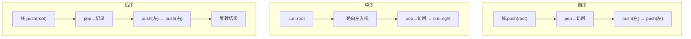

# E003 二叉树的后序遍历（Postorder Traversal）

> LeetCode 145 · ⭐ · 递归 / 迭代
>
> 后序（左→右→根）常用于自底向上的计算，如计算树的高度、直径、最大路径和。

---

## 01. 题目描述

给定二叉树的根节点 `root`，返回其节点值的**后序遍历**。

**示例**：

```
输入：root = [1,null,2,3]
输出：[3,2,1]

    1
     \
      2
     /
    3
```

---

## 02. 题目分析

### 2.1 迭代难点

前序和中序的迭代很自然——访问顺序与"压栈顺序"一致。后序是"左右根"，栈的 LIFO 特性导致我们不能直接输出。

### 2.2 巧妙解法：前序反转

```
后序（左→右→根）
= 前序（根→右→左）的反转
```

只需把前序迭代中的"先右后左"改成"先左后右"，最后反转结果即可！

### 2.3 解法对比

| 解法 | 时间 | 空间 | 难度 |
|------|:---:|:---:|:---:|
| 递归 | O(N) | O(H) | ⭐ |
| 前序反转 | O(N) | O(H) | ⭐⭐ |
| 栈+prev标记 | O(N) | O(H) | ⭐⭐⭐ |

---

## 03. 解法一：递归

```java
public List<Integer> postorderTraversal(TreeNode root) {
    List<Integer> res = new ArrayList<>();
    dfs(root, res);
    return res;
}
void dfs(TreeNode node, List<Integer> res) {
    if (node == null) return;
    dfs(node.left, res);
    dfs(node.right, res);
    res.add(node.val);         // 最后访问根
}
```

**复杂度**：O(N) / O(H)。

---

## 04. 解法二：前序反转（推荐）

### 4.1 思路

```
前序（根→右→左）+ 反转 = 后序（左→右→根）
```

前序迭代只需把"先右后左"换成"先左后右"，再加一步 `Collections.reverse(res)`。

### 4.2 代码

**Java**：
```java
public List<Integer> postorderTraversal(TreeNode root) {
    List<Integer> res = new ArrayList<>();
    if (root == null) return res;
    Deque<TreeNode> stack = new ArrayDeque<>();
    stack.push(root);
    while (!stack.isEmpty()) {
        TreeNode node = stack.pop();
        res.add(node.val);                 // 访问根
        if (node.left != null)  stack.push(node.left);  // 先左
        if (node.right != null) stack.push(node.right); // 后右
    }
    Collections.reverse(res);              // 反转 → 左-右-根
    return res;
}
```

**Python**：
```python
def postorderTraversal(self, root: Optional[TreeNode]) -> List[int]:
    if not root: return []
    stack, res = [root], []
    while stack:
        node = stack.pop()
        res.append(node.val)
        if node.left:  stack.append(node.left)
        if node.right: stack.append(node.right)
    return res[::-1]
```

**C++**：
```cpp
vector<int> postorderTraversal(TreeNode* root) {
    if (!root) return {};
    vector<int> res;
    stack<TreeNode*> st; st.push(root);
    while (!st.empty()) {
        TreeNode* node = st.top(); st.pop();
        res.push_back(node->val);
        if (node->left)  st.push(node->left);
        if (node->right) st.push(node->right);
    }
    reverse(res.begin(), res.end());
    return res;
}
```

**复杂度**：O(N) / O(H)。

---

## 05. 三种遍历迭代写法对比



| 遍历 | 栈操作 | 关键技巧 |
|------|--------|---------|
| 前序 | push(右)→push(左) | 直接输出 |
| 中序 | 一路向左入栈 | 弹栈后转右 |
| 后序 | push(左)→push(右)+反转 | 巧用前序变形 |

---

## 06. 总结

后序遍历的**前序反转法**不仅代码量少于传统解法，且记忆负担小——会写前序就会写后序。这是面试中最推荐的后序迭代写法。

**应用场景**：计算树高（需要先知道子树高度）、删除树（自底向上释放节点）。

**相关题目**：[E001 前序遍历](E001-二叉树的前序遍历.md)、[E002 中序遍历](E002-二叉树的中序遍历.md)、[E019 最大路径和](E019-二叉树中的最大路径和.md)
