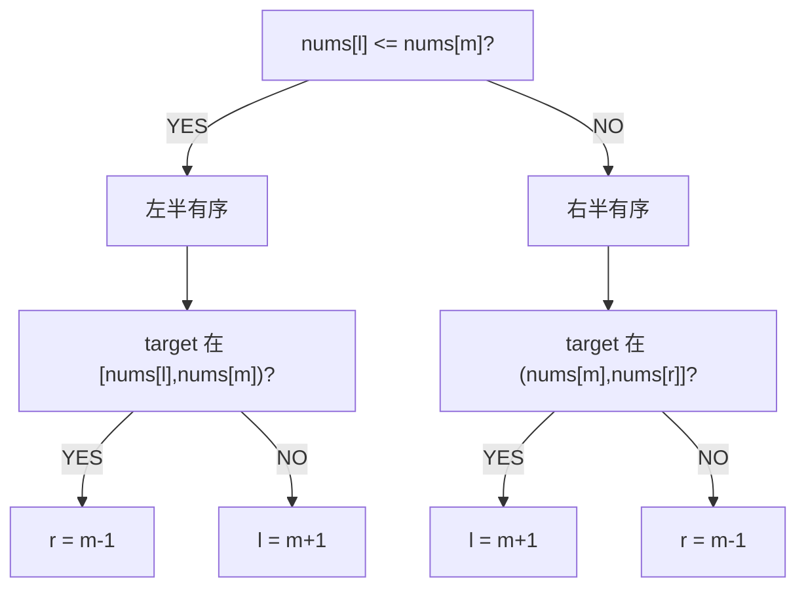

# H004 搜索旋转排序数组

> LeetCode 33 · ⭐⭐ · 转折点二分

## 01. 题目

旋转有序数组 `[4,5,6,7,0,1,2]` 中找 target=0 → 4。O(logN)。

## 02. 题目分析

### 核心洞察

旋转数组被 pivot 分成两段有序子数组。任意时刻 `nums[l..m]` 和 `nums[m..r]` **至少有一段是有序的**。检查 target 是否在有序段内，即可决定搜索方向。

### 判定流程



---

## 03. 代码

**Java**：
```java
public int search(int[] nums, int target) {
    int l = 0, r = nums.length - 1;
    while (l <= r) {
        int m = l + (r - l) / 2;
        if (nums[m] == target) return m;
        if (nums[l] <= nums[m]) {                     // 左半有序
            if (nums[l] <= target && target < nums[m]) r = m - 1;
            else l = m + 1;
        } else {                                       // 右半有序
            if (nums[m] < target && target <= nums[r]) l = m + 1;
            else r = m - 1;
        }
    }
    return -1;
}
```

**Python**：
```python
def search(self, nums, target):
    l, r = 0, len(nums) - 1
    while l <= r:
        m = (l + r) // 2
        if nums[m] == target: return m
        if nums[l] <= nums[m]:
            if nums[l] <= target < nums[m]: r = m - 1
            else: l = m + 1
        else:
            if nums[m] < target <= nums[r]: l = m + 1
            else: r = m - 1
    return -1
```

**C++**：
```cpp
int search(vector<int>& nums, int target) {
    int l = 0, r = nums.size() - 1;
    while (l <= r) {
        int m = l + (r - l) / 2;
        if (nums[m] == target) return m;
        if (nums[l] <= nums[m]) {
            if (nums[l] <= target && target < nums[m]) r = m - 1;
            else l = m + 1;
        } else {
            if (nums[m] < target && target <= nums[r]) l = m + 1;
            else r = m - 1;
        }
    }
    return -1;
}
```

**复杂度**：O(logN)/O(1)。

---

## 04. 总结

旋转数组二分的本质：**每次迭代中至少有一半是有序的**。判断 target 是否落在有序的那一半，即可缩小搜索范围。

**相关题目**：[H005 搜索旋转数组II](H005-搜索旋转排序数组II.md)、[H006 寻找旋转排序数组中的最小值](H006-寻找旋转排序数组中的最小值.md)
