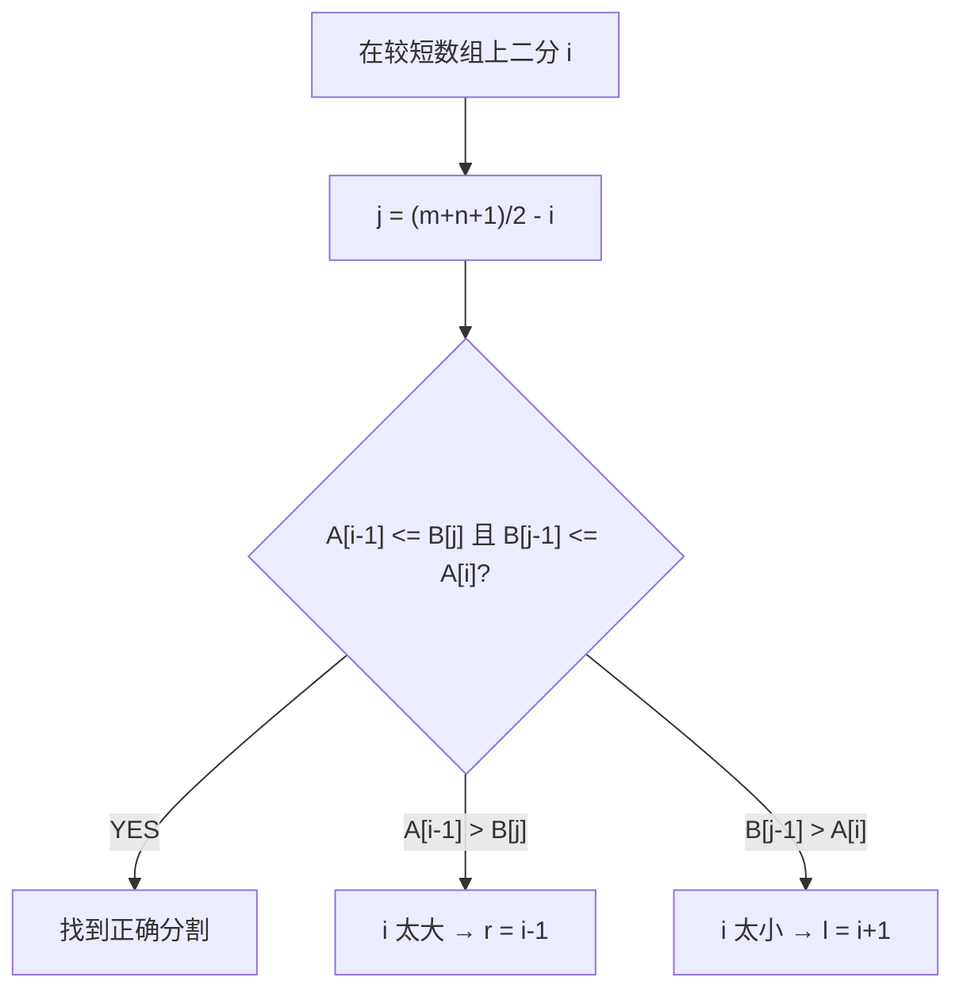

# H008 寻找两个正序数组的中位数

> LeetCode 4 · ⭐⭐⭐ · 二分找第K小

## 01. 题目

`nums1=[1,3], nums2=[2]` → 中位数 2.0。要求 O(log(min(m,n)))。

## 02. 题目分析

### 2.1 问题转化

中位数 = 找第 k 小的元素，其中 k = (m+n+1)/2（奇数）或 k 与 k+1 的平均（偶数）。

### 2.2 核心思路：在较短数组上二分

假设 i 是 nums1 的分割位置，则 j = (m+n+1)/2 - i 是 nums2 的分割位置。满足：

$$\text{nums1}[i-1] \le \text{nums2}[j] \quad\text{且}\quad \text{nums2}[j-1] \le \text{nums1}[i]$$

```
nums1:  ... A[i-1] | A[i] ...
nums2:  ... B[j-1] | B[j] ...
        ←左半部分→ | ←右半部分→
```

对较短数组二分查找 i，使得分割条件成立。



---

## 03. 代码

**Java**：
```java
public double findMedianSortedArrays(int[] A, int[] B) {
    if (A.length > B.length) return findMedianSortedArrays(B, A);
    int m = A.length, n = B.length;
    int half = (m + n + 1) / 2;
    int l = 0, r = m;
    while (l <= r) {
        int i = l + (r - l) / 2;
        int j = half - i;
        int Aleft  = i == 0 ? Integer.MIN_VALUE : A[i - 1];
        int Aright = i == m ? Integer.MAX_VALUE : A[i];
        int Bleft  = j == 0 ? Integer.MIN_VALUE : B[j - 1];
        int Bright = j == n ? Integer.MAX_VALUE : B[j];
        if (Aleft <= Bright && Bleft <= Aright) {
            if ((m + n) % 2 == 1) return Math.max(Aleft, Bleft);
            return (Math.max(Aleft, Bleft) + Math.min(Aright, Bright)) / 2.0;
        } else if (Aleft > Bright) r = i - 1;
        else l = i + 1;
    }
    return 0;
}
```

**Python**：
```python
def findMedianSortedArrays(self, A: List[int], B: List[int]) -> float:
    if len(A) > len(B): A, B = B, A
    m, n = len(A), len(B)
    half = (m + n + 1) // 2
    l, r = 0, m
    while l <= r:
        i = (l + r) // 2
        j = half - i
        A_left  = A[i-1] if i > 0 else float('-inf')
        A_right = A[i]   if i < m else float('inf')
        B_left  = B[j-1] if j > 0 else float('-inf')
        B_right = B[j]   if j < n else float('inf')
        if A_left <= B_right and B_left <= A_right:
            if (m + n) % 2: return max(A_left, B_left)
            return (max(A_left, B_left) + min(A_right, B_right)) / 2
        elif A_left > B_right: r = i - 1
        else: l = i + 1
```

**复杂度**：O(log(min(m,n))) / O(1)。

---

## 04. 总结

此题是二分查找的"天花板"——不是找某个具体值，而是**找分割位置**。核心技巧：在较短数组上二分，长数组的分割位置自然确定。

**相关题目**：[H001 基础二分](H001-二分查找.md)、[F001 第K大元素](F001-数组中的第K个最大元素.md)
