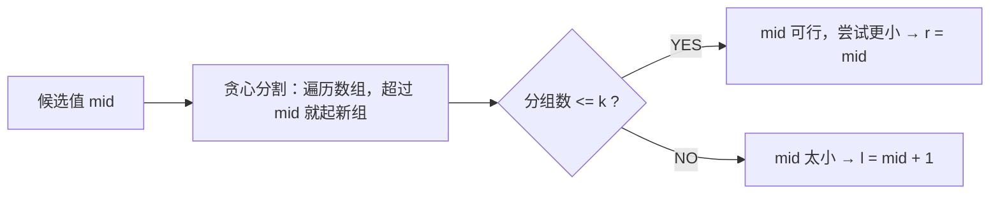

# H010 分割数组的最大值

> LeetCode 410 · ⭐⭐⭐ · 二分答案

## 01. 题目

`nums=[7,2,5,10,8], k=2` → 18（分为 `[7,2,5]` 和 `[10,8]`，最大和 18 最小）。

## 02. 题目分析

### "二分答案"范式

答案在 `[max(nums), sum(nums)]` 之间。对候选答案 `mid`，判断能否用 ≤k 个子数组实现。



---

## 03. 代码

**Java**：
```java
public int splitArray(int[] nums, int k) {
    int l = 0, r = 0;
    for (int n : nums) { l = Math.max(l, n); r += n; }
    while (l < r) {
        int mid = l + (r - l) / 2;
        int sum = 0, cnt = 1;
        for (int n : nums) {
            if (sum + n > mid) { cnt++; sum = 0; }
            sum += n;
        }
        if (cnt <= k) r = mid;
        else l = mid + 1;
    }
    return l;
}
```

**Python**：
```python
def splitArray(self, nums: List[int], k: int) -> int:
    def can(mid):
        cnt, s = 1, 0
        for x in nums:
            if s + x > mid: cnt += 1; s = 0
            s += x
        return cnt <= k
    l, r = max(nums), sum(nums)
    while l < r:
        m = (l + r) // 2
        if can(m): r = m
        else: l = m + 1
    return l
```

**C++**：
```cpp
int splitArray(vector<int>& nums, int k) {
    int l = *max_element(nums.begin(), nums.end());
    int r = accumulate(nums.begin(), nums.end(), 0);
    auto can = [&](int mid) {
        int cnt = 1, sum = 0;
        for (int x : nums) { if (sum + x > mid) { cnt++; sum = 0; } sum += x; }
        return cnt <= k;
    };
    while (l < r) { int m = l + (r - l) / 2; can(m) ? (r = m) : (l = m + 1); }
    return l;
}
```

**复杂度**：O(NlogSum)。

---

## 04. 总结

**二分答案**是一种强大的优化范式：把"求最优值"转化为"判断某个值是否可行"，然后用二分逼近。适用条件：答案区间**单调**（更大的值一定更容易满足条件）。

**相关题目**：[H009 平方根](H009-x的平方根.md)
