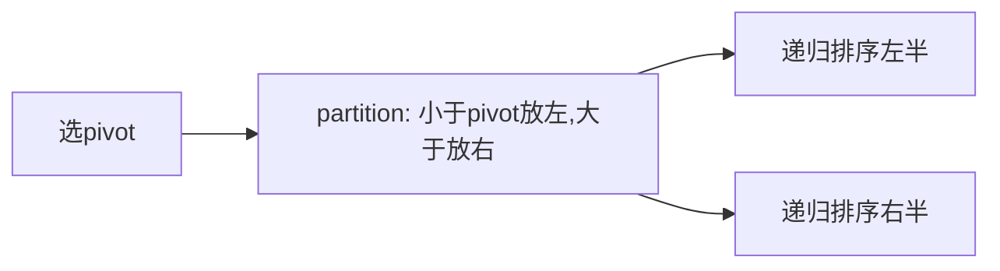

# J001 快速排序（Quick Sort）

> 手写必考 · ⭐⭐ · 分区+递归
>
> 平均 O(NlogN)，最坏 O(N²)（有序数组不随机选 pivot）。Java 的 `Arrays.sort()` 对基本类型用双轴快排。

## 01. 题目

手写快速排序，将数组升序排列。

## 02. 题目分析



### 核心：partition

选择 `nums[r]` 作为 pivot。指针 `i` 标记"小于 pivot 区的末尾"。遍历 `j`，遇到 `≤pivot` 就 swap 到 i 位置。

## 03. 代码

**Java**：
```java
void quickSort(int[] nums, int l, int r) {
    if (l >= r) return;
    int p = partition(nums, l, r);
    quickSort(nums, l, p - 1);
    quickSort(nums, p + 1, r);
}
int partition(int[] nums, int l, int r) {
    int pivot = nums[r], i = l;
    for (int j = l; j < r; j++)
        if (nums[j] <= pivot) swap(nums, i++, j);
    swap(nums, i, r);
    return i;
}
void swap(int[] a, int i, int j) { int t = a[i]; a[i] = a[j]; a[j] = t; }
```

**Python**：
```python
def quickSort(self, nums, l, r):
    if l >= r: return
    p = self.partition(nums, l, r)
    self.quickSort(nums, l, p-1)
    self.quickSort(nums, p+1, r)

def partition(self, nums, l, r):
    pivot, i = nums[r], l
    for j in range(l, r):
        if nums[j] <= pivot: nums[i], nums[j] = nums[j], nums[i]; i += 1
    nums[i], nums[r] = nums[r], nums[i]
    return i
```

**C++**：
```cpp
int partition(vector<int>& a, int l, int r) {
    int pivot = a[r], i = l;
    for (int j = l; j < r; j++)
        if (a[j] <= pivot) swap(a[i++], a[j]);
    swap(a[i], a[r]); return i;
}
void quickSort(vector<int>& a, int l, int r) {
    if (l >= r) return; int p = partition(a, l, r);
    quickSort(a, l, p-1); quickSort(a, p+1, r);
}
```

**复杂度**：时间 O(NlogN) 平均 / O(N²) 最坏，空间 O(logN) 栈。

### 优化方向

| 优化 | 方法 |
|------|------|
| 随机化 pivot | `swap(nums[r], nums[rand(l,r)])` |
| 三数取中 | pivot 取 l/m/r 的中位数 |
| 三路快排 | 处理大量重复元素 |

**相关题目**：[J002 归并排序](J002-归并排序.md)、[A011 荷兰国旗](A011-颜色分类.md)、[F001 第K大元素](F001-数组中的第K个最大元素.md)
