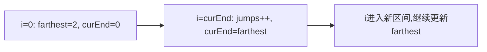

# L002 跳跃游戏 II（Jump Game II）

> LeetCode 45 · ⭐⭐ · 贪心
>
> 每次跳跃选择能到达的最远位置，用 `curEnd` 标记当前跳跃边界。

## 01. 题目

`[2,3,1,1,4]` → 2（0→1→4）。

## 02. 题目分析



```
nums = [2,3,1,1,4]

i=0: farthest=2, i==curEnd(0) → jumps=1, curEnd=2
i=1: farthest=4, i!=curEnd → 继续
i=2: i==curEnd(2) → jumps=2, curEnd=4 ≥ n-1 → 结束
```

## 03. 代码

**Java**：
```java
public int jump(int[] nums) {
    int jumps = 0, curEnd = 0, farthest = 0;
    for (int i = 0; i < nums.length - 1; i++) {
        farthest = Math.max(farthest, i + nums[i]);
        if (i == curEnd) { jumps++; curEnd = farthest; }
    }
    return jumps;
}
```

**Python**：
```python
def jump(self, nums: List[int]) -> int:
    jumps = cur_end = farthest = 0
    for i in range(len(nums) - 1):
        farthest = max(farthest, i + nums[i])
        if i == cur_end: jumps += 1; cur_end = farthest
    return jumps
```

**复杂度**：O(N)/O(1)。

**相关**：[L001 跳跃游戏](L001-跳跃游戏.md)
