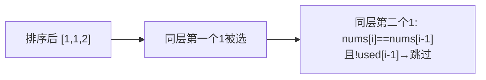

# M002 全排列 II（含重复）

> LeetCode 47 · ⭐⭐ · 回溯+排序去重

## 01. 题目

`nums = [1,1,2]` → `[[1,1,2],[1,2,1],[2,1,1]]`

## 02. 题目分析

### 去重核心

**排序** + 跳过条件：`i > 0 && nums[i] == nums[i-1] && !used[i-1]`。

`!used[i-1]` 保证同层去重（非同一树枝的重复使用）。



## 03. 代码

**Java**：
```java
public List<List<Integer>> permuteUnique(int[] nums) {
    Arrays.sort(nums);
    List<List<Integer>> res = new ArrayList<>();
    backtrack(nums, new ArrayList<>(), new boolean[nums.length], res);
    return res;
}
void backtrack(int[] nums, List<Integer> path, boolean[] used, List<List<Integer>> res) {
    if (path.size() == nums.length) { res.add(new ArrayList<>(path)); return; }
    for (int i = 0; i < nums.length; i++) {
        if (used[i] || (i > 0 && nums[i] == nums[i-1] && !used[i-1])) continue;
        path.add(nums[i]); used[i] = true;
        backtrack(nums, path, used, res);
        path.remove(path.size()-1); used[i] = false;
    }
}
```

**Python**：
```python
def permuteUnique(self, nums):
    nums.sort()
    res = []
    def dfs(path, used):
        if len(path) == len(nums): res.append(path[:]); return
        for i in range(len(nums)):
            if used[i] or (i > 0 and nums[i] == nums[i-1] and not used[i-1]): continue
            used[i] = True; path.append(nums[i])
            dfs(path, used)
            path.pop(); used[i] = False
    dfs([], [False] * len(nums))
    return res
```

**复杂度**：O(N·N!)/O(N)。

---

## 04. 总结

| 去重类型 | 条件 | 含义 |
|---------|------|------|
| 全排列去重 | `!used[i-1]` | 同一层不去重，同位置重复才去 |
| 子集/组合去重 | `i > start` | 同一层起始位置后重复元素跳过 |

**相关题目**：[M001 全排列](M001-全排列.md)、[M004 子集II](M004-子集II.md)
