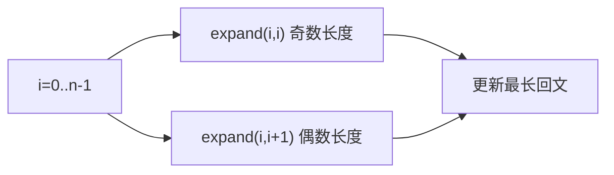

# N017 最长回文子串

> LeetCode 5 · ⭐⭐ · 中心扩展 / 区间DP
>
> 两种解法覆盖回文串的所有考察维度。中心扩展是面试首选。

## 01. 题目

`s="babad"` → `"bab"` (或 `"aba"`)

## 02. 题目分析

### 解法对比

| 解法 | 时间 | 空间 | 思路 |
|------|:---:|:---:|------|
| 中心扩展 | O(N²) | O(1) | 每个位置向两边扩展 |
| 区间DP | O(N²) | O(N²) | `dp[i][j]=dp[i+1][j-1] && s[i]==s[j]` |

### 中心扩展法

从每个位置（奇数长度）和每两个位置之间（偶数长度）向两边扩展。



---

## 03. 解法一：中心扩展（推荐）

**Java**：
```java
public String longestPalindrome(String s) {
    int n = s.length(), start = 0, max = 0;
    for (int i = 0; i < n; i++) {
        int len1 = expand(s, i, i);       // 奇数
        int len2 = expand(s, i, i + 1);    // 偶数
        int len = Math.max(len1, len2);
        if (len > max) { max = len; start = i - (len - 1) / 2; }
    }
    return s.substring(start, start + max);
}
int expand(String s, int l, int r) {
    while (l >= 0 && r < s.length() && s.charAt(l) == s.charAt(r)) { l--; r++; }
    return r - l - 1;
}
```

**Python**：
```python
def longestPalindrome(self, s: str) -> str:
    n, start, max_len = len(s), 0, 0
    def expand(l, r):
        while l >= 0 and r < n and s[l] == s[r]: l -= 1; r += 1
        return r - l - 1
    for i in range(n):
        l = max(expand(i, i), expand(i, i + 1))
        if l > max_len: max_len = l; start = i - (l - 1) // 2
    return s[start:start + max_len]
```

**C++**：
```cpp
string longestPalindrome(string s) {
    int n = s.size(), start = 0, maxLen = 0;
    auto expand = [&](int l, int r) {
        while (l >= 0 && r < n && s[l] == s[r]) { l--; r++; }
        return r - l - 1;
    };
    for (int i = 0; i < n; i++) {
        int len = max(expand(i, i), expand(i, i + 1));
        if (len > maxLen) { maxLen = len; start = i - (len - 1) / 2; }
    }
    return s.substr(start, maxLen);
}
```

**复杂度**：O(N²)/O(1)。

---

## 04. 解法二：区间 DP

```java
public String longestPalindromeDP(String s) {
    int n = s.length(), start = 0, max = 1;
    boolean[][] dp = new boolean[n][n];
    for (int i = n - 1; i >= 0; i--)  // 从后往前
        for (int j = i; j < n; j++) {
            if (s.charAt(i) == s.charAt(j) && (j - i <= 2 || dp[i+1][j-1])) {
                dp[i][j] = true;
                if (j - i + 1 > max) { max = j - i + 1; start = i; }
            }
        }
    return s.substring(start, start + max);
}
```

---

## 05. 总结

**中心扩展**比 DP 更优（O(1) 空间），是回文串问题的最佳实践。

**相关题目**：[N018 回文子串个数](N018-回文子串.md)
