## B001 反转链表（Reverse Linked List）

> LeetCode 206 · ⭐ · 指针操作 / 递归
>
> 链表操作的"Hello World"。迭代和递归两种写法必须烂熟于心。这道题的美妙在于：4 行迭代代码蕴含了链表指针操作的全部精髓。


### 01. 题目描述

反转一个单链表。

**示例**：

```
输入：1 → 2 → 3 → 4 → 5 → NULL
输出：5 → 4 → 3 → 2 → 1 → NULL
```

**进阶**：分别用迭代和递归实现。


### 02. 题目分析：指针翻转的本质

**2.1 核心操作**

链表的反转本质是**逐个翻转每个节点的 `next` 指针方向**：

```
原链表：  prev  ←  curr  →  next
                  ↓
反转后：  prev  ←  curr  ←  next
```

**2.2 为什么需要三个指针？**

| 指针 | 作用 | 丢失后果 |
|------|------|---------|
| `prev` | 当前节点应指向的新方向 | — |
| `curr` | 正在处理的节点 | — |
| `next` | 暂存下一个节点 | 丢失后半条链！ |

关键：改方向前**必须先保存 next**，否则断链。

**2.3 解法概览**

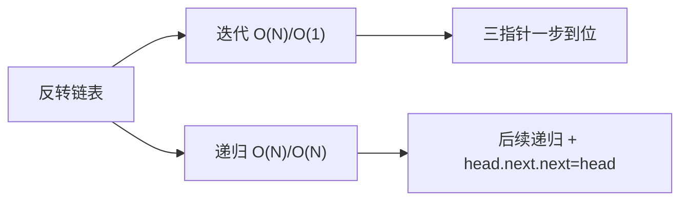


### 03. 解法一：迭代（三指针）

**3.1 手推演示**

```
初始：prev=null, curr=1
      1 → 2 → 3 → null

第1步：next=2, 1.next=null(prev), prev=1, curr=2
      1 → null    2 → 3 → null

第2步：next=3, 2.next=1(prev), prev=2, curr=3
      2 → 1 → null    3 → null

第3步：next=null, 3.next=2(prev), prev=3, curr=null
      3 → 2 → 1 → null

curr=null → 结束，返回 prev(3)
```

**3.2 代码**

**Java**：
```java
public ListNode reverseList(ListNode head) {
    ListNode prev = null, curr = head;
    while (curr != null) {
        ListNode next = curr.next;   // ① 暂存下一个
        curr.next = prev;            // ② 翻转指针
        prev = curr;                 // ③ prev 前进
        curr = next;                 // ④ curr 前进
    }
    return prev;
}
```

**Python**：
```python
def reverseList(self, head: Optional[ListNode]) -> Optional[ListNode]:
    prev, cur = None, head
    while cur:
        nxt = cur.next
        cur.next = prev
        prev, cur = cur, nxt
    return prev
```

**C++**：
```cpp
ListNode* reverseList(ListNode* head) {
    ListNode *prev = nullptr, *cur = head;
    while (cur) {
        ListNode *nxt = cur->next;
        cur->next = prev;
        prev = cur; cur = nxt;
    }
    return prev;
}
```

**复杂度**：时间 O(N)，一次遍历。空间 O(1)，仅三个指针变量。


### 04. 解法二：递归

**4.1 递归思路**

不要试图"在脑中展开递归调用栈"。从语义理解：

```
reverseList(head) = 反转以 head 为头的链表，返回新头
```

递归到最后一个节点，逐层让 `head.next.next = head`（让后一个节点指回自己）。

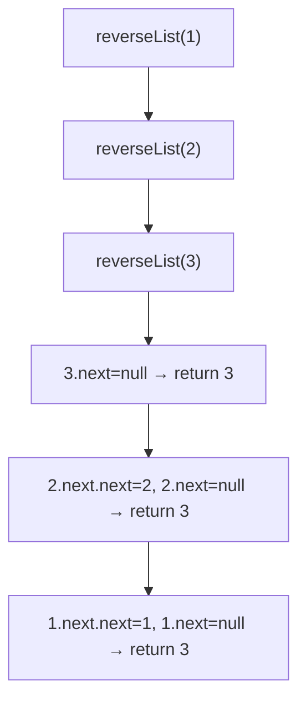

**4.2 代码**

**Java**：
```java
public ListNode reverseList(ListNode head) {
    if (head == null || head.next == null) return head;   // 终止
    ListNode newHead = reverseList(head.next);             // 递归反转后续
    head.next.next = head;                                 // 后指回前
    head.next = null;                                      // 断开原链
    return newHead;
}
```

**Python**：
```python
def reverseList(self, head: Optional[ListNode]) -> Optional[ListNode]:
    if not head or not head.next: return head
    new_head = self.reverseList(head.next)
    head.next.next = head
    head.next = None
    return new_head
```

**C++**：
```cpp
ListNode* reverseList(ListNode* head) {
    if (!head || !head.next) return head;
    ListNode* newHead = reverseList(head->next);
    head->next->next = head;
    head->next = nullptr;
    return newHead;
}
```

**复杂度**：时间 O(N)，空间 O(N)（递归栈深度）。


### 05. 两解法对比

| 维度 | 迭代 | 递归 |
|------|:---:|:---:|
| 时间复杂度 | O(N) | O(N) |
| 空间复杂度 | **O(1)** | O(N) |
| 代码行数 | 8 行 | 7 行 |
| 栈溢出风险 | 无 | **长链表易溢出** |
| 思维难度 | ⭐⭐ | ⭐⭐⭐ |
| 面试推荐 | **首选** | 加分项 |


### 06. 总结

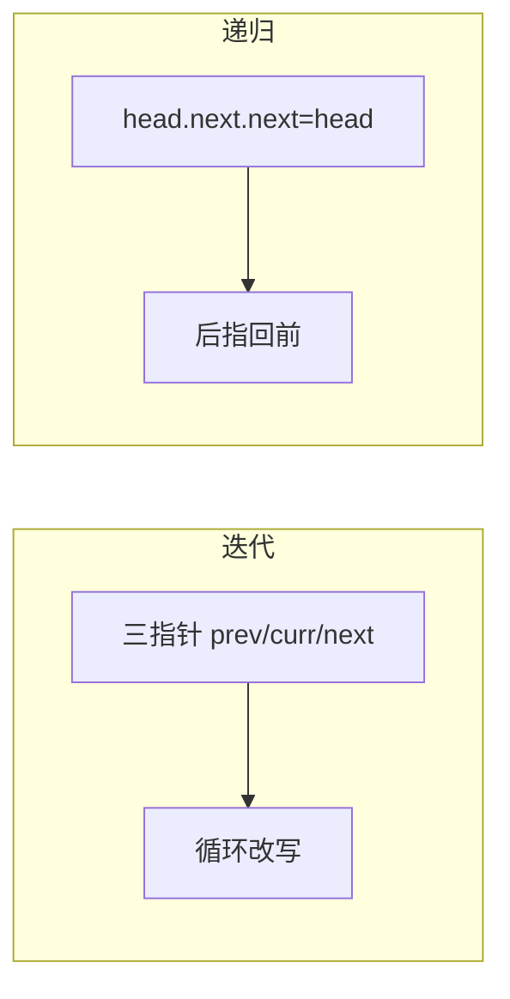

| 核心启示 | 说明 |
|---------|------|
| 三指针法 | prev/curr/next 是链表操作的黄金搭档 |
| 先存后改 | 改指针前必须先保存 next，防止断链 |
| 递归语义 | 相信递归——它返回的是已反转的后续链表 |
| 反转是基础 | B002/B003/B010/B014 都依赖反转操作 |

**相关题目**：[B002 反转链表II](002-B-反转链表II.md)、[B003 K个一组翻转](003-B-K个一组翻转链表.md)


## B002 反转链表 II（区间反转）

> LeetCode 92 · ⭐⭐ · 穿针引线（头插法）

### 01. 题目

`1→2→3→4→5, left=2, right=4` → `1→4→3→2→5`

### 02. 题目分析

**头插法（穿针引线）**

核心思路：固定 `pre` 指向 left 前驱，然后每次把 `cur.next` 插入到 `pre` 后面。

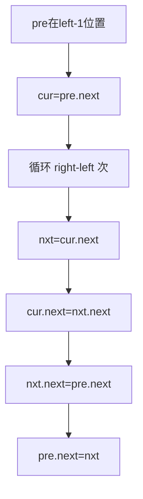

**手推演示**

```
dummy→1→2→3→4→5, left=2, right=4

pre=1, cur=2

轮1: nxt=3, cur.next=4, nxt.next=pre.next=2, pre.next=3
     dummy→1→3→2→4→5

轮2: nxt=4, cur.next=5, nxt.next=pre.next=3, pre.next=4
     dummy→1→4→3→2→5  ← 完成！
```

### 03. 代码

**Java**：
```java
public ListNode reverseBetween(ListNode head, int left, int right) {
    ListNode dummy = new ListNode(0, head);
    ListNode pre = dummy;
    for (int i = 1; i < left; i++) pre = pre.next;   // 走到 left-1
    ListNode cur = pre.next;
    for (int i = 0; i < right - left; i++) {
        ListNode nxt = cur.next;
        cur.next = nxt.next;
        nxt.next = pre.next;
        pre.next = nxt;
    }
    return dummy.next;
}
```

**Python**：
```python
def reverseBetween(self, head, left, right):
    dummy = ListNode(0, head); pre = dummy
    for _ in range(left - 1): pre = pre.next
    cur = pre.next
    for _ in range(right - left):
        nxt = cur.next; cur.next = nxt.next
        nxt.next = pre.next; pre.next = nxt
    return dummy.next
```

**C++**：
```cpp
ListNode* reverseBetween(ListNode* head, int left, int right) {
    ListNode dummy(0, head), *pre = &dummy;
    for (int i = 1; i < left; i++) pre = pre->next;
    ListNode *cur = pre->next;
    for (int i = 0; i < right - left; i++) {
        ListNode *nxt = cur->next; cur->next = nxt->next;
        nxt->next = pre->next; pre->next = nxt;
    }
    return dummy.next;
}
```

**复杂度**：O(N)/O(1)。

### 04. B001/B002/B003 对比

| | B001 全反转 | B002 区间 | B003 K组 |
|------|:---:|:---:|:---:|
| 方法 | 三指针 | **头插法** | 分组+B001 |
| 核心 | prev/cur/next | 插到pre后 | 判别长度+反转 |

**相关**：[B001 反转链表](001-B-反转链表.md)、[B003 K组](003-B-K个一组翻转链表.md)


## B003 K 个一组翻转链表

> LeetCode 25 · ⭐⭐⭐ · 分组反转

### 01. 题目

`1→2→3→4→5, k=2` → `2→1→4→3→5`；`k=3` → `3→2→1→4→5`

### 02. 题目分析

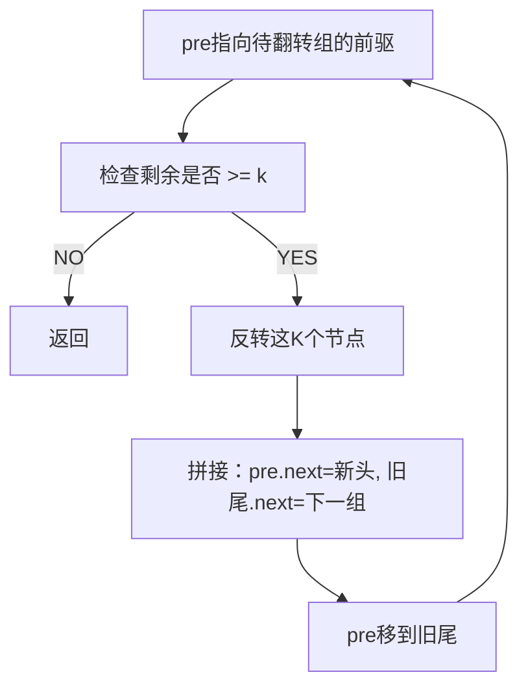

### 03. 代码

**Java**：
```java
public ListNode reverseKGroup(ListNode head, int k) {
    ListNode dummy = new ListNode(0, head), pre = dummy;
    while (head != null) {
        ListNode tail = pre;
        for (int i = 0; i < k; i++) {     // ① 检查是否够K个
            tail = tail.next;
            if (tail == null) return dummy.next;
        }
        ListNode nxt = tail.next;          // ② 暂存下一组头
        ListNode[] rev = reverse(head, tail);
        pre.next = rev[0];                 // ③ 接新头
        rev[1].next = nxt;                 // ④ 旧尾接下一组
        pre = rev[1];                      // ⑤ 移动pre
        head = nxt;
    }
    return dummy.next;
}
ListNode[] reverse(ListNode head, ListNode tail) {
    ListNode prev = tail.next, cur = head;
    while (prev != tail) {
        ListNode nxt = cur.next; cur.next = prev; prev = cur; cur = nxt;
    }
    return new ListNode[]{tail, head};
}
```

**Python**：
```python
def reverseKGroup(self, head, k):
    def reverse(h, t):
        prev, cur = t.next, h
        while prev != t: nxt = cur.next; cur.next = prev; prev = cur; cur = nxt
        return t, h
    dummy = ListNode(0, head); pre = dummy
    while head:
        tail = pre
        for _ in range(k):
            tail = tail.next
            if not tail: return dummy.next
        nxt = tail.next; h, t = reverse(head, tail)
        pre.next = h; t.next = nxt; pre = t; head = nxt
    return dummy.next
```

**复杂度**：O(N)/O(1)。

**相关**：[B001 反转链表](001-B-反转链表.md)


## B004 环形链表 / B005 环形链表 II（找入口）

> LeetCode 141/142 · ⭐/⭐⭐ · 快慢指针（Floyd 判圈算法）

### B004 环形链表 (141)

**01. 题目**

判断链表是否有环。`3→2→0→-4→2↺` → true。

**02. 题目分析**

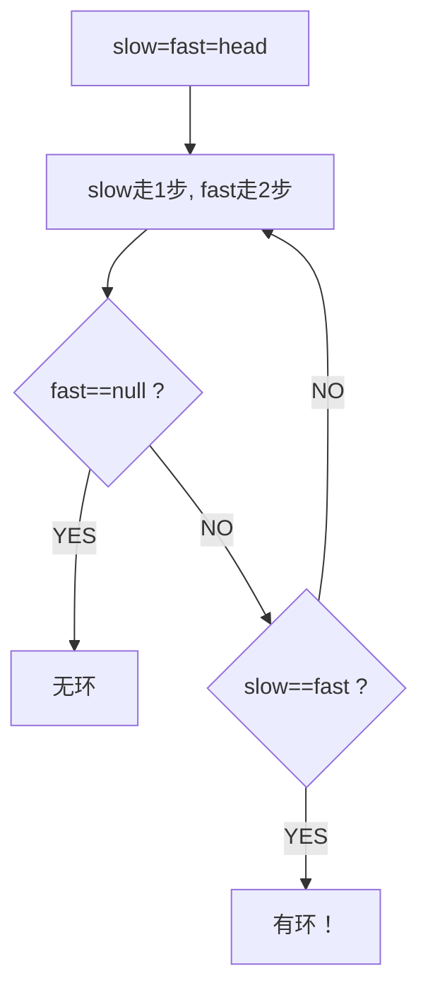

**为什么快指针一定追得上慢指针？** fast 每次比 slow 多走 1 步，两者距离每次缩小 1——必相遇。

**03. 代码**

```java
public boolean hasCycle(ListNode head) {
    ListNode slow = head, fast = head;
    while (fast != null && fast.next != null) {
        slow = slow.next; fast = fast.next.next;
        if (slow == fast) return true;
    }
    return false;
}
```

**Python**：
```python
def hasCycle(self, head): slow=fast=head; return any((slow:=slow.next, fast:=fast.next.next)[-1]==slow for _ in iter(int,1) if fast and fast.next) or False
```

**复杂度**：O(N)/O(1)。


### B005 环形链表 II（找环入口）(142)

**01. 题目**

返回环的入口节点。无环返回 null。

**02. 题目分析：三步走**

```
步骤1：快慢指针找相遇点（同 B004）
步骤2：一个指针从 head 出发，一个从相遇点出发
步骤3：两指针同步前进，相遇处即为环入口
```

**数学证明**

设 head→入口距离 `a`，入口→相遇点距离 `b`，相遇点→入口距离 `c`（环长 = b+c）。

```
慢指针路程 = a + b
快指针路程 = a + b + n(b+c) = 2(a+b)
→ a = c + (n-1)(b+c)
→ a 和 c 相差整数倍环长
→ head 出发和相遇点出发，同步前进，必在入口相遇
```

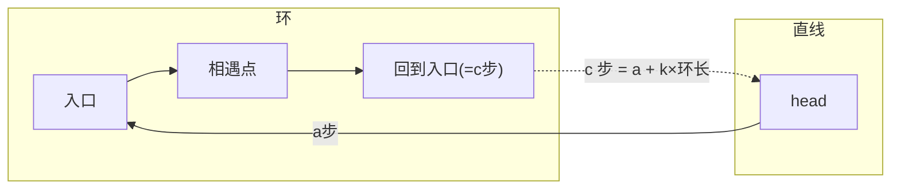

**03. 代码**

**Java**：
```java
public ListNode detectCycle(ListNode head) {
    ListNode slow = head, fast = head;
    while (fast != null && fast.next != null) {
        slow = slow.next; fast = fast.next.next;
        if (slow == fast) {
            ListNode p = head;
            while (p != slow) { p = p.next; slow = slow.next; }
            return p;
        }
    }
    return null;
}
```

**Python**：
```python
def detectCycle(self, head):
    slow = fast = head
    while fast and fast.next:
        slow, fast = slow.next, fast.next.next
        if slow == fast:
            p = head
            while p != slow: p, slow = p.next, slow.next
            return p
    return None
```

**C++**：
```cpp
ListNode *detectCycle(ListNode *head) {
    ListNode *slow=head,*fast=head;
    while(fast&&fast->next){ slow=slow->next; fast=fast->next->next; if(slow==fast){ ListNode *p=head; while(p!=slow){ p=p->next; slow=slow->next; } return p; } }
    return nullptr;
}
```

**复杂度**：O(N)/O(1)。

**04. 快慢指针题型总结**

| 题目 | 快慢指针用途 |
|------|------------|
| B004 | 判环（相遇即true） |
| B005 | 找环入口（数学推导） |
| B010 | 回文链表（找中点+反转） |
| B011 | 排序链表（找中点分割） |
| B014 | 重排链表（找中点） |

**相关**：[B010 回文链表](010-B-回文链表.md)、[B014 重排链表](014-B-重排链表.md)


## B005 环形链表 II（找环入口）

> LeetCode 142 · ⭐⭐ · 快慢指针+数学推导

### 01. 题目

如果有环，返回环的入口节点；无环返回 null。

### 02. 题目分析

**三步走**

```
步骤1：快慢指针找相遇点（同 B004）
步骤2：一个指针从 head 出发，一个从相遇点出发
步骤3：两指针同步前进，相遇处即为入口
```

**数学证明**

设 head→入口距离 `a`，入口→相遇点距离 `b`，相遇点→入口距离 `c`。

```
慢指针路程 = a + b
快指针路程 = a + b + n(b+c) = 2(a+b)
→ a = c + (n-1)(b+c)
→ a 和 c 相差整数倍环长
→ head 出发和相遇点出发，相遇在入口
```

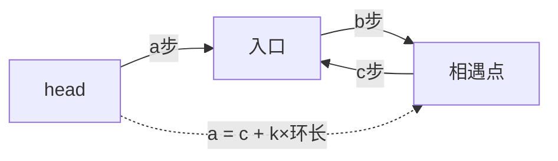

### 03. 代码

**Java**：
```java
public ListNode detectCycle(ListNode head) {
    ListNode slow = head, fast = head;
    while (fast != null && fast.next != null) {
        slow = slow.next; fast = fast.next.next;
        if (slow == fast) {
            ListNode p = head;
            while (p != slow) { p = p.next; slow = slow.next; }
            return p;
        }
    }
    return null;
}
```

**Python**：
```python
def detectCycle(self, head):
    slow = fast = head
    while fast and fast.next:
        slow, fast = slow.next, fast.next.next
        if slow == fast:
            p = head
            while p != slow: p, slow = p.next, slow.next
            return p
    return None
```

**C++**：
```cpp
ListNode *detectCycle(ListNode *head) {
    ListNode *slow=head,*fast=head;
    while(fast&&fast->next){
        slow=slow->next; fast=fast->next->next;
        if(slow==fast){ ListNode *p=head; while(p!=slow){ p=p->next; slow=slow->next; } return p; }
    }
    return nullptr;
}
```

**复杂度**：O(N)/O(1)。

### 04. 总结

| 核心 | 说明 |
|------|------|
| Floyd判圈 | slow走1步, fast走2步, 有环必相遇 |
| 入口公式 | a = c + k(b+c)，两指针同步走 |
| O(1)空间 | 不需哈希表，纯指针操作 |

**相关**：[B004 环形链表](004-B-环形链表.md)


## B006 合并两个有序链表 / B007 合并 K 个升序链表

> LeetCode 21/23 · ⭐/⭐⭐⭐ · 归并 / 优先队列

### B006 合并两个有序链表 (21)

**01. 题目**

`1→2→4, 1→3→4` → `1→1→2→3→4→4`

**02. 分析**

两条有序链表的归并——dummy 节点的经典应用。每次比较两链表头部，取较小的接到结果链。

**03. 代码**

**Java**：
```java
public ListNode mergeTwoLists(ListNode l1, ListNode l2) {
    ListNode dummy = new ListNode(0), cur = dummy;
    while (l1 != null && l2 != null) {
        if (l1.val < l2.val) { cur.next = l1; l1 = l1.next; }
        else { cur.next = l2; l2 = l2.next; }
        cur = cur.next;
    }
    cur.next = l1 != null ? l1 : l2;   // 拼接剩余
    return dummy.next;
}
```

**Python**：
```python
def mergeTwoLists(self, l1, l2):
    dummy = cur = ListNode(0)
    while l1 and l2:
        if l1.val < l2.val: cur.next = l1; l1 = l1.next
        else: cur.next = l2; l2 = l2.next
        cur = cur.next
    cur.next = l1 or l2
    return dummy.next
```

**C++**：
```cpp
ListNode* mergeTwoLists(ListNode* l1, ListNode* l2) {
    ListNode dummy(0), *cur = &dummy;
    while (l1 && l2) {
        if (l1->val < l2->val) { cur->next = l1; l1 = l1->next; }
        else { cur->next = l2; l2 = l2->next; }
        cur = cur->next;
    }
    cur->next = l1 ? l1 : l2;
    return dummy.next;
}
```

**复杂度**：O(m+n)/O(1)。


### B007 合并 K 个升序链表 (23)

**01. 题目**

K 个有序链表，合并为一个有序链表。

**02. 解法对比**

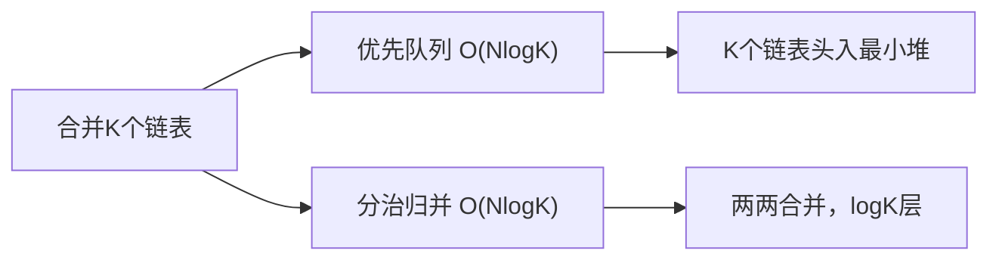

| 解法 | 时间 | 空间 | 思路 |
|------|:---:|:---:|------|
| 优先队列 | O(NlogK) | O(K) | 最小堆维护K个链表头 |
| 分治归并 | O(NlogK) | O(logK) | 递归两两合并 |

**解法一：优先队列**

```java
public ListNode mergeKLists(ListNode[] lists) {
    PriorityQueue<ListNode> pq = new PriorityQueue<>((a, b) -> a.val - b.val);
    for (ListNode node : lists) if (node != null) pq.offer(node);
    ListNode dummy = new ListNode(0), cur = dummy;
    while (!pq.isEmpty()) {
        ListNode min = pq.poll();
        cur.next = min; cur = cur.next;
        if (min.next != null) pq.offer(min.next);
    }
    return dummy.next;
}
```

**Python**：
```python
def mergeKLists(self, lists):
    from heapq import heappush, heappop
    ListNode.__lt__ = lambda self, o: self.val < o.val
    heap = []; [heappush(heap, n) for n in lists if n]
    dummy = cur = ListNode(0)
    while heap:
        node = heappop(heap); cur.next = node; cur = cur.next
        if node.next: heappush(heap, node.next)
    return dummy.next
```

**解法二：分治归并**

```java
public ListNode mergeKLists(ListNode[] lists) {
    if (lists.length == 0) return null;
    return divide(lists, 0, lists.length - 1);
}
ListNode divide(ListNode[] lists, int l, int r) {
    if (l == r) return lists[l];
    int m = (l + r) / 2;
    return mergeTwo(divide(lists, l, m), divide(lists, m + 1, r));
}
```

**03. 总结**

| 核心启示 | 说明 |
|---------|------|
| dummy 节点 | 简化头节点处理，所有链表题的基础技巧 |
| 最小堆 | K 路归并的标准解法 |
| 分治 | "合并两个" 复用——化 K 为 2 的递归公式 |

**相关**：[B011 排序链表](011-B-排序链表.md)


## B008 删除链表的倒数第 N 个结点

> LeetCode 19 · ⭐⭐ · 前后指针

### 01. 题目

`1→2→3→4→5, n=2` → `1→2→3→5`（删除倒数第2个即节点4）

### 02. 题目分析

**前后指针**

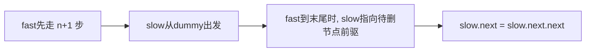

**为什么是 n+1 步？**

因为我们需要 `slow` 指向待删节点的**前驱**。

```
dummy → 1 → 2 → 3 → 4 → 5 → null, n=2

fast先走 3 步: dummy → 1 → 2 → 3
                 slow              fast
同步前进直到fast=null:
                 1 → 2 → 3 → 4 → 5 → null
                             slow        fast
slow指向3, slow.next=4 (待删), slow.next.next=5
```

### 03. 代码

**Java**：
```java
public ListNode removeNthFromEnd(ListNode head, int n) {
    ListNode dummy = new ListNode(0, head);
    ListNode fast = dummy, slow = dummy;
    for (int i = 0; i <= n; i++) fast = fast.next;   // 快指针先走 n+1
    while (fast != null) { fast = fast.next; slow = slow.next; }
    slow.next = slow.next.next;
    return dummy.next;
}
```

**Python**：
```python
def removeNthFromEnd(self, head, n):
    dummy = ListNode(0, head)
    fast = slow = dummy
    for _ in range(n + 1): fast = fast.next
    while fast: fast = fast.next; slow = slow.next
    slow.next = slow.next.next
    return dummy.next
```

**C++**：
```cpp
ListNode* removeNthFromEnd(ListNode* head, int n) {
    ListNode dummy(0, head);
    ListNode *fast = &dummy, *slow = &dummy;
    for (int i = 0; i <= n; i++) fast = fast->next;
    while (fast) { fast = fast->next; slow = slow->next; }
    slow->next = slow->next->next;
    return dummy.next;
}
```

**复杂度**：O(N)/O(1)。

### 04. 总结

| 核心要点 | 说明 |
|---------|------|
| fast 先走 n+1 步 | 确保 slow 停在待删节点的前驱 |
| dummy 节点 | 处理删除头节点的边界情况 |
| 前后指针 | 固定间距的同步移动，链表题高频技巧 |

**相关**：[B009 相交链表](009-B-相交链表.md)


## B009 相交链表（Intersection of Two Linked Lists）

> LeetCode 160 · ⭐ · 双指针
>
> 6 行代码解决一道经典题。"各走 A+B 长度"是链表题的优雅巅峰。

### 01. 题目描述

找出两个单链表相交的起始节点。不相交返回 null。

```
A:  a1 → a2 ↘
              c1 → c2 → c3
B:  b1 → b2 → b3 ↗

输出：c1
```

### 02. 题目分析

**2.1 为什么各走 A+B 长度会相遇？**

```
pA 走完 A 后切换到 B 头
pB 走完 B 后切换到 A 头

总路程：
  pA = A + B = 相交前A + 共用段 + 相交前B + 共用段
  pB = B + A = 相交前B + 共用段 + 相交前A + 共用段

到达相交点时，两者路程相同 → 同时到达！
```

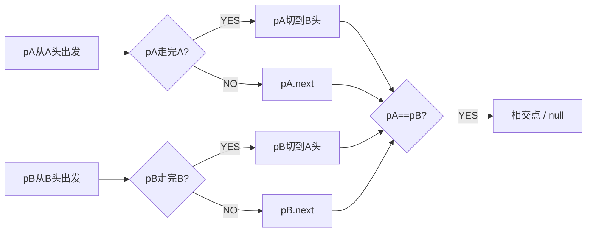

**2.2 不相交的情况**

两指针各走 A+B 步后同时到达 null——`pA == pB == null`，循环退出。

### 03. 代码

**Java**：
```java
public ListNode getIntersectionNode(ListNode headA, ListNode headB) {
    ListNode pA = headA, pB = headB;
    while (pA != pB) {
        pA = pA == null ? headB : pA.next;
        pB = pB == null ? headA : pB.next;
    }
    return pA;
}
```

**Python**：
```python
def getIntersectionNode(self, headA, headB):
    pA, pB = headA, headB
    while pA != pB:
        pA = pA.next if pA else headB
        pB = pB.next if pB else headA
    return pA
```

**C++**：
```cpp
ListNode *getIntersectionNode(ListNode *headA, ListNode *headB) {
    ListNode *pA = headA, *pB = headB;
    while (pA != pB) {
        pA = pA ? pA->next : headB;
        pB = pB ? pB->next : headA;
    }
    return pA;
}
```

**复杂度**：时间 O(m+n)，空间 O(1)。

### 04. 总结

| 核心启示 | 说明 |
|---------|------|
| 消除长度差 | 通过"切换链表"使两指针走相同总路程 |
| 优雅 | 6 行代码，不需要计算长度差 |
| 场景 | 处理链表"对齐"问题的通用技巧 |

**相关**：[B008 删除倒数第N个](008-B-删除链表的倒数第N个结点.md)


## B010 回文链表（Palindrome Linked List）

> LeetCode 234 · ⭐ · 快慢指针+反转

### 01. 题目

`1→2→2→1` → true。O(N) 时间 O(1) 空间。

### 02. 题目分析

三步组合拳：①快慢找中点 ②反转后半段 ③双指针比较。

```
1→2→2→1

找中点: slow走到第二个2 (奇数时走到中点+1)
反转后半: 1→2→2←1
比较: 1==1, 2==2 → true
```

### 03. 代码

**Java**：
```java
public boolean isPalindrome(ListNode head) {
    ListNode slow = head, fast = head;
    while (fast != null && fast.next != null) { slow=slow.next; fast=fast.next.next; }
    ListNode right = reverse(slow), left = head;
    while (right != null) {
        if (left.val != right.val) return false;
        left = left.next; right = right.next;
    }
    return true;
}
ListNode reverse(ListNode head) {
    ListNode prev = null;
    while (head != null) { ListNode nxt=head.next; head.next=prev; prev=head; head=nxt; }
    return prev;
}
```

**Python**：
```python
def isPalindrome(self, head):
    slow = fast = head; rev = None
    while fast and fast.next: slow, fast = slow.next, fast.next.next
    while slow: nxt = slow.next; slow.next = rev; rev = slow; slow = nxt
    while rev:
        if head.val != rev.val: return False
        head, rev = head.next, rev.next
    return True
```

**复杂度**：O(N)/O(1)。

**相关**：[B001 反转链表](001-B-反转链表.md)、[B004 环形链表](004-B-环形链表.md)


## B011 排序链表（Sort List）

> LeetCode 148 · ⭐⭐ · 归并排序 O(NlogN)/O(1)

### 01. 题目

对链表排序。要求 O(NlogN) 时间、O(1) 空间。

### 02. 题目分析

**为什么选归并？**

| 排序 | 链表适用？ | 原因 |
|------|:---:|------|
| 快排 | 勉强 | 链表不支持随机访问 |
| 归并 | **最适合** | 链表天然可分可合 |
| 堆排 | 不适合 | 需要随机访问建堆 |

**归并步骤**

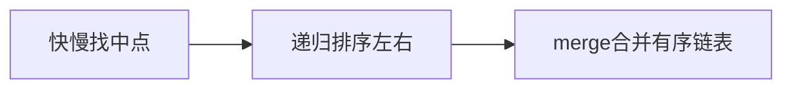

### 03. 代码

**Java**：
```java
public ListNode sortList(ListNode head) {
    if (head == null || head.next == null) return head;
    ListNode mid = findMid(head);
    ListNode right = mid.next; mid.next = null;
    return merge(sortList(head), sortList(right));
}
ListNode findMid(ListNode head) {
    ListNode slow = head, fast = head.next;  // fast初始多一步，使mid偏左
    while (fast != null && fast.next != null) { slow = slow.next; fast = fast.next.next; }
    return slow;
}
ListNode merge(ListNode a, ListNode b) {
    ListNode dummy = new ListNode(0), cur = dummy;
    while (a != null && b != null) {
        if (a.val < b.val) { cur.next = a; a = a.next; }
        else { cur.next = b; b = b.next; }
        cur = cur.next;
    }
    cur.next = a != null ? a : b;
    return dummy.next;
}
```

**Python**：
```python
def sortList(self, head):
    if not head or not head.next: return head
    slow, fast = head, head.next
    while fast and fast.next: slow, fast = slow.next, fast.next.next
    mid, slow.next = slow.next, None
    return self.merge(self.sortList(head), self.sortList(mid))
def merge(self, a, b):
    dummy = cur = ListNode(0)
    while a and b:
        if a.val < b.val: cur.next = a; a = a.next
        else: cur.next = b; b = b.next
        cur = cur.next
    cur.next = a or b
    return dummy.next
```

**复杂度**：O(NlogN)/O(logN)（递归栈）。

### 04. 总结

链表的归并排序比数组更自然——不需要额外数组空间。`findMid` 的 fast 初始偏移技巧保证分割均匀。

**相关**：[B006 合并有序](006-B-合并两个有序链表.md)


## B012 复制带随机指针的链表（Clone with Random）

> LeetCode 138 · ⭐⭐ · 节点交错 O(1) 空间

### 01. 题目

深拷贝链表，每个节点有 `next` 和 `random` 两个指针。

### 02. 题目分析

**解法对比**

| 解法 | 空间 | 思路 |
|------|:---:|------|
| 哈希映射 | O(N) | `Map<OldNode, NewNode>` |
| **节点交错** | **O(1)** | 每个原节点后插入克隆节点 |

**交错法三步**


### 03. 代码（交错法 O(1)空间）

**Java**：
```java
public Node copyRandomList(Node head) {
    if (head == null) return null;
    // ① 每个原节点后插入克隆
    for (Node cur = head; cur != null; cur = cur.next.next) {
        Node clone = new Node(cur.val); clone.next = cur.next; cur.next = clone;
    }
    // ② 设置 random
    for (Node cur = head; cur != null; cur = cur.next.next)
        if (cur.random != null) cur.next.random = cur.random.next;
    // ③ 拆分
    Node newHead = head.next;
    for (Node cur = head; cur != null; cur = cur.next) {
        Node clone = cur.next; cur.next = clone.next;
        if (clone.next != null) clone.next = clone.next.next;
    }
    return newHead;
}
```

**Python**：
```python
def copyRandomList(self, head):
    if not head: return None
    cur = head
    while cur:
        clone = Node(cur.val); clone.next = cur.next; cur.next = clone; cur = clone.next
    cur = head
    while cur:
        if cur.random: cur.next.random = cur.random.next
        cur = cur.next.next
    old, new, newHead = head, head.next, head.next
    while old:
        old.next = old.next.next; new.next = new.next.next if new.next else None
        old, new = old.next, new.next
    return newHead
```

**复杂度**：O(N)/O(1)。

**相关**：[B011 排序链表](011-B-排序链表.md)


## B013 两数相加（Add Two Numbers）

> LeetCode 2 · ⭐⭐ · 模拟进位

### 01. 题目

两个逆序链表各表示一个非负整数，返回和的链表。`(2→4→3) + (5→6→4)` = `7→0→8`（342+465=807）

### 02. 题目分析

逐位相加，处理进位。while 续条件：`l1!=null || l2!=null || carry>0`。

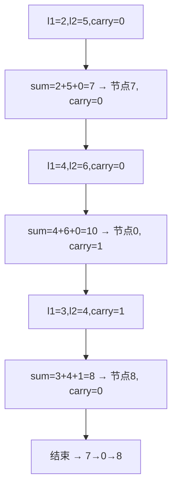

### 03. 代码

**Java**：
```java
public ListNode addTwoNumbers(ListNode l1, ListNode l2) {
    ListNode dummy = new ListNode(0), cur = dummy;
    int carry = 0;
    while (l1 != null || l2 != null || carry > 0) {
        int sum = carry + (l1 != null ? l1.val : 0) + (l2 != null ? l2.val : 0);
        cur.next = new ListNode(sum % 10);
        carry = sum / 10;
        cur = cur.next;
        if (l1 != null) l1 = l1.next;
        if (l2 != null) l2 = l2.next;
    }
    return dummy.next;
}
```

**Python**：
```python
def addTwoNumbers(self, l1, l2):
    dummy = cur = ListNode(0); carry = 0
    while l1 or l2 or carry:
        s = carry + (l1.val if l1 else 0) + (l2.val if l2 else 0)
        cur.next = ListNode(s % 10); carry = s // 10; cur = cur.next
        l1 = l1.next if l1 else None; l2 = l2.next if l2 else None
    return dummy.next
```

**C++**：
```cpp
ListNode* addTwoNumbers(ListNode* l1, ListNode* l2) {
    ListNode dummy(0), *cur = &dummy; int carry = 0;
    while (l1 || l2 || carry) {
        int s = carry + (l1?l1->val:0) + (l2?l2->val:0);
        cur->next = new ListNode(s % 10); carry = s / 10; cur = cur->next;
        if (l1) l1 = l1->next; if (l2) l2 = l2->next;
    }
    return dummy.next;
}
```

**复杂度**：O(max(m,n))/O(max(m,n))。

**相关**：[A019 字符串相乘](A019-字符串相乘.md)


## B014 重排链表（Reorder List）

> LeetCode 143 · ⭐⭐ · 找中点+反转+合并

### 01. 题目

`L0→L1→...→Ln` 重排为 `L0→Ln→L1→Ln-1→...`

### 02. 题目分析

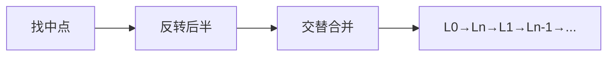

三个基础操作串联：B004 找中点 + B001 反转 + B006 合并。此题展示了链表操作如何像搭积木一样组合。

### 03. 代码

**Java**：
```java
public void reorderList(ListNode head) {
    if (head == null || head.next == null) return;
    // 1. 找中点
    ListNode slow = head, fast = head;
    while (fast != null && fast.next != null) { slow = slow.next; fast = fast.next.next; }
    // 2. 反转后半
    ListNode prev = null, cur = slow.next; slow.next = null;
    while (cur != null) { ListNode nxt = cur.next; cur.next = prev; prev = cur; cur = nxt; }
    // 3. 交替合并
    ListNode p1 = head, p2 = prev;
    while (p2 != null) {
        ListNode n1 = p1.next, n2 = p2.next;
        p1.next = p2; p2.next = n1; p1 = n1; p2 = n2;
    }
}
```

**Python**：
```python
def reorderList(self, head):
    if not head or not head.next: return
    slow = fast = head
    while fast and fast.next: slow, fast = slow.next, fast.next.next
    prev, cur = None, slow.next; slow.next = None
    while cur: nxt = cur.next; cur.next = prev; prev = cur; cur = nxt
    p1, p2 = head, prev
    while p2: n1, n2 = p1.next, p2.next; p1.next = p2; p2.next = n1; p1 = n1; p2 = n2
```

**复杂度**：O(N)/O(1)。

**相关**：[B001 反转链表](001-B-反转链表.md)、[B006 合并有序](006-B-合并两个有序链表.md)


## B015 LRU 缓存（LRU Cache）

> LeetCode 146 · ⭐⭐ · 哈希+双向链表
>
> 面试最常考的设计题，没有之一。两个数据结构取长补短——HashMap 保证 O(1) 查找，双向链表保证 O(1) 插入/删除/移位。这道题考察的是"组合数据结构"的设计思维。


### 01. 题目描述

设计 LRU（最近最少使用）缓存。支持：

- `get(key)` → 存在返回值并标记为"最近使用"，否则返回 -1
- `put(key, value)` → 若存在则更新；若容量满则淘汰"最久未使用"的

**示例**：

```
LRUCache cache = new LRUCache(2);
cache.put(1, 1);
cache.put(2, 2);
cache.get(1);       // 返回 1
cache.put(3, 3);    // 淘汰 key=2
cache.get(2);       // 返回 -1
```

**约束**：`get` 和 `put` 必须 O(1)。


### 02. 题目分析

**2.1 数据结构选型**

| 操作 | HashMap | 双向链表 | 组合后 |
|------|:---:|:---:|:---:|
| 查找 | O(1) | O(N) | **O(1)** (HashMap) |
| 插入 | O(1) | O(1) | **O(1)** (链表) |
| 删除 | O(1) | O(1) | **O(1)** (链表) |
| 移到头部 | 不支持 | O(1) | **O(1)** (链表) |

HashMap 存 `key → Node` 映射；双向链表维护访问顺序（头部=最近，尾部=最久）。

**2.2 操作流程**

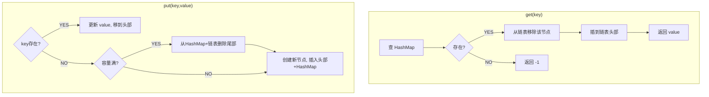

**2.3 哨兵节点的妙用**

头尾各一个 dummy 节点，避免了空链表判断和边界条件处理。

```
head(dummy) ↔ 最近使用 ↔ ... ↔ 最久使用 ↔ tail(dummy)
```


### 03. 解法一：手写双向链表+HashMap

**Java**：
```java
class LRUCache {
    class Node { int key, val; Node prev, next; Node(int k, int v) { key=k; val=v; } }

    Map<Integer, Node> map = new HashMap<>();
    Node head = new Node(0, 0), tail = new Node(0, 0);
    int cap;

    public LRUCache(int capacity) {
        cap = capacity;
        head.next = tail; tail.prev = head;
    }

    public int get(int key) {
        if (!map.containsKey(key)) return -1;
        Node node = map.get(key);
        remove(node); addHead(node);       // 移到头部
        return node.val;
    }

    public void put(int key, int value) {
        if (map.containsKey(key)) {
            remove(map.get(key));           // 移除旧节点
        } else if (map.size() == cap) {
            map.remove(tail.prev.key);      // HashMap 也删
            remove(tail.prev);              // 淘汰最久未用
        }
        Node node = new Node(key, value);
        map.put(key, node); addHead(node);
    }

    void remove(Node node) { node.prev.next = node.next; node.next.prev = node.prev; }
    void addHead(Node node) { node.next = head.next; node.prev = head; head.next.prev = node; head.next = node; }
}
```

**Python**：
```python
class Node:
    def __init__(self, k=0, v=0): self.key, self.val = k, v

class LRUCache:
    def __init__(self, cap):
        self.cap = cap; self.map = {}
        self.head = Node(); self.tail = Node()
        self.head.next = self.tail; self.tail.prev = self.head

    def get(self, key):
        if key not in self.map: return -1
        node = self.map[key]
        self._remove(node); self._add_head(node)
        return node.val

    def put(self, key, value):
        if key in self.map: self._remove(self.map[key])
        elif len(self.map) == self.cap:
            del self.map[self.tail.prev.key]
            self._remove(self.tail.prev)
        node = Node(key, value)
        self.map[key] = node; self._add_head(node)

    def _remove(self, node): node.prev.next = node.next; node.next.prev = node.prev
    def _add_head(self, node): node.next = self.head.next; node.prev = self.head; self.head.next.prev = node; self.head.next = node
```

**C++**：
```cpp
class LRUCache {
    struct Node { int key, val; Node *prev, *next; Node(int k=0, int v=0):key(k),val(v),prev(nullptr),next(nullptr){} };
    unordered_map<int, Node*> mp;
    Node *head, *tail; int cap;
public:
    LRUCache(int c) : cap(c) { head=new Node(); tail=new Node(); head->next=tail; tail->prev=head; }
    int get(int k) {
        if(!mp.count(k)) return -1;
        Node *n=mp[k]; remove(n); addHead(n); return n->val;
    }
    void put(int k, int v) {
        if(mp.count(k)){ remove(mp[k]); }
        else if(mp.size()==cap){ mp.erase(tail->prev->key); remove(tail->prev); }
        Node *n=new Node(k,v); mp[k]=n; addHead(n);
    }
    void remove(Node *n){ n->prev->next=n->next; n->next->prev=n->prev; }
    void addHead(Node *n){ n->next=head->next; n->prev=head; head->next->prev=n; head->next=n; }
};
```

**复杂度**：`get` 和 `put` 均 O(1)。


### 04. 解法二：Java LinkedHashMap（API 实现）

```java
class LRUCache extends LinkedHashMap<Integer, Integer> {
    int cap;
    LRUCache(int c) { super(c, 0.75f, true); cap = c; }
    int get(int k) { return super.getOrDefault(k, -1); }
    void put(int k, int v) { super.put(k, v); }
    @Override protected boolean removeEldestEntry(Map.Entry e) { return size() > cap; }
}
```


### 05. LRU 改进与延伸

| 变体 | 改进点 |
|------|--------|
| LRU-K | 记录最近 K 次访问，防一次性扫描污染缓存 |
| LFU | 按访问频率淘汰，而非最近性 |
| 2Q | 两级队列：刚进入放 hot queue，频繁访问的晋升 |


### 06. 总结

| 核心启示 | 说明 |
|---------|------|
| 组合数据结构 | HashMap 解决"查"，双向链表解决"序" |
| 哨兵节点 | dummy head/tail 极大简化边界处理 |
| O(1) 操作 | remove + addHead 两个原子操作组合出 get/put |
| 工业应用 | Redis 内存淘汰、操作系统页面置换、CDN 缓存 |

**相关题目**：[B001 反转链表](001-B-反转链表.md)


