# 有效的括号（Valid Parentheses）

> LeetCode 20 · ⭐ · 栈匹配

## 01. 题目

`"()[]{}"` → true, `"([)]"` → false。括号必须用同类型闭合且顺序正确。

## 02. 题目分析

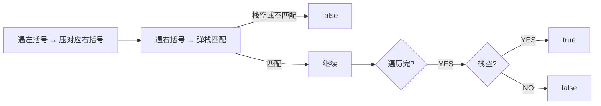

**技巧**：遇 `([{` 时，不压左括号而压对应的右括号。这样遇 `)]}` 时直接 `pop()==c` 即可，不用查表。

## 03. 代码

**Java**：
```java
public boolean isValid(String s) {
    Deque<Character> stack = new ArrayDeque<>();
    for (char c : s.toCharArray()) {
        if (c == '(') stack.push(')');
        else if (c == '[') stack.push(']');
        else if (c == '{') stack.push('}');
        else if (stack.isEmpty() || stack.pop() != c) return false;
    }
    return stack.isEmpty();
}
```

**Python**：
```python
def isValid(self, s):
    stack, pair = [], {')': '(', ']': '[', '}': '{'}
    for c in s:
        if c in '([{': stack.append(c)
        elif not stack or stack.pop() != pair[c]: return False
    return not stack
```

**C++**：
```cpp
bool isValid(string s) { stack<char> st; for(char c:s){ if(c=='(') st.push(')'); else if(c=='[') st.push(']'); else if(c=='{') st.push('}'); else if(st.empty()||st.top()!=c) return false; else st.pop(); } return st.empty(); }
```

**复杂度**：O(N)/O(N)。

## 04. 思维延伸

**括号匹配的本质是"最近未闭合"——栈的 LIFO 恰好匹配这个语义。这是为什么栈是括号匹配的天然数据结构。**

**相关**：[037 最长有效括号](037.最长有效括号.md)、[038 括号生成](038.括号生成.md)

---

# 最长有效括号（Longest Valid Parentheses）

> LeetCode 32 · ⭐⭐⭐ · 栈 / DP
>
> "最长 + 有效"——双重条件叠加的经典问题。栈解法中，**栈底存最后一个未匹配的右括号下标**是神来之笔。

---

## 01. 题目描述

找出最长有效括号子串的长度。

**示例**：

```
输入：s = "(()"
输出：2  ("()")

输入：s = ")()())"
输出：4  ("()()")

输入：s = ""
输出：0
```

---

## 02. 题目分析

### 2.1 核心问题

有效括号 = `左括号和右括号正确匹配` + `位置连续`。

与 C001"有效的括号"不同之处：C001 只需要判断整个串是否有效，这里需要找"最长的有效子串"。

### 2.2 解法概览

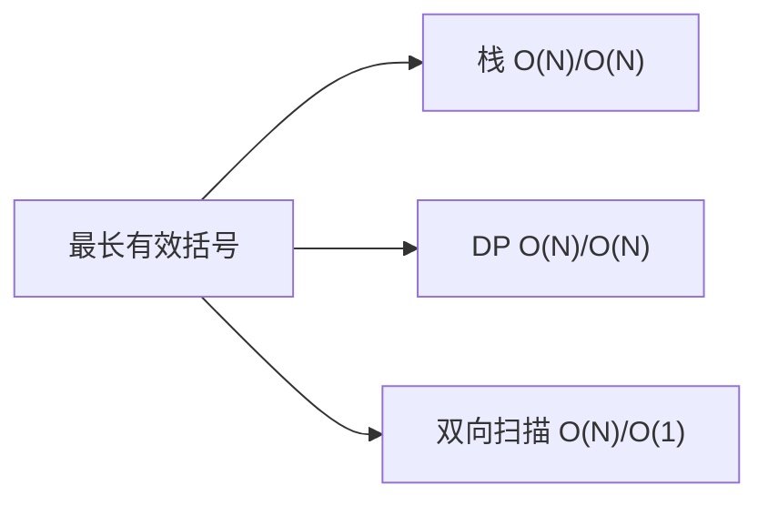

---

## 03. 解法一：栈（存下标）

### 3.1 核心技巧

栈底永远存"最后一个未匹配的右括号下标"。初始化为 -1（虚拟的"未匹配右括号"）。

```
遇 '('：下标入栈
遇 ')'：先弹栈
  - 弹后栈空 → 当前 ')' 未匹配 → 存它的下标
  - 弹后非空 → 当前有效长度 = i - 栈顶
```

### 3.2 手推演示

```
s = ")()())", 栈初始 = [-1]

i=0,')': 弹-1,栈空 → 存0             栈: [0],  max=0
i=1,'(': 入栈1                        栈: [0,1], max=0
i=2,')': 弹1,非空 → 2-0=2            栈: [0],   max=2
i=3,'(': 入栈3                        栈: [0,3], max=2
i=4,')': 弹3,非空 → 4-0=4            栈: [0],   max=4
i=5,')': 弹0,栈空 → 存5             栈: [5],   max=4

答案: 4  ("()()")
```

### 3.3 代码

**Java**：
```java
public int longestValidParentheses(String s) {
    Deque<Integer> stack = new ArrayDeque<>();
    stack.push(-1);
    int max = 0;
    for (int i = 0; i < s.length(); i++) {
        if (s.charAt(i) == '(') {
            stack.push(i);
        } else {
            stack.pop();
            if (stack.isEmpty()) stack.push(i);
            else max = Math.max(max, i - stack.peek());
        }
    }
    return max;
}
```

**Python**：
```python
def longestValidParentheses(self, s: str) -> int:
    stack, mx = [-1], 0
    for i, c in enumerate(s):
        if c == '(': stack.append(i)
        else:
            stack.pop()
            if not stack: stack.append(i)
            else: mx = max(mx, i - stack[-1])
    return mx
```

**C++**：
```cpp
int longestValidParentheses(string s) {
    stack<int> st; st.push(-1); int mx=0;
    for(int i=0;i<s.size();i++){
        if(s[i]=='(') st.push(i);
        else{ st.pop(); if(st.empty()) st.push(i); else mx=max(mx,i-st.top()); }
    }
    return mx;
}
```

**复杂度**：O(N)/O(N)。

---

## 04. 解法二：DP

`dp[i]`：以 i 结尾的最长有效括号长度。

两种转移：
- `s[i]==')' && s[i-1]=='('` → `dp[i] = dp[i-2] + 2`（...() 模式）
- `s[i]==')' && s[i-1]==')'` → 检查 `i-dp[i-1]-1` 是否为 `(`

**Java**：
```java
public int longestValidParentheses(String s) {
    int n = s.length(), max = 0;
    int[] dp = new int[n];
    for (int i = 1; i < n; i++) {
        if (s.charAt(i) == ')') {
            if (s.charAt(i - 1) == '(') {
                dp[i] = (i >= 2 ? dp[i - 2] : 0) + 2;
            } else {
                int j = i - dp[i - 1] - 1;
                if (j >= 0 && s.charAt(j) == '(')
                    dp[i] = dp[i - 1] + 2 + (j >= 1 ? dp[j - 1] : 0);
            }
            max = Math.max(max, dp[i]);
        }
    }
    return max;
}
```

## 05. 解法三：双向扫描（O(1)空间）

从左到右：遇 `(` left++，遇 `)` right++。left==right 时更新。right>left 时归零。
再从右到左同样逻辑。

---

## 06. 三解法对比

| 维度 | 栈 | DP | 双向扫描 |
|------|:---:|:---:|:---:|
| 时间 | O(N) | O(N) | O(N) |
| 空间 | O(N) | O(N) | **O(1)** |
| 直观性 | ⭐⭐⭐ | ⭐⭐ | ⭐⭐⭐⭐ |
| 面试推荐 | ✅ 首选 | 加分项 | 炫技项 |

## 07. 总结

| 核心启示 | 说明 |
|---------|------|
| 栈底存 -1 | 作为"虚拟未匹配右括号"，计算第一个有效段的长度 |
| 弹栈后判断 | 栈空 = 无匹配，不空 = 可计算长度 |
| DP转移 | 分"前一个是("和"前一个是)"两种情况 |

**相关题目**：[036 有效的括号](036.有效的括号.md)、[038 括号生成](038.括号生成.md)

---

# 括号生成（Generate Parentheses）

> LeetCode 22 · ⭐⭐ · 回溯

## 01. 题目

生成 n 对括号的所有合法组合。n=3 → `["((()))","(()())","(())()","()(())","()()()"]`

## 02. 题目分析

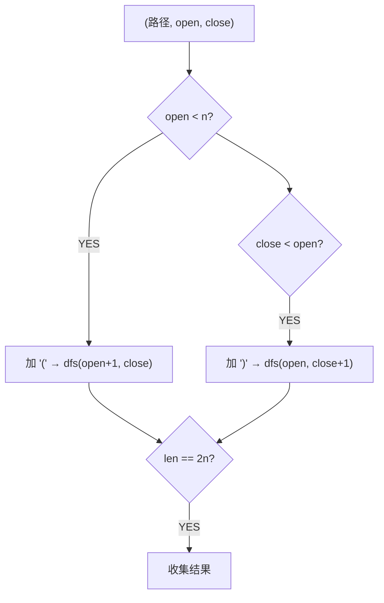

**剪枝**：`close < open` 保证合法性——右括号数量不能超过左括号。

## 03. 代码

**Java**：
```java
public List<String> generateParenthesis(int n) {
    List<String> res = new ArrayList<>();
    backtrack(res, new StringBuilder(), 0, 0, n);
    return res;
}
void backtrack(List<String> res, StringBuilder sb, int o, int c, int n) {
    if (sb.length() == 2 * n) { res.add(sb.toString()); return; }
    if (o < n) { sb.append('('); backtrack(res, sb, o+1, c, n); sb.deleteCharAt(sb.length()-1); }
    if (c < o) { sb.append(')'); backtrack(res, sb, o, c+1, n); sb.deleteCharAt(sb.length()-1); }
}
```

**Python**：
```python
def generateParenthesis(self, n):
    res = []
    def dfs(s, o, c):
        if len(s) == 2*n: res.append(s); return
        if o < n: dfs(s+'(', o+1, c)
        if c < o: dfs(s+')', o, c+1)
    dfs('', 0, 0)
    return res
```

**C++**：
```cpp
vector<string> generateParenthesis(int n) { vector<string> res; string cur; function<void(int,int)> dfs=[&](int o,int c){ if(cur.size()==2*n){ res.push_back(cur); return; } if(o<n){ cur+='('; dfs(o+1,c); cur.pop_back(); } if(c<o){ cur+=')'; dfs(o,c+1); cur.pop_back(); } }; dfs(0,0); return res; }
```

**复杂度**：O(4ⁿ/√n)，卡特兰数。**相关**：[036 有效的括号](036.有效的括号.md)

---

# 用栈实现队列 / 用队列实现栈

> LeetCode 232/225 · ⭐ · 双栈 / 单队列

## 039 用栈实现队列 (232)

### 设计思想

两个栈：`inStack`（接收 push）+ `outStack`（处理 pop/peek）。当 outStack 空时，把 inStack 的全部倒入 outStack——FIFO 就出现了。

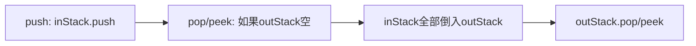

**Java**：
```java
class MyQueue {
    Deque<Integer> in = new ArrayDeque<>(), out = new ArrayDeque<>();
    public void push(int x) { in.push(x); }
    public int pop() { ensure(); return out.pop(); }
    public int peek() { ensure(); return out.peek(); }
    public boolean empty() { return in.isEmpty() && out.isEmpty(); }
    void ensure() { if (out.isEmpty()) while (!in.isEmpty()) out.push(in.pop()); }
}
```

**Python**：
```python
class MyQueue:
    def __init__(self): self.in_stack, self.out_stack = [], []
    def push(self, x): self.in_stack.append(x)
    def pop(self): self._ensure(); return self.out_stack.pop()
    def peek(self): self._ensure(); return self.out_stack[-1]
    def empty(self): return not self.in_stack and not self.out_stack
    def _ensure(self):
        if not self.out_stack:
            while self.in_stack: self.out_stack.append(self.in_stack.pop())
```

**摊还 O(1)**：每个元素只被倒一次。

---

## 040 用队列实现栈 (225)

### 单队列旋转法

push 时把新元素前面的所有元素旋转到队尾——使新元素成为队首。

```java
class MyStack {
    Queue<Integer> q = new LinkedList<>();
    public void push(int x) { q.offer(x); for(int i=0;i<q.size()-1;i++) q.offer(q.poll()); }
    public int pop() { return q.poll(); }
    public int top() { return q.peek(); }
    public boolean empty() { return q.isEmpty(); }
}
```

**Python**：
```python
class MyStack:
    def __init__(self): self.q = deque()
    def push(self, x): self.q.append(x); [self.q.append(self.q.popleft()) for _ in range(len(self.q)-1)]
    def pop(self): return self.q.popleft()
    def top(self): return self.q[0]
    def empty(self): return not self.q
```

| | 栈→队列 | 队列→栈 |
|------|:---:|:---:|
| 核心 | 双栈+摊还 | 旋转法 |
| push | O(1) | **O(N)** |
| pop/peek | 摊还 O(1) | O(1) |

---

# C005 用队列实现栈

> LeetCode 225 · ⭐ · 单队列
>
> push 时把新元素旋转到队首，这样 pop 直接取队首即可。

## 01. 代码

**Java**：
```java
class MyStack {
    Queue<Integer> q = new LinkedList<>();
    public void push(int x) {
        q.offer(x);
        for (int i = 0; i < q.size() - 1; i++) q.offer(q.poll());
    }
    public int pop() { return q.poll(); }
    public int top() { return q.peek(); }
    public boolean empty() { return q.isEmpty(); }
}
```

**Python**：
```python
class MyStack:
    def __init__(self): self.q = deque()
    def push(self, x):
        self.q.append(x)
        for _ in range(len(self.q) - 1): self.q.append(self.q.popleft())
    def pop(self): return self.q.popleft()
    def top(self): return self.q[0]
    def empty(self): return not self.q
```

**复杂度**：push O(N)，pop/top O(1)。

---

# 最小栈 / 设计循环队列

> LeetCode 155/622 · ⭐/⭐⭐

## 041 最小栈 (155)

### 设计思想

辅助栈同步存"当前最小值"。push 时 `minStack.push(min(当前值, minStack.top))`。

**Java**：
```java
class MinStack {
    Deque<Integer> s = new ArrayDeque<>(), ms = new ArrayDeque<>();
    public void push(int x) { s.push(x); ms.push(ms.isEmpty() ? x : Math.min(x, ms.peek())); }
    public void pop() { s.pop(); ms.pop(); }
    public int top() { return s.peek(); }
    public int getMin() { return ms.peek(); }
}
```

**Python**：
```python
class MinStack:
    def __init__(self): self.s, self.ms = [], []
    def push(self, x): self.s.append(x); self.ms.append(x if not self.ms else min(x, self.ms[-1]))
    def pop(self): self.s.pop(); self.ms.pop()
    def top(self): return self.s[-1]
    def getMin(self): return self.ms[-1]
```

**复杂度**：全部 O(1)。

---

## 050 设计循环队列 (622)

### 关键设计

数组 + `front` + `rear` + `size`（用 size 判空/满，无需浪费一个位置）。

**Java**：
```java
class MyCircularQueue {
    int[] a; int f, r, sz, cap;
    MyCircularQueue(int k) { a=new int[k]; cap=k; }
    boolean enQueue(int x) { if(isFull()) return false; a[r]=x; r=(r+1)%cap; sz++; return true; }
    boolean deQueue() { if(isEmpty()) return false; f=(f+1)%cap; sz--; return true; }
    int Front() { return isEmpty()?-1:a[f]; }
    int Rear() { return isEmpty()?-1:a[(r-1+cap)%cap]; }
    boolean isEmpty() { return sz==0; }
    boolean isFull() { return sz==cap; }
}
```

**Python**：
```python
class MyCircularQueue:
    def __init__(self, k): self.q=[0]*k; self.f=self.r=self.sz=0; self.cap=k
    def enQueue(self, x): return not self.isFull() and (setattr(self,'q',self.q.__setitem__(self.r,x)),setattr(self,'r',(self.r+1)%self.cap),setattr(self,'sz',self.sz+1),True)[-1] if not self.isFull() else False
    def deQueue(self): return not self.isEmpty() and (self.f:=(self.f+1)%self.cap,self.sz-1)[1]>=0
    def Front(self): return -1 if self.isEmpty() else self.q[self.f]
    def Rear(self): return -1 if self.isEmpty() else self.q[(self.r-1)%self.cap]
    def isEmpty(self): return self.sz==0
    def isFull(self): return self.sz==self.cap
```

**复杂度**：全部 O(1)。

---

# 逆波兰表达式求值（Evaluate Reverse Polish Notation）

> LeetCode 150 · ⭐⭐ · 后缀表达式

## 01. 题目

`["2","1","+","3","*"]` → 9（即 (2+1)×3=9）

## 02. 题目分析

后缀表达式无需括号就能唯一确定运算顺序——这正是栈的天然场景。

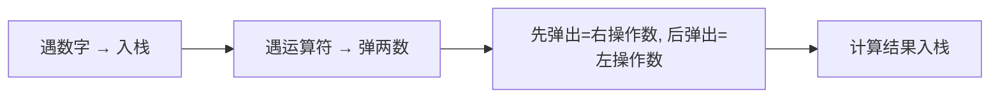

**注意**：**先弹出的是右操作数**（减法除法顺序敏感）。

## 03. 代码

**Java**：
```java
public int evalRPN(String[] tokens) {
    Deque<Integer> stack = new ArrayDeque<>();
    for (String t : tokens) {
        switch (t) {
            case "+": stack.push(stack.pop() + stack.pop()); break;
            case "-": int b = stack.pop(), a = stack.pop(); stack.push(a - b); break;
            case "*": stack.push(stack.pop() * stack.pop()); break;
            case "/": int d = stack.pop(), c = stack.pop(); stack.push(c / d); break;
            default: stack.push(Integer.parseInt(t));
        }
    }
    return stack.pop();
}
```

**Python**：
```python
def evalRPN(self, tokens):
    stack, ops = [], {'+': lambda a,b: a+b, '-': lambda a,b: a-b, '*': lambda a,b: a*b, '/': lambda a,b: int(a/b)}
    for t in tokens:
        if t in ops: b,a=stack.pop(),stack.pop(); stack.append(ops[t](a,b))
        else: stack.append(int(t))
    return stack[0]
```

**C++**：
```cpp
int evalRPN(vector<string>& t) { stack<int> st; for(auto& s:t){ if(s=="+"){ int b=st.top();st.pop(); st.top()+=b; } else if(s=="-"){ int b=st.top();st.pop(); st.top()-=b; } else if(s=="*"){ int b=st.top();st.pop(); st.top()*=b; } else if(s=="/"){ int b=st.top();st.pop(); st.top()/=b; } else st.push(stoi(s)); } return st.top(); }
```

**复杂度**：O(N)/O(N)。**相关**：[043 基本计算器II](043.基本计算器II.md)

---

# 基本计算器 II（Basic Calculator II）

> LeetCode 227 · ⭐⭐ · 栈模拟运算

## 01. 题目

`"3+2*2"` → 7, `" 3/2 "` → 1（加减乘除，无括号，非负整数）

## 02. 题目分析

### 核心困难：运算符优先级

`+` 和 `-` 可以直接算（同级），`×` 和 `÷` 优先级更高——必须先算。

### 巧妙解法：延迟计算

```
当前运算符决定的是"上一个数"的命运：

sign='+' → 直接入栈 num
sign='-' → 入栈 -num
sign='*' → 弹栈顶 × num 入栈
sign='/' → 弹栈顶 / num 入栈

最后把栈内所有数求和
```

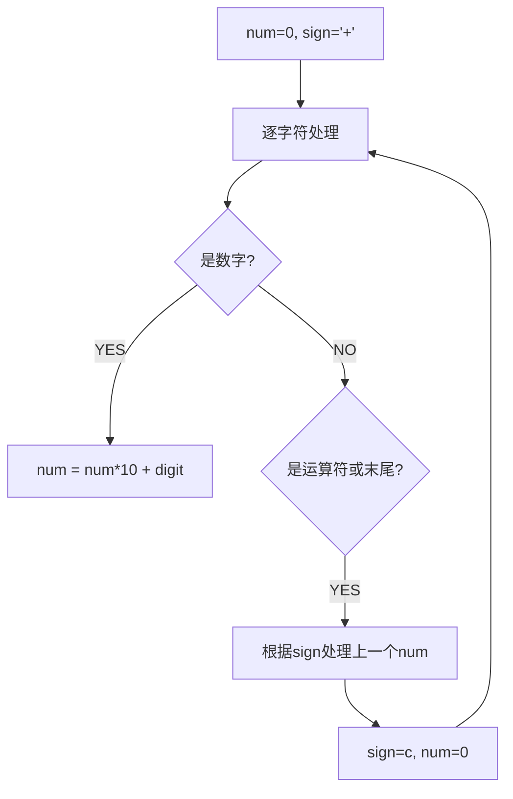

## 03. 代码

**Java**：
```java
public int calculate(String s) {
    Deque<Integer> stack = new ArrayDeque<>();
    int num = 0; char sign = '+';
    for (int i = 0; i < s.length(); i++) {
        char c = s.charAt(i);
        if (Character.isDigit(c)) num = num * 10 + (c - '0');
        if ((!Character.isDigit(c) && c != ' ') || i == s.length() - 1) {
            switch (sign) {
                case '+': stack.push(num); break;
                case '-': stack.push(-num); break;
                case '*': stack.push(stack.pop() * num); break;
                case '/': stack.push(stack.pop() / num); break;
            }
            sign = c; num = 0;
        }
    }
    return stack.stream().mapToInt(Integer::intValue).sum();
}
```

**Python**：
```python
def calculate(self, s):
    stack, num, sign = [], 0, '+'
    for i, c in enumerate(s):
        if c.isdigit(): num = num*10 + int(c)
        if c in '+-*/' or i == len(s)-1:
            if sign == '+': stack.append(num)
            elif sign == '-': stack.append(-num)
            elif sign == '*': stack.append(stack.pop() * num)
            elif sign == '/': stack.append(int(stack.pop() / num))
            sign, num = c, 0
    return sum(stack)
```

**C++**：
```cpp
int calculate(string s) { stack<int> st; int num=0; char sign='+'; for(int i=0;i<s.size();i++){ char c=s[i]; if(isdigit(c)) num=num*10+(c-'0'); if((!isdigit(c)&&c!=' ')||i==s.size()-1){ if(sign=='+') st.push(num); else if(sign=='-') st.push(-num); else if(sign=='*'){ num*=st.top();st.pop();st.push(num); } else{ num=st.top()/num;st.pop();st.push(num); } sign=c;num=0; } } int ans=0; while(!st.empty()){ ans+=st.top();st.pop(); } return ans; }
```

**复杂度**：O(N)/O(N)。

## 04. 总结

| 核心 | 说明 |
|------|------|
| 延迟计算 | 当前运算符决定上一个数的去向 |
| 优先级 | ×÷ 弹栈先算，+- 直接入栈 |
| 最后求和 | 栈内所有元素求和 = 最终结果 |

**相关**：[042 逆波兰](042.逆波兰表达式求值.md)

---

# 柱状图中最大的矩形（Largest Rectangle in Histogram）

> LeetCode 84 · ⭐⭐⭐ · 单调栈
>
> 单调栈的"第二经典题"——与接雨水是镜像关系。接雨水求"凹槽"，柱状图求"凸起"。理解这道题，才算真正掌握了单调栈的范式思维。

---

## 01. 题目描述

给定 `heights`，求其中能勾勒出的最大矩形面积。

**示例**：

```
输入：heights = [2,1,5,6,2,3]
输出：10
解释：最大矩形是高度为 5 和 6 的部分，面积 = 5 × 2(宽) = 10
```

```
直观图示：
    █
  █ █
  █ █   █
█ █ █ █ █
█ █ █ █ █
2 1 5 6 2 3

最大矩形 = 5×2 = 10 (heights[2]=5, heights[3]=6, 宽=2)
```

**约束**：`1 <= heights.length <= 10^5`，`0 <= heights[i] <= 10^4`

---

## 02. 题目分析：每个柱子的"势力范围"

### 2.1 核心公式

对每个柱子 `i`，以它的高度能延伸的最大矩形：

$$area[i] = heights[i] \times (rightSmaller[i] - leftSmaller[i] - 1)$$

其中 `rightSmaller[i]` 是 i 右端第一个比它矮的柱子下标，`leftSmaller[i]` 同理。

```
以 heights[2]=5 为例：
  leftSmaller=1 (heights[1]=1<5)
  rightSmaller=4 (heights[4]=2<5)
  width = 4 - 1 - 1 = 2
  area = 5 × 2 = 10
```

### 2.2 朴素做法：O(N²)

对每个柱子 i，向左右扫描找第一个比它矮的。N=10⁵ → 10¹⁰ 超时。

### 2.3 单调栈：O(N)

维护单调递增栈（存下标）。遇到较矮柱子时弹栈——此时弹出的柱子找到了它的**右边界**。

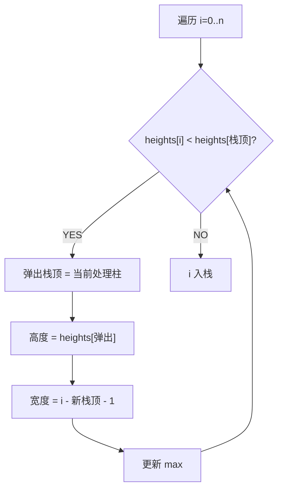

### 2.4 与接雨水的镜像关系

| | 接雨水 | 柱状图最大矩形 |
|------|:---:|:---:|
| 形状 | 凹槽 ↓ | 凸起 ↑ |
| 单调栈类型 | 递减栈 | **递增栈** |
| 弹出时机 | 遇到更高 | 遇到更矮 |
| 计算目标 | 水量 (宽×深) | 面积 (宽×高) |

---

## 03. 单调栈解法（O(N)）

### 3.1 手推演示

```
heights = [2, 1, 5, 6, 2, 3], 末尾加哨兵 0

i=0,h=2: 栈空 → 入栈        栈: [0]
i=1,h=1: 1<2 → 弹出0: 高2, 宽1-(-1)-1=1, area=2   栈: []
         入栈 1              栈: [1]
i=2,h=5: 5>1 → 入栈 2       栈: [1,2]
i=3,h=6: 6>5 → 入栈 3       栈: [1,2,3]
i=4,h=2: 2<6 → 弹出3: 高6, 宽4-2-1=1, area=6       栈: [1,2]
         2<5 → 弹出2: 高5, 宽4-1-1=2, area=10 ←max 栈: [1]
         2>1 → 入栈 4       栈: [1,4]
i=5,h=3: 3>2 → 入栈 5       栈: [1,4,5]
i=6,h=0: 0<3 → 弹出5: 高3, 宽6-4-1=1, area=3
         0<2 → 弹出4: 高2, 宽6-1-1=4, area=8
         0<1 → 弹出1: 高1, 宽6-(-1)-1=6, area=6

max = 10
```

### 3.2 哨兵的作用

`heights` 末尾追加 `0`：确保所有元素都被弹出处理。否则最后一段递增序列无法计算。

### 3.3 代码

**Java**：
```java
public int largestRectangleArea(int[] heights) {
    int n = heights.length, max = 0;
    Deque<Integer> stack = new ArrayDeque<>();
    for (int i = 0; i <= n; i++) {
        int h = (i == n) ? 0 : heights[i];          // 哨兵
        while (!stack.isEmpty() && h < heights[stack.peek()]) {
            int height = heights[stack.pop()];
            int width = stack.isEmpty() ? i : i - stack.peek() - 1;
            max = Math.max(max, height * width);
        }
        stack.push(i);
    }
    return max;
}
```

**Python**：
```python
def largestRectangleArea(self, heights: List[int]) -> int:
    stack, ans = [], 0
    heights.append(0)               # 哨兵
    for i, h in enumerate(heights):
        while stack and h < heights[stack[-1]]:
            height = heights[stack.pop()]
            width = i if not stack else i - stack[-1] - 1
            ans = max(ans, height * width)
        stack.append(i)
    return ans
```

**C++**：
```cpp
int largestRectangleArea(vector<int>& heights) {
    heights.push_back(0);            // 哨兵
    stack<int> st; int ans = 0;
    for (int i = 0; i < heights.size(); i++) {
        while (!st.empty() && heights[i] < heights[st.top()]) {
            int h = heights[st.top()]; st.pop();
            int w = st.empty() ? i : i - st.top() - 1;
            ans = max(ans, h * w);
        }
        st.push(i);
    }
    return ans;
}
```

**复杂度**：时间 O(N)，每个元素最多入栈出栈各一次。空间 O(N)。

---

## 04. 单调栈题型总结

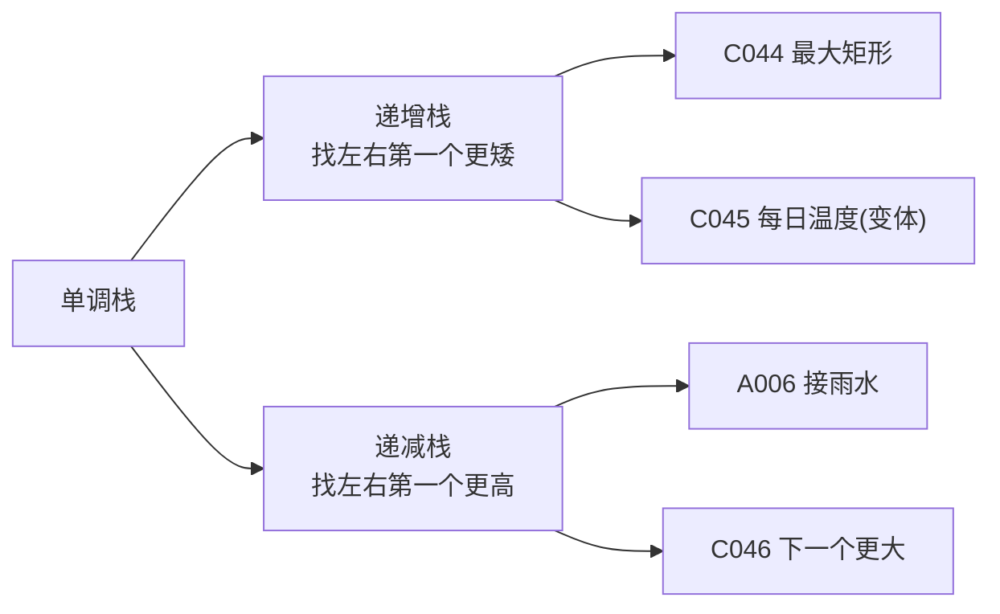

| 题目 | 栈类型 | 弹出条件 | 计算什么 |
|------|:---:|---------|---------|
| A006 接雨水 | 递减栈 | `h > top` | 凹槽水量 |
| **C044 最大矩形** | **递增栈** | `h < top` | 矩形面积 |
| C045 每日温度 | 递减栈 | `t > top` | 等待天数 |
| C046 下一个更大 | 递减栈 | `n > top` | 下一个更大 |

---

## 05. 总结

| 核心启示 | 说明 |
|---------|------|
| 递增栈=找更矮 | 遇到更矮时弹栈，弹栈节点找到了右边界 |
| 宽度计算 | `width = i - 新栈顶 - 1`（或 `i` 若栈空） |
| 哨兵 0 | 末尾加 0 确保所有元素被弹出 |
| 与接雨水镜像 | 递增栈 vs 递减栈，凸起 vs 凹槽 |

**相关题目**：[045 每日温度](045.每日温度.md)、[接雨水](../07.数组算法题/006.接雨水.md)

---

# 每日温度（Daily Temperatures）

> LeetCode 739 · ⭐⭐ · 单调栈

## 01. 题目

`[73,74,75,71,69,72,76,73]` → `[1,1,4,2,1,1,0,0]`（每个元素等几天才能遇到更高温度）

## 02. 题目分析

### 单调递减栈

栈存下标，温度递减。遇更高温度时弹栈——弹栈元素找到了"下一个更高温度"。

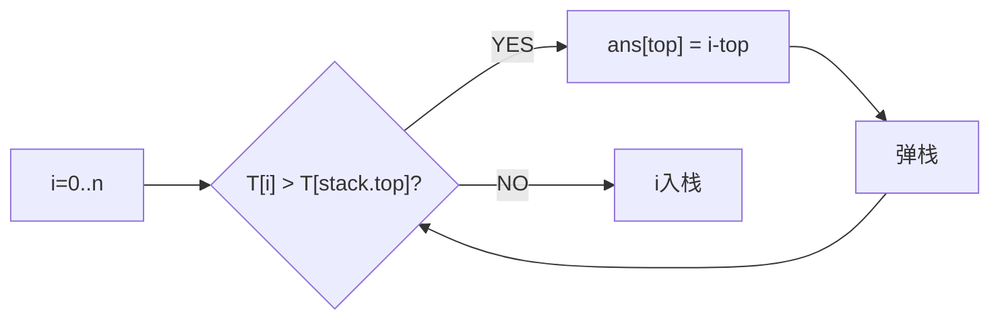

### 手推

```
T=[73,74,75,71,69,72,76,73]

i=0,T=73: 栈空 → 入栈          栈=[0]
i=1,T=74: 74>73 → ans[0]=1,弹0  栈=[] → 入栈1  栈=[1]
i=2,T=75: 75>74 → ans[1]=1,弹1  栈=[] → 入栈2  栈=[2]
i=3,T=71: 71<75 → 入栈3          栈=[2,3]
i=4,T=69: 69<71 → 入栈4          栈=[2,3,4]
i=5,T=72: 72>69 → ans[4]=1,弹4
          72>71 → ans[3]=2,弹3
          72<75 → 入栈5          栈=[2,5]
i=6,T=76: 76>72 → ans[5]=1,弹5
          76>75 → ans[2]=4,弹2   栈=[] → 入栈6
i=7,T=73: 73<76 → 入栈7

结果：[1,1,4,2,1,1,0,0]
```

## 03. 代码

**Java**：
```java
public int[] dailyTemperatures(int[] T) {
    int n=T.length; int[] ans=new int[n];
    Deque<Integer> stack=new ArrayDeque<>();
    for(int i=0;i<n;i++){
        while(!stack.isEmpty()&&T[i]>T[stack.peek()]){
            int prev=stack.pop(); ans[prev]=i-prev;
        }
        stack.push(i);
    }
    return ans;
}
```

**Python**：
```python
def dailyTemperatures(self, T):
    ans,stack=[0]*len(T),[]
    for i,t in enumerate(T):
        while stack and t>T[stack[-1]]: prev=stack.pop(); ans[prev]=i-prev
        stack.append(i)
    return ans
```

**C++**：
```cpp
vector<int> dailyTemperatures(vector<int>& T) {
    int n=T.size(); vector<int> ans(n); stack<int> st;
    for(int i=0;i<n;i++){ while(!st.empty()&&T[i]>T[st.top()]){ ans[st.top()]=i-st.top(); st.pop(); } st.push(i); }
    return ans;
}
```

**复杂度**：O(N)/O(N)。

## 04. 单调栈题型与栈类型

| 题目 | 栈类型 | 找什么 | 计算什么 |
|------|:---:|------|------|
| C045 每日温度 | **递减** | 下一个更高 | 等了几天 |
| C046 下一个更大 | **递减** | 下一个更大 | 更大的值 |
| A006 接雨水 | **递减** | 下一个更高 | 凹槽水量 |
| C044 最大矩形 | **递增** | 下一个更矮 | 矩形面积 |

**相关**：[046 下一个更大](046.下一个更大元素II.md)、[044 最大矩形](044.柱状图中最大的矩形.md)

---

# 下一个更大元素 II / 去除重复字母

> LeetCode 503/316 · ⭐⭐/⭐⭐⭐ · 单调栈+循环数组

## 046 下一个更大元素 II (503)

### 01. 题目

`[1,2,1]` → `[2,-1,2]`（循环数组，最后一个1的下一个更大是前面的2）

### 02. 分析

循环数组技巧：遍历两遍 `0..2n-1`，取模 `i%n`。`i < n` 时才入栈。

### 03. 代码

**Java**：
```java
public int[] nextGreaterElements(int[] nums) {
    int n=nums.length; int[] ans=new int[n]; Arrays.fill(ans,-1);
    Deque<Integer> stack=new ArrayDeque<>();
    for(int i=0;i<2*n;i++){
        while(!stack.isEmpty()&&nums[i%n]>nums[stack.peek()])
            ans[stack.pop()]=nums[i%n];
        if(i<n) stack.push(i);
    }
    return ans;
}
```

**Python**：
```python
def nextGreaterElements(self, nums):
    n=len(nums); ans,stack=[-1]*n,[]
    for i in range(2*n):
        while stack and nums[i%n]>nums[stack[-1]]: ans[stack.pop()]=nums[i%n]
        if i<n: stack.append(i)
    return ans
```

**复杂度**：O(N)/O(N)。**核心**：`i%n` 实现循环数组。

---

## 049 去除重复字母 (316)

### 01. 题目

`s="bcabc"` → `"abc"`（去重+最小字典序）。

### 02. 分析

递增栈（存字符）+ 弹出前必须确保该字符后续还会出现。

```java
public String removeDuplicateLetters(String s) {
    int[] last=new int[26];
    for(int i=0;i<s.length();i++) last[s.charAt(i)-'a']=i;
    boolean[] inStack=new boolean[26];
    Deque<Character> stack=new ArrayDeque<>();
    for(int i=0;i<s.length();i++){
        char c=s.charAt(i);
        if(inStack[c-'a']) continue;
        while(!stack.isEmpty()&&c<stack.peek()&&last[stack.peek()-'a']>i)
            inStack[stack.pop()-'a']=false;
        stack.push(c); inStack[c-'a']=true;
    }
    StringBuilder sb=new StringBuilder();
    while(!stack.isEmpty()) sb.append(stack.pollLast());
    return sb.toString();
}
```

**Python**：
```python
def removeDuplicateLetters(self, s):
    last={c:i for i,c in enumerate(s)}
    stack,seen=[],set()
    for i,c in enumerate(s):
        if c in seen: continue
        while stack and c<stack[-1] and last[stack[-1]]>i: seen.remove(stack.pop())
        stack.append(c); seen.add(c)
    return ''.join(stack)
```

**复杂度**：O(N)/O(1)。**核心**：递增栈+弹出前检查`last[top]>i`。

---

## 单调栈题型汇总

| | 栈类型 | 弹出前提 | 结果 |
|------|:---:|------|------|
| 045 每日温度 | 递减 | 无条件 | 等待天数 |
| 046 下一个更大 | 递减 | 无条件 | 更大的值 |
| 049 去除重复字母 | **递增** | **后续还会出现** | 字典序最小 |
| 044 最大矩形 | 递增 | 无条件 | 最大面积 |

**相关**：[044 最大矩形](044.柱状图中最大的矩形.md)

---

# 滑动窗口最大值（Sliding Window Maximum）

> LeetCode 239 · ⭐⭐⭐ · 单调队列
>
> 单调栈处理"以前"的数据，单调队列处理"滑动"的数据。队首始终是当前窗口的最大值——但如何高效剔除"过期"元素和"无用"元素？

---

## 01. 题目描述

给定数组 `nums` 和窗口大小 `k`，返回每个滑动窗口的最大值。

**示例**：

```
输入：nums = [1,3,-1,-3,5,3,6,7], k = 3
输出：[3,3,5,5,6,7]

窗口位置              最大值
[1  3  -1] -3  5  3  6  7    3
 1 [3  -1  -3] 5  3  6  7    3
 1  3 [-1  -3  5] 3  6  7    5
 1  3  -1 [-3  5  3] 6  7    5
 1  3  -1  -3 [5  3  6] 7    6
 1  3  -1  -3  5 [3  6  7]   7
```

**约束**：`1 <= k <= nums.length <= 10^5`

---

## 02. 题目分析

### 2.1 朴素做法：O(NK)

每次窗口移动，扫描 K 个元素找最大值。N=10⁵ → O(NK) 必超时。

### 2.2 为什么需要队列？

窗口滑动 = 新元素进来 + 旧元素出去。这就是队列的语义（FIFO）。

### 2.3 为什么需要"单调"？

普通队列只能存取元素，不能 O(1) 获取最大值。**单调队列**：队首始终是窗口内最大值，队尾用来"淘汰"无用元素。

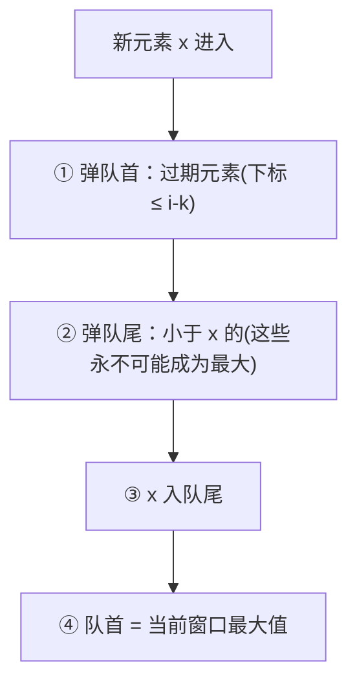

### 2.4 为什么可以"弹队尾"？

如果一个元素 `x` 比之前的元素大，且比它们更靠右，那些之前的元素**永远不可能成为窗口内的最大值**——因为 x 更大且更晚过期。

```
窗口 k=3: [1, 3, -1]

队列状态：
i=0,x=1: dq=[1]
i=1,x=3: 3>1 → 弹出1, dq=[3]
i=2,x=-1: -1<3 → dq=[3,-1]
        队首=3,窗口[1,3,-1] max=3 ✓

i=3,x=-3: 1不在窗口 → 弹队首, dq=[3,-1,-3]
        队首=3,窗口[3,-1,-3] max=3 ✓
```

---

## 03. 解法一：单调队列（O(N)）

### 3.1 核心操作

| 操作 | 代码 | 目的 |
|------|------|------|
| 弹队首 | `if(dq[0] <= i-k) pollFirst()` | 剔除过期元素 |
| 弹队尾 | `while(dq[-1] < x) pollLast()` | 剔除无用元素 |
| 取队首 | `nums[dq[0]]` | 当前窗口最大值 |

### 3.2 代码

**Java**：
```java
public int[] maxSlidingWindow(int[] nums, int k) {
    int n = nums.length;
    int[] ans = new int[n - k + 1];
    Deque<Integer> dq = new ArrayDeque<>();   // 存下标，值递减

    for (int i = 0; i < n; i++) {
        // ① 弹队首：移除窗口外的元素
        if (!dq.isEmpty() && dq.peekFirst() <= i - k)
            dq.pollFirst();
        // ② 弹队尾：移除所有小于当前值的（它们永不可能成最大）
        while (!dq.isEmpty() && nums[i] >= nums[dq.peekLast()])
            dq.pollLast();
        // ③ 当前元素入队
        dq.offerLast(i);
        // ④ 记录窗口最大值（队首）
        if (i >= k - 1)
            ans[i - k + 1] = nums[dq.peekFirst()];
    }
    return ans;
}
```

**Python**：
```python
def maxSlidingWindow(self, nums: List[int], k: int) -> List[int]:
    from collections import deque
    dq = deque()
    ans = []
    for i, x in enumerate(nums):
        if dq and dq[0] <= i - k:      # 弹过期
            dq.popleft()
        while dq and nums[dq[-1]] <= x: # 弹无用
            dq.pop()
        dq.append(i)                     # 入队
        if i >= k - 1:
            ans.append(nums[dq[0]])      # 队首=最大
    return ans
```

**C++**：
```cpp
vector<int> maxSlidingWindow(vector<int>& nums, int k) {
    deque<int> dq;
    vector<int> ans;
    for (int i = 0; i < nums.size(); i++) {
        if (!dq.empty() && dq.front() <= i - k) dq.pop_front();
        while (!dq.empty() && nums[i] >= nums[dq.back()]) dq.pop_back();
        dq.push_back(i);
        if (i >= k - 1) ans.push_back(nums[dq.front()]);
    }
    return ans;
}
```

**复杂度**：时间 O(N)，每个元素最多入队出队各一次。空间 O(K)。

---

## 04. 单调栈 vs 单调队列

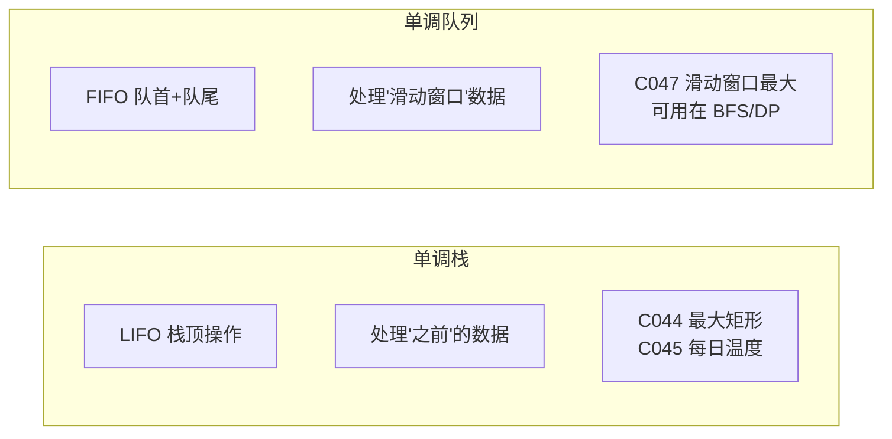

| | 单调栈 | 单调队列 |
|------|:---:|:---:|
| 数据结构 | Deque 当栈用 | Deque 当队列用 |
| 操作端点 | 仅栈顶 | 队首(过期) + 队尾(无用) |
| 典型题 | 接雨水、最大矩形 | 滑动窗口最大/最小 |
| 核心操作 | `push/pop` | `offerLast/pollFirst/pollLast` |

---

## 05. 总结

| 核心启示 | 说明 |
|---------|------|
| 弹队尾淘汰 | "更大且更靠右"的元素使之前的元素"永无出头之日" |
| 弹队首过期 | 窗口滑动后，队首元素可能已不在窗口内 |
| 队首即答案 | 单调递减队列 → 队首 = 最大值 |
| 复杂度分析 | 每个元素最多入队一次、出队一次 → O(N) |

**相关题目**：[045 每日温度](045.每日温度.md)、[046 下一个更大](046.下一个更大元素II.md)

---

# 字符串解码（Decode String）

> LeetCode 394 · ⭐⭐ · 栈处理嵌套结构

## 01. 题目

`"3[a2[c]]"` → `"accaccacc"`（嵌套解码：先内层 `2[c]=cc`，再外层 `3[acc]=accaccacc`）

## 02. 题目分析

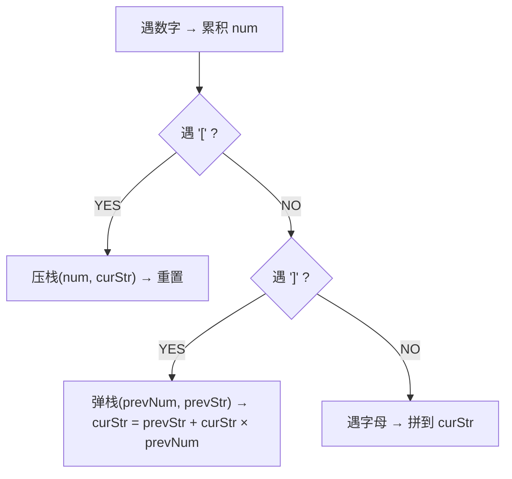

## 03. 代码

**Java**：
```java
public String decodeString(String s) {
    Deque<Integer> numStack = new ArrayDeque<>();
    Deque<StringBuilder> strStack = new ArrayDeque<>();
    StringBuilder cur = new StringBuilder();
    int num = 0;
    for (char c : s.toCharArray()) {
        if (Character.isDigit(c)) num = num * 10 + (c - '0');
        else if (c == '[') { numStack.push(num); strStack.push(cur); num = 0; cur = new StringBuilder(); }
        else if (c == ']') { int k = numStack.pop(); StringBuilder prev = strStack.pop(); while (k-- > 0) prev.append(cur); cur = prev; }
        else cur.append(c);
    }
    return cur.toString();
}
```

**Python**：
```python
def decodeString(self, s):
    stack, cur_num, cur_str = [], 0, ''
    for c in s:
        if c.isdigit(): cur_num = cur_num*10 + int(c)
        elif c == '[': stack.append((cur_str, cur_num)); cur_str, cur_num = '', 0
        elif c == ']': prev_str, num = stack.pop(); cur_str = prev_str + cur_str * num
        else: cur_str += c
    return cur_str
```

**C++**：
```cpp
string decodeString(string s) { stack<pair<string,int>> st; string cur; int num=0; for(char c:s){ if(isdigit(c)) num=num*10+(c-'0'); else if(c=='['){ st.push({cur,num}); cur="";num=0; } else if(c==']'){ auto[prev,k]=st.top();st.pop(); string tmp=cur; cur=prev; while(k--) cur+=tmp; } else cur+=c; } return cur; }
```

**复杂度**：O(N×maxK)/O(N)。

**相关**：[036 有效的括号](036.有效的括号.md)

---

# C014 去除重复字母

> LeetCode 316 · ⭐⭐⭐ · 单调栈+贪心
>
> 去重+最小字典序。关键：弹出前需确保该字符后续还会出现。

## 01. 题目

去除重复字母使结果字典序最小且保留原相对顺序。`"bcabc"` → `"abc"`

## 02. 代码

**Java**：
```java
public String removeDuplicateLetters(String s) {
    int[] last = new int[26];
    for (int i = 0; i < s.length(); i++) last[s.charAt(i)-'a'] = i;
    boolean[] inStack = new boolean[26];
    Deque<Character> stack = new ArrayDeque<>();
    for (int i = 0; i < s.length(); i++) {
        char c = s.charAt(i);
        if (inStack[c-'a']) continue;
        while (!stack.isEmpty() && c < stack.peek() && last[stack.peek()-'a'] > i)
            inStack[stack.pop()-'a'] = false;
        stack.push(c); inStack[c-'a'] = true;
    }
    StringBuilder sb = new StringBuilder();
    while (!stack.isEmpty()) sb.append(stack.pollLast());
    return sb.toString();
}
```

**Python**：
```python
def removeDuplicateLetters(self, s):
    last = {c: i for i, c in enumerate(s)}
    stack, seen = [], set()
    for i, c in enumerate(s):
        if c in seen: continue
        while stack and c < stack[-1] and last[stack[-1]] > i:
            seen.remove(stack.pop())
        stack.append(c); seen.add(c)
    return ''.join(stack)
```

**复杂度**：O(N)/O(1)。

---

# C015 设计循环队列

> LeetCode 622 · ⭐⭐ · 循环队列
>
> 固定大小数组 + front + rear。判空/判满用额外变量 count 或浪费一个位置。

## 01. 代码

**Java**：
```java
class MyCircularQueue {
    int[] arr; int front, rear, size, cap;
    public MyCircularQueue(int k) { arr = new int[k]; cap = k; }
    public boolean enQueue(int val) { if (isFull()) return false; arr[rear] = val; rear = (rear+1)%cap; size++; return true; }
    public boolean deQueue() { if (isEmpty()) return false; front = (front+1)%cap; size--; return true; }
    public int Front() { return isEmpty() ? -1 : arr[front]; }
    public int Rear() { return isEmpty() ? -1 : arr[(rear-1+cap)%cap]; }
    public boolean isEmpty() { return size == 0; }
    public boolean isFull() { return size == cap; }
}
```

**Python**：
```python
class MyCircularQueue:
    def __init__(self, k):
        self.q, self.cap = [0] * k, k
        self.f = self.r = self.sz = 0
    def enQueue(self, val):
        if self.isFull(): return False
        self.q[self.r] = val; self.r = (self.r+1)%self.cap; self.sz += 1; return True
    def deQueue(self):
        if self.isEmpty(): return False
        self.f = (self.f+1)%self.cap; self.sz -= 1; return True
    def Front(self): return -1 if self.isEmpty() else self.q[self.f]
    def Rear(self): return -1 if self.isEmpty() else self.q[(self.r-1)%self.cap]
    def isEmpty(self): return self.sz == 0
    def isFull(self): return self.sz == self.cap
```

**复杂度**：所有操作 O(1)。

---
