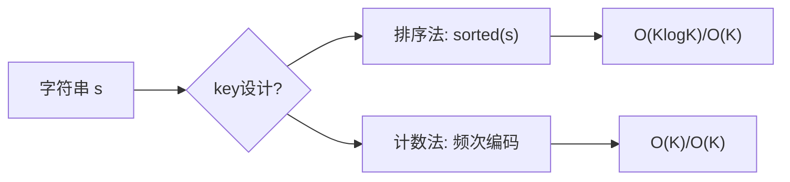
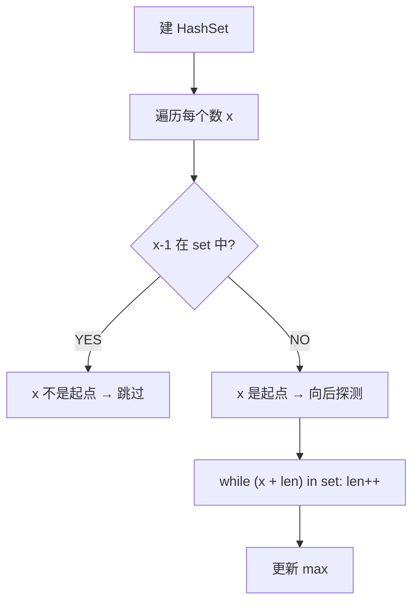
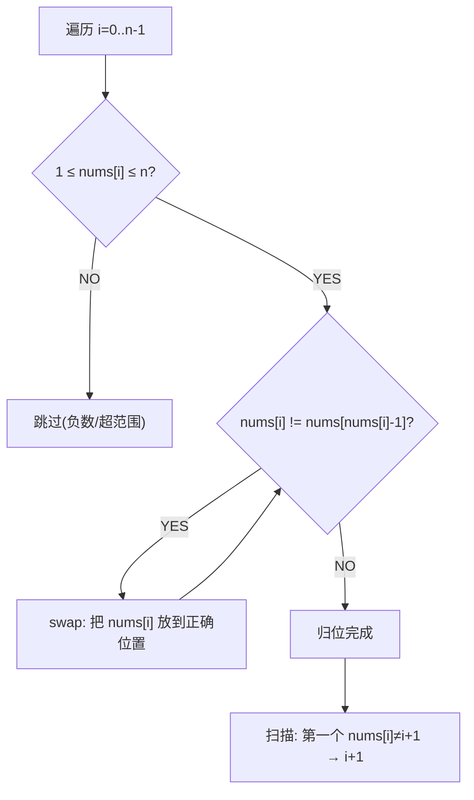
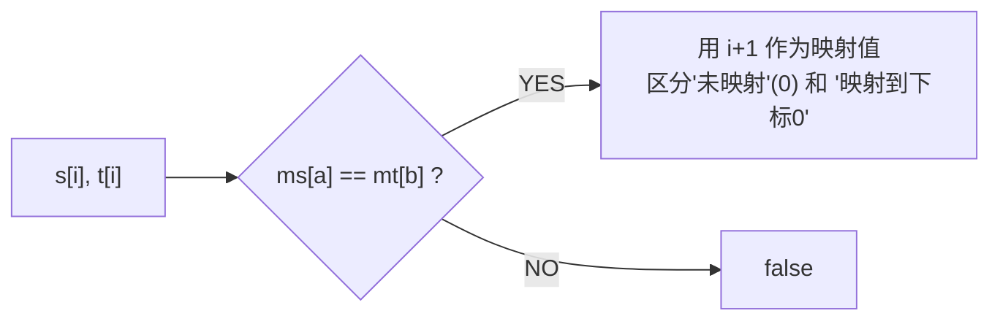
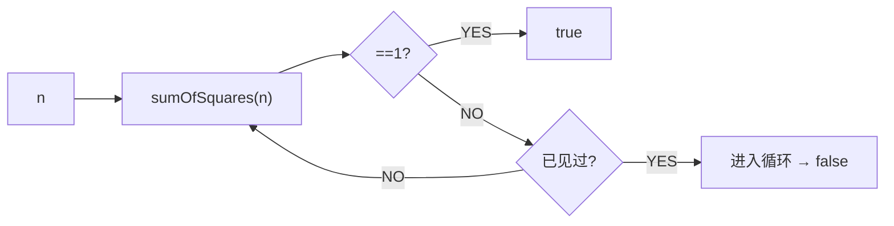
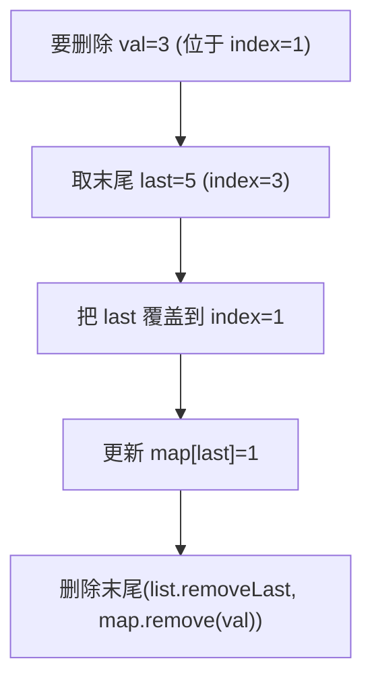
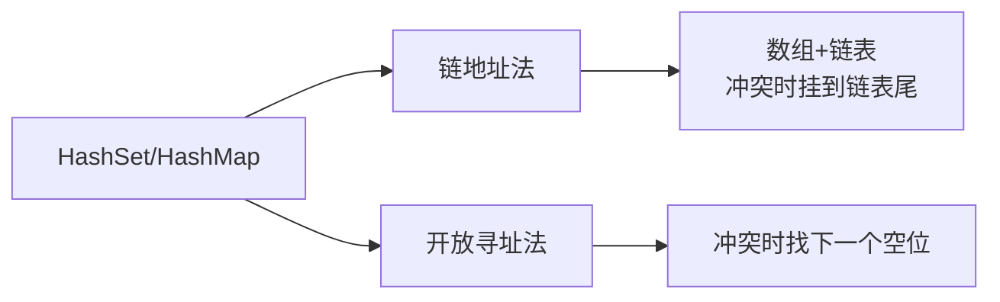

## 字母异位词分组（Group Anagrams）

> LeetCode 49 · ⭐⭐ · 哈希+排序/计数

### 01. 题目

`["eat","tea","tan","ate","nat","bat"]` → `[["bat"],["nat","tan"],["ate","eat","tea"]]`

### 02. 题目分析

**核心：如何设计 key？**

字母异位词 → 字符频次相同。需要一种将"频次"编码为唯一 key 的方法。



| 方法 | key 示例 | 时间 |
|------|------|:---:|
| 排序 | `"eat"→"aet"` | O(KlogK) |
| 计数编码 | `"eat"→"1#0#0#0#1#..."` | O(K) |

### 03. 代码

**Java**（排序法）：
```java
public List<List<String>> groupAnagrams(String[] strs) {
    Map<String, List<String>> map = new HashMap<>();
    for (String s : strs) {
        char[] arr = s.toCharArray(); Arrays.sort(arr);
        String key = new String(arr);
        map.computeIfAbsent(key, k -> new ArrayList<>()).add(s);
    }
    return new ArrayList<>(map.values());
}
```

**Python**（排序法）：
```python
def groupAnagrams(self, strs):
    from collections import defaultdict
    mp = defaultdict(list)
    for s in strs: mp[''.join(sorted(s))].append(s)
    return list(mp.values())
```

**C++**：
```cpp
vector<vector<string>> groupAnagrams(vector<string>& strs) {
    unordered_map<string, vector<string>> mp;
    for (auto& s : strs) { string k = s; sort(k.begin(), k.end()); mp[k].push_back(s); }
    vector<vector<string>> res;
    for (auto& p : mp) res.push_back(p.second);
    return res;
}
```

**复杂度**：O(N·KlogK)/O(NK)。

### 04. 总结

| 核心 | 说明 |
|------|------|
| key 设计 | 排序后的字符串 = 字母异位词的标准表示 |
| HashMap | key → List 的自然映射 |
| 变体 | 也可用计数数组编码作为 key |

**相关题目**：[058 字符频率排序](058.根据字符出现频率排序.md)


## 最长连续序列（Longest Consecutive Sequence）

> LeetCode 128 · ⭐⭐ · 哈希+边界探测
>
> 要求 O(N) 时间。排序法 O(NlogN) 不行。"只有起点才向后探测"——一次 O(1) 的判断避免了 O(N²) 的膨胀。


### 01. 题目描述

给定未排序的整数数组，找出最长连续序列的长度。要求 O(N) 时间。

**示例**：

```
输入：nums = [100,4,200,1,3,2]
输出：4
解释：最长连续序列是 [1,2,3,4]，长度 4
```

**示例 2**：

```
输入：nums = [0,3,7,2,5,8,4,6,0,1]
输出：9     ([0,1,2,3,4,5,6,7,8])
```


### 02. 题目分析

**2.1 朴素思路的陷阱**

| 思路 | 时间 | 问题 |
|------|:---:|------|
| 排序+扫描 | O(NlogN) | 不满足 O(N) |
| 每个数向后探测 | O(N²) | 大量重复探测 |
| 并查集 | O(N·α(N)) | 过于复杂 |

**2.2 关键洞察：只从"起点"探测**

什么是一个连续序列的起点？——**它的前驱不在集合中**。



**复杂度证明**：每个数最多被访问两次（一次作为起点判断，一次在探测中被访问）→ O(N)。

**2.3 手推演示**

```
nums = [100, 4, 200, 1, 3, 2]
set = {100, 4, 200, 1, 3, 2}

x=100: 99 not in set → 起点!
       while 101?× → len=1, max=1
x=4:   3 in set → 不是起点（skip）
x=200: 199 not in set → 起点!
       while 201?× → len=1, max=1
x=1:   0 not in set → 起点!
       while 2?✓, 3?✓, 4?✓ → len=4, max=4
x=3:   2 in set → skip
x=2:   1 in set → skip

结果：4 (序列 [1,2,3,4])
```


### 03. 代码

**Java**：
```java
public int longestConsecutive(int[] nums) {
    Set<Integer> set = new HashSet<>();
    for (int n : nums) set.add(n);          // O(N) 建集合
    int max = 0;
    for (int x : set) {                     // 遍历集合（非数组，已去重）
        if (!set.contains(x - 1)) {         // x 是起点
            int cur = x, len = 1;
            while (set.contains(cur + 1)) {
                cur++; len++;
            }
            max = Math.max(max, len);
        }
    }
    return max;
}
```

**Python**：
```python
def longestConsecutive(self, nums: List[int]) -> int:
    s = set(nums)
    ans = 0
    for x in s:
        if x - 1 not in s:                   # 只从起点开始
            y = x + 1
            while y in s:
                y += 1
            ans = max(ans, y - x)
    return ans
```

**C++**：
```cpp
int longestConsecutive(vector<int>& nums) {
    unordered_set<int> s(nums.begin(), nums.end());
    int ans = 0;
    for (int x : s) {
        if (!s.count(x - 1)) {               // 起点
            int cur = x;
            while (s.count(cur + 1)) cur++;
            ans = max(ans, cur - x + 1);
        }
    }
    return ans;
}
```

**复杂度**：时间 O(N)，每个数最多被访问两次。空间 O(N)。


### 04. 哈希表的作用

| 操作 | 复杂度 | 如何达成 |
|------|:---:|------|
| 建集合 | O(N) | 遍历一次 |
| 判断"x-1 存在?" | O(1) | HashSet |
| 向后探测 | 摊还 O(1) | 每个数最多被探测一次 |

**关键**：HashSet 的 O(1) 查找 + "只从起点探测"的剪枝 = O(N) 总复杂度。


### 05. 总结

| 核心启示 | 说明 |
|---------|------|
| 起点判断 | `x-1 in set` → O(1) 判断，避免 O(N²) 膨胀 |
| 摊还 O(N) | 每个元素最多出现在一段探测中 |
| 哈希场景 | 序列关系（前驱/后继）的 O(1) 查询 |

**相关题目**：[053 缺失的第一个正数](053.缺失的第一个正数.md)


## 缺失的第一个正数（First Missing Positive）

> LeetCode 41 · ⭐⭐⭐ · 原地哈希
>
> O(N) 时间 + O(1) 空间。"把每个数放到它该在的位置上"——这是 O(1) 空间哈希的核心思想。


### 01. 题目描述

找出数组中没有出现的最小正整数。要求 O(N) 时间、O(1) 空间。

**示例**：

```
输入：[1,2,0]          → 3
输入：[3,4,-1,1]       → 2
输入：[7,8,9,11,12]    → 1
```


### 02. 题目分析

**2.1 答案范围**

$$答案 \in [1, n+1]$$

为什么？数组中最多有 n 个元素。如果 1,2,...,n 都存在，答案是 n+1。如果某个 1..n 缺失，答案就是那个数。

**2.2 如何做到 O(1) 空间？**

**原地哈希**：利用数组本身的下标作为"哈希桶"。把值 `x` 放到下标 `x-1` 处。



**2.3 为什么 while 不是 if？**

因为交换后，新换到位置 i 的元素可能也不在正确位置——需要继续换。但每个元素最多被交换一次到正确位置，所以摊还 O(N)。

**2.4 手推演示**

```
nums = [3, 4, -1, 1], n=4

i=0: nums[0]=3, 1≤3≤4 → swap(nums[0], nums[2])
     nums = [-1, 4, 3, 1]
     nums[0]=-1, 不在[1,4] → 跳过

i=1: nums[1]=4, 1≤4≤4 → swap(nums[1], nums[3])
     nums = [-1, 1, 3, 4]
     nums[1]=1, 1≤1≤4 → swap(nums[1], nums[0])
     nums = [1, -1, 3, 4]
     nums[1]=-1 → 跳过

i=2: nums[2]=3, nums[nums[2]-1]=nums[2]=3 → 已归位, 跳过
i=3: nums[3]=4, nums[4-1]=4 → 已归位, 跳过

扫描:
nums[0]=1==1 ✓
nums[1]=-1≠2 → 答案 = 2 ✓
```


### 03. 代码

**Java**：
```java
public int firstMissingPositive(int[] nums) {
    int n = nums.length;
    // 原地哈希：把 x 放到下标 x-1
    for (int i = 0; i < n; i++)
        while (nums[i] > 0 && nums[i] <= n && nums[nums[i] - 1] != nums[i])
            swap(nums, i, nums[i] - 1);
    // 扫描：找第一个不匹配的位置
    for (int i = 0; i < n; i++)
        if (nums[i] != i + 1) return i + 1;
    return n + 1;
}
void swap(int[] a, int i, int j) { int t = a[i]; a[i] = a[j]; a[j] = t; }
```

**Python**：
```python
def firstMissingPositive(self, nums: List[int]) -> int:
    n = len(nums)
    for i in range(n):
        while 1 <= nums[i] <= n and nums[nums[i] - 1] != nums[i]:
            nums[nums[i] - 1], nums[i] = nums[i], nums[nums[i] - 1]
    for i in range(n):
        if nums[i] != i + 1:
            return i + 1
    return n + 1
```

**C++**：
```cpp
int firstMissingPositive(vector<int>& nums) {
    int n = nums.size();
    for (int i = 0; i < n; i++)
        while (nums[i] > 0 && nums[i] <= n && nums[nums[i] - 1] != nums[i])
            swap(nums[i], nums[nums[i] - 1]);
    for (int i = 0; i < n; i++)
        if (nums[i] != i + 1) return i + 1;
    return n + 1;
}
```

**复杂度**：时间 O(N)，每个元素最多被交换到正确位置一次。空间 O(1)。


### 04. 总结

| 核心启示 | 说明 |
|---------|------|
| 答案范围 | 一定在 [1, n+1] 内 |
| 原地哈希 | 利用下标 i 映射值 i+1，O(1) 空间 |
| while 循环 | 交换后新元素可能也需要归位 |
| 与 052 对比 | 052 用 HashSet 做 O(1) 查找，本题用数组本身 |

**相关题目**：[052 最长连续序列](052.最长连续序列.md)


## 同构字符串 / 单词规律

> LeetCode 205/290 · ⭐ · 双射映射

### 054 同构字符串 (205)

**01. 题目**

`s="egg", t="add"` → true。字符到字符的双射映射。

**02. 分析**

需要**正反两个映射**。单映射 `e→a, g→d` 不够——可能两个不同字符映射到同一个目标（如 `"ab"→"aa"`）。



**代码**

**Java**：
```java
public boolean isIsomorphic(String s, String t) {
    int[] ms = new int[256], mt = new int[256];
    for (int i = 0; i < s.length(); i++) {
        char a = s.charAt(i), b = t.charAt(i);
        if (ms[a] != mt[b]) return false;  // 双射冲突
        ms[a] = mt[b] = i + 1;              // 用 i+1 代替映射值
    }
    return true;
}
```

**Python**：
```python
def isIsomorphic(self, s, t):
    ms, mt = {}, {}
    for a, b in zip(s, t):
        if ms.get(a, b) != b or mt.get(b, a) != a: return False
        ms[a] = b; mt[b] = a
    return True
```

**复杂度**：O(N)/O(1)。


### 055 单词规律 (290)

**题目**

`pattern="abba", s="dog cat cat dog"` → true。D054 的单词版。

**Java**：
```java
public boolean wordPattern(String pattern, String s) {
    String[] words = s.split(" ");
    if (pattern.length() != words.length) return false;
    Map<Character, String> pm = new HashMap<>();
    Map<String, Character> wm = new HashMap<>();
    for (int i = 0; i < pattern.length(); i++) {
        char c = pattern.charAt(i);
        if (pm.containsKey(c) && !pm.get(c).equals(words[i])) return false;
        if (wm.containsKey(words[i]) && wm.get(words[i]) != c) return false;
        pm.put(c, words[i]); wm.put(words[i], c);
    }
    return true;
}
```

**Python**：
```python
def wordPattern(self, p, s):
    words = s.split()
    if len(p) != len(words): return False
    return len(set(zip(p, words))) == len(set(p)) == len(set(words))
```

**双射思想总结**

| 场景 | 映射关系 | 验证条件 |
|------|---------|---------|
| 同构字符串 | char → char | 正反查表一致 |
| 单词规律 | char → word | 正反查表一致 |


## D005 单词规律

> LeetCode 290 · ⭐ · 双射映射

### 01. 题目

`pattern="abba", s="dog cat cat dog"` → true。D004 的单词版。

### 02. 代码

**Java**：
```java
public boolean wordPattern(String pattern, String s) {
    String[] words = s.split(" ");
    if (pattern.length() != words.length) return false;
    Map<Character, String> pm = new HashMap<>();
    Map<String, Character> wm = new HashMap<>();
    for (int i = 0; i < pattern.length(); i++) {
        char c = pattern.charAt(i);
        if (pm.containsKey(c) && !pm.get(c).equals(words[i])) return false;
        if (wm.containsKey(words[i]) && wm.get(words[i]) != c) return false;
        pm.put(c, words[i]); wm.put(words[i], c);
    }
    return true;
}
```

**Python**：
```python
def wordPattern(self, pattern, s):
    words = s.split()
    if len(pattern) != len(words): return False
    return len(set(zip(pattern, words))) == len(set(pattern)) == len(set(words))
```

**复杂度**：O(N)/O(N)。**相关**：[D004 同构字符串](D004-同构字符串.md)


## 快乐数（Happy Number）

> LeetCode 202 · ⭐ · 哈希判环

### 01. 题目

不断替换为各位数字平方和。最终变为 1→快乐数，进入循环→非快乐数。`19` → true。

```
1²+9²=82 → 8²+2²=68 → 6²+8²=100 → 1²+0²+0²=1 ✓
```

### 02. 题目分析

**本质：链表判环**

将每次计算看作"链表的下一个节点"。快乐数最终到达 1（无环），非快乐数进入循环（有环）。



**也可以快慢指针**

同 B004 环形链表——快指针两步慢指针一步判环。

### 03. 代码

**Java**（HashSet）：
```java
public boolean isHappy(int n) {
    Set<Integer> seen = new HashSet<>();
    while (n != 1 && !seen.contains(n)) { seen.add(n); n = sumSq(n); }
    return n == 1;
}
int sumSq(int n) { int s = 0; while (n > 0) { int d = n % 10; s += d * d; n /= 10; } return s; }
```

**Java**（快慢指针 O(1)空间）：
```java
public boolean isHappy(int n) {
    int slow = n, fast = n;
    do { slow = sumSq(slow); fast = sumSq(sumSq(fast)); } while (slow != fast);
    return slow == 1;
}
```

**Python**：
```python
def isHappy(self, n):
    seen = set()
    while n != 1 and n not in seen: seen.add(n); n = sum(int(d)**2 for d in str(n))
    return n == 1
```

**复杂度**：O(logN)/O(logN)。

**相关题目**：[B004 环形链表](../08.链表算法题/004-B-环形链表.md)


## 根据字符出现频率排序（Sort Characters By Frequency）

> LeetCode 451 · ⭐⭐ · 哈希+桶排序

### 01. 题目

`s = "tree"` → `"eert"`。按字符频率降序排列。

### 02. 题目分析


桶排序 O(N)：频次范围不超过 N，用索引当频率。

### 03. 代码

**Java**（桶排序 O(N)）：
```java
public String frequencySort(String s) {
    Map<Character, Integer> freq = new HashMap<>();
    for (char c : s.toCharArray()) freq.merge(c, 1, Integer::sum);
    List<Character>[] buckets = new List[s.length() + 1];
    for (char c : freq.keySet()) {
        int f = freq.get(c);
        if (buckets[f] == null) buckets[f] = new ArrayList<>();
        buckets[f].add(c);
    }
    StringBuilder sb = new StringBuilder();
    for (int i = buckets.length - 1; i >= 0; i--)
        if (buckets[i] != null)
            for (char c : buckets[i])
                for (int j = 0; j < i; j++) sb.append(c);
    return sb.toString();
}
```

**Python**（Counter + most_common）：
```python
def frequencySort(self, s: str) -> str:
    from collections import Counter
    return ''.join(c * f for c, f in Counter(s).most_common())
```

**C++**：
```cpp
string frequencySort(string s) {
    unordered_map<char,int> f; for(char c:s) f[c]++;
    map<int,vector<char>,greater<int>> buckets;
    for(auto& [c,v]:f) buckets[v].push_back(c);
    string ans; for(auto& [k,v]:buckets) for(char c:v) ans.append(k,c);
    return ans;
}
```

**复杂度**：桶排序 O(N)，堆排序 O(NlogK)。

### 04. 总结

| 核心 | 说明 |
|------|------|
| 桶排序 | 频次 ≤ N → 用数组索引当频率 |
| 堆 | PriorityQueue 维护 TopK 频率 |
| 频率统计 | HashMap 存 char→freq |

**相关题目**：[051 字母异位词](051.字母异位词分组.md)、[F004 高频单词](../12.堆算法题/F004-前K个高频单词.md)


## O(1) 时间插入、删除和获取随机元素（RandomizedSet）

> LeetCode 380 · ⭐⭐ · 哈希+动态数组
>
> "组合数据结构"的经典范例——HashMap 负责 O(1) 查找，ArrayList 负责 O(1) 随机访问。删除时用"末位覆盖"技巧是神来之笔。


### 01. 题目描述

设计支持 O(1) 平均时间的 `insert/remove/getRandom` 的数据结构。

**示例**：

```
RandomizedSet set = new RandomizedSet();
set.insert(1);   // true
set.remove(2);   // false (不存在)
set.insert(2);   // true
set.getRandom(); // 1 或 2 (等概率)
set.remove(1);   // true
set.insert(2);   // false (已存在)
set.getRandom(); // 2
```


### 02. 题目分析

**2.1 为什么单个结构不够？**

| 操作 | ArrayList | HashMap | 组合 |
|------|:---:|:---:|:---:|
| insert | O(1)* | O(1) | O(1) |
| remove | **O(N)** | O(1) | **O(1)** |
| getRandom | O(1) | **不可能** | **O(1)** |

- ArrayList: remove 要移动元素 → O(N)
- HashMap: 无法 O(1) 等概率随机取键
- **组合**：HashMap 存 `val→index`（索引到 ArrayList），ArrayList 存值

**2.2 remove 的末位覆盖技巧**



```
删除前：list=[2, 3, 7, 5], map={2:0, 3:1, 7:2, 5:3}
删除 3:
  ① last=list[3]=5, 放到位置1: list=[2, 5, 7, 5]
  ② map[5]=1
  ③ 删末尾: list=[2, 5, 7], map 移除 3

结果：list=[2,5,7], map={2:0,5:1,7:2}
```


### 03. 代码

**Java**：
```java
class RandomizedSet {
    List<Integer> list = new ArrayList<>();
    Map<Integer, Integer> map = new HashMap<>();
    Random rand = new Random();

    public boolean insert(int val) {
        if (map.containsKey(val)) return false;
        map.put(val, list.size());
        list.add(val);
        return true;
    }

    public boolean remove(int val) {
        if (!map.containsKey(val)) return false;
        int idx = map.get(val), last = list.get(list.size() - 1);
        list.set(idx, last);                 // 末位覆盖
        map.put(last, idx);                  // 更新映射
        list.remove(list.size() - 1);        // 删末尾 O(1)
        map.remove(val);
        return true;
    }

    public int getRandom() { return list.get(rand.nextInt(list.size())); }
}
```

**Python**：
```python
class RandomizedSet:
    def __init__(self):
        self.lst, self.mp = [], {}

    def insert(self, val):
        if val in self.mp: return False
        self.mp[val] = len(self.lst)
        self.lst.append(val)
        return True

    def remove(self, val):
        if val not in self.mp: return False
        idx, last = self.mp[val], self.lst[-1]
        self.lst[idx] = last; self.mp[last] = idx  # 末位覆盖
        self.lst.pop(); del self.mp[val]
        return True

    def getRandom(self): return random.choice(self.lst)
```

**C++**：
```cpp
class RandomizedSet {
    vector<int> v; unordered_map<int,int> mp;
public:
    bool insert(int val) { if(mp.count(val)) return false; mp[val]=v.size(); v.push_back(val); return true; }
    bool remove(int val) { if(!mp.count(val)) return false; int idx=mp[val],last=v.back(); v[idx]=last; mp[last]=idx; v.pop_back(); mp.erase(val); return true; }
    int getRandom() { return v[rand()%v.size()]; }
};
```

**复杂度**：全部 O(1)。


### 04. 总结

| 核心启示 | 说明 |
|---------|------|
| 组合思想 | HashMap 补 ArrayList 的 remove 慢，ArrayList 补 HashMap 的随机访问 |
| 末位覆盖 | 删除时用末位元素覆盖被删位置，O(1) 完成 |
| 等概率 | ArrayList O(1) 随机下标 → 等概率随机取值 |

**相关题目**：[B015 LRU 缓存](../08.链表算法题/015-B-LRU缓存.md)


## 设计哈希集合 / 设计哈希映射

> LeetCode 705/706 · ⭐ · 链地址法

### 01. 题目

实现 HashSet 和 HashMap（add/remove/contains 和 put/get/remove）。

### 02. 题目分析

**哈希冲突解决**



链地址法：取 `key % CAP` 定位桶，冲突时遍历链表。

**为什么 HashMap 更难？**

HashSet 只需存 key。HashMap 需要存 (key, value) 对，且 put 时要判断是新增还是更新。

### 03. HashSet 代码

**Java**：
```java
class MyHashSet {
    static final int CAP = 10000;
    Node[] buckets = new Node[CAP];
    static class Node { int key; Node next; Node(int k) { key = k; } }

    int hash(int key) { return key % CAP; }

    public void add(int key) {
        int idx = hash(key);
        if (buckets[idx] == null) { buckets[idx] = new Node(key); return; }
        Node cur = buckets[idx], prev = null;
        while (cur != null) { if (cur.key == key) return; prev = cur; cur = cur.next; }
        prev.next = new Node(key);
    }

    public void remove(int key) {
        int idx = hash(key); Node cur = buckets[idx], prev = null;
        while (cur != null) {
            if (cur.key == key) {
                if (prev == null) buckets[idx] = cur.next;
                else prev.next = cur.next;
                return;
            }
            prev = cur; cur = cur.next;
        }
    }

    public boolean contains(int key) {
        Node cur = buckets[hash(key)];
        while (cur != null) { if (cur.key == key) return true; cur = cur.next; }
        return false;
    }
}
```

### 04. HashMap 代码

```java
class MyHashMap {
    static class Node { int k, v; Node next; Node(int k, int v) { this.k=k; this.v=v; } }
    Node[] buckets = new Node[10000];
    int hash(int k) { return k % buckets.length; }

    public void put(int k, int v) {
        int i = hash(k); Node cur = buckets[i];
        if (cur == null) { buckets[i] = new Node(k, v); return; }
        Node prev = null;
        while (cur != null) { if (cur.k == k) { cur.v = v; return; } prev=cur; cur=cur.next; }
        prev.next = new Node(k, v);
    }

    public int get(int k) {
        Node cur = buckets[hash(k)];
        while (cur != null) { if (cur.k == k) return cur.v; cur = cur.next; }
        return -1;
    }

    public void remove(int k) {
        int i = hash(k); Node cur = buckets[i], prev = null;
        while (cur != null) {
            if (cur.k == k) {
                if (prev == null) buckets[i] = cur.next; else prev.next = cur.next;
                return;
            }
            prev = cur; cur = cur.next;
        }
    }
}
```

**Python**：
```python
class MyHashSet:
    def __init__(self): self.b = [[] for _ in range(1000)]
    def add(self, k):
        i = k % len(self.b)
        if k not in self.b[i]: self.b[i].append(k)
    def remove(self, k):
        i = k % len(self.b)
        self.b[i] = [x for x in self.b[i] if x != k]
    def contains(self, k): return k in self.b[k % len(self.b)]
```

### 05. 哈希冲突深入

| 解决方式 | 优点 | 缺点 | Java |
|------|------|------|------|
| 链地址法 | 简单 | 链表过长退化为 O(N) | HashMap(红黑树退化) |
| 开放寻址 | 缓存友好 | 删除麻烦 | ThreadLocalMap |

**复杂度**：平均 O(1)，最坏 O(N)（全冲突）。

**相关题目**：[059 随机集合](059.O1时间插入删除获取随机元素.md)


