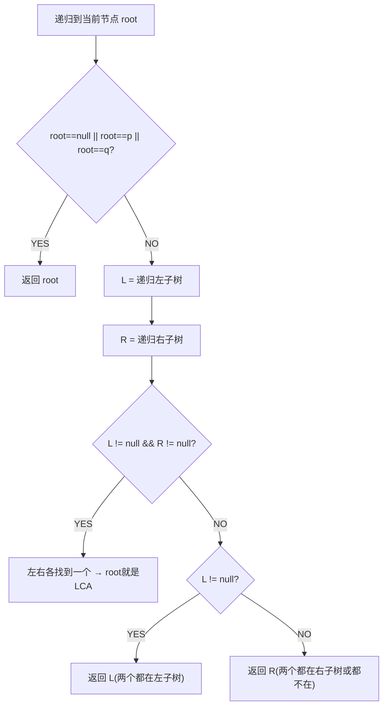
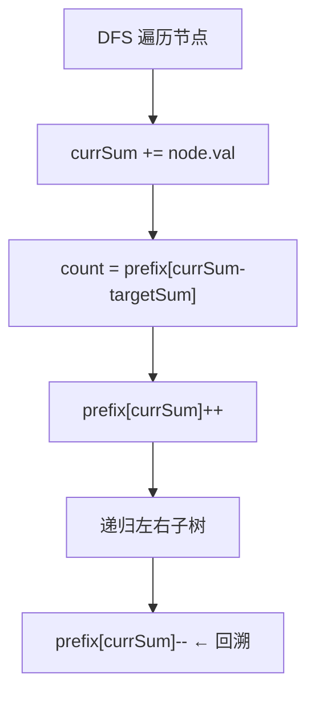
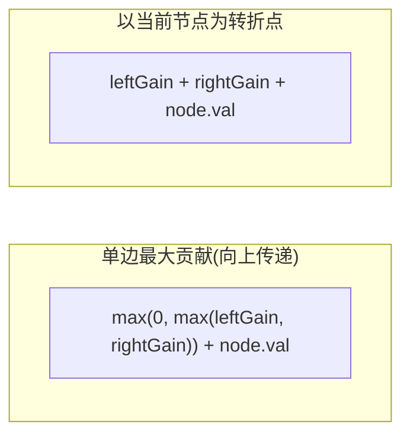
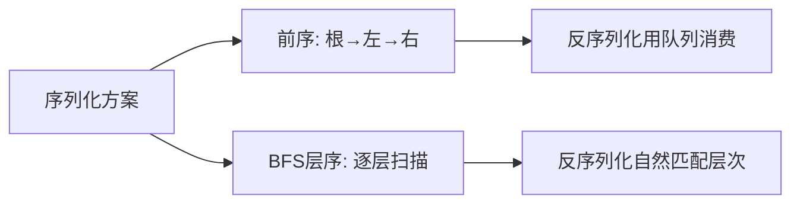

## 二叉树的遍历（前序/中序/后序）

> LeetCode 144/94/145 · ⭐ · 递归/迭代/Morris


### 066 前序遍历（根→左→右）

**迭代：栈先压右后压左**


**Java**：
```java
public List<Integer> preorderTraversal(TreeNode root) {
    List<Integer> res = new ArrayList<>();
    if (root == null) return res;
    Deque<TreeNode> stack = new ArrayDeque<>(); stack.push(root);
    while (!stack.isEmpty()) {
        TreeNode n = stack.pop(); res.add(n.val);
        if (n.right != null) stack.push(n.right);
        if (n.left != null) stack.push(n.left);
    }
    return res;
}
```

**递归**: `res.add(root.val); dfs(root.left); dfs(root.right);`

**复杂度**：O(N)/O(H)。


### 067 中序遍历（左→根→右）

**迭代：一路向左**

```java
public List<Integer> inorderTraversal(TreeNode root) {
    List<Integer> res = new ArrayList<>();
    Deque<TreeNode> stack = new ArrayDeque<>();
    TreeNode cur = root;
    while (cur != null || !stack.isEmpty()) {
        while (cur != null) { stack.push(cur); cur = cur.left; }
        cur = stack.pop(); res.add(cur.val); cur = cur.right;
    }
    return res;
}
```

**Morris O(1)空间**：利用空闲右指针建立线索。

**Python**：
```python
def inorder(root): stack,ans,cur=[],[],root; [(stack.append(cur),cur:=cur.left) if cur else (cur:=stack.pop(),ans.append(cur.val),cur:=cur.right) for _ in iter(int,1) if stack or cur]; return ans
```


### 068 后序遍历（左→右→根）

**迭代：前序(根右左)反转**

```java
public List<Integer> postorderTraversal(TreeNode root) {
    List<Integer> res = new ArrayList<>();
    if (root == null) return res;
    Deque<TreeNode> stack = new ArrayDeque<>(); stack.push(root);
    while (!stack.isEmpty()) {
        TreeNode n = stack.pop(); res.add(n.val);
        if (n.left != null) stack.push(n.left);   // 先左
        if (n.right != null) stack.push(n.right);  // 后右
    }
    Collections.reverse(res);
    return res;
}
```


### 三种遍历对比

| 遍历 | 迭代技巧 | 应用 |
|------|---------|------|
| 前序 | push(右)→push(左) | 序列化、拷贝 |
| 中序 | 一路向左入栈 | BST排序 |
| 后序 | 前序(根右左)+反转 | 删除树、自底向上 |

**相关**：[069 层序遍历](069.二叉树的层序遍历.md)、[078 验证BST](078.验证二叉搜索树.md)


## 二叉树的中序遍历（迭代+Morris）

> LeetCode 94 · ⭐

### 01. 迭代（一路向左）

```java
public List<Integer> inorderTraversal(TreeNode root) {
    List<Integer> res = new ArrayList<>();
    Deque<TreeNode> stack = new ArrayDeque<>();
    TreeNode cur = root;
    while (cur != null || !stack.isEmpty()) {
        while (cur != null) { stack.push(cur); cur = cur.left; }
        cur = stack.pop(); res.add(cur.val); cur = cur.right;
    }
    return res;
}
```

**Python**：
```python
def inorderTraversal(self, root):
    res, stack, cur = [], [], root
    while stack or cur:
        while cur: stack.append(cur); cur = cur.left
        cur = stack.pop(); res.append(cur.val); cur = cur.right
    return res
```

**复杂度**：O(N)/O(H)。

### 02. Morris 遍历（O(1)空间）

利用叶子节点的空闲右指针指向后继（中序线索）。

```java
public List<Integer> inorderTraversal(TreeNode root) {
    List<Integer> res = new ArrayList<>();
    TreeNode cur = root;
    while (cur != null) {
        if (cur.left == null) { res.add(cur.val); cur = cur.right; }
        else {
            TreeNode pre = cur.left;
            while (pre.right != null && pre.right != cur) pre = pre.right;
            if (pre.right == null) { pre.right = cur; cur = cur.left; }
            else { pre.right = null; res.add(cur.val); cur = cur.right; }
        }
    }
    return res;
}
```

**复杂度**：O(N)/O(1)。每个节点最多被访问两次。

**应用**：BST中序遍历 = 升序序列。用于验证BST、找BST第K小。

**相关**：[078 验证BST](078.验证二叉搜索树.md)


## 二叉树的后序遍历（Postorder）

> LeetCode 145 · ⭐ · 迭代巧解

### 01. 迭代：前序(根右左)反转

```java
public List<Integer> postorderTraversal(TreeNode root) {
    List<Integer> res = new ArrayList<>();
    if (root == null) return res;
    Deque<TreeNode> stack = new ArrayDeque<>(); stack.push(root);
    while (!stack.isEmpty()) {
        TreeNode n = stack.pop(); res.add(n.val);
        if (n.left != null) stack.push(n.left);    // 先左(与前序相反)
        if (n.right != null) stack.push(n.right);   // 后右
    }
    Collections.reverse(res);                        // 反转!
    return res;
}
```

**Python**：
```python
def postorderTraversal(self, root):
    if not root: return []
    stack, ans = [root], []
    while stack:
        n = stack.pop(); ans.append(n.val)
        if n.left: stack.append(n.left)
        if n.right: stack.append(n.right)
    return ans[::-1]
```

**原理**：前序(根→右→左).reverse() = 左→右→根 = 后序。

**应用**：自底向上计算（高度/直径/最大路径和/删除树）。

**相关**：[074 直径](074.二叉树的直径.md)、[084 最大路径和](084.二叉树中的最大路径和.md)


## 二叉树的层序遍历 / 锯齿形层序遍历

> LeetCode 102/103 · ⭐⭐ · BFS

### 069 层序遍历 (102)

```java
public List<List<Integer>> levelOrder(TreeNode root) {
    List<List<Integer>> ans = new ArrayList<>();
    if (root == null) return ans;
    Queue<TreeNode> q = new LinkedList<>(); q.offer(root);
    while (!q.isEmpty()) {
        int size = q.size(); List<Integer> level = new ArrayList<>();
        for (int i = 0; i < size; i++) {
            TreeNode n = q.poll(); level.add(n.val);
            if (n.left != null) q.offer(n.left);
            if (n.right != null) q.offer(n.right);
        }
        ans.add(level);
    }
    return ans;
}
```

**Python**：
```python
def levelOrder(self, root):
    if not root: return []
    from collections import deque
    q, ans = deque([root]), []
    while q:
        level = []
        for _ in range(len(q)):
            n = q.popleft(); level.append(n.val)
            if n.left: q.append(n.left)
            if n.right: q.append(n.right)
        ans.append(level)
    return ans
```

**复杂度**：O(N)/O(N)。

### 070 锯齿形层序遍历 (103)

加一个 `boolean leftToRight` 标记，逆序时头插或用 LinkedList。

```java
public List<List<Integer>> zigzagLevelOrder(TreeNode root) {
    List<List<Integer>> ans = new ArrayList<>();
    if (root == null) return ans;
    Queue<TreeNode> q = new LinkedList<>(); q.offer(root);
    boolean lr = true;
    while (!q.isEmpty()) {
        int size = q.size(); LinkedList<Integer> level = new LinkedList<>();
        for (int i = 0; i < size; i++) {
            TreeNode n = q.poll();
            if (lr) level.addLast(n.val); else level.addFirst(n.val);
            if (n.left != null) q.offer(n.left);
            if (n.right != null) q.offer(n.right);
        }
        ans.add(level); lr = !lr;
    }
    return ans;
}
```

**相关**：[085 序列化](085.序列化与反序列化二叉树.md)、[080 右视图](080.二叉树的右视图.md)


## E005 二叉树的锯齿形层序遍历

> LeetCode 103 · ⭐⭐ · BFS+方向标记

### 01. 题目

层序遍历，但奇数层从左到右，偶数层从右到左。

### 02. 分析

BFS 框架不变，用 `boolean leftToRight` 标记当前层方向。每层结束后翻转或用 LinkedList 头插/尾插。

### 03. 代码

**Java**：
```java
public List<List<Integer>> zigzagLevelOrder(TreeNode root) {
    List<List<Integer>> ans = new ArrayList<>();
    if (root == null) return ans;
    Queue<TreeNode> q = new LinkedList<>(); q.offer(root);
    boolean leftToRight = true;
    while (!q.isEmpty()) {
        int size = q.size();
        LinkedList<Integer> level = new LinkedList<>();
        for (int i = 0; i < size; i++) {
            TreeNode node = q.poll();
            if (leftToRight) level.addLast(node.val);
            else level.addFirst(node.val);
            if (node.left != null) q.offer(node.left);
            if (node.right != null) q.offer(node.right);
        }
        ans.add(level); leftToRight = !leftToRight;
    }
    return ans;
}
```

**Python**：
```python
def zigzagLevelOrder(self, root):
    if not root: return []
    from collections import deque
    q, ans, left = deque([root]), [], True
    while q:
        level = deque()
        for _ in range(len(q)):
            node = q.popleft()
            if left: level.append(node.val)
            else: level.appendleft(node.val)
            if node.left: q.append(node.left)
            if node.right: q.append(node.right)
        ans.append(list(level)); left = not left
    return ans
```

**复杂度**：O(N)/O(N)。**相关**：[E004 层序](E004-二叉树的层序遍历.md)


## 深度 / 对称 / 翻转 / 直径

> LeetCode 104/101/226/543 · ⭐ · 递归基本功

### 071 最大深度 (104)

```java
public int maxDepth(TreeNode root) { return root == null ? 0 : 1 + Math.max(maxDepth(root.left), maxDepth(root.right)); }
```

### 072 对称二叉树 (101)

```java
public boolean isSymmetric(TreeNode root) { return mirror(root, root); }
boolean mirror(TreeNode a, TreeNode b) { if (a == null && b == null) return true; if (a == null || b == null) return false; return a.val == b.val && mirror(a.left, b.right) && mirror(a.right, b.left); }
```

### 073 翻转二叉树 (226)

```java
public TreeNode invertTree(TreeNode root) { if (root == null) return null; TreeNode left = invertTree(root.left), right = invertTree(root.right); root.left = right; root.right = left; return root; }
```

**Python**：`root.left, root.right = invertTree(root.right), invertTree(root.left)`

### 074 二叉树的直径 (543)

```java
int max = 0;
public int diameterOfBinaryTree(TreeNode root) { depth(root); return max; }
int depth(TreeNode node) { if (node == null) return 0; int L = depth(node.left), R = depth(node.right); max = Math.max(max, L + R); return 1 + Math.max(L, R); }
```

**核心**：直径 = 左子树深度 + 右子树深度。后序遍历更新全局最大。

| | 深度 | 直径 |
|------|:---:|:---:|
| 返回值 | `1+max(L,R)` | `L+R` |
| 含义 | 节点高度 | 经过该节点的最长路径 |

**相关**：[084 最大路径和](084.二叉树中的最大路径和.md)


## E007 对称二叉树

> LeetCode 101 · ⭐ · 递归镜像检查

### 01. 题目

判断二叉树是否轴对称。

### 02. 分析

两棵树互为镜像 ⇔ 根值相等 且 t1.left == t2.right 且 t1.right == t2.left。

### 03. 代码

**Java**：
```java
public boolean isSymmetric(TreeNode root) {
    return isMirror(root, root);
}
boolean isMirror(TreeNode t1, TreeNode t2) {
    if (t1 == null && t2 == null) return true;
    if (t1 == null || t2 == null) return false;
    return t1.val == t2.val && isMirror(t1.left, t2.right) && isMirror(t1.right, t2.left);
}
```

**Python**：
```python
def isSymmetric(self, root):
    def mirror(t1, t2):
        if not t1 and not t2: return True
        if not t1 or not t2: return False
        return t1.val == t2.val and mirror(t1.left, t2.right) and mirror(t1.right, t2.left)
    return mirror(root, root)
```

**C++**：
```cpp
bool isMirror(TreeNode* t1, TreeNode* t2) {
    if (!t1 && !t2) return true;
    if (!t1 || !t2) return false;
    return t1->val == t2->val && isMirror(t1->left, t2->right) && isMirror(t1->right, t2->left);
}
bool isSymmetric(TreeNode* root) { return isMirror(root, root); }
```

**复杂度**：O(N)/O(H)。


## E008 翻转二叉树

> LeetCode 226 · ⭐ · 递归

### 01. 代码

**Java**：
```java
public TreeNode invertTree(TreeNode root) {
    if (root == null) return null;
    TreeNode left = invertTree(root.left);
    TreeNode right = invertTree(root.right);
    root.left = right; root.right = left;
    return root;
}
```

**Python**：
```python
def invertTree(self, root):
    if not root: return None
    root.left, root.right = self.invertTree(root.right), self.invertTree(root.left)
    return root
```

**复杂度**：O(N)/O(H)。


## 二叉树的直径（Diameter）

> LeetCode 543 · ⭐ · 后序+全局变量

### 01. 题目

二叉树的直径 = 任意两节点最长路径（边数）。

### 02. 分析

直径 = 左子树深度 + 右子树深度。后序遍历更新全局最大。

```java
int max = 0;
public int diameterOfBinaryTree(TreeNode root) { depth(root); return max; }
int depth(TreeNode node) {
    if (node == null) return 0;
    int L = depth(node.left), R = depth(node.right);
    max = Math.max(max, L + R);          // 以当前节点为转折的路径
    return 1 + Math.max(L, R);           // 当前子树深度
}
```

**Python**：
```python
def diameterOfBinaryTree(self, root):
    self.ans = 0
    def depth(n):
        if not n: return 0
        L, R = depth(n.left), depth(n.right)
        self.ans = max(self.ans, L + R)
        return 1 + max(L, R)
    depth(root); return self.ans
```

**复杂度**：O(N)/O(H)。

**核心启示**：直径与最大路径和是同一模板——返回值是"单边"，全局是"双边"。

**相关**：[084 最大路径和](084.二叉树中的最大路径和.md)


## 二叉树的最近公共祖先（LCA）

> LeetCode 236 · ⭐⭐ · 后序遍历


### 01. 题目描述

找出二叉树中两个节点 `p` 和 `q` 的最近公共祖先。

```
       3
     /   \
    5     1
   / \   / \
  6   2 0   8
     / \
    7   4

p=5, q=1 → LCA=3
p=5, q=4 → LCA=5
```


### 02. 题目分析

**2.1 核心思路**



**2.2 三种情况**

| 情况 | 判断条件 | 返回值 | 示例 |
|------|---------|--------|------|
| 分布在左右 | `L!=null && R!=null` | root | p=5,q=1 → 3 |
| 都在左 | `L!=null` | L | p=5,q=4 → 5 |
| 都在右 | `R!=null` | R | — |


### 03. 代码

**Java**：
```java
public TreeNode lowestCommonAncestor(TreeNode root, TreeNode p, TreeNode q) {
    if (root == null || root == p || root == q) return root;
    TreeNode left = lowestCommonAncestor(root.left, p, q);
    TreeNode right = lowestCommonAncestor(root.right, p, q);
    if (left != null && right != null) return root;     // 分布在左右
    return left != null ? left : right;                  // 都在一侧
}
```

**Python**：
```python
def lowestCommonAncestor(self, root, p, q):
    if not root or root == p or root == q: return root
    left = self.lowestCommonAncestor(root.left, p, q)
    right = self.lowestCommonAncestor(root.right, p, q)
    if left and right: return root
    return left or right
```

**C++**：
```cpp
TreeNode* lowestCommonAncestor(TreeNode* root, TreeNode* p, TreeNode* q) {
    if (!root || root == p || root == q) return root;
    auto left = lowestCommonAncestor(root->left, p, q);
    auto right = lowestCommonAncestor(root->right, p, q);
    if (left && right) return root;
    return left ? left : right;
}
```

**复杂度**：O(N)/O(H)。


### 04. BST 版本 LCA

若为 BST，可利用有序性质 O(logN)：

```java
public TreeNode lowestCommonAncestor(TreeNode root, TreeNode p, TreeNode q) {
    if (root.val > p.val && root.val > q.val) return lowestCommonAncestor(root.left, p, q);
    if (root.val < p.val && root.val < q.val) return lowestCommonAncestor(root.right, p, q);
    return root; // 一个在左一个在右
}
```

**相关**：[084 最大路径和](084.二叉树中的最大路径和.md)


## 从前序/中序/后序遍历构造二叉树

> LeetCode 105/106 · ⭐⭐ · 分治+HashMap

### 076 前序+中序 (105)

前序第一个是根，HashMap存中序 `val→idx`（O(1)找根位置）。递归划分左右子树。

```java
Map<Integer, Integer> map = new HashMap<>(); int preIdx = 0;
public TreeNode buildTree(int[] pre, int[] in) {
    for (int i = 0; i < in.length; i++) map.put(in[i], i);
    return build(pre, 0, in.length - 1);
}
TreeNode build(int[] pre, int inL, int inR) {
    if (inL > inR) return null;
    int val = pre[preIdx++], idx = map.get(val);
    TreeNode root = new TreeNode(val);
    root.left = build(pre, inL, idx - 1);
    root.right = build(pre, idx + 1, inR);
    return root;
}
```

### 077 中序+后序 (106)

后序最后一个是根。从后往前消费 → 先右后左。

```java
Map<Integer, Integer> map = new HashMap<>(); int postIdx;
public TreeNode buildTree(int[] in, int[] post) {
    for (int i = 0; i < in.length; i++) map.put(in[i], i);
    postIdx = post.length - 1;
    return build(post, 0, in.length - 1);
}
TreeNode build(int[] post, int inL, int inR) {
    if (inL > inR) return null;
    int val = post[postIdx--], idx = map.get(val);
    TreeNode root = new TreeNode(val);
    root.right = build(post, idx + 1, inR);  // 先右！
    root.left = build(post, inL, idx - 1);
    return root;
}
```

**对比**：

| | 前序+中序 | 中序+后序 |
|------|:---:|:---:|
| 根位置 | pre[preIdx++] | post[postIdx--] |
| 递归顺序 | 左→右 | **右→左** |

**复杂度**：O(N)/O(N)。

**相关**：[079 有序数组→BST](079.将有序数组转换为二叉搜索树.md)


## E012 从中序与后序遍历构造二叉树

> LeetCode 106 · ⭐⭐ · 分治+哈希

### 01. 分析

后序最后一个元素是根，从后往前消费：根→右→左。所以先递归右子树再左子树。

### 02. 代码

**Java**：
```java
Map<Integer, Integer> map = new HashMap<>(); int postIdx;
public TreeNode buildTree(int[] inorder, int[] postorder) {
    for (int i = 0; i < inorder.length; i++) map.put(inorder[i], i);
    postIdx = postorder.length - 1;
    return build(postorder, 0, inorder.length - 1);
}
TreeNode build(int[] post, int inL, int inR) {
    if (inL > inR) return null;
    int val = post[postIdx--];
    TreeNode root = new TreeNode(val);
    int idx = map.get(val);
    root.right = build(post, idx + 1, inR);
    root.left = build(post, inL, idx - 1);
    return root;
}
```

**Python**：
```python
def buildTree(self, inorder, postorder):
    mp = {v: i for i, v in enumerate(inorder)}
    self.pi = len(postorder) - 1
    def build(inL, inR):
        if inL > inR: return None
        val = postorder[self.pi]; self.pi -= 1
        root = TreeNode(val)
        idx = mp[val]
        root.right = build(idx + 1, inR)
        root.left = build(inL, idx - 1)
        return root
    return build(0, len(inorder) - 1)
```

**复杂度**：O(N)/O(N)。**相关**：[E011 前中序构造](E011-从前序与中序遍历构造二叉树.md)


## 验证BST / 数组→BST / 右视图

> LeetCode 98/108/199

### 078 验证BST (98)

两种方法：范围约束（传 min/max）或中序遍历（严格递增）。

```java
public boolean isValidBST(TreeNode root) { return valid(root, Long.MIN_VALUE, Long.MAX_VALUE); }
boolean valid(TreeNode n, long min, long max) { if (n == null) return true; if (n.val <= min || n.val >= max) return false; return valid(n.left, min, n.val) && valid(n.right, n.val, max); }
```

**Python**：
```python
def isValidBST(self, root, lo=float('-inf'), hi=float('inf')):
    return not root or (lo < root.val < hi and self.isValidBST(root.left, lo, root.val) and self.isValidBST(root.right, root.val, hi))
```

### 079 有序数组→BST (108)

每次取中间元素做根，分治构造平衡BST。

```java
public TreeNode sortedArrayToBST(int[] nums) { return build(nums, 0, nums.length-1); }
TreeNode build(int[] nums, int l, int r) { if (l>r) return null; int m=l+(r-l)/2; TreeNode root=new TreeNode(nums[m]); root.left=build(nums,l,m-1); root.right=build(nums,m+1,r); return root; }
```

### 080 右视图 (199)

DFS 根→右→左，深度==res.size() 时记录。

```java
List<Integer> res = new ArrayList<>();
public List<Integer> rightSideView(TreeNode root) { dfs(root, 0); return res; }
void dfs(TreeNode n, int d) { if (n == null) return; if (d == res.size()) res.add(n.val); dfs(n.right, d+1); dfs(n.left, d+1); }
```

**复杂度**：均 O(N)/O(H)。

**相关**：[067 中序遍历](067.二叉树的中序遍历.md)、[069 层序遍历](069.二叉树的层序遍历.md)


## E014 将有序数组转换为二叉搜索树

> LeetCode 108 · ⭐ · 分治+中点

### 01. 代码

**Java**：
```java
public TreeNode sortedArrayToBST(int[] nums) {
    return build(nums, 0, nums.length - 1);
}
TreeNode build(int[] nums, int l, int r) {
    if (l > r) return null;
    int m = l + (r - l) / 2;
    TreeNode root = new TreeNode(nums[m]);
    root.left = build(nums, l, m - 1);
    root.right = build(nums, m + 1, r);
    return root;
}
```

**Python**：
```python
def sortedArrayToBST(self, nums):
    def build(l, r):
        if l > r: return None
        m = (l + r) // 2
        root = TreeNode(nums[m])
        root.left = build(l, m - 1)
        root.right = build(m + 1, r)
        return root
    return build(0, len(nums) - 1)
```

**复杂度**：O(N)/O(logN)。


## E015 二叉树的右视图

> LeetCode 199 · ⭐⭐ · BFS/DFS

### 01. 分析

BFS: 每层最后一个节点。DFS: 根→右→左，深度==res.size()时记录。

### 02. 代码

**Java (DFS)**：
```java
List<Integer> res = new ArrayList<>();
public List<Integer> rightSideView(TreeNode root) {
    dfs(root, 0); return res;
}
void dfs(TreeNode node, int depth) {
    if (node == null) return;
    if (depth == res.size()) res.add(node.val);
    dfs(node.right, depth + 1);
    dfs(node.left, depth + 1);
}
```

**Python**：
```python
def rightSideView(self, root):
    res = []
    def dfs(node, d):
        if not node: return
        if d == len(res): res.append(node.val)
        dfs(node.right, d+1); dfs(node.left, d+1)
    dfs(root, 0)
    return res
```

**复杂度**：O(N)/O(H)。**相关**：[E004 层序](E004-二叉树的层序遍历.md)


## 路径总和 III（Path Sum III）

> LeetCode 437 · ⭐⭐ · 前缀和+DFS回溯


### 01. 题目描述

统计二叉树中路径和等于 `targetSum` 的路径数。路径必须向下，不需要从根开始或到叶子结束。

**示例**：

```
root = [10,5,-3,3,2,null,11,3,-2,null,1], targetSum = 8
输出：3

路径1: 5→3
路径2: 5→2→1  
路径3: -3→11
```


### 02. 题目分析

**2.1 朴素思路：两次DFS O(N²)**

对每个节点作为起点，DFS 向下统计路径。O(N²)，大数据超时。

**2.2 前缀和+回溯 O(N)**



**核心公式**：同 A014 前缀和 `sum(i,j)=pre[j]-pre[i-1]=K`。

**2.3 手推**

```
        10
       /  \
      5   -3
     / \    \
    3   2   11
   /    \
  3     -2
 /
1    targetSum = 8

currSum=10: prefix[10-8=2]=0 → 0条
currSum=15: prefix[15-8=7]=0 → 0条
currSum=18: prefix[18-8=10]=1 → 1条 (3→10... 即 5→3)
...
```


### 03. 代码

**Java**：
```java
public int pathSum(TreeNode root, int targetSum) {
    Map<Long, Integer> prefix = new HashMap<>();
    prefix.put(0L, 1);                                // 空前缀
    return dfs(root, 0L, targetSum, prefix);
}
int dfs(TreeNode node, long sum, int target, Map<Long, Integer> prefix) {
    if (node == null) return 0;
    sum += node.val;
    int count = prefix.getOrDefault(sum - target, 0); // 以当前节点结尾的有效路径数
    prefix.merge(sum, 1, Integer::sum);               // 加入当前前缀
    count += dfs(node.left, sum, target, prefix);
    count += dfs(node.right, sum, target, prefix);
    prefix.merge(sum, -1, Integer::sum);              // 回溯
    return count;
}
```

**Python**：
```python
def pathSum(self, root, targetSum):
    prefix = {0: 1}
    def dfs(node, s):
        if not node: return 0
        s += node.val
        cnt = prefix.get(s - targetSum, 0)
        prefix[s] = prefix.get(s, 0) + 1
        cnt += dfs(node.left, s) + dfs(node.right, s)
        prefix[s] -= 1
        return cnt
    return dfs(root, 0)
```

**C++**：
```cpp
int pathSum(TreeNode* root, int target) {
    unordered_map<long, int> prefix{{0, 1}};
    function<int(TreeNode*,long)> dfs = [&](TreeNode* n, long s) {
        if (!n) return 0; s += n->val;
        int cnt = prefix[s - target];
        prefix[s]++; cnt += dfs(n->left, s) + dfs(n->right, s);
        prefix[s]--; return cnt;
    };
    return dfs(root, 0);
}
```

**复杂度**：O(N)/O(N)。


### 04. 总结

| 核心 | 说明 |
|------|------|
| 前缀和公式 | `prefix[currSum-K]` = 以当前结尾的有效路径数 |
| 回溯 | 返回父节点时移除当前前缀 |
| 初始化 `{0:1}` | 处理从根开始的路径 |

**相关**：[A014 和为K的子数组](../07.数组算法题/014-A-和为K的子数组.md)


## 把二叉搜索树转换为累加树 / 展开为链表

> LeetCode 538/114 · ⭐⭐ · 逆中序 / O(1)空间

### 082 累加树 (538)

BST 的逆中序遍历（右→根→左）= 降序序列。维护累加和 `sum`，每次 `sum += node.val; node.val = sum`。

```java
int sum = 0;
public TreeNode convertBST(TreeNode root) {
    if (root == null) return null;
    convertBST(root.right);
    sum += root.val; root.val = sum;
    convertBST(root.left);
    return root;
}
```

**Python**：
```python
def convertBST(self, root):
    self.s = 0
    def dfs(n):
        if not n: return
        dfs(n.right); self.s += n.val; n.val = self.s; dfs(n.left)
    dfs(root); return root
```

**复杂度**：O(N)/O(H)。

### 083 二叉树展开为链表 (114)

Morris-like 技巧 O(1) 空间：对每个节点，找到左子树最右节点，把右子树接到它的右指针。

```java
public void flatten(TreeNode root) {
    TreeNode cur = root;
    while (cur != null) {
        if (cur.left != null) {
            TreeNode pre = cur.left;
            while (pre.right != null) pre = pre.right; // 找前驱
            pre.right = cur.right;                       // 右子树接到前驱
            cur.right = cur.left;                        // 左子树→右
            cur.left = null;
        }
        cur = cur.right;
    }
}
```

**Python**：
```python
def flatten(self, root):
    cur = root
    while cur:
        if cur.left:
            pre = cur.left
            while pre.right: pre = pre.right
            pre.right = cur.right; cur.right = cur.left; cur.left = None
        cur = cur.right
```

**复杂度**：O(N)/O(1)。**相关**：[066 前序遍历](066.二叉树的前序遍历.md)


## E018 二叉树展开为链表

> LeetCode 114 · ⭐⭐ · 前序+O(1)空间

### 01. 分析

对于每个节点，若左子树非空：找到左子树最右节点（前驱），将右子树接到其右指针，左子树移到右子树位置，左置空。继续处理下一个节点。

### 02. 代码

**Java**：
```java
public void flatten(TreeNode root) {
    TreeNode cur = root;
    while (cur != null) {
        if (cur.left != null) {
            TreeNode pre = cur.left;
            while (pre.right != null) pre = pre.right;
            pre.right = cur.right;
            cur.right = cur.left;
            cur.left = null;
        }
        cur = cur.right;
    }
}
```

**Python**：
```python
def flatten(self, root):
    cur = root
    while cur:
        if cur.left:
            pre = cur.left
            while pre.right: pre = pre.right
            pre.right = cur.right
            cur.right = cur.left
            cur.left = None
        cur = cur.right
```

**复杂度**：O(N)/O(1)。**相关**：[E001 中序Morris](E001-二叉树遍历.md)


## 二叉树中的最大路径和（Binary Tree Maximum Path Sum）

> LeetCode 124 · ⭐⭐⭐ · 后序+贡献值


### 01. 题目描述

路径 = 任意起点到任意终点的节点序列（每个节点最多一次）。求最大路径和。

**示例 1**：

```
输入：root = [1,2,3]

    1
   / \
  2   3

输出：6  (2→1→3)
```

**示例 2**：

```
输入：root = [-10,9,20,null,null,15,7]

  -10
  /  \
 9   20
    /  \
   15   7

输出：42  (15→20→7)
```


### 02. 题目分析

**2.1 核心概念：单边贡献 vs 全局最大**



对每个节点，我们计算两个值：

| 值 | 含义 | 去向 |
|------|------|------|
| `单边贡献` | 以当前节点为一端向下的最大路径和 | 返回给父节点 |
| `全局最大` | 以当前节点为转折点的路径和 | 更新全局答案 |

**2.2 为什么负数贡献取 0？**

如果子树贡献为负，那就不选它——`max(0, leftGain)` 相当于"切断该分支"。

**2.3 手推演示**

```
       -10
       /  \
      9   20
          /  \
         15   7

叶节点 9:   gain=9, maxPath=9
叶节点 15:  gain=15, maxPath=15
叶节点 7:   gain=7, maxPath=7

节点 20:
  leftGain=15, rightGain=7
  gain = max(0,max(15,7))+20 = 35     ← 返回给-10
  maxPath = max(7, 15+7+20) = 42      ← 全局答案！

节点 -10:
  leftGain=9, rightGain=35
  gain = max(0,max(9,35))+(-10) = 25
  maxPath = max(42, 9+35+(-10)) = 42

最终：42
```


### 03. 代码

**Java**：
```java
int ans = Integer.MIN_VALUE;
public int maxPathSum(TreeNode root) { gain(root); return ans; }

int gain(TreeNode node) {
    if (node == null) return 0;
    int L = Math.max(0, gain(node.left));   // 负数舍弃
    int R = Math.max(0, gain(node.right));
    ans = Math.max(ans, L + R + node.val);  // 更新全局最大
    return Math.max(L, R) + node.val;        // 单边贡献
}
```

**Python**：
```python
def maxPathSum(self, root: TreeNode) -> int:
    self.ans = float('-inf')
    def gain(node):
        if not node: return 0
        L = max(0, gain(node.left))
        R = max(0, gain(node.right))
        self.ans = max(self.ans, L + R + node.val)
        return max(L, R) + node.val
    gain(root)
    return self.ans
```

**C++**：
```cpp
int ans = INT_MIN;
int maxPathSum(TreeNode* root) { gain(root); return ans; }
int gain(TreeNode* node) {
    if (!node) return 0;
    int L = max(0, gain(node->left)), R = max(0, gain(node->right));
    ans = max(ans, L + R + node->val);
    return max(L, R) + node->val;
}
```

**复杂度**：O(N)/O(H)。


### 04. 与 LCA 的对比

| | LCA | 最大路径和 |
|------|------|------|
| 遍历方式 | 后序 | 后序 |
| 向上传递 | 找到的节点 | 单边最大贡献 |
| 全局判断 | L&&R → root | `ans=max(ans, L+R+val)` |
| 复杂度 | O(N) | O(N) |


### 05. 总结

| 核心启示 | 说明 |
|---------|------|
| 贡献值 | `max(0, max(L,R)) + val` = 单边向上传递 |
| 转折点 | `L + R + val` = 以当前为转折的完整路径 |
| 负数舍弃 | `max(0, gain)` 切断负贡献分支 |

**相关**：[074 二叉树的直径](074.二叉树的直径.md)、[075 最近公共祖先](075.二叉树的最近公共祖先.md)


## 序列化与反序列化二叉树（Serialize and Deserialize）

> LeetCode 297 · ⭐⭐⭐ · BFS 层序序列化


### 01. 题目描述

设计算法将二叉树序列化为字符串，再反序列化还原二叉树。

**示例**：

```
    1
   / \
  2   3
     / \
    4   5

序列化 → "1,2,3,null,null,4,5,null,null,null,null"
```


### 02. 题目分析

**2.1 为什么用 BFS？**



**BFS 优势**：序列化和反序列化都自然是"从左到右逐层"的，不需要额外标记。

**2.2 空节点必须记录**

不记录 `null` 无法区分 `[1,null,2]` 和 `[1,2]`。

**2.3 序列化流程**

```
BFS 遍历每个节点：
  - node != null → 记录 val，左右子节点入队
  - node == null → 记录 "null"
```

**2.4 反序列化流程**

```
vals = split(data)
root = new TreeNode(vals[0])
队列初始化 = [root]
i = 1
while 队列非空：
  弹出 node
  vals[i] != "null" → node.left = new TreeNode, 入队
  i++
  vals[i] != "null" → node.right = new TreeNode, 入队
  i++
```


### 03. 代码

**Java**：
```java
public String serialize(TreeNode root) {
    if (root == null) return "null";
    StringBuilder sb = new StringBuilder();
    Queue<TreeNode> q = new LinkedList<>(); q.offer(root);
    while (!q.isEmpty()) {
        TreeNode n = q.poll();
        if (n == null) sb.append("null,");
        else { sb.append(n.val).append(","); q.offer(n.left); q.offer(n.right); }
    }
    return sb.toString();
}

public TreeNode deserialize(String data) {
    if ("null".equals(data)) return null;
    String[] vals = data.split(",");
    TreeNode root = new TreeNode(Integer.parseInt(vals[0]));
    Queue<TreeNode> q = new LinkedList<>(); q.offer(root);
    for (int i = 1; i < vals.length; i += 2) {
        TreeNode node = q.poll();
        if (!"null".equals(vals[i])) {
            node.left = new TreeNode(Integer.parseInt(vals[i])); q.offer(node.left);
        }
        if (i + 1 < vals.length && !"null".equals(vals[i + 1])) {
            node.right = new TreeNode(Integer.parseInt(vals[i + 1])); q.offer(node.right);
        }
    }
    return root;
}
```

**Python**：
```python
class Codec:
    def serialize(self, root):
        if not root: return "null"
        res, q = [], deque([root])
        while q:
            node = q.popleft()
            if not node: res.append("null")
            else: res.append(str(node.val)); q.append(node.left); q.append(node.right)
        return ",".join(res)

    def deserialize(self, data):
        if data == "null": return None
        vals = data.split(",")
        root = TreeNode(int(vals[0]))
        q = deque([root])
        i = 1
        while q and i < len(vals):
            node = q.popleft()
            if vals[i] != "null": node.left = TreeNode(int(vals[i])); q.append(node.left)
            i += 1
            if i < len(vals) and vals[i] != "null": node.right = TreeNode(int(vals[i])); q.append(node.right)
            i += 1
        return root
```

**C++**：
```cpp
string serialize(TreeNode* root) {
    if (!root) return "null";
    string res; queue<TreeNode*> q; q.push(root);
    while (!q.empty()) {
        auto n = q.front(); q.pop();
        if (!n) res += "null,";
        else { res += to_string(n->val) + ","; q.push(n->left); q.push(n->right); }
    }
    return res;
}
TreeNode* deserialize(string data) {
    if (data == "null") return nullptr;
    vector<string> vals; stringstream ss(data); string s;
    while (getline(ss, s, ',')) vals.push_back(s);
    auto root = new TreeNode(stoi(vals[0]));
    queue<TreeNode*> q; q.push(root);
    for (int i = 1; i < vals.size(); i += 2) {
        auto node = q.front(); q.pop();
        if (vals[i] != "null") { node->left = new TreeNode(stoi(vals[i])); q.push(node->left); }
        if (i+1 < vals.size() && vals[i+1] != "null") { node->right = new TreeNode(stoi(vals[i+1])); q.push(node->right); }
    }
    return root;
}
```

**复杂度**：O(N)/O(N)。


### 04. 总结

| 要点 | 说明 |
|------|------|
| 空节点必须存 | `null` 保留结构信息 |
| BFS 自然 | 序列化=层序遍历，反序列化=逐层建树 |
| 队列同步 | 序列化和反序列化共享同一队列逻辑 |

**相关**：[069 层序遍历](069.二叉树的层序遍历.md)


