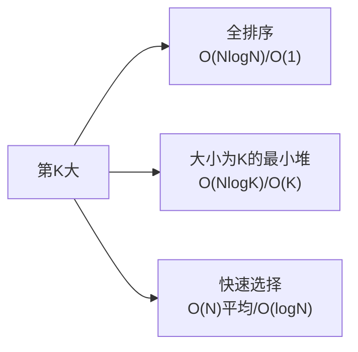
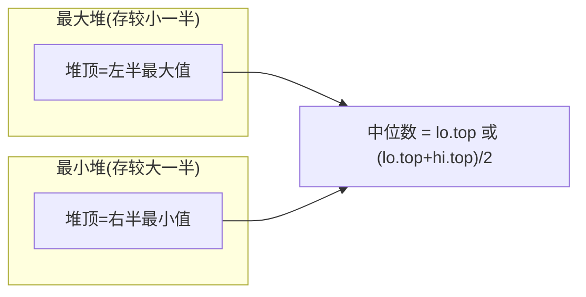
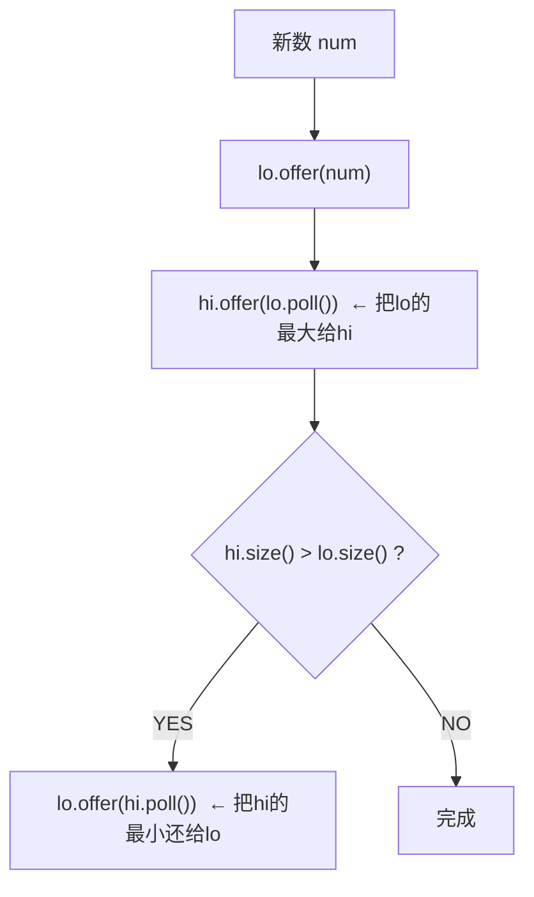
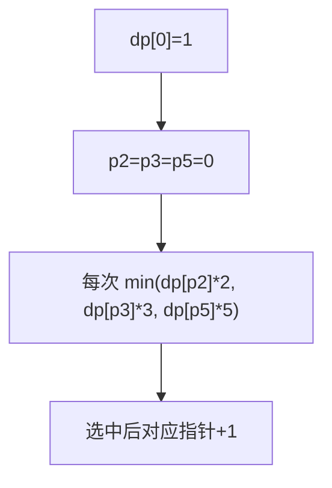
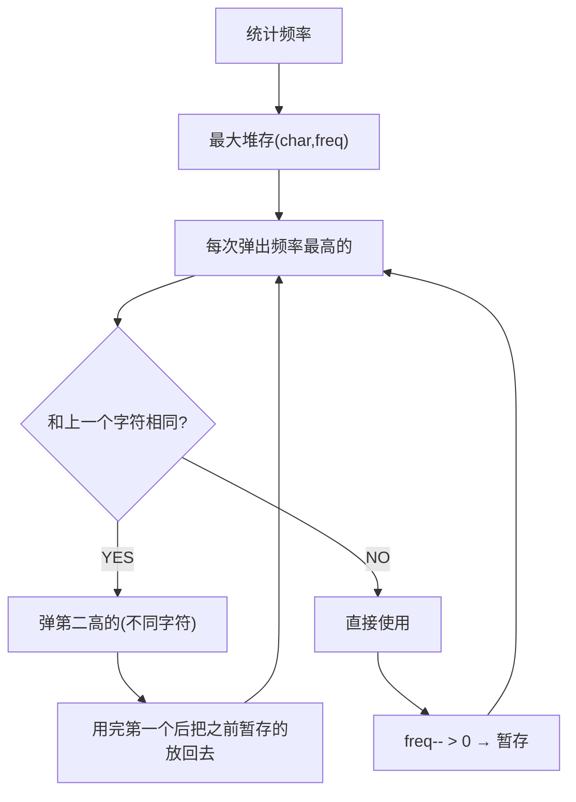
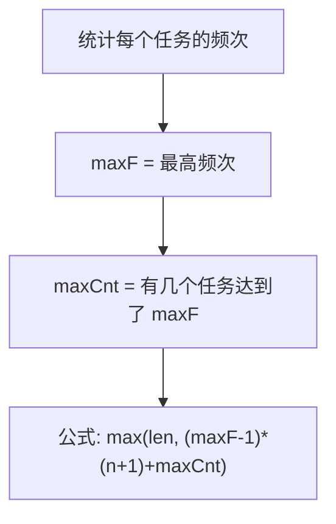
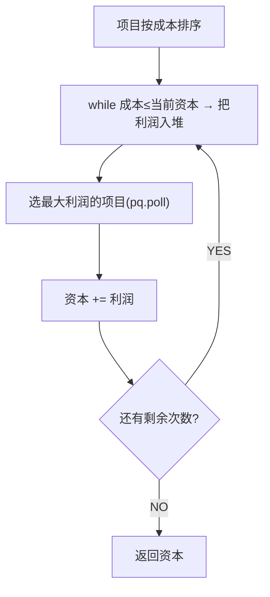

# 数组中的第 K 个最大元素（Kth Largest Element）

> LeetCode 215 · ⭐⭐ · 快速选择 / 堆
>
> 一道题考察了排序、堆、快速选择三种思路。面试首选快速选择（O(N) 平均），次选大小为 K 的最小堆（O(NlogK)）。

---

## 01. 题目描述

**示例 1**：
```
输入：nums = [3,2,1,5,6,4], k = 2
输出：5
```

**示例 2**：
```
输入：nums = [3,2,3,1,2,4,5,5,6], k = 4
输出：4
```

---

## 02. 题目分析：三种思维的演变



| 解法 | 时间 | 空间 | 核心思想 |
|------|:---:|:---:|------|
| 全排序 | O(NlogN) | O(1) | 直接取第K个 |
| 最小堆 | O(NlogK) | O(K) | 维护K个"候选最大值" |
| **快速选择** | **O(N)平均** | O(logN) | 快排partition，只递归一侧 |

### 2.1 最小堆为什么是大小为K的**最小**堆？

堆顶是堆中最小值。当堆大小>K时，弹出最小值——**淘汰最小的，保留K个最大的**。最终堆顶就是第K大。

```
nums = [3,2,1,5,6,4], k=2

3入堆: pq=[3]
2入堆: pq=[2,3]  堆顶=2(第2大)  size=2, 不需要弹出
1入堆: pq=[1,2,3] → poll去掉1 → pq=[2,3]  堆顶=2
5入堆: pq=[2,3,5] → poll去掉2 → pq=[3,5]  堆顶=3
6入堆: pq=[3,5,6] → poll去掉3 → pq=[5,6]  堆顶=5
4入堆: pq=[4,5,6] → poll去掉4 → pq=[5,6]  堆顶=5 ←答案
```

### 2.2 快速选择的直觉

快排的 partition 把数组分成 `[小于pivot] | pivot | [大于pivot]`。pivot 的 index 如果 == N-K，它就是答案。否则只递归一侧。

---

## 03. 解法一：最小堆（O(NlogK)）

```java
public int findKthLargest(int[] nums, int k) {
    PriorityQueue<Integer> pq = new PriorityQueue<>(); // 默认最小堆
    for (int n : nums) {
        pq.offer(n);
        if (pq.size() > k) pq.poll();   // 淘汰最小的
    }
    return pq.peek();
}
```

**Python**：
```python
def findKthLargest(self, nums: List[int], k: int) -> int:
    import heapq
    pq = []
    for n in nums:
        heapq.heappush(pq, n)
        if len(pq) > k: heapq.heappop(pq)
    return pq[0]
```

**C++**：
```cpp
int findKthLargest(vector<int>& nums, int k) {
    priority_queue<int, vector<int>, greater<int>> pq;
    for (int n : nums) { pq.push(n); if (pq.size() > k) pq.pop(); }
    return pq.top();
}
```

**复杂度**：O(NlogK) / O(K)。

---

## 04. 解法二：快速选择（O(N) 平均）

```java
public int findKthLargest(int[] nums, int k) {
    return quickSelect(nums, 0, nums.length - 1, nums.length - k);
}
int quickSelect(int[] a, int l, int r, int k) {
    int pivot = a[r], i = l;
    for (int j = l; j < r; j++)
        if (a[j] <= pivot) swap(a, i++, j);
    swap(a, i, r);
    if (i == k) return a[i];
    return i < k ? quickSelect(a, i + 1, r, k) : quickSelect(a, l, i - 1, k);
}
void swap(int[] a, int i, int j) { int t = a[i]; a[i] = a[j]; a[j] = t; }
```

**Python**：
```python
def findKthLargest(self, nums, k):
    def quick(l, r, k):
        pivot, i = nums[r], l
        for j in range(l, r):
            if nums[j] <= pivot: nums[i], nums[j] = nums[j], nums[i]; i += 1
        nums[i], nums[r] = nums[r], nums[i]
        if i == k: return nums[i]
        return quick(i+1, r, k) if i < k else quick(l, i-1, k)
    return quick(0, len(nums)-1, len(nums)-k)
```

**复杂度**：O(N)平均 / O(N²)最坏（有序时退化），O(logN)栈空间。

### 常见追问：如何避免 O(N²) 最坏？

随机化 pivot：`swap(a[r], a[rand.nextInt(r-l+1)+l])`。

---

## 05. 两解法对比

| 维度 | 最小堆 | 快速选择 |
|------|:---:|:---:|
| 时间复杂度 | O(NlogK) | **O(N) 平均** |
| 空间复杂度 | O(K) | O(logN) |
| 稳定性 | 很稳定 | 最坏 O(N²) |
| K << N 时 | 优 | — |
| K ≈ N 时 | O(NlogN) | O(N) |
| 面试推荐 | ✅ 首选 | ✅** 加分 |

---

## 06. 总结

| 核心启示 | 说明 |
|---------|------|
| 最小堆维护TopK | 大小为K的最小堆，堆顶=第K大 |
| 快速选择 | partition后只递归一侧，O(N)平均 |
| 与中位数的联系 | 找中位数 = 第 N/2 大 = KthLargest 的特例 |

**相关题目**：[087 数据流中位数](087.数据流的中位数.md)、[J001 快速排序](../16.排序算法题/J001-快速排序.md)

---

# 数据流的中位数（Find Median from Data Stream）

> LeetCode 295 · ⭐⭐⭐ · 双堆
>
> 第K大是"静态TopK"，中位数是"动态TopK"——数据不断流入，随时能返回中位数。双堆是最优雅的解法。

---

## 01. 题目描述

实现 `MedianFinder` 类：
- `addNum(int num)`：将整数添加到数据流中
- `findMedian()`：返回当前所有元素的中位数

**示例**：
```
addNum(1) → [1]       中位数=1
addNum(2) → [1,2]     中位数=1.5
findMedian() → 1.5
addNum(3) → [1,2,3]   中位数=2
findMedian() → 2
```

---

## 02. 题目分析

### 2.1 暴力解法

每次插入后排序 → O(NlogN)。数据流场景不可接受。

### 2.2 双堆设计



**平衡规则**：`lo.size() >= hi.size()`，|size差| ≤ 1。

### 2.3 插入流程



### 2.4 手推演示

```
addNum(5): lo=[5],hi=[] → hi.size()<lo.size() → 中位数=5
addNum(2): lo.offer(2)→lo=[2,5], hi.offer(lo.poll)=lo.poll=5? 不对...

重新来：
addNum(5): lo=[5], hi=[]
  → lo.offer(5): lo=[5]
  → hi.offer(lo.poll()): hi=[5], lo=[]
  → hi.size()>lo.size() → lo.offer(hi.poll()): lo=[5], hi=[]
  → 中位数=5

addNum(2): 
  → lo.offer(2): lo=[2,5]  (lo是最大堆: maxheap)
  → hi.offer(lo.poll()): lo.poll=5, hi=[5], lo=[2]
  → hi.size()==lo.size()==1 → 中位数=(2+5)/2=3.5

addNum(3):
  → lo.offer(3): lo=[3,2]  
  → hi.offer(lo.poll()=3): hi=[3,5], lo=[2]
  → hi.size()>lo.size() → lo.offer(hi.poll()=3): lo=[3,2], hi=[5]
  → 中位数=lo.top=3
```

---

## 03. 代码

**Java**：
```java
class MedianFinder {
    // lo: 存储较小一半 → 最大堆(取反或用Comparator)
    PriorityQueue<Integer> lo = new PriorityQueue<>(Collections.reverseOrder());
    // hi: 存储较大一半 → 最小堆(默认)
    PriorityQueue<Integer> hi = new PriorityQueue<>();

    public void addNum(int num) {
        lo.offer(num);
        hi.offer(lo.poll());          // 把lo的最大值给hi
        if (hi.size() > lo.size())    // 保持平衡
            lo.offer(hi.poll());
    }

    public double findMedian() {
        return lo.size() > hi.size() ?
            lo.peek() : (lo.peek() + hi.peek()) / 2.0;
    }
}
```

**Python**：
```python
class MedianFinder:
    def __init__(self):
        self.lo = []  # 最大堆（取反存储）
        self.hi = []  # 最小堆

    def addNum(self, num: int) -> None:
        heapq.heappush(self.lo, -num)
        heapq.heappush(self.hi, -heapq.heappop(self.lo))
        if len(self.hi) > len(self.lo):
            heapq.heappush(self.lo, -heapq.heappop(self.hi))

    def findMedian(self) -> float:
        if len(self.lo) > len(self.hi):
            return -self.lo[0]
        return (-self.lo[0] + self.hi[0]) / 2
```

**C++**：
```cpp
class MedianFinder {
    priority_queue<int> lo;                           // 最大堆
    priority_queue<int, vector<int>, greater<int>> hi; // 最小堆
public:
    void addNum(int num) {
        lo.push(num); hi.push(lo.top()); lo.pop();
        if (hi.size() > lo.size()) { lo.push(hi.top()); hi.pop(); }
    }
    double findMedian() {
        return lo.size() > hi.size() ? lo.top() : (lo.top() + hi.top()) / 2.0;
    }
};
```

**复杂度**：add O(logN)，find O(1)。

---

## 04. 总结

| 核心启示 | 说明 |
|---------|------|
| 双堆思想 | 一个最大堆 + 一个最小堆 = 中位数的天然存储结构 |
| 平衡规则 | 每次插入后做一次"lo→hi→lo"的三步循环 |
| TopK 延伸 | 静态(KthLargest) → 动态(数据流中位数) |

**相关题目**：[086 第K大](086.数组中的第K个最大元素.md)

---

# 丑数 II（Ugly Number II）

> LeetCode 264 · ⭐⭐ · 多路归并（三指针）

---

## 01. 题目

只含质因数 2/3/5 的第 n 个丑数。`n=10` → 12（1,2,3,4,5,6,8,9,10,12）

---

## 02. 题目分析

### 2.1 朴素思路

从 1 开始逐个检查每个数是否为丑数 → 太慢。

### 2.2 三指针归并



**本质**：三个有序序列的归并。

| 序列 | 生成方式 | 前几个值 |
|------|---------|------|
| ×2 | dp[p2]×2 | 2,4,6,8,10,... |
| ×3 | dp[p3]×3 | 3,6,9,12,15,... |
| ×5 | dp[p5]×5 | 5,10,15,20,25,... |

### 2.3 手推

```
dp[0]=1, p2=p3=p5=0

i=1: n2=2, n3=3, n5=5 → min=2 → dp[1]=2, p2++
i=2: n2=4, n3=3, n5=5 → min=3 → dp[2]=3, p3++
i=3: n2=4, n3=6, n5=5 → min=4 → dp[3]=4, p2++
i=4: n2=6, n3=6, n5=5 → min=5 → dp[4]=5, p5++
i=5: n2=6, n3=6, n5=10→ min=6 → dp[5]=6, p2++ && p3++ (两个6)
```

**注意**：`dp[i]==n2` 时不加 else，让相等的指针同时前进（如6同时被p2和p3命中），防止重复。

---

## 03. 代码

**Java**：
```java
public int nthUglyNumber(int n) {
    int[] dp = new int[n]; dp[0] = 1;
    int p2 = 0, p3 = 0, p5 = 0;
    for (int i = 1; i < n; i++) {
        int n2 = dp[p2] * 2, n3 = dp[p3] * 3, n5 = dp[p5] * 5;
        dp[i] = Math.min(n2, Math.min(n3, n5));
        if (dp[i] == n2) p2++;
        if (dp[i] == n3) p3++;
        if (dp[i] == n5) p5++;
    }
    return dp[n - 1];
}
```

**Python**：
```python
def nthUglyNumber(self, n: int) -> int:
    dp = [1]; p2 = p3 = p5 = 0
    for _ in range(n - 1):
        n2, n3, n5 = dp[p2]*2, dp[p3]*3, dp[p5]*5
        nxt = min(n2, n3, n5)
        dp.append(nxt)
        if nxt == n2: p2 += 1
        if nxt == n3: p3 += 1
        if nxt == n5: p5 += 1
    return dp[-1]
```

**C++**：
```cpp
int nthUglyNumber(int n) {
    vector<int> dp(n); dp[0] = 1;
    int p2 = 0, p3 = 0, p5 = 0;
    for (int i = 1; i < n; i++) {
        int n2 = dp[p2]*2, n3 = dp[p3]*3, n5 = dp[p5]*5;
        dp[i] = min({n2, n3, n5});
        if (dp[i] == n2) p2++;
        if (dp[i] == n3) p3++;
        if (dp[i] == n5) p5++;  // 注意：是 if 不是 else if
    }
    return dp[n - 1];
}
```

**复杂度**：O(N)/O(N)。

---

## 04. 总结

| 核心 | 说明 |
|------|------|
| 多路归并 | 三个有序序列归并去重 |
| 去重 | `if` 不用 `else if`，相同时多指针同时前进 |
| 本质 | DP + 三指针 = 动态规划的多维扩展 |

**相关题目**：[086 第K大](086.数组中的第K个最大元素.md)

---

# 重构字符串（Reorganize String）

> LeetCode 767 · ⭐⭐ · 最大堆贪心

---

## 01. 题目

重排字符串使相邻字符不同。`"aab"` → `"aba"`；`"aaab"` → `""`（不可能）。

---

## 02. 题目分析

### 2.1 何时不可能？

若某字符频率 > (N+1)/2，则不可能。`"aaab"`：a频=3，总长4，(4+1)/2=2.5 → 3>2.5 → 不可能。

### 2.2 贪心策略



**为什么贪心正确？** 每次都选当前剩余最多且与上一个不同的字符，最大化未来的排列空间。

### 2.3 手推

```
s = "aab", freq = {a:2, b:1}

pq = [(a,2), (b,1)]

弹(a,2): sb='a', 暂存prev=(a,1)
弹(b,1): sb='ab', prev=(a,1)放回 → pq=[(a,1)]
弹(a,1): sb='aba', prev=(a,0)

结果: "aba" ✓
```

---

## 03. 代码

**Java**：
```java
public String reorganizeString(String s) {
    int[] f = new int[26];
    for (char c : s.toCharArray()) f[c - 'a']++;
    PriorityQueue<int[]> pq = new PriorityQueue<>((a, b) -> b[1] - a[1]);
    for (int i = 0; i < 26; i++) if (f[i] > 0) pq.offer(new int[]{i, f[i]});

    StringBuilder sb = new StringBuilder();
    int[] prev = {-1, 0};                           // 暂存上一个用过的字符
    while (!pq.isEmpty()) {
        int[] cur = pq.poll();
        sb.append((char)(cur[0] + 'a')); cur[1]--;
        if (prev[1] > 0) pq.offer(prev);            // 把暂存放回
        prev = cur;                                  // 当前成为新的暂存
    }
    return sb.length() == s.length() ? sb.toString() : "";
}
```

**Python**：
```python
def reorganizeString(self, s: str) -> str:
    from collections import Counter
    import heapq
    freq = Counter(s)
    pq = [(-v, k) for k, v in freq.items()]         # Python最大堆=取反
    heapq.heapify(pq)
    res, prev = [], (0, '')                          # prev=(剩余频次, 字符)

    while pq:
        v, k = heapq.heappop(pq)
        res.append(k)
        if prev[0] < 0: heapq.heappush(pq, prev)     # 放回暂存
        prev = (v + 1, k)                            # freq-1 (v是负数)

    return ''.join(res) if len(res) == len(s) else ''
```

**C++**：
```cpp
string reorganizeString(string s) {
    vector<int> f(26); for (char c : s) f[c-'a']++;
    auto cmp = [](pair<int,int>& a, pair<int,int>& b) { return a.second < b.second; };
    priority_queue<pair<int,int>, vector<pair<int,int>>, decltype(cmp)> pq(cmp);
    for (int i = 0; i < 26; i++) if (f[i] > 0) pq.push({i, f[i]});

    string ans; pair<int,int> prev = {-1, 0};
    while (!pq.empty()) {
        auto cur = pq.top(); pq.pop();
        ans += (char)(cur.first + 'a'); cur.second--;
        if (prev.second > 0) pq.push(prev);
        prev = cur;
    }
    return ans.size() == s.size() ? ans : "";
}
```

**复杂度**：O(Nlog26) ≈ O(N) / O(26)。

---

## 04. 总结

| 核心启示 | 说明 |
|---------|------|
| 最大堆 | 每次选剩余最多的不同字符 |
| 暂存(prev) | 本轮用了但仍有剩余的字符，下轮放回堆 |
| 不可行判定 | 某字符频率 > (N+1)/2 |

**相关题目**：[094 任务调度器](094.任务调度器.md)

---

# 任务调度器 (621) / IPO (502)

---

## F009 任务调度器

> LeetCode 621 · ⭐⭐ · 桶思想

### 01. 题目

相同任务需间隔 n 个单位。`tasks=["A","A","A","B","B","B"], n=2` → 8。

### 02. 题解分析



**桶模型**：最高频任务形成 `(maxF-1)` 个完整桶，每个桶大小 `n+1`。最后一桶只放 maxCnt 个最高频任务。

```
A A A
B B B    n=2

桶1: A B idle  (周期=3=n+1)
桶2: A B idle  
最后: A B

总: 2×(2+1) + 2 = 8
公式: (3-1)×3 + 2 = 8
```

### 03. 代码

```java
public int leastInterval(char[] tasks, int n) {
    int[] f = new int[26];
    for (char c : tasks) f[c - 'A']++;
    int maxF = 0, maxCnt = 0;
    for (int x : f) {
        if (x > maxF) { maxF = x; maxCnt = 1; }
        else if (x == maxF) maxCnt++;
    }
    return Math.max(tasks.length, (maxF - 1) * (n + 1) + maxCnt);
}
```

**Python**：
```python
def leastInterval(self, tasks, n):
    from collections import Counter
    f = list(Counter(tasks).values())
    m = max(f); cnt = f.count(m)
    return max(len(tasks), (m - 1) * (n + 1) + cnt)
```

**复杂度**：O(N)/O(1)。

---

## F010 IPO

> LeetCode 502 · ⭐⭐⭐ · 贪心+堆

### 01. 题目

初始资本 w，选 ≤ k 个项目。每个项目有成本 c 和利润 p。最大化最终资本。

### 02. 分析



### 03. 代码

**Java**：
```java
public int findMaximizedCapital(int k, int w, int[] p, int[] c) {
    int n = p.length;
    int[][] arr = new int[n][2];
    for (int i = 0; i < n; i++) arr[i] = new int[]{c[i], p[i]};
    Arrays.sort(arr, (a, b) -> a[0] - b[0]);           // 按成本排序
    PriorityQueue<Integer> pq = new PriorityQueue<>(Collections.reverseOrder());

    int i = 0;
    while (k-- > 0) {
        while (i < n && arr[i][0] <= w)                 // 能买得起的全入堆
            pq.offer(arr[i++][1]);
        if (pq.isEmpty()) break;                         // 没有可选的了
        w += pq.poll();                                  // 选利润最大的
    }
    return w;
}
```

**Python**：
```python
def findMaximizedCapital(self, k, w, profits, capital):
    import heapq
    arr = sorted(zip(capital, profits))
    pq = []; i = 0
    for _ in range(k):
        while i < len(arr) and arr[i][0] <= w:
            heapq.heappush(pq, -arr[i][1]); i += 1
        if not pq: break
        w += -heapq.heappop(pq)
    return w
```

**复杂度**：O(NlogN)/O(N)。

### 04. 两题对比

| | 任务调度器 | IPO |
|------|:---:|:---:|
| 核心 | 桶思想(O(N)) | 贪心+最大堆(O(NlogN)) |
| 堆用途 | — | 选最大利润 |
| 公式 | 数学推导 | 贪心迭代 |

**相关**：[093 重构字符串](093.重构字符串.md)、[086 第K大](086.数组中的第K个最大元素.md)

---

# F010 IPO（最大资本）

> LeetCode 502 · ⭐⭐⭐ · 贪心+双堆

## 01. 题目

初始资本 w，最多选 k 个项目，每个项目有成本 c 和利润 p。资本足够时可选，利润加入资本。最大化最终资本。

## 02. 代码

**Java**：
```java
public int findMaximizedCapital(int k, int w, int[] p, int[] c) {
    int n=p.length; int[][] arr=new int[n][2];
    for(int i=0;i<n;i++) arr[i]=new int[]{c[i],p[i]};
    Arrays.sort(arr,(a,b)->a[0]-b[0]);
    PriorityQueue<Integer> pq=new PriorityQueue<>(Collections.reverseOrder());
    int i=0;
    while(k-->0){ while(i<n&&arr[i][0]<=w) pq.offer(arr[i++][1]); if(pq.isEmpty()) break; w+=pq.poll(); }
    return w;
}
```

**Python**：
```python
def findMaximizedCapital(self, k, w, profits, capital):
    import heapq
    arr=sorted(zip(capital,profits))
    pq=[]; i=0
    for _ in range(k):
        while i<len(arr) and arr[i][0]<=w: heapq.heappush(pq,-arr[i][1]); i+=1
        if not pq: break
        w+=-heapq.heappop(pq)
    return w
```

**复杂度**：O(NlogN)/O(N)。

---
