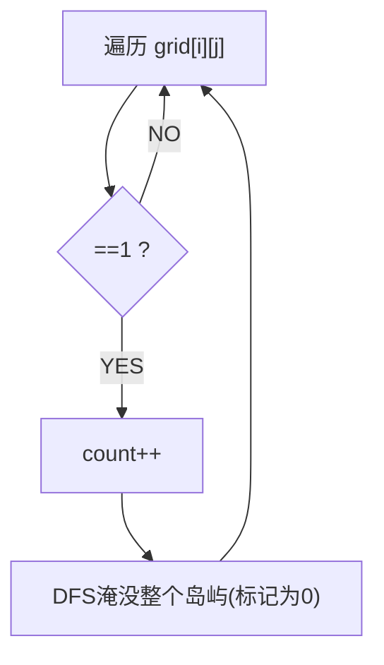
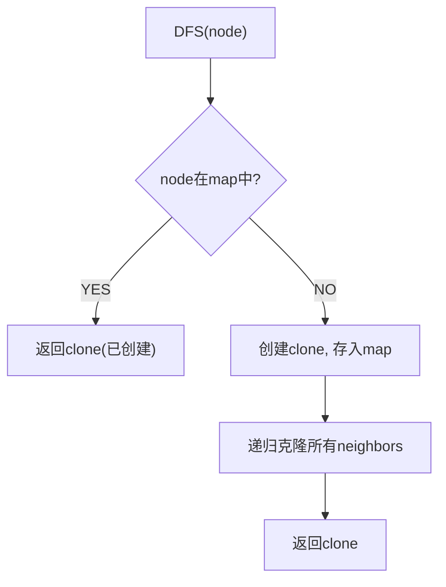
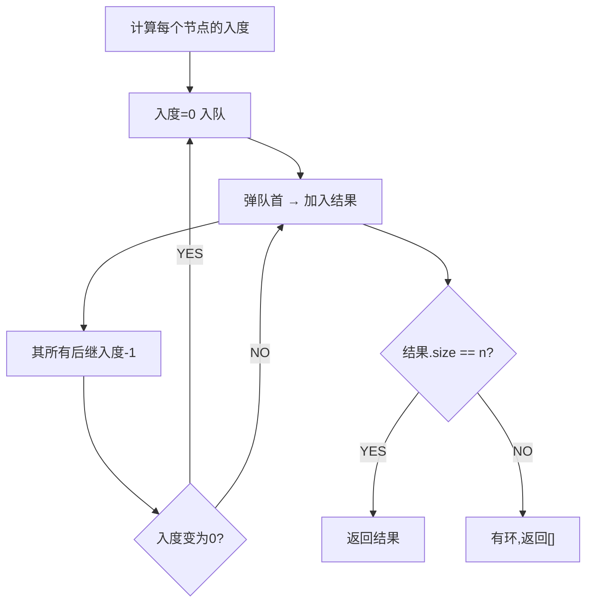
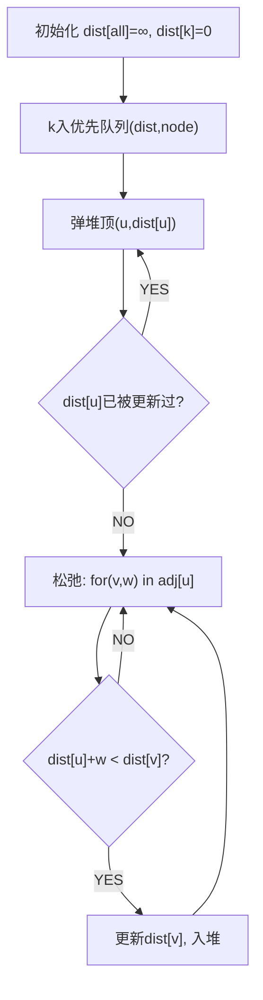
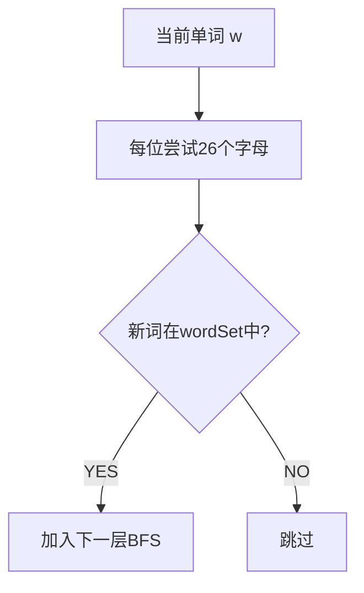

# 岛屿数量（Number of Islands）

> LeetCode 200 · ⭐⭐ · DFS/BFS/并查集
>
> 图的入门题。三种解法覆盖了图的三种核心算法思想：DFS"沉没"、BFS"扩散"、并查集"连通"。

---

## 01. 题目描述

二维网格 `'1'` 陆地 `'0'` 水。相邻（上下左右）的 1 属于同一岛屿。计算岛屿数量。

**示例**：
```
grid = [
  ["1","1","0","0","0"],
  ["1","1","0","0","0"],
  ["0","0","1","0","0"],
  ["0","0","0","1","1"]
]
输出：3
```

---

## 02. 题目分析

### 2.1 核心：连通分量计数

每个岛屿 = 一个连通分量。找到所有 `'1'`，将其所属连通分量全部标记，计数+1。



### 2.2 三解法对比

| 解法 | 时间 | 空间 | 核心操作 |
|------|:---:|:---:|------|
| DFS | O(MN) | O(MN) | 递归沉没 |
| BFS | O(MN) | O(min(M,N)) | 队列扩散 |
| 并查集 | O(MN·α) | O(MN) | union 连通 |

---

## 03. 解法一：DFS 沉没法

```java
public int numIslands(char[][] grid) {
    int m = grid.length, n = grid[0].length, count = 0;
    for (int i = 0; i < m; i++)
        for (int j = 0; j < n; j++)
            if (grid[i][j] == '1') { dfs(grid, i, j); count++; }
    return count;
}
void dfs(char[][] g, int i, int j) {
    if (i < 0 || i >= g.length || j < 0 || j >= g[0].length || g[i][j] == '0') return;
    g[i][j] = '0';          // 沉没！
    dfs(g, i+1, j); dfs(g, i-1, j); dfs(g, i, j+1); dfs(g, i, j-1);
}
```

**Python**：
```python
def numIslands(self, grid):
    m, n = len(grid), len(grid[0])
    def dfs(i, j):
        if i<0 or i>=m or j<0 or j>=n or grid[i][j]=='0': return
        grid[i][j] = '0'
        dfs(i+1,j); dfs(i-1,j); dfs(i,j+1); dfs(i,j-1)
    return sum(dfs(i,j) or 1 for i in range(m) for j in range(n) if grid[i][j]=='1')
```

**C++**：
```cpp
int numIslands(vector<vector<char>>& g) {
    int m=g.size(), n=g[0].size(), cnt=0;
    function<void(int,int)> dfs=[&](int i,int j){ if(i<0||i>=m||j<0||j>=n||g[i][j]=='0') return; g[i][j]='0'; dfs(i+1,j);dfs(i-1,j);dfs(i,j+1);dfs(i,j-1); };
    for(int i=0;i<m;i++) for(int j=0;j<n;j++) if(g[i][j]=='1'){ dfs(i,j); cnt++; }
    return cnt;
}
```

**复杂度**：O(MN)/O(MN)。

## 04. 解法二：并查集

```java
public int numIslands(char[][] grid) {
    int m=grid.length, n=grid[0].length, zeros=0;
    UnionFind uf = new UnionFind(m * n);
    for(int i=0;i<m;i++) for(int j=0;j<n;j++){
        if(grid[i][j]=='0'){ zeros++; continue; }
        if(i+1<m&&grid[i+1][j]=='1') uf.union(i*n+j, (i+1)*n+j);
        if(j+1<n&&grid[i][j+1]=='1') uf.union(i*n+j, i*n+j+1);
    }
    return uf.count - zeros;
}
```

## 05. 总结

| 核心启示 | 说明 |
|---------|------|
| DFS沉没 | 访问过的1变为0，省去visited数组 |
| 沉没=标记 | 一次DFS标记整个连通分量 |
| 并查集应用 | 连通分量问题 = 并查集天然场景 |

**相关**：[100 克隆图](100.克隆图.md)、[108 省份数量](108.省份数量.md)

---

# 克隆图（Clone Graph）

> LeetCode 133 · ⭐⭐ · DFS/BFS+HashMap

## 01. 题目

深拷贝一个无向连通图。每个节点有 `val` 和 `List<Node> neighbors`。

## 02. 题目分析



**关键**：HashMap 存 `原节点 → 克隆节点` 防止重复创建和死循环。

## 03. 代码

**Java**：
```java
Map<Node, Node> map = new HashMap<>();
public Node cloneGraph(Node node) {
    if (node == null) return null;
    if (map.containsKey(node)) return map.get(node);
    Node clone = new Node(node.val);
    map.put(node, clone);
    for (Node neighbor : node.neighbors)
        clone.neighbors.add(cloneGraph(neighbor));
    return clone;
}
```

**Python**：
```python
def cloneGraph(self, node):
    if not node: return None
    mp = {}
    def dfs(n):
        if n in mp: return mp[n]
        clone = Node(n.val); mp[n] = clone
        for nb in n.neighbors: clone.neighbors.append(dfs(nb))
        return clone
    return dfs(node)
```

**C++**：
```cpp
unordered_map<Node*,Node*> mp;
Node* cloneGraph(Node* node) {
    if(!node) return nullptr;
    if(mp.count(node)) return mp[node];
    mp[node]=new Node(node->val);
    for(auto nb:node->neighbors) mp[node]->neighbors.push_back(cloneGraph(nb));
    return mp[node];
}
```

**复杂度**：O(V+E)/O(V)。

---

## 补充：被围绕的区域 (LeetCode 130)

从边界 `O` 开始DFS标记为 `T`。最后 `O→X`，`T→O`。

```java
public void solve(char[][] b) {
    int m=b.length,n=b[0].length;
    for(int i=0;i<m;i++){ dfs(b,i,0); dfs(b,i,n-1); }
    for(int j=0;j<n;j++){ dfs(b,0,j); dfs(b,m-1,j); }
    for(int i=0;i<m;i++) for(int j=0;j<n;j++) b[i][j]=b[i][j]=='T'?'O':'X';
}
void dfs(char[][] b,int i,int j){ if(i<0||i>=b.length||j<0||j>=b[0].length||b[i][j]!='O') return; b[i][j]='T'; dfs(b,i+1,j);dfs(b,i-1,j);dfs(b,i,j+1);dfs(b,i,j-1); }
```

**相关**：[096 岛屿数量](096.岛屿数量.md)

---

# 课程表 II（Course Schedule II）

> LeetCode 210 · ⭐⭐ · 拓扑排序

## 01. 题目

给定课程依赖 `[a,b]` 表示修 a 前必须先修 b。返回任意一种学习顺序，若存在环返回 `[]`。

```
numCourses=4, pre=[[1,0],[2,0],[3,1],[3,2]]
输出：[0,1,2,3] 或 [0,2,1,3]
```

## 02. 分析



**BFS拓扑排序 = 不断删除入度为0的节点**。若最终处理的节点数 < n，说明有环。

## 03. 代码

**Java**：
```java
public int[] findOrder(int n, int[][] pre) {
    List<Integer>[] adj = new List[n];
    for (int i = 0; i < n; i++) adj[i] = new ArrayList<>();
    int[] indeg = new int[n];
    for (int[] p : pre) { adj[p[1]].add(p[0]); indeg[p[0]]++; }

    Queue<Integer> q = new LinkedList<>();
    for (int i = 0; i < n; i++) if (indeg[i] == 0) q.offer(i);

    int[] res = new int[n]; int idx = 0;
    while (!q.isEmpty()) {
        int u = q.poll(); res[idx++] = u;
        for (int v : adj[u]) if (--indeg[v] == 0) q.offer(v);
    }
    return idx == n ? res : new int[0]; // 有环
}
```

**Python**：
```python
def findOrder(self, n, pre):
    adj = [[] for _ in range(n)]; indeg = [0] * n
    for a, b in pre: adj[b].append(a); indeg[a] += 1
    q = deque([i for i in range(n) if indeg[i] == 0])
    res = []
    while q:
        u = q.popleft(); res.append(u)
        for v in adj[u]:
            indeg[v] -= 1
            if indeg[v] == 0: q.append(v)
    return res if len(res) == n else []
```

**C++**：
```cpp
vector<int> findOrder(int n, vector<vector<int>>& pre) {
    vector<vector<int>> adj(n); vector<int> indeg(n);
    for(auto& p:pre){ adj[p[1]].push_back(p[0]); indeg[p[0]]++; }
    queue<int> q; for(int i=0;i<n;i++) if(!indeg[i]) q.push(i);
    vector<int> res;
    while(!q.empty()){ int u=q.front();q.pop(); res.push_back(u); for(int v:adj[u]) if(!--indeg[v]) q.push(v); }
    return res.size()==n?res:vector<int>();
}
```

**复杂度**：O(V+E)/O(V+E)。

**相关**：[103 Dijkstra](103.网络延迟时间.md)

---

# 网络延迟时间（Network Delay Time）

> LeetCode 743 · ⭐⭐ · Dijkstra 最短路径

---

## 01. 题目描述

n 个节点（1~n），从 k 发送信号。`times[i]=[u,v,w]` 表示 u→v 耗时 w。求所有节点收到信号的最短时间（不可达返回-1）。

**示例**：
```
times = [[2,1,1],[2,3,1],[3,4,1]], n = 4, k = 2
输出：2
解释：2→1(1), 2→3(1), 3→4(1) → 最大=2
```

---

## 02. 题目分析

### Dijkstra 算法流程



**核心**：每次从堆中取出距离最小的节点，松弛它的所有出边。

---

## 03. 代码

**Java**：
```java
public int networkDelayTime(int[][] times, int n, int k) {
    // 建图
    List<int[]>[] adj = new List[n + 1];
    for (int i = 1; i <= n; i++) adj[i] = new ArrayList<>();
    for (int[] t : times) adj[t[0]].add(new int[]{t[1], t[2]});

    // Dijkstra
    int[] dist = new int[n + 1]; Arrays.fill(dist, Integer.MAX_VALUE);
    dist[k] = 0;
    PriorityQueue<int[]> pq = new PriorityQueue<>((a, b) -> a[1] - b[1]);
    pq.offer(new int[]{k, 0});

    while (!pq.isEmpty()) {
        int[] cur = pq.poll();
        int u = cur[0], d = cur[1];
        if (d > dist[u]) continue;                         // 过时数据跳过
        for (int[] e : adj[u]) {
            int v = e[0], w = e[1];
            if (dist[u] + w < dist[v]) {                   // 松弛
                dist[v] = dist[u] + w;
                pq.offer(new int[]{v, dist[v]});
            }
        }
    }

    int max = 0;
    for (int i = 1; i <= n; i++) {
        if (dist[i] == Integer.MAX_VALUE) return -1;
        max = Math.max(max, dist[i]);
    }
    return max;
}
```

**Python**：
```python
def networkDelayTime(self, times, n, k):
    import heapq
    adj = [[] for _ in range(n+1)]
    for u, v, w in times: adj[u].append((v, w))
    dist = [float('inf')] * (n+1); dist[k] = 0
    pq = [(0, k)]
    while pq:
        d, u = heapq.heappop(pq)
        if d > dist[u]: continue
        for v, w in adj[u]:
            if dist[u] + w < dist[v]:
                dist[v] = dist[u] + w; heapq.heappush(pq, (dist[v], v))
    ans = max(dist[1:])
    return -1 if ans == float('inf') else ans
```

**C++**：
```cpp
int networkDelayTime(vector<vector<int>>& times, int n, int k) {
    vector<vector<pair<int,int>>> adj(n+1);
    for(auto& t:times) adj[t[0]].emplace_back(t[1],t[2]);
    vector<int> dist(n+1,INT_MAX); dist[k]=0;
    priority_queue<pair<int,int>,vector<pair<int,int>>,greater<>> pq; pq.push({0,k});
    while(!pq.empty()){ auto[d,u]=pq.top();pq.pop(); if(d>dist[u]) continue;
        for(auto&[v,w]:adj[u]) if(dist[u]+w<dist[v]){ dist[v]=dist[u]+w; pq.push({dist[v],v}); } }
    int mx=*max_element(dist.begin()+1,dist.end());
    return mx==INT_MAX?-1:mx;
}
```

**复杂度**：O(ElogV)/O(V+E)。

## 04. 最短路算法对比

| 算法 | 适用 | 时间 | 空间 |
|------|------|:---:|:---:|
| Dijkstra | 非负权 | O(ElogV) | O(V+E) |
| Bellman-Ford | 可负权 | O(VE) | O(V) |
| BFS | 无权图 | O(V+E) | O(V) |

**相关**：[102 课程表II](102.课程表II.md)

---

# 单词接龙（Word Ladder）

> LeetCode 127 · ⭐⭐⭐ · BFS + 隐式建图

---

## 01. 题目

每次变一个字母，从 beginWord 到 endWord 的最短转换序列长度。

```
begin="hit", end="cog", wordList=["hot","dot","dog","lot","log","cog"]
输出：5 (hit→hot→dot→dog→cog)
```

## 02. 题目分析

### 为什么是 BFS？

求最短路径 = 无权图 → BFS。每个单词是一个节点，相差一个字母的单词之间有边。

### 隐式建图



**不需要显式建邻接表**。对每个单词，枚举它的所有"一次变化邻居"，检查是否在集合中。O(N·L·26) << O(N²)。

## 03. 代码

**Java**：
```java
public int ladderLength(String begin, String end, List<String> wordList) {
    Set<String> set = new HashSet<>(wordList);
    if (!set.contains(end)) return 0;
    Queue<String> q = new LinkedList<>(); q.offer(begin);
    int level = 1;
    while (!q.isEmpty()) {
        for (int s = q.size(); s > 0; s--) {
            char[] cur = q.poll().toCharArray();
            for (int i = 0; i < cur.length; i++) {
                char old = cur[i];
                for (char c = 'a'; c <= 'z'; c++) {
                    if (c == old) continue; cur[i] = c;
                    String nxt = new String(cur);
                    if (nxt.equals(end)) return level + 1;
                    if (set.contains(nxt)) { set.remove(nxt); q.offer(nxt); }
                }
                cur[i] = old;
            }
        }
        level++;
    }
    return 0;
}
```

**Python**：
```python
def ladderLength(self, begin, end, wordList):
    ws = set(wordList)
    if end not in ws: return 0
    from collections import deque
    q, level = deque([begin]), 1
    while q:
        for _ in range(len(q)):
            w = list(q.popleft())
            for i in range(len(w)):
                old = w[i]
                for c in 'abcdefghijklmnopqrstuvwxyz':
                    if c == old: continue
                    w[i] = c; nxt = ''.join(w)
                    if nxt == end: return level + 1
                    if nxt in ws: ws.remove(nxt); q.append(nxt)
                w[i] = old
        level += 1
    return 0
```

**复杂度**：O(N·L·26)/O(N)，N为单词数，L为单词长度。

## 04. 优化方向

双向BFS：从begin和end同时搜索，相遇即找到最短路径。复杂度 O(N^(d/2))。

**相关**：[103 Dijkstra](103.网络延迟时间.md)、[102 课程表II](102.课程表II.md)

---

# 并查集三题：除法求值 / 冗余连接 / 省份数量

> LeetCode 399/684/547 · ⭐⭐

## 106 除法求值 (399) 带权并查集

### 题目

`equations = [["a","b"],["b","c"]]`, `values = [2.0,3.0]` → a/b=2, b/c=3 → 求 a/c=6。

### 核心

并查集维护 `weight[x] = x / parent[x]` 的比值。union 时更新权和路径压缩。

```java
class UF {
    Map<String,String> p = new HashMap<>();
    Map<String,Double> w = new HashMap<>();

    String find(String x) {
        if (!p.get(x).equals(x)) {
            String root = find(p.get(x));
            w.put(x, w.get(x) * w.get(p.get(x))); // 路径压缩更新权
            p.put(x, root);
        }
        return p.get(x);
    }

    void union(String a, String b, double v) {
        p.putIfAbsent(a, a); p.putIfAbsent(b, b);
        w.putIfAbsent(a, 1.0); w.putIfAbsent(b, 1.0);
        String ra = find(a), rb = find(b);
        if (!ra.equals(rb)) { p.put(ra, rb); w.put(ra, v * w.get(b) / w.get(a)); }
    }

    double query(String a, String b) {
        if (!p.containsKey(a) || !p.containsKey(b) || !find(a).equals(find(b))) return -1.0;
        return w.get(a) / w.get(b);
    }
}
```

**Python**：
```python
def calcEquation(self, eq, vals, qs):
    from collections import defaultdict
    p = {}; w = {}
    def find(x):
        if p[x] != x: r = find(p[x]); w[x] *= w[p[x]]; p[x] = r
        return p[x]
    def union(a,b,v):
        if a not in p: p[a]=a; w[a]=1.0
        if b not in p: p[b]=b; w[b]=1.0
        ra,rb = find(a),find(b)
        if ra!=rb: p[ra]=rb; w[ra]=v*w[b]/w[a]
    for (a,b),v in zip(eq,vals): union(a,b,v)
    return [w[a]/w[b] if a in p and b in p and find(a)==find(b) else -1.0 for a,b in qs]
```

---

## 107 冗余连接 (684)

树中多了一条边，找出它。并查集判环：已连通的两点再连边 = 冗余。

```java
public int[] findRedundantConnection(int[][] edges) {
    int n = edges.length;
    int[] parent = new int[n + 1];
    for (int i = 1; i <= n; i++) parent[i] = i;
    for (int[] e : edges) {
        if (find(parent, e[0]) == find(parent, e[1])) return e; // 已连通=冗余
        union(parent, e[0], e[1]);
    }
    return new int[0];
}
int find(int[] p, int x) { return p[x] == x ? x : (p[x] = find(p, p[x])); }
void union(int[] p, int a, int b) { p[find(p, a)] = find(p, b); }
```

## 108 省份数量 (547)

```java
public int findCircleNum(int[][] M) {
    int n=M.length, cnt=n;
    int[] p=new int[n]; for(int i=0;i<n;i++) p[i]=i;
    for(int i=0;i<n;i++) for(int j=i+1;j<n;j++)
        if(M[i][j]==1 && find(p,i)!=find(p,j)){ union(p,i,j); cnt--; }
    return cnt;
}
```

**Python**：
```python
def findCircleNum(self, M):
    n, cnt = len(M), len(M); p = list(range(n))
    def find(x): return x if p[x]==x else (p.__setitem__(x, find(p[x])) or p[x])
    for i in range(n):
        for j in range(i+1,n):
            if M[i][j] and find(i)!=find(j): p[find(i)]=find(j); cnt-=1
    return cnt
```

**复杂度**：O(N²·α(N))/O(N)。

## 并查集模板

```java
class UF {
    int[] p;
    UF(int n) { p = new int[n]; for (int i = 0; i < n; i++) p[i] = i; }
    int find(int x) { return p[x] == x ? x : (p[x] = find(p[x])); }
    void union(int a, int b) { p[find(a)] = find(b); }
    boolean connected(int a, int b) { return find(a) == find(b); }
}
```

**相关**：[096 岛屿数量](096.岛屿数量.md)

---

# G012 冗余连接 / G013 省份数量

> LeetCode 684/547 · ⭐⭐ · 并查集

## G012 冗余连接

找出树中多余的边（最后一条使图出现环的边）。

**Java**：
```java
public int[] findRedundantConnection(int[][] edges) {
    int n=edges.length;
    int[] parent=new int[n+1];
    for(int i=1;i<=n;i++) parent[i]=i;
    for(int[] e:edges) {
        if(find(parent,e[0])==find(parent,e[1])) return e;
        union(parent,e[0],e[1]);
    }
    return new int[0];
}
int find(int[] p, int x) { return p[x]==x ? x : (p[x]=find(p,p[x])); }
void union(int[] p, int a, int b) { p[find(p,a)]=find(p,b); }
```

## G013 省份数量

```java
public int findCircleNum(int[][] M) {
    int n=M.length, cnt=n;
    int[] p=new int[n]; for(int i=0;i<n;i++) p[i]=i;
    for(int i=0;i<n;i++)
        for(int j=i+1;j<n;j++)
            if(M[i][j]==1 && find(p,i)!=find(p,j)) { union(p,i,j); cnt--; }
    return cnt;
}
```

**Python（并查集模板）**：
```python
class UF:
    def __init__(self,n):
        self.p=list(range(n)); self.cnt=n
    def find(self,x):
        if self.p[x]!=x: self.p[x]=self.find(self.p[x])
        return self.p[x]
    def union(self,a,b):
        ra,rb=self.find(a),self.find(b)
        if ra!=rb: self.p[ra]=rb; self.cnt-=1
```

**复杂度**：近似 O(N)。

---

# G013 省份数量

> LeetCode 547 · ⭐⭐ · 并查集

## 01. 题目

n×n 矩阵 `isConnected`，连通的城市属于同一个省。求省份数量。

## 02. 代码

**Java**：
```java
public int findCircleNum(int[][] M) {
    int n=M.length, cnt=n;
    int[] p=new int[n]; for(int i=0;i<n;i++) p[i]=i;
    for(int i=0;i<n;i++)
        for(int j=i+1;j<n;j++)
            if(M[i][j]==1 && find(p,i)!=find(p,j)){ union(p,i,j); cnt--; }
    return cnt;
}
int find(int[] p,int x){ return p[x]==x?x:(p[x]=find(p,p[x])); }
void union(int[] p,int a,int b){ p[find(p,a)]=find(p,b); }
```

**Python**：
```python
def findCircleNum(self, M):
    n,cnt=len(M),len(M); p=list(range(n))
    def find(x): 
        if p[x]!=x: p[x]=find(p[x])
        return p[x]
    for i in range(n):
        for j in range(i+1,n):
            if M[i][j] and find(i)!=find(j): p[find(i)]=find(j); cnt-=1
    return cnt
```

**复杂度**：O(N²·α(N))/O(N)。**相关**：[G012 冗余连接](G012-冗余连接.md)

---
