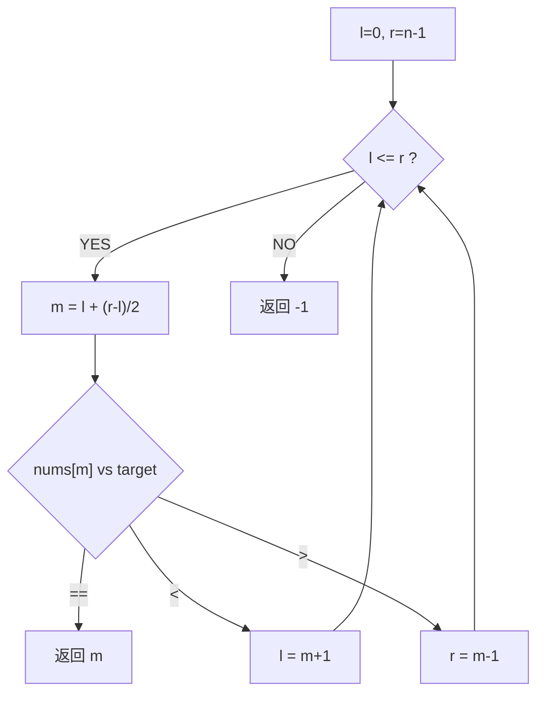
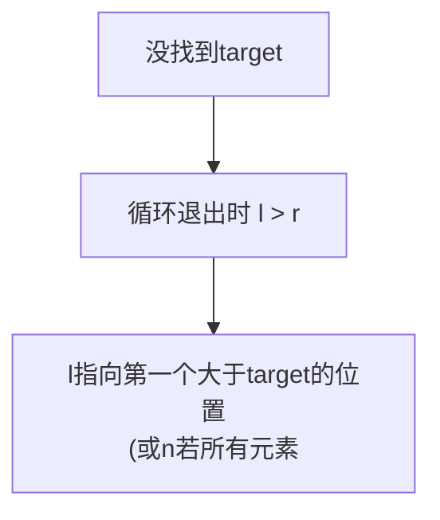
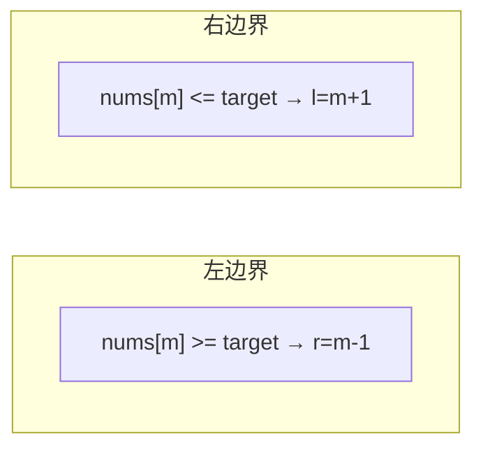
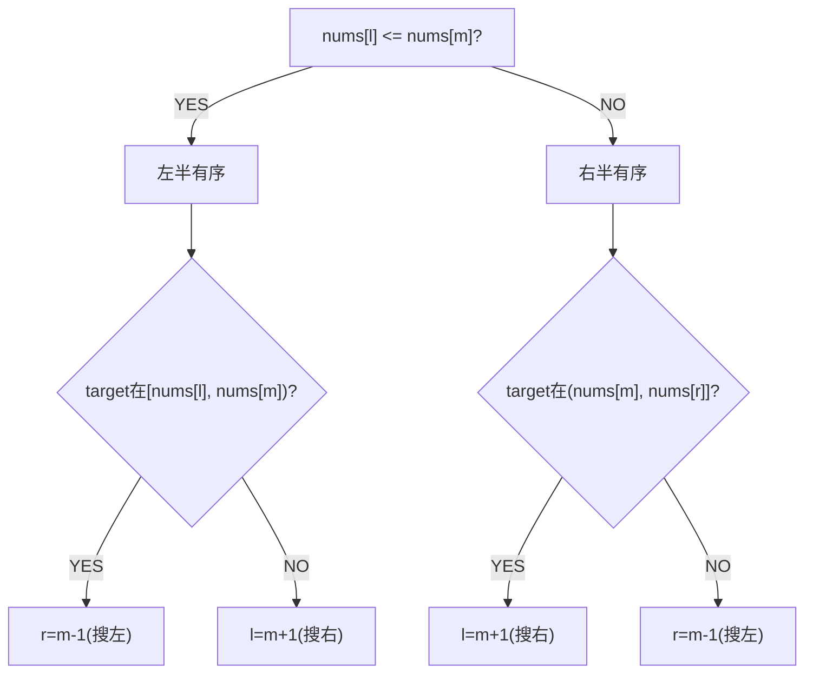
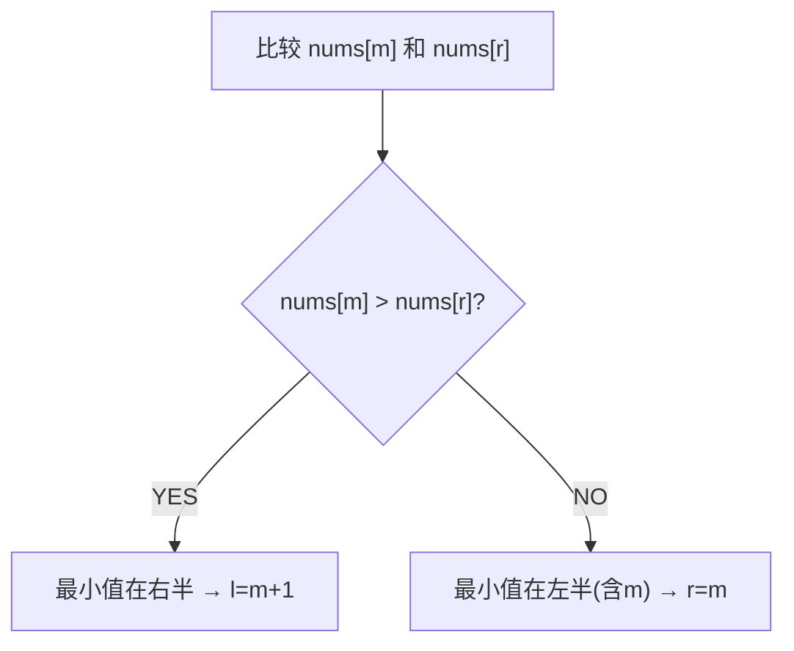
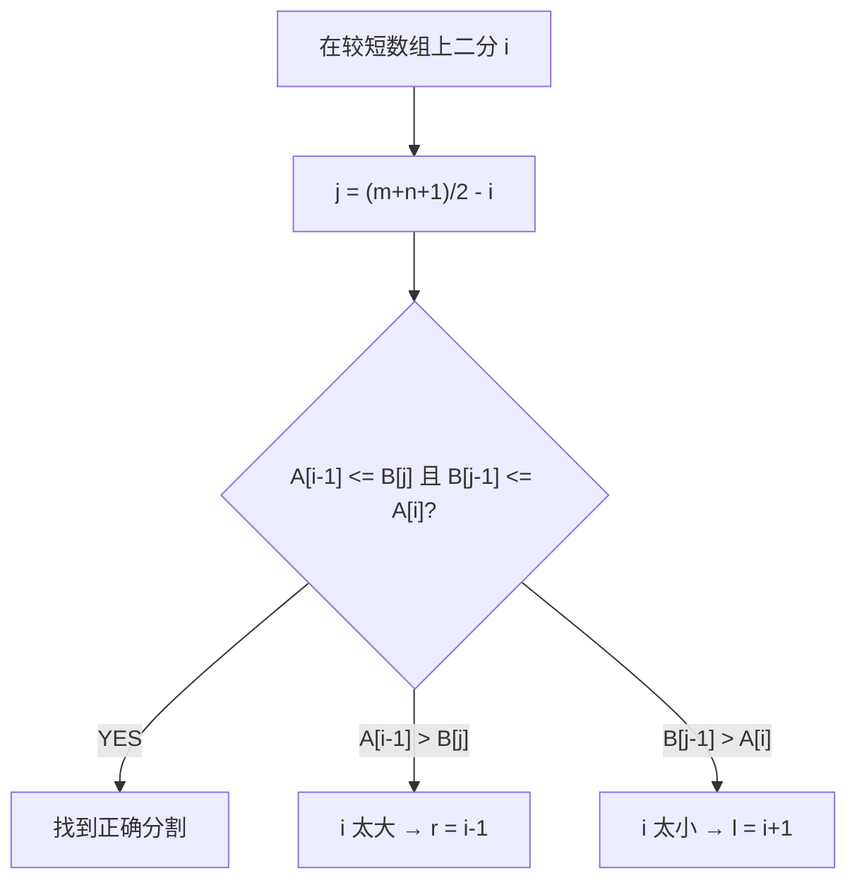
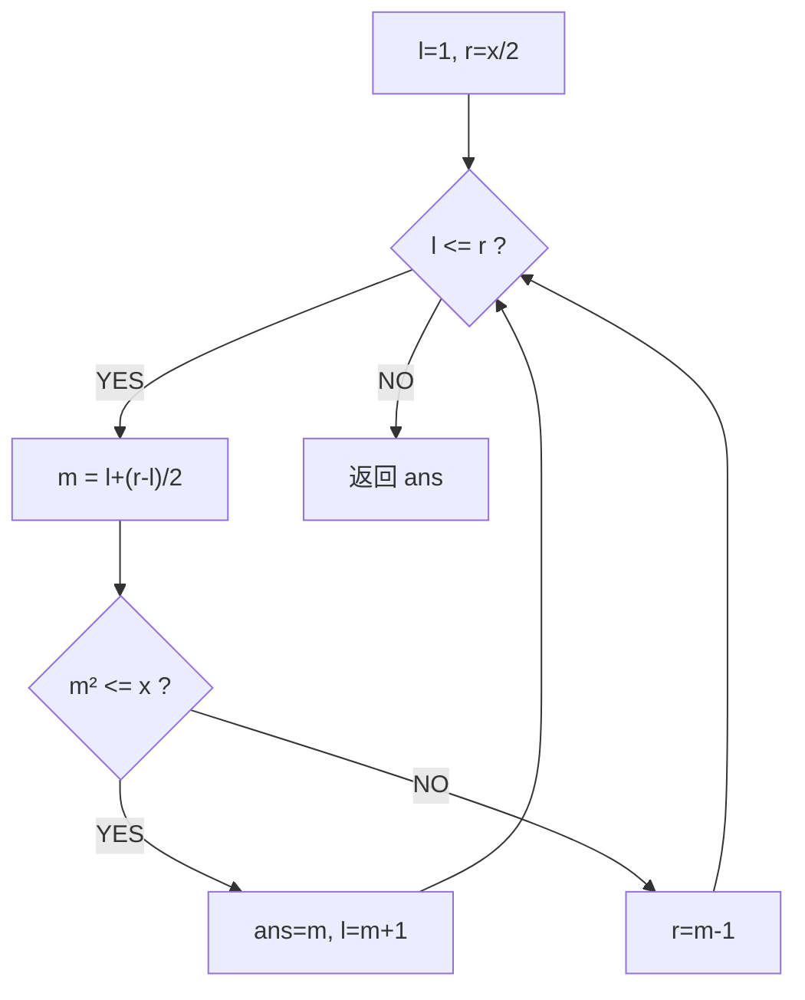
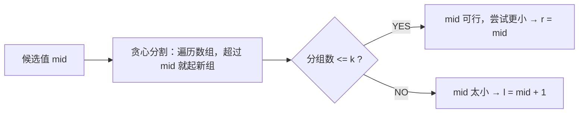

# 二分查找（Binary Search）

> LeetCode 704 · ⭐ · 二分根基
>
> 所有二分变体的母题。掌握这道题的三个关键细节，变体题迎刃而解。

---

## 01. 题目描述

在升序数组 `nums` 中查找 `target`，返回下标或 -1。

**示例**：
```
输入：nums = [-1,0,3,5,9,12], target = 9 → 输出：4
输入：nums = [-1,0,3,5,9,12], target = 2 → 输出：-1
```

---

## 02. 题目分析

### 2.1 核心框架



### 2.2 三个关键细节

| 细节 | 正确写法 | 为什么 |
|------|---------|--------|
| 中点 | `l + (r-l)/2` | 防 `(l+r)` 溢出 |
| 循环条件 | `while(l <= r)` | 单元素也能进入循环 |
| 边界更新 | `l=m+1`, `r=m-1` | 排除已检查的 m，防死循环 |

---

## 03. 代码

**Java**：
```java
public int search(int[] nums, int target) {
    int l = 0, r = nums.length - 1;
    while (l <= r) {
        int m = l + (r - l) / 2;
        if (nums[m] == target) return m;
        else if (nums[m] < target) l = m + 1;
        else r = m - 1;
    }
    return -1;
}
```

**Python**：
```python
def search(self, nums: List[int], target: int) -> int:
    l, r = 0, len(nums) - 1
    while l <= r:
        m = (l + r) // 2
        if nums[m] == target: return m
        elif nums[m] < target: l = m + 1
        else: r = m - 1
    return -1
```

**C++**：
```cpp
int search(vector<int>& nums, int target) {
    int l = 0, r = nums.size() - 1;
    while (l <= r) { int m = l + (r - l) / 2; if (nums[m] == target) return m; else if (nums[m] < target) l = m + 1; else r = m - 1; }
    return -1;
}
```

**复杂度**：O(logN)/O(1)。

---

## 04. 二分查找变体家族

```
基础二分 ─→ 搜索插入位置(112)
       ├─→ 左边界(113)
       ├─→ 右边界(113)
       ├─→ 旋转数组搜索(114)
       ├─→ 旋转数组最小值(116)
       ├─→ 两个有序数组中位数(118)
       ├─→ 平方根(119)
       └─→ 二分答案(120)

共同框架: while(l<=r) + m=l+(r-l)/2 + 有序判定
```

---

## 05. 总结

| 核心启示 | 说明 |
|---------|------|
| `l+(r-l)/2` | 永远用它，忘掉 `(l+r)/2` |
| `l<=r` | 保证处理到最后一个元素 |
| `m±1` | 必须排除已检查元素 |

**相关**：[112 搜索插入位置](112.搜索插入位置.md)、[113 查找边界](113.在排序数组中查找元素的第一个和最后一个位置.md)

---

# 搜索插入位置（Search Insert Position）

> LeetCode 35 · ⭐ · 二分边界

## 01. 题目

`nums=[1,3,5,6], target=5` → 2；`target=2` → 1；`target=7` → 4

## 02. 题目分析

与基础二分完全相同，唯一区别：**未找到时返回 `l` 而不是 `-1`**。

### 为什么退出循环时 `l` 就是插入位置？



**证明**：二分过程中 `l` 只会向右移动（找更大的），`r` 向左移动（找更小的）。最终 `l` 停在第一个 `≥target` 的位置。

## 03. 代码

**Java**：
```java
public int searchInsert(int[] nums, int target) {
    int l = 0, r = nums.length - 1;
    while (l <= r) {
        int m = l + (r - l) / 2;
        if (nums[m] == target) return m;
        else if (nums[m] < target) l = m + 1;
        else r = m - 1;
    }
    return l;  // 唯一区别：返回l而非-1
}
```

**Python**：
```python
def searchInsert(self, nums, target):
    l, r = 0, len(nums) - 1
    while l <= r:
        m = (l + r) // 2
        if nums[m] == target: return m
        elif nums[m] < target: l = m + 1
        else: r = m - 1
    return l
```

**C++**：
```cpp
int searchInsert(vector<int>& nums, int target) {
    int l=0, r=nums.size()-1;
    while(l<=r){ int m=l+(r-l)/2; if(nums[m]==target) return m; else if(nums[m]<target) l=m+1; else r=m-1; }
    return l;
}
```

**复杂度**：O(logN)/O(1)。

**相关**：[111 基础二分](111.二分查找.md)、[113 查找边界](113.在排序数组中查找元素的第一个和最后一个位置.md)

---

# 在排序数组中查找元素的第一个和最后一个位置

> LeetCode 34 · ⭐⭐ · 左右边界二分

## 01. 题目

`nums=[5,7,7,8,8,10], target=8` → `[3,4]`

## 02. 题目分析

### 左边界 vs 右边界



| | 左边界 | 右边界 |
|------|:---:|:---:|
| 移动条件 | `>= target` 时 `r=m-1` | `<= target` 时 `l=m+1` |
| 位置 | 第一个等于target | 最后一个等于target |
| 结果 | `ans` 记录命中时的 m | 同上 |

## 03. 代码

**Java**：
```java
public int[] searchRange(int[] nums, int target) {
    return new int[]{leftBound(nums, target), rightBound(nums, target)};
}
int leftBound(int[] nums, int t) {
    int l = 0, r = nums.length - 1, ans = -1;
    while (l <= r) {
        int m = l + (r - l) / 2;
        if (nums[m] >= t) { r = m - 1; if (nums[m] == t) ans = m; }
        else l = m + 1;
    }
    return ans;
}
int rightBound(int[] nums, int t) {
    int l = 0, r = nums.length - 1, ans = -1;
    while (l <= r) {
        int m = l + (r - l) / 2;
        if (nums[m] <= t) { l = m + 1; if (nums[m] == t) ans = m; }
        else r = m - 1;
    }
    return ans;
}
```

**Python**：
```python
def searchRange(self, nums, target):
    def left():
        l, r, a = 0, len(nums)-1, -1
        while l<=r:
            m=(l+r)//2
            if nums[m]>=target: r=m-1; a=m if nums[m]==target else a
            else: l=m+1
        return a
    def right():
        l, r, a = 0, len(nums)-1, -1
        while l<=r:
            m=(l+r)//2
            if nums[m]<=target: l=m+1; a=m if nums[m]==target else a
            else: r=m-1
        return a
    return [left(), right()]
```

**C++**：
```cpp
vector<int> searchRange(vector<int>& nums, int t) {
    auto left=[&]{ int l=0,r=nums.size()-1,a=-1; while(l<=r){ int m=l+(r-l)/2; if(nums[m]>=t){ r=m-1; if(nums[m]==t) a=m; } else l=m+1; } return a; };
    auto right=[&]{ int l=0,r=nums.size()-1,a=-1; while(l<=r){ int m=l+(r-l)/2; if(nums[m]<=t){ l=m+1; if(nums[m]==t) a=m; } else r=m-1; } return a; };
    return {left(),right()};
}
```

**复杂度**：O(logN)/O(1)。

**相关**：[111 基础二分](111.二分查找.md)、[112 搜索插入](112.搜索插入位置.md)

---

# 搜索旋转排序数组 / 含重复值

> LeetCode 33/81 · ⭐⭐ · 二分找有序段

## 114 旋转数组搜索 (33)

### 01. 题目

`nums=[4,5,6,7,0,1,2], target=0` → 4。O(logN)。

### 02. 分析

旋转数组 = 被pivot分成两段有序子数组。**每次迭代至少一半有序**。



### 03. 代码

**Java**：
```java
public int search(int[] nums, int target) {
    int l = 0, r = nums.length - 1;
    while (l <= r) {
        int m = l + (r - l) / 2;
        if (nums[m] == target) return m;
        if (nums[l] <= nums[m]) {                     // 左半有序
            if (nums[l] <= target && target < nums[m]) r = m - 1;
            else l = m + 1;
        } else {                                       // 右半有序
            if (nums[m] < target && target <= nums[r]) l = m + 1;
            else r = m - 1;
        }
    }
    return -1;
}
```

**Python**：
```python
def search(self, nums, target):
    l, r = 0, len(nums)-1
    while l <= r:
        m = (l+r)//2
        if nums[m] == target: return m
        if nums[l] <= nums[m]:
            if nums[l] <= target < nums[m]: r = m-1
            else: l = m+1
        else:
            if nums[m] < target <= nums[r]: l = m+1
            else: r = m-1
    return -1
```

**C++**：
```cpp
int search(vector<int>& nums, int target) {
    int l=0,r=nums.size()-1;
    while(l<=r){ int m=l+(r-l)/2; if(nums[m]==target) return m;
        if(nums[l]<=nums[m]){ if(nums[l]<=target&&target<nums[m]) r=m-1; else l=m+1; }
        else{ if(nums[m]<target&&target<=nums[r]) l=m+1; else r=m-1; }
    }
    return -1;
}
```

**复杂度**：O(logN)/O(1)。

## 115 含重复值 (81)

当 `nums[l]==nums[m]==nums[r]` 无法判断时 → `l++; r--`。最坏 O(N)。

```java
public boolean search(int[] nums, int target) {
    int l=0,r=nums.length-1;
    while(l<=r){ int m=l+(r-l)/2; if(nums[m]==target) return true;
        if(nums[l]==nums[m]&&nums[m]==nums[r]){ l++; r--; }
        else if(nums[l]<=nums[m]){ if(nums[l]<=target&&target<nums[m]) r=m-1; else l=m+1; }
        else{ if(nums[m]<target&&target<=nums[r]) l=m+1; else r=m-1; }
    }
    return false;
}
```

**相关**：[116 最小值](116.寻找旋转排序数组中的最小值.md)

---

# H005 搜索旋转排序数组 II

> LeetCode 81 · ⭐⭐ · 含重复值的旋转二分

## 01. 题目

与 H004 相同，但数组可能包含重复元素。`[2,5,6,0,0,1,2], target=0` → true。

## 02. 分析

重复元素破坏了"有序段判定"的确定性。当 `nums[l]==nums[m]==nums[r]` 时，无法判断哪半有序，只能 `l++; r--` 缩小范围。

**Java**：
```java
public boolean search(int[] nums, int target) {
    int l=0, r=nums.length-1;
    while(l<=r){
        int m=l+(r-l)/2;
        if(nums[m]==target) return true;
        if(nums[l]==nums[m]&&nums[m]==nums[r]){ l++; r--; }
        else if(nums[l]<=nums[m]){
            if(nums[l]<=target&&target<nums[m]) r=m-1; else l=m+1;
        } else {
            if(nums[m]<target&&target<=nums[r]) l=m+1; else r=m-1;
        }
    }
    return false;
}
```

**复杂度**：O(logN)平均，O(N)最坏（全相同元素）。**相关**：[H004 旋转搜索](H004-搜索旋转排序数组.md)

---

# 寻找旋转排序数组中的最小值 (153) / 寻找峰值 (162)

> LeetCode 153/162 · ⭐⭐ · 二分找拐点

## 116 旋转数组最小值 (153)

### 01. 题目

`[3,4,5,1,2]` → 1。无重复元素，O(logN)。

### 02. 分析



**关键**：`nums[m] > nums[r]` 说明最小值在 `[m+1, r]`。否则在 `[l, m]`。

### 03. 代码

```java
public int findMin(int[] nums) {
    int l = 0, r = nums.length - 1;
    while (l < r) {
        int m = l + (r - l) / 2;
        if (nums[m] > nums[r]) l = m + 1;
        else r = m;
    }
    return nums[l];
}
```

**Python**：
```python
def findMin(self, nums):
    l, r = 0, len(nums)-1
    while l < r:
        m = (l+r)//2
        if nums[m] > nums[r]: l = m+1
        else: r = m
    return nums[l]
```

**C++**：
```cpp
int findMin(vector<int>& nums) { int l=0,r=nums.size()-1; while(l<r){ int m=l+(r-l)/2; if(nums[m]>nums[r]) l=m+1; else r=m; } return nums[l]; }
```

**复杂度**：O(logN)/O(1)。

## H007 寻找峰值 (162)

峰值：`nums[i] > nums[i-1] && nums[i] > nums[i+1]`（边界外为 -∞）。

```java
public int findPeakElement(int[] nums) {
    int l = 0, r = nums.length - 1;
    while (l < r) {
        int m = l + (r - l) / 2;
        if (nums[m] > nums[m + 1]) r = m;   // 峰值在左(含m)
        else l = m + 1;                       // 峰值在右
    }
    return l;
}
```

**二分爬坡**：哪边更高就往哪边走，O(logN) 必能找到峰值。

**Python**：
```python
def findPeakElement(self, nums):
    l, r = 0, len(nums)-1
    while l < r:
        m = (l+r)//2
        if nums[m] > nums[m+1]: r = m
        else: l = m+1
    return l
```

**相关**：[114 旋转搜索](114.搜索旋转排序数组.md)

---

# H008 寻找两个正序数组的中位数

> LeetCode 4 · ⭐⭐⭐ · 二分找第K小

## 01. 题目

`nums1=[1,3], nums2=[2]` → 中位数 2.0。要求 O(log(min(m,n)))。

## 02. 题目分析

### 2.1 问题转化

中位数 = 找第 k 小的元素，其中 k = (m+n+1)/2（奇数）或 k 与 k+1 的平均（偶数）。

### 2.2 核心思路：在较短数组上二分

假设 i 是 nums1 的分割位置，则 j = (m+n+1)/2 - i 是 nums2 的分割位置。满足：

$$\text{nums1}[i-1] \le \text{nums2}[j] \quad\text{且}\quad \text{nums2}[j-1] \le \text{nums1}[i]$$

```
nums1:  ... A[i-1] | A[i] ...
nums2:  ... B[j-1] | B[j] ...
        ←左半部分→ | ←右半部分→
```

对较短数组二分查找 i，使得分割条件成立。



---

## 03. 代码

**Java**：
```java
public double findMedianSortedArrays(int[] A, int[] B) {
    if (A.length > B.length) return findMedianSortedArrays(B, A);
    int m = A.length, n = B.length;
    int half = (m + n + 1) / 2;
    int l = 0, r = m;
    while (l <= r) {
        int i = l + (r - l) / 2;
        int j = half - i;
        int Aleft  = i == 0 ? Integer.MIN_VALUE : A[i - 1];
        int Aright = i == m ? Integer.MAX_VALUE : A[i];
        int Bleft  = j == 0 ? Integer.MIN_VALUE : B[j - 1];
        int Bright = j == n ? Integer.MAX_VALUE : B[j];
        if (Aleft <= Bright && Bleft <= Aright) {
            if ((m + n) % 2 == 1) return Math.max(Aleft, Bleft);
            return (Math.max(Aleft, Bleft) + Math.min(Aright, Bright)) / 2.0;
        } else if (Aleft > Bright) r = i - 1;
        else l = i + 1;
    }
    return 0;
}
```

**Python**：
```python
def findMedianSortedArrays(self, A: List[int], B: List[int]) -> float:
    if len(A) > len(B): A, B = B, A
    m, n = len(A), len(B)
    half = (m + n + 1) // 2
    l, r = 0, m
    while l <= r:
        i = (l + r) // 2
        j = half - i
        A_left  = A[i-1] if i > 0 else float('-inf')
        A_right = A[i]   if i < m else float('inf')
        B_left  = B[j-1] if j > 0 else float('-inf')
        B_right = B[j]   if j < n else float('inf')
        if A_left <= B_right and B_left <= A_right:
            if (m + n) % 2: return max(A_left, B_left)
            return (max(A_left, B_left) + min(A_right, B_right)) / 2
        elif A_left > B_right: r = i - 1
        else: l = i + 1
```

**复杂度**：O(log(min(m,n))) / O(1)。

---

## 04. 总结

此题是二分查找的"天花板"——不是找某个具体值，而是**找分割位置**。核心技巧：在较短数组上二分，长数组的分割位置自然确定。

**相关题目**：[H001 基础二分](H001-二分查找.md)、[F001 第K大元素](F001-数组中的第K个最大元素.md)

---

# x 的平方根（Sqrt(x)）

> LeetCode 69 · ⭐ · 二分 / 牛顿迭代

---

## 01. 题目

计算 x 的算术平方根（只保留整数）。`x=8` → 2。

---

## 02. 题目分析

### 解法一：二分查找

在 `[1, x/2]` 内二分找 `m² ≤ x` 的最大 m。



### 解法二：牛顿迭代

$$x_{n+1} = \frac{x_n + a/x_n}{2}$$

收敛极快（二次收敛），约 5 次迭代即可。

---

## 03. 代码

**Java**（二分）：
```java
public int mySqrt(int x) {
    if (x < 2) return x;
    int l = 1, r = x / 2, ans = 0;
    while (l <= r) {
        int m = l + (r - l) / 2;
        if ((long) m * m <= x) { ans = m; l = m + 1; }
        else r = m - 1;
    }
    return ans;
}
```

**Java**（牛顿法）：
```java
public int mySqrt(int x) {
    if (x == 0) return 0;
    long r = x;
    while (r * r > x) r = (r + x / r) / 2;
    return (int) r;
}
```

**Python**（二分）：
```python
def mySqrt(self, x: int) -> int:
    if x < 2: return x
    l, r, ans = 1, x // 2, 0
    while l <= r:
        m = (l + r) // 2
        if m * m <= x: ans = m; l = m + 1
        else: r = m - 1
    return ans
```

**C++**（二分）：
```cpp
int mySqrt(int x) { if(x<2) return x; int l=1,r=x/2,a=0; while(l<=r){ int m=l+(r-l)/2; if((long)m*m<=x){ a=m; l=m+1; } else r=m-1; } return a; }
```

**复杂度**：二分 O(logN)，牛顿法 O(logN)但常数极小。

---

## 04. 二分 vs 牛顿

| | 二分 | 牛顿 |
|------|:---:|:---:|
| 时间复杂度 | O(logN) | 约 O(loglogN) |
| 实现难度 | 简单 | 简单 |
| 面试推荐 | ✅ | ✅ 加分 |

**相关**：[120 分割数组最大值](120.分割数组的最大值.md)

---

# H010 分割数组的最大值

> LeetCode 410 · ⭐⭐⭐ · 二分答案

## 01. 题目

`nums=[7,2,5,10,8], k=2` → 18（分为 `[7,2,5]` 和 `[10,8]`，最大和 18 最小）。

## 02. 题目分析

### "二分答案"范式

答案在 `[max(nums), sum(nums)]` 之间。对候选答案 `mid`，判断能否用 ≤k 个子数组实现。



---

## 03. 代码

**Java**：
```java
public int splitArray(int[] nums, int k) {
    int l = 0, r = 0;
    for (int n : nums) { l = Math.max(l, n); r += n; }
    while (l < r) {
        int mid = l + (r - l) / 2;
        int sum = 0, cnt = 1;
        for (int n : nums) {
            if (sum + n > mid) { cnt++; sum = 0; }
            sum += n;
        }
        if (cnt <= k) r = mid;
        else l = mid + 1;
    }
    return l;
}
```

**Python**：
```python
def splitArray(self, nums: List[int], k: int) -> int:
    def can(mid):
        cnt, s = 1, 0
        for x in nums:
            if s + x > mid: cnt += 1; s = 0
            s += x
        return cnt <= k
    l, r = max(nums), sum(nums)
    while l < r:
        m = (l + r) // 2
        if can(m): r = m
        else: l = m + 1
    return l
```

**C++**：
```cpp
int splitArray(vector<int>& nums, int k) {
    int l = *max_element(nums.begin(), nums.end());
    int r = accumulate(nums.begin(), nums.end(), 0);
    auto can = [&](int mid) {
        int cnt = 1, sum = 0;
        for (int x : nums) { if (sum + x > mid) { cnt++; sum = 0; } sum += x; }
        return cnt <= k;
    };
    while (l < r) { int m = l + (r - l) / 2; can(m) ? (r = m) : (l = m + 1); }
    return l;
}
```

**复杂度**：O(NlogSum)。

---

## 04. 总结

**二分答案**是一种强大的优化范式：把"求最优值"转化为"判断某个值是否可行"，然后用二分逼近。适用条件：答案区间**单调**（更大的值一定更容易满足条件）。

**相关题目**：[H009 平方根](H009-x的平方根.md)

---
