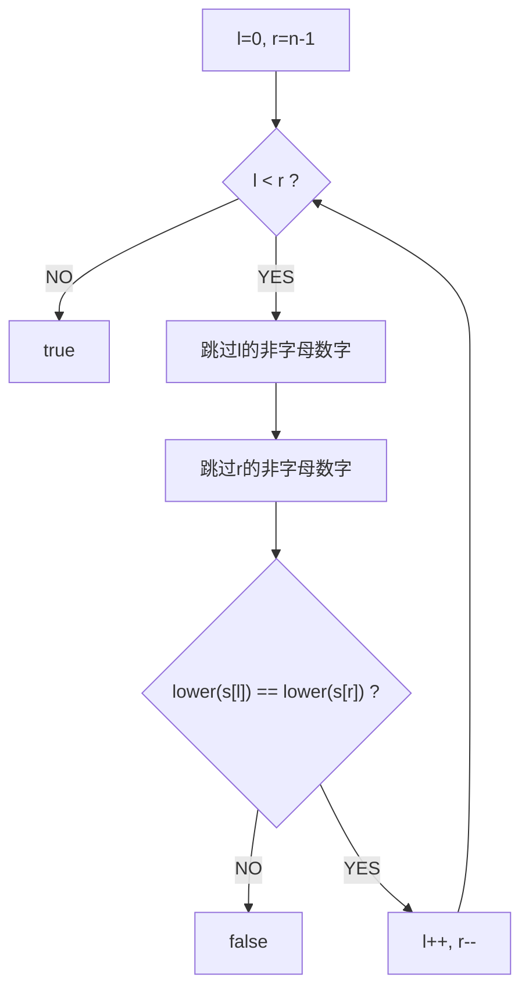
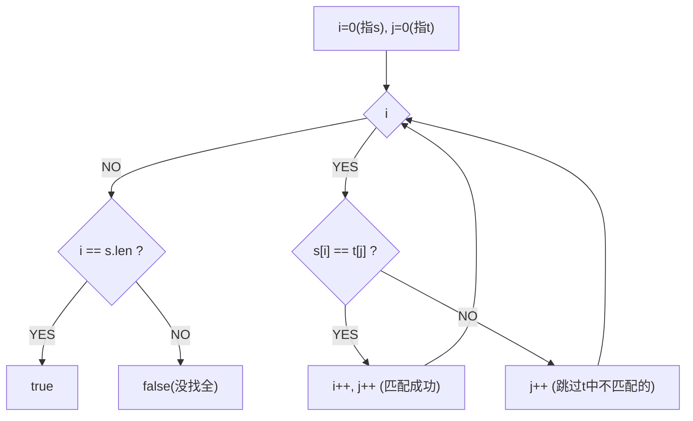
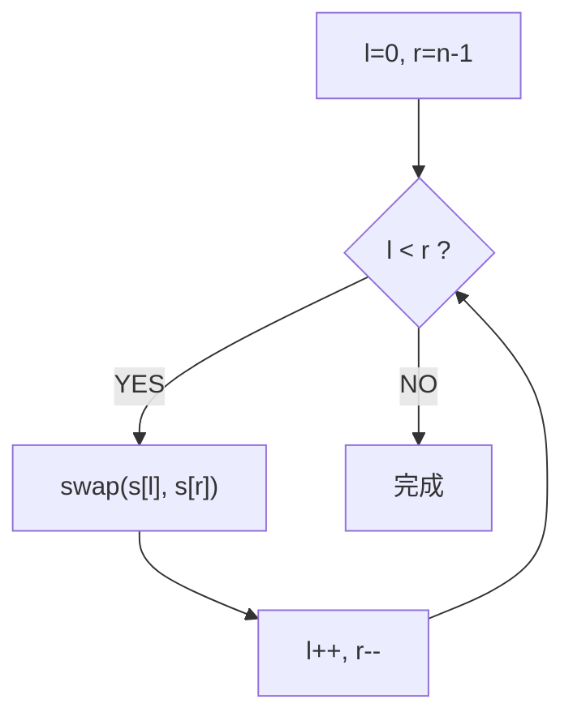
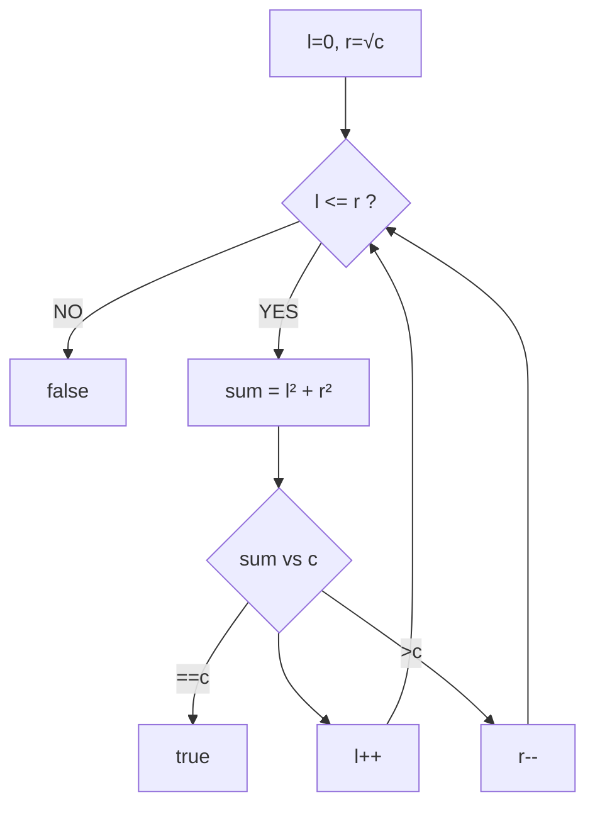

# 验证回文串（Valid Palindrome）

> LeetCode 125 · ⭐ · 双指针

---

## 01. 题目描述

只考虑字母和数字字符，忽略大小写。判断是否为回文。

**示例**：
```
输入："A man, a plan, a canal: Panama"  → true  ("amanaplanacanalpanama")
输入："race a car"                       → false
```

---

## 02. 题目分析

### 2.1 双指针夹逼



### 2.2 技巧

`Character.isLetterOrDigit()` 只保留字母和数字。`Character.toLowerCase()` 统一转小写。

---

## 03. 代码

**Java**：
```java
public boolean isPalindrome(String s) {
    int l = 0, r = s.length() - 1;
    while (l < r) {
        while (l < r && !Character.isLetterOrDigit(s.charAt(l))) l++;
        while (l < r && !Character.isLetterOrDigit(s.charAt(r))) r--;
        if (Character.toLowerCase(s.charAt(l)) != Character.toLowerCase(s.charAt(r)))
            return false;
        l++; r--;
    }
    return true;
}
```

**Python**：
```python
def isPalindrome(self, s: str) -> bool:
    s = ''.join(c.lower() for c in s if c.isalnum())
    return s == s[::-1]
```

**C++**：
```cpp
bool isPalindrome(string s) {
    int l=0, r=s.size()-1;
    while(l<r){ while(l<r&&!isalnum(s[l])) l++; while(l<r&&!isalnum(s[r])) r--; if(tolower(s[l])!=tolower(s[r])) return false; l++; r--; }
    return true;
}
```

**复杂度**：O(N)/O(1)。

---

## 04. 总结

| 核心技巧 | 说明 |
|---------|------|
| 双指针夹逼 | 两端向中间收缩 |
| 过滤非字母数字 | `isLetterOrDigit` / `isalnum` |
| 忽略大小写 | `toLowerCase` / `tolower` |

**相关题目**：[123 反转字符串](123.反转字符串.md)

---

# 判断子序列（Is Subsequence）

> LeetCode 392 · ⭐ · 双指针

---

## 01. 题目描述

判断 `s` 是否为 `t` 的子序列（不要求连续，但相对顺序不变）。

**示例**：
```
输入：s="abc", t="ahbgdc"    → true
输入：s="axc", t="ahbgdc"    → false
```

---

## 02. 题目分析

### 双指针追及



`i` 指向 s 中待匹配字符，`j` 扫描 t。匹配成功时 i 前进，j 一直前进。

### 进阶：大量 s 查询

如果有 k 个 s 要判断，每次 O(N) 太慢。预处理 t 的字符位置列表，用二分加速到 O(logN)。

---

## 03. 代码

**Java**：
```java
public boolean isSubsequence(String s, String t) {
    int i = 0, j = 0;
    while (i < s.length() && j < t.length()) {
        if (s.charAt(i) == t.charAt(j)) i++;
        j++;
    }
    return i == s.length();
}
```

**Python**：
```python
def isSubsequence(self, s: str, t: str) -> bool:
    i = 0
    for c in t:
        if i < len(s) and s[i] == c: i += 1
    return i == len(s)
```

**C++**：
```cpp
bool isSubsequence(string s, string t) {
    int i=0;
    for(int j=0;i<s.size()&&j<t.size();j++)
        if(s[i]==t[j]) i++;
    return i==s.size();
}
```

**复杂度**：O(N)/O(1)。

---

## 04. 总结

| 核心 | 说明 |
|------|------|
| 双指针追及 | i 追 s，j 扫 t |
| 关键条件 | `s[i]==t[j]` 匹配成功 i++ |
| 进阶 | 预处理+二分支持多查询 |

**相关题目**：[121 回文串](121.验证回文串.md)

---

# 反转字符串（Reverse String）

> LeetCode 344 · ⭐ · 双指针原地交换

---

## 01. 题目描述

原地反转字符数组。

**示例**：
```
输入：['h','e','l','l','o']  →  ['o','l','l','e','h']
```

---

## 02. 题目分析

### 双指针原地交换



---

## 03. 代码

**Java**：
```java
public void reverseString(char[] s) {
    for (int l = 0, r = s.length - 1; l < r; l++, r--) {
        char t = s[l]; s[l] = s[r]; s[r] = t;
    }
}
```

**Python**：
```python
def reverseString(self, s: List[str]) -> None:
    s.reverse()
```

**C++**：
```cpp
void reverseString(vector<char>& s) {
    for(int l=0,r=s.size()-1;l<r;l++,r--) swap(s[l],s[r]);
}
```

**复杂度**：O(N)/O(1)。

---

## 04. 双指针题型速查

| 类型 | 题目 | 指针移动 |
|------|------|---------|
| 两端夹逼 | 121 回文 / 123 反转 | `l++, r--` 同步 |
| 同向追及 | 122 子序列 | `j` 始终前进，`i` 匹配才进 |
| 左右夹逼 | A005 盛水 / A006 接雨 | 哪边矮移哪边 |
| 平方数 | 126 平方数之和 | `l²+r² vs c` 决定方向 |

---

## 05. 总结

| 核心启示 | 说明 |
|---------|------|
| 原地反转 | 双指针首尾交换，无需额外空间 |
| 双指针本质 | 用两端向中间的方式将 O(N) 空间降到 O(1) |

**相关题目**：[121 回文串](121.验证回文串.md)、[A005 盛水容器](../07.数组算法题/005.盛最多水的容器.md)

---

# 平方数之和（Sum of Square Numbers）

> LeetCode 633 · ⭐⭐ · 双指针

---

## 01. 题目描述

判断是否存在整数 a,b 使 `a² + b² = c`。

**示例**：
```
输入：c = 5  → true  (1² + 2² = 5)
输入：c = 3  → false
```

---

## 02. 题目分析

### 2.1 朴素思路

暴力枚举 a ∈ [0, √c]，检查 c-a² 是否为完全平方数 → O(√c)。

### 2.2 双指针优化



与 A005 盛最多水的容器同一框架——用双指针替代暴力枚举的 O(N²)。

### 2.3 正确性

当 `l²+r² < c` 时，任何含有当前 l 的组合都不可能等于 c（因为 r 已是最大可能值）→ 放弃 l。

---

## 03. 代码

**Java**：
```java
public boolean judgeSquareSum(int c) {
    long l = 0, r = (long) Math.sqrt(c);
    while (l <= r) {
        long sum = l * l + r * r;
        if (sum == c) return true;
        if (sum < c) l++;
        else r--;
    }
    return false;
}
```

**Python**：
```python
def judgeSquareSum(self, c: int) -> bool:
    l, r = 0, int(c ** 0.5)
    while l <= r:
        s = l * l + r * r
        if s == c: return True
        if s < c: l += 1
        else: r -= 1
    return False
```

**C++**：
```cpp
bool judgeSquareSum(int c) {
    long l=0, r=sqrt(c);
    while(l<=r){ long s=l*l+r*r; if(s==c) return true; if(s<c) l++; else r--; }
    return false;
}
```

**复杂度**：O(√c)/O(1)。

---

## 04. 总结

| 核心启示 | 说明 |
|---------|------|
| 双指针替代暴力 | 把 O(N²) 枚举优化为 O(N) |
| 正确性 | `sum<c → l++` 是安全的（r已达最大） |
| 与盛水容器相似 | 同一框架：根据 sum 与 target 的关系决定移动方向 |

**相关题目**：[A005 盛水容器](../07.数组算法题/005.盛最多水的容器.md)、[123 反转字符串](123.反转字符串.md)

---
