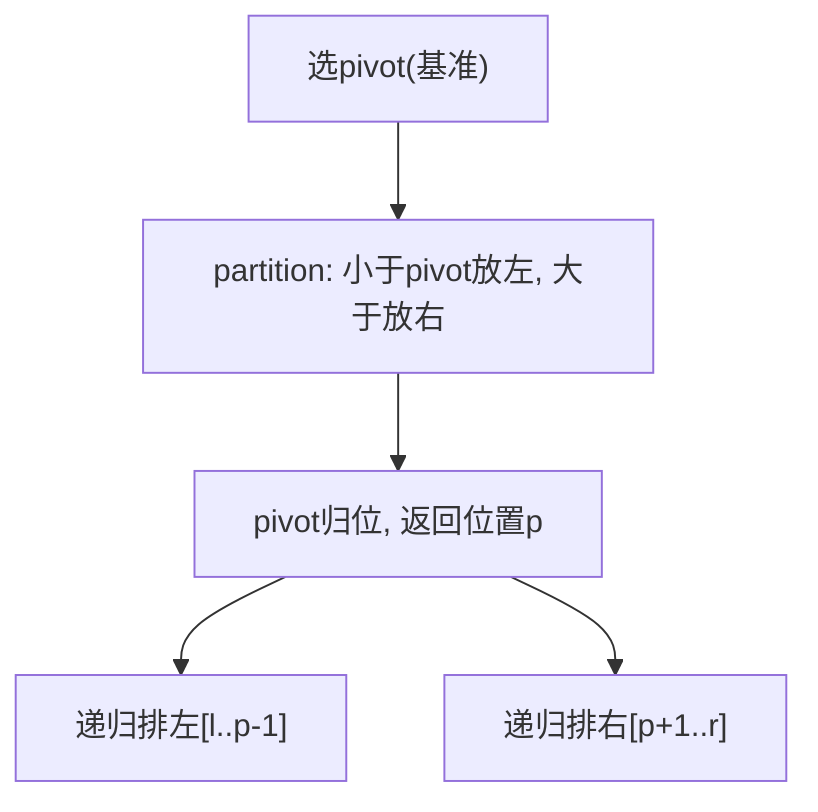
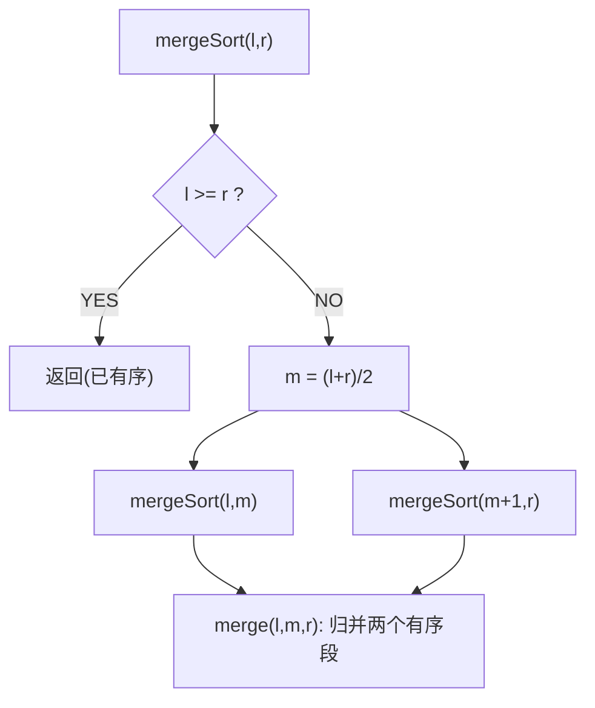
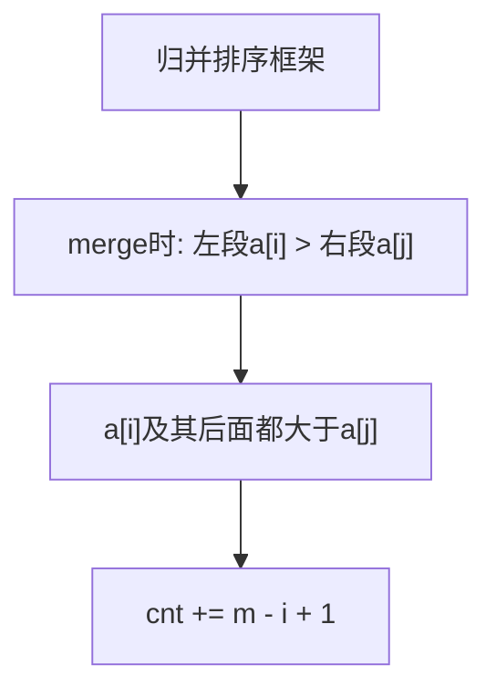
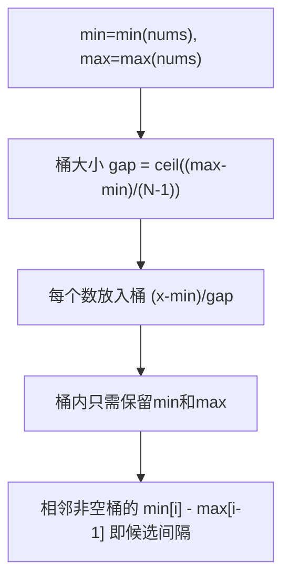

## 快速排序（Quick Sort）

> 手写必考 · ⭐⭐ · 分区+递归
>
> 平均 O(NlogN)，最坏 O(N²)。Java `Arrays.sort()` 对基本类型用双轴快排。理解 partition 就理解了快排。


### 01. 题目

手写快速排序。


### 02. 题目分析

**2.1 核心思想**



**2.2 partition 手推**

```
数组 [5, 3, 8, 4, 2], pivot=2(r=4)
i=l=0, j遍历:

j=0: a[0]=5 > pivot → 跳过
j=1: a[1]=3 > pivot → 跳过
j=2: a[2]=8 > pivot → 跳过
j=3: a[3]=4 > pivot → 跳过
swap(a[i],a[r]): swap(0,4) → [2,3,8,4,5]
pivot归位到i=0

左: 空  右: [3,8,4,5]
```

```
数组 [3, 1, 2, 5, 4], pivot=4(r=4)
i=0,j=0: a[0]=3 ≤ 4 → swap(0,0), i=1
i=1,j=1: a[1]=1 ≤ 4 → swap(1,1), i=2
i=2,j=2: a[2]=2 ≤ 4 → swap(2,2), i=3
i=3,j=3: a[3]=5 > 4 → 跳过
swap(a[i],a[r]): swap(3,4) → [3,1,2,4,5]
pivot=4归位到i=3
```


### 03. 代码

**Java**：
```java
void quickSort(int[] nums, int l, int r) {
    if (l >= r) return;
    int p = partition(nums, l, r);
    quickSort(nums, l, p - 1);
    quickSort(nums, p + 1, r);
}
int partition(int[] nums, int l, int r) {
    int pivot = nums[r], i = l;
    for (int j = l; j < r; j++)
        if (nums[j] <= pivot) swap(nums, i++, j);
    swap(nums, i, r); return i;
}
void swap(int[] a, int i, int j) { int t = a[i]; a[i] = a[j]; a[j] = t; }
```

**Python**：
```python
def quickSort(self, nums, l, r):
    if l >= r: return
    p = self.partition(nums, l, r)
    self.quickSort(nums, l, p-1)
    self.quickSort(nums, p+1, r)

def partition(self, nums, l, r):
    pivot, i = nums[r], l
    for j in range(l, r):
        if nums[j] <= pivot: nums[i], nums[j] = nums[j], nums[i]; i += 1
    nums[i], nums[r] = nums[r], nums[i]
    return i
```

**C++**：
```cpp
int partition(vector<int>& a, int l, int r) {
    int pivot = a[r], i = l;
    for (int j = l; j < r; j++) if (a[j] <= pivot) swap(a[i++], a[j]);
    swap(a[i], a[r]); return i;
}
void quickSort(vector<int>& a, int l, int r) {
    if (l >= r) return; int p = partition(a, l, r);
    quickSort(a, l, p-1); quickSort(a, p+1, r);
}
```

**复杂度**：O(NlogN)平均 / O(N²)最坏，O(logN)栈。


### 04. 优化方向与三大排序对比

| 优化 | 方法 | 解决的问题 |
|------|------|---------|
| 随机pivot | `swap(r, rand(l,r))` | 有序数组退化为O(N²) |
| 三数取中 | `median(l,m,r)` | 克服有序和逆序 |
| 三路快排 | 小于/等于/大于三个区 | 大量重复元素时O(N) |
| 小数组切插入排序 | `r-l < threshold` 时用插排 | 小数组递归开销大 |

| | 快排 | 归并 | 堆排 |
|------|:---:|:---:|:---:|
| 时间 | O(NlogN) | O(NlogN) | O(NlogN) |
| 空间 | O(logN) | O(N) | O(1) |
| 稳定 | 否 | **是** | 否 |
| 随机访问 | 需要 | 需要 | 需要(建堆) |

**相关**：[134 归并排序](134.归并排序.md)、[A011 荷兰国旗(三路快排)](../07.数组算法题/011-A-颜色分类.md)


## 归并排序（Merge Sort）

> 手写必考 · ⭐⭐ · 分治+合并
>
> 稳定排序，O(NlogN)。天然适合链表排序和外排序。逆序对计数问题就是归并排序的变形。


### 01. 题目

手写归并排序。


### 02. 题目分析

**2.1 分治三步**



**2.2 merge 手推**

```
左子数组 [2,8]   右子数组 [3,5]
         i=0            j=0

① 2≤3 → tmp=[2], i=1
② 8>3 → tmp=[2,3], j=1
③ 8>5 → tmp=[2,3,5], j=2(右空)
④ 复制剩余: tmp=[2,3,5,8]
```


### 03. 代码

**Java**：
```java
void mergeSort(int[] nums, int l, int r) {
    if (l >= r) return;
    int m = l + (r - l) / 2;
    mergeSort(nums, l, m);
    mergeSort(nums, m + 1, r);
    merge(nums, l, m, r);
}
void merge(int[] nums, int l, int m, int r) {
    int[] tmp = new int[r - l + 1];
    int i = l, j = m + 1, k = 0;
    while (i <= m && j <= r)
        tmp[k++] = nums[i] <= nums[j] ? nums[i++] : nums[j++];
    while (i <= m) tmp[k++] = nums[i++];
    while (j <= r) tmp[k++] = nums[j++];
    System.arraycopy(tmp, 0, nums, l, tmp.length);
}
```

**Python**：
```python
def mergeSort(self, nums, l, r):
    if l >= r: return
    m = (l + r) // 2
    self.mergeSort(nums, l, m)
    self.mergeSort(nums, m + 1, r)
    tmp, i, j = [], l, m + 1
    while i <= m and j <= r:
        if nums[i] <= nums[j]: tmp.append(nums[i]); i += 1
        else: tmp.append(nums[j]); j += 1
    tmp.extend(nums[i:m+1]); tmp.extend(nums[j:r+1])
    nums[l:r+1] = tmp
```

**C++**：
```cpp
void merge(vector<int>& a,int l,int m,int r){ vector<int>t(r-l+1); int i=l,j=m+1,k=0; while(i<=m&&j<=r) t[k++]=a[i]<=a[j]?a[i++]:a[j++]; while(i<=m)t[k++]=a[i++]; while(j<=r)t[k++]=a[j++]; copy(t.begin(),t.end(),a.begin()+l); }
void mergeSort(vector<int>& a,int l,int r){ if(l>=r) return; int m=l+(r-l)/2; mergeSort(a,l,m);mergeSort(a,m+1,r); merge(a,l,m,r); }
```

**复杂度**：O(NlogN)/O(N)。稳定。


### 04. 归并 vs 快排

| | 归并 | 快排 |
|------|:---:|:---:|
| 分治顺序 | 先分后合 | 先partition再分 |
| 原地 | 否(需tmp) | 是 |
| 稳定 | **是** | 否 |
| 链表 | **天然适合** | 不适合 |
| 外排序 | **可以** | 不可以 |
| 逆序对 | **可以统计** | 不能 |

**归并的应用**

- **逆序对统计**：在 merge 时 `a[i] > a[j] → cnt += m-i+1`
- **链表排序**：链表的归并 = O(1)空间（断链+合并）
- **外排序**：内存装不下时，分段排+归并


### 05. 总结

| 核心启示 | 说明 |
|---------|------|
| 分治后归并 | 先递归拆分成最小单元，再回溯合并 |
| `a[i]<=a[j]` | `<=` 保证稳定性 |
| 逆序对 | `a[i] > a[j]` 时 `cnt += m-i+1` |

**相关**：[133 快速排序](133.快速排序.md)、[136 逆序对](136.数组中的逆序对.md)


## 数组中的逆序对（Reverse Pairs）

> 剑指 Offer 51 · ⭐⭐⭐ · 归并统计


### 01. 题目描述

数组中 `i < j` 且 `a[i] > a[j]` 称为一个逆序对。统计总数。

```
输入：[7,5,6,4]
输出：5
解释：(7,5)(7,6)(7,4)(5,4)(6,4)
```


### 02. 题目分析

**2.1 暴力 O(N²)**

双重循环比较 → 超时。

**2.2 归并统计 O(NlogN)**



**为什么 `cnt += m-i+1`？**

```
左段已有序: [5,7,8,9]    右段已有序: [1,3,4,6]
              i=0                   j=0

a[0]=5 > a[j]=1 → 5,7,8,9 都 > 1 → cnt += 4-0 = 4
i=0不变, a[0]=5 vs a[j=1]=3: 5>3 → cnt += 4  → 总8
a[0]=5 vs a[j=2]=4: 5>4 → cnt += 4 → 总12
a[0]=5 vs a[j=3]=6: 5<6 → tmp[k++]=5, i=1
...
```

**2.3 手推**

```
[7, 5, 6, 4]

split: [7,5] [6,4]
↓
[7],[5]: merge: 7>5 → cnt=1, tmp=[5,7]
[6],[4]: merge: 6>4 → cnt=2, tmp=[4,6]
↓
[5,7],[4,6]: merge:
  i=0(5) vs j=0(4): 5>4 → cnt+=2-0=2, cnt=4, tmp=[4]
  i=0(5) vs j=1(6): 5<6 → tmp=[4,5], i=1
  i=1(7) vs j=1(6): 7>6 → cnt+=2-1=1, cnt=5, tmp=[4,5,6]
  i=1(7): tmp=[4,5,6,7]

cnt=5
```


### 03. 代码

**Java**：
```java
int cnt = 0;
public int reversePairs(int[] nums) {
    mergeSort(nums, 0, nums.length - 1);
    return cnt;
}
void mergeSort(int[] a, int l, int r) {
    if (l >= r) return;
    int m = l + (r - l) / 2;
    mergeSort(a, l, m); mergeSort(a, m + 1, r);
    merge(a, l, m, r);
}
void merge(int[] a, int l, int m, int r) {
    int[] tmp = new int[r - l + 1];
    int i = l, j = m + 1, k = 0;
    while (i <= m && j <= r) {
        if (a[i] <= a[j]) tmp[k++] = a[i++];
        else { tmp[k++] = a[j++]; cnt += m - i + 1; }  // 关键！
    }
    while (i <= m) tmp[k++] = a[i++];
    while (j <= r) tmp[k++] = a[j++];
    System.arraycopy(tmp, 0, a, l, tmp.length);
}
```

**Python**：
```python
def reversePairs(self, nums: List[int]) -> int:
    self.cnt = 0
    def merge(l, m, r):
        tmp, i, j = [], l, m + 1
        while i <= m and j <= r:
            if nums[i] <= nums[j]: tmp.append(nums[i]); i += 1
            else: tmp.append(nums[j]); j += 1; self.cnt += m - i + 1
        tmp.extend(nums[i:m+1]); tmp.extend(nums[j:r+1])
        nums[l:r+1] = tmp
    def mergeSort(l, r):
        if l >= r: return
        m = (l + r) // 2
        mergeSort(l, m); mergeSort(m + 1, r)
        merge(l, m, r)
    mergeSort(0, len(nums) - 1)
    return self.cnt
```

**C++**：
```cpp
int reversePairs(vector<int>& nums) {
    int cnt = 0;
    function<void(int,int)> ms = [&](int l,int r){ if(l>=r) return; int m=l+(r-l)/2; ms(l,m);ms(m+1,r);
        vector<int> t(r-l+1); int i=l,j=m+1,k=0;
        while(i<=m&&j<=r){ if(nums[i]<=nums[j]) t[k++]=nums[i++]; else{ t[k++]=nums[j++]; cnt+=m-i+1; } }
        while(i<=m) t[k++]=nums[i++]; while(j<=r) t[k++]=nums[j++]; move(t.begin(),t.end(),nums.begin()+l);
    };
    ms(0,nums.size()-1); return cnt;
}
```

**复杂度**：O(NlogN)/O(N)。


### 04. 总结

| 核心启示 | 说明 |
|---------|------|
| `cnt += m-i+1` | 左段a[i]及其后面的数都构成逆序对 |
| 归并变形 | 归并排序 + 一行统计 = 逆序对计数 |
| 树状数组 | 也可解此题，O(NlogN) |

**相关**：[134 归并排序](134.归并排序.md)


## 最大间距（Maximum Gap）

> LeetCode 164 · ⭐⭐⭐ · 桶排序 O(N)


### 01. 题目描述

求无序数组中排序后相邻元素的最大差值。要求 O(N)。

```
输入：[3,6,9,1]
输出：3  (排序后 [1,3,6,9]，最大间隔=3)
```


### 02. 题目分析

**2.1 为什么必须用桶？**

排序法 O(NlogN) 不满足要求。桶排序 O(N)。

**2.2 桶排序原理**



**2.3 为什么 `(max-min)/(N-1)` 是最小桶大小？**

N 个数均匀分布在 [min, max]，每个间隔至少 `(max-min)/(N-1)`。桶内元素的最大差值不会超过这个值——所以**最大间距一定出现在桶之间**。


### 03. 代码

**Java**：
```java
public int maximumGap(int[] nums) {
    if (nums.length < 2) return 0;
    int n = nums.length;
    int min = Integer.MAX_VALUE, max = Integer.MIN_VALUE;
    for (int x : nums) { min = Math.min(min, x); max = Math.max(max, x); }
    if (min == max) return 0;

    // 桶大小 = ceil((max-min)/(n-1))
    int gap = Math.max(1, (max - min) / (n - 1));
    int size = (max - min) / gap + 1;
    int[] bMin = new int[size], bMax = new int[size];
    Arrays.fill(bMin, Integer.MAX_VALUE); Arrays.fill(bMax, Integer.MIN_VALUE);

    // 入桶
    for (int x : nums) {
        int i = (x - min) / gap;
        bMin[i] = Math.min(bMin[i], x);
        bMax[i] = Math.max(bMax[i], x);
    }

    // 计算相邻桶的最大间距
    int ans = 0, prev = min;
    for (int i = 0; i < size; i++) {
        if (bMin[i] == Integer.MAX_VALUE) continue;  // 空桶跳过
        ans = Math.max(ans, bMin[i] - prev);
        prev = bMax[i];
    }
    return ans;
}
```

**Python**：
```python
def maximumGap(self, nums: List[int]) -> int:
    if len(nums) < 2: return 0
    n = len(nums)
    mn, mx = min(nums), max(nums)
    if mn == mx: return 0

    gap = max(1, (mx - mn) // (n - 1))
    size = (mx - mn) // gap + 1
    bMin = [float('inf')] * size; bMax = [float('-inf')] * size

    for x in nums:
        i = (x - mn) // gap
        bMin[i] = min(bMin[i], x); bMax[i] = max(bMax[i], x)

    ans, prev = 0, mn
    for i in range(size):
        if bMin[i] == float('inf'): continue
        ans = max(ans, bMin[i] - prev)
        prev = bMax[i]
    return ans
```

**C++**：
```cpp
int maximumGap(vector<int>& nums) {
    if (nums.size() < 2) return 0;
    int n = nums.size();
    auto [mn, mx] = minmax_element(nums.begin(), nums.end());
    if (*mn == *mx) return 0;

    int gap = max(1, (*mx - *mn) / (n - 1));
    int size = (*mx - *mn) / gap + 1;
    vector<int> bMin(size, INT_MAX), bMax(size, INT_MIN);

    for (int x : nums) { int i = (x - *mn) / gap; bMin[i] = min(bMin[i], x); bMax[i] = max(bMax[i], x); }

    int ans = 0, prev = *mn;
    for (int i = 0; i < size; i++) {
        if (bMin[i] == INT_MAX) continue;
        ans = max(ans, bMin[i] - prev); prev = bMax[i];
    }
    return ans;
}
```

**复杂度**：O(N)时间，O(N)空间。


### 04. 总结

| 核心启示 | 说明 |
|---------|------|
| 桶大小 | `(max-min)/(N-1)` 保证最大间距在桶间 |
| 只存min/max | 桶内不需要全排序，只需最值 |
| 空桶跳过 | 相邻非空桶的 `min[i]-max[i-1]` |
| O(N)排序 | 桶/计数/基数排序可突破 O(NlogN) |

**相关**：[136 逆序对](136.数组中的逆序对.md)


