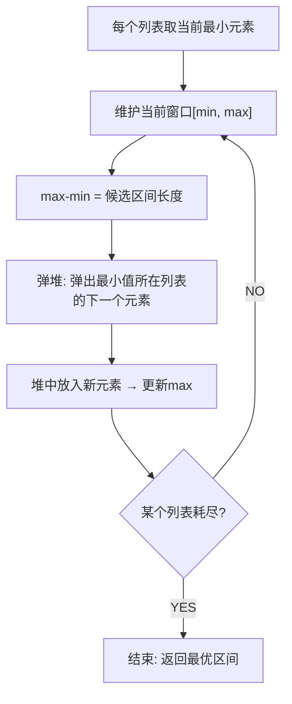

## 最小区间（Smallest Range Covering Elements from K Lists）

> LeetCode 632 · ⭐⭐⭐ · 多路归并堆
>
> K 个有序数组，找一个最小区间使得区间内至少包含每个数组中的一个元素。这道题是多路归并的经典应用——与合并K个有序链表同根同源。


### 01. 题目描述

给定 K 个升序排列的整数列表。找出一个最小区间 `[left, right]`，使得每个列表中**至少有一个元素**在区间内。若有多个，返回起点最小的。

**示例**：

```
输入：nums = [[4,10,15,24,26],[0,9,12,20],[5,18,22,30]]
输出：[20,24]
解释：
  [20,24] 包含: 列表1的20和24, 列表2的20, 列表3的22
  区间长度=4, 是所有可行区间中最小的
```

**约束**：`nums[i]` 升序，元素总数 ≤ 10^5。


### 02. 题目分析

**2.1 朴素思路**

枚举所有区间 → O(元素总数²) → 不可接受。

**2.2 多路归并视角**



**2.3 核心洞察**

用最小堆维护 **每个列表当前参与窗口的最小元素**。`max` 跟踪窗口右边界。

- **弹堆顶（min）**：当前窗口的最左端
- **替换为同列表的下一个元素**：保证窗口始终包含所有列表
- **更新 window = [min, max]**：如果更小则记录

**2.4 为什么这样能找到最优？**

当前窗口的最小值是某个列表的元素。要缩小窗口，必须放弃它——换上同列表的下一个更大元素。所以**每次都弹出最小值所在列表的下一个**。

**2.5 手推演示**

```
nums = [[4,10,15,24,26], [0,9,12,20], [5,18,22,30]]

初始化：每个列表首元素入堆
pq=[(0,1,0), (4,0,0), (5,2,0)]    max=5
格式: (值, 列表号, 该列表中的下标)

窗口[0,5], len=6

弹(0,1,0): 列表1下一个=9 → 入(9,1,1), max=9
  pq=[(4,0,0),(5,2,0),(9,1,1)]  窗口[4,9], len=6(不优)

弹(4,0,0): 列表0下一个=10 → 入(10,0,1), max=10
  pq=[(5,2,0),(9,1,1),(10,0,1)] 窗口[5,10], len=6

弹(5,2,0): 列表2下一个=18 → 入(18,2,1), max=18
  pq=[(9,1,1),(10,0,1),(18,2,1)] 窗口[9,18], len=10

弹(9,1,1): 列表1下一个=12 → 入(12,1,2), max=18
  pq=[(10,0,1),(12,1,2),(18,2,1)] 窗口[10,18], len=9

弹(10,0,1): 列表0下一个=15 → 入(15,0,2), max=18
  pq=[(12,1,2),(15,0,2),(18,2,1)] 窗口[12,18], len=7

弹(12,1,2): 列表1下一个=20 → 入(20,1,3), max=20
  pq=[(15,0,2),(18,2,1),(20,1,3)] 窗口[15,20], len=6

弹(15,0,2): 列表0下一个=24 → 入(24,0,3), max=24
  pq=[(18,2,1),(20,1,3),(24,0,3)] 窗口[18,24], len=7

弹(18,2,1): 列表2下一个=22 → 入(22,2,2), max=24
  pq=[(20,1,3),(22,2,2),(24,0,3)] 窗口[20,24], len=4 ← 最优！

弹(20,1,3): 列表1下一个=不存在(长度3,下标3越界)
  堆大小<3 → 结束

最终: [20,24]
```


### 03. 代码

**Java**：
```java
public int[] smallestRange(List<List<Integer>> nums) {
    // 堆: [值, 列表索引, 元素在列表中的下标]
    PriorityQueue<int[]> pq = new PriorityQueue<>((a, b) -> a[0] - b[0]);
    int max = Integer.MIN_VALUE, start = 0, end = Integer.MAX_VALUE;

    // 初始：每个列表第一个元素入堆
    for (int i = 0; i < nums.size(); i++) {
        int val = nums.get(i).get(0);
        pq.offer(new int[]{val, i, 0});
        max = Math.max(max, val);
    }

    while (pq.size() == nums.size()) {           // 必须所有列表都有元素
        int[] cur = pq.poll();                    // 当前最小值
        int min = cur[0], listIdx = cur[1], elemIdx = cur[2];

        // 更新最优区间
        if (max - min < end - start) { start = min; end = max; }

        // 用同列表的下一个元素替换
        if (elemIdx + 1 < nums.get(listIdx).size()) {
            int nxt = nums.get(listIdx).get(elemIdx + 1);
            pq.offer(new int[]{nxt, listIdx, elemIdx + 1});
            max = Math.max(max, nxt);             // 更新最大值
        }
    }
    return new int[]{start, end};
}
```

**Python**：
```python
def smallestRange(self, nums: List[List[int]]) -> List[int]:
    import heapq
    pq = [(lst[0], i, 0) for i, lst in enumerate(nums)]
    heapq.heapify(pq)

    mx = max(lst[0] for lst in nums)
    start, end = pq[0][0], mx

    while len(pq) == len(nums):
        _, list_i, elem_i = heapq.heappop(pq)
        if mx - pq[0][0] < end - start:
            start, end = pq[0][0], mx

        if elem_i + 1 < len(nums[list_i]):
            nxt = nums[list_i][elem_i + 1]
            heapq.heappush(pq, (nxt, list_i, elem_i + 1))
            mx = max(mx, nxt)

    return [start, end]
```

**C++**：
```cpp
vector<int> smallestRange(vector<vector<int>>& nums) {
    auto cmp = [](auto& a, auto& b) { return a[0] > b[0]; };
    priority_queue<vector<int>, vector<vector<int>>, decltype(cmp)> pq(cmp);
    int mx = INT_MIN, start = 0, end = INT_MAX;

    for (int i = 0; i < nums.size(); i++) {
        pq.push({nums[i][0], i, 0});
        mx = max(mx, nums[i][0]);
    }

    while (pq.size() == nums.size()) {
        auto cur = pq.top(); pq.pop();
        int mn = cur[0], li = cur[1], ei = cur[2];
        if (mx - mn < end - start) { start = mn; end = mx; }
        if (ei + 1 < nums[li].size()) {
            int nxt = nums[li][ei + 1];
            pq.push({nxt, li, ei + 1});
            mx = max(mx, nxt);
        }
    }
    return {start, end};
}
```

**复杂度**：时间 O(NlogK)，N 为元素总数，K 为列表数。空间 O(K)。


### 04. 与合并K个有序链表的对比

| | 合并K链表 (B007) | 最小区间 (K008) |
|------|:---:|:---:|
| 数据结构 | 最小堆 | 最小堆 |
| 维护 | — | 额外维护 max |
| 终止条件 | 堆空 | 某个列表耗尽 |
| 操作 | 取最小→接结果 | 取最小→更新区间→替换 |
| 复杂度 | O(NlogK) | O(NlogK) |


### 05. 总结

| 核心启示 | 说明 |
|---------|------|
| 多路归并堆 | K 个有序列表的通用处理框架 |
| 窗口维护 | min从堆中来，max手动跟踪 |
| 贪心滑动 | 每次弹出最小值，用同列表下一个替换 |
| 终止条件 | 任一列表耗尽即结束（无法再覆盖所有列表） |

**相关题目**：[B007 合并K个链表](../08.链表算法题/006-B-合并两个有序链表.md)、[F001 第K大元素](../12.堆算法题/086.数组中的第K个最大元素.md)


