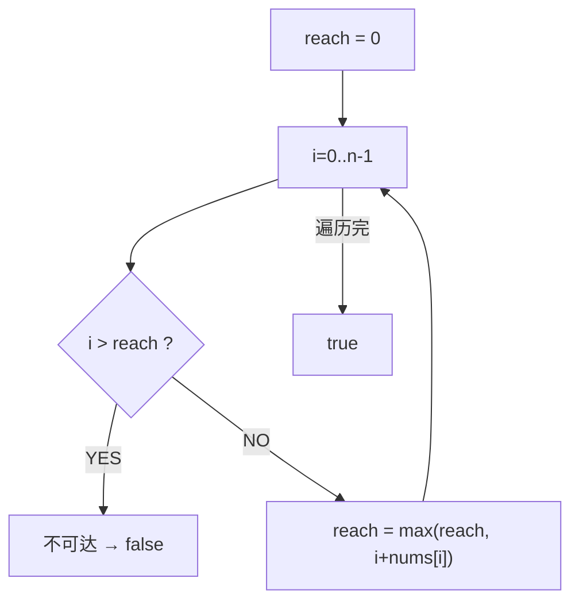
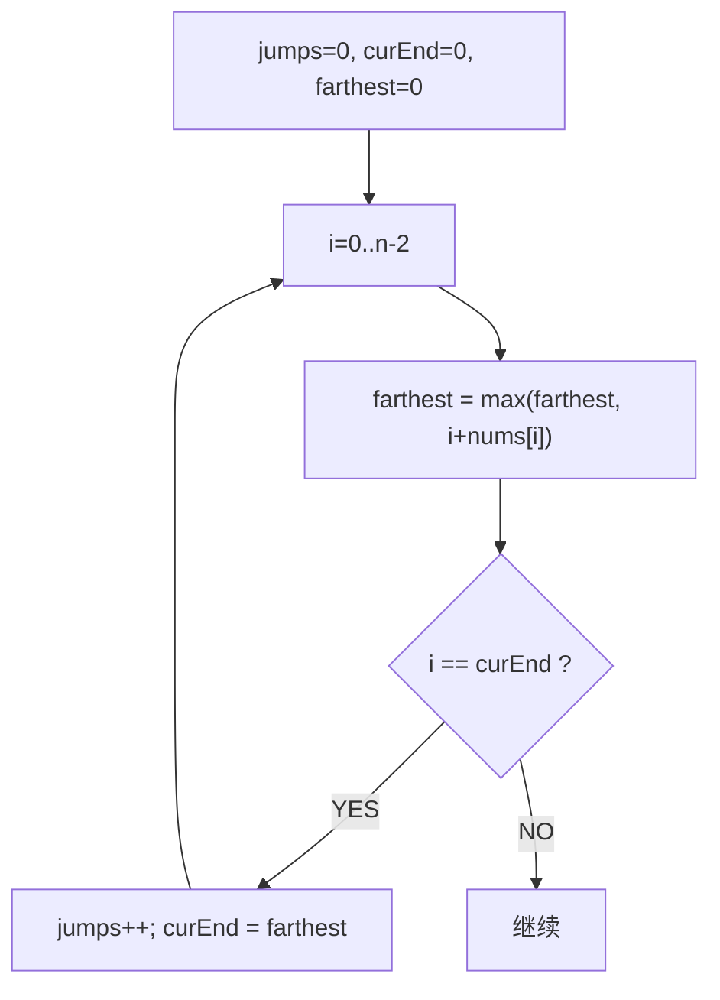
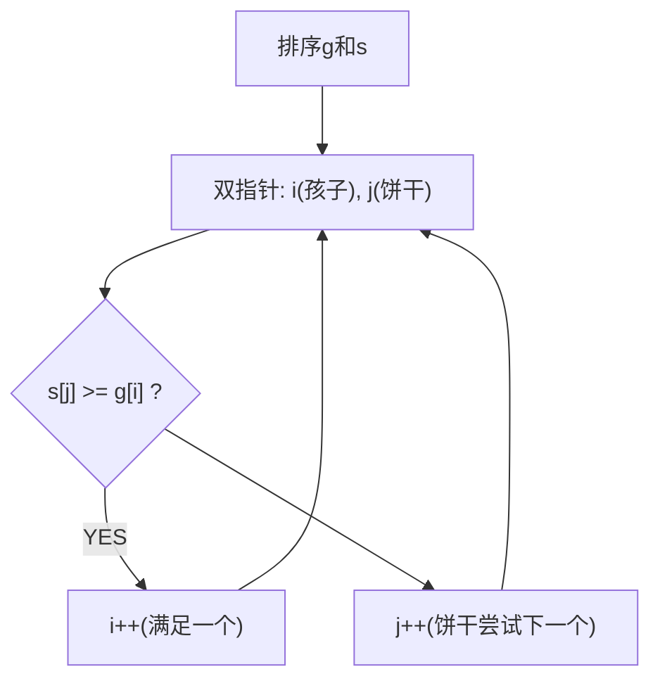
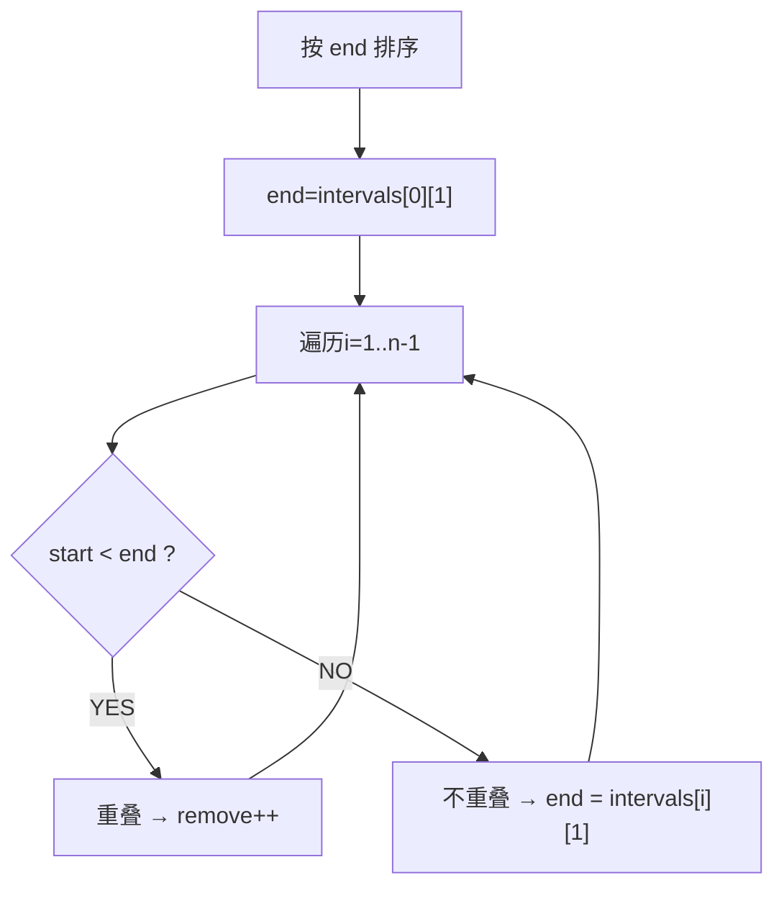
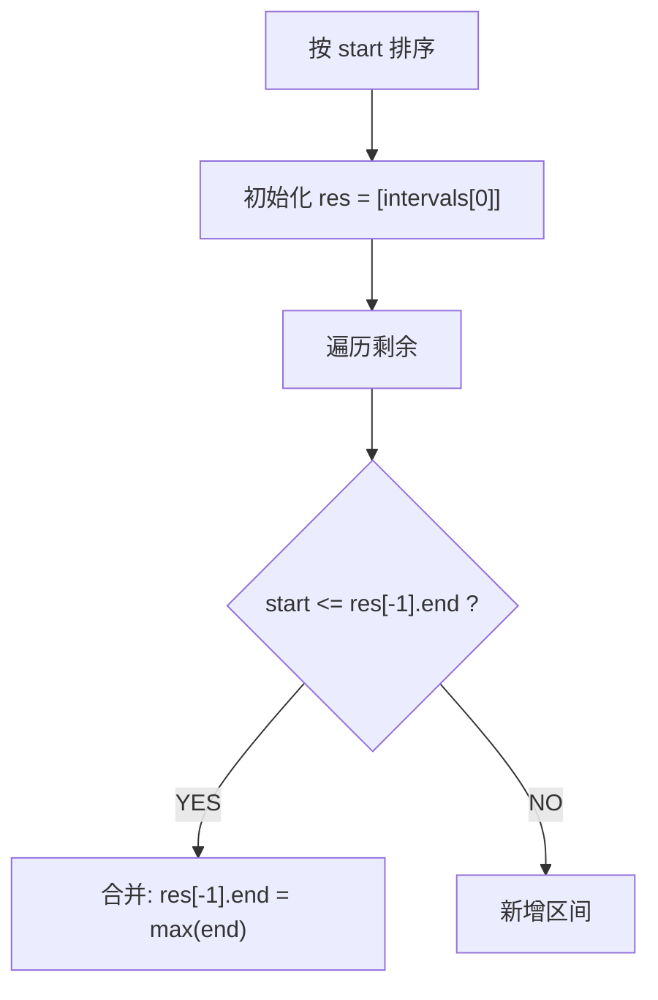
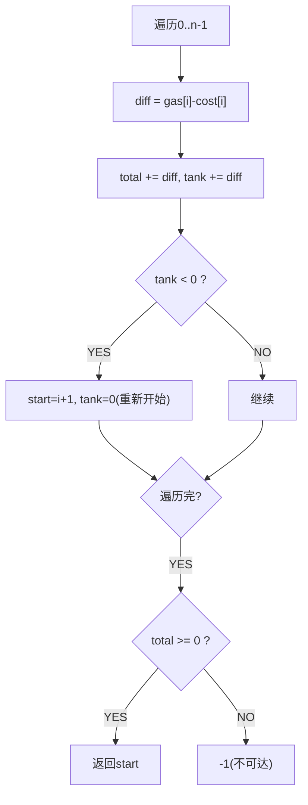
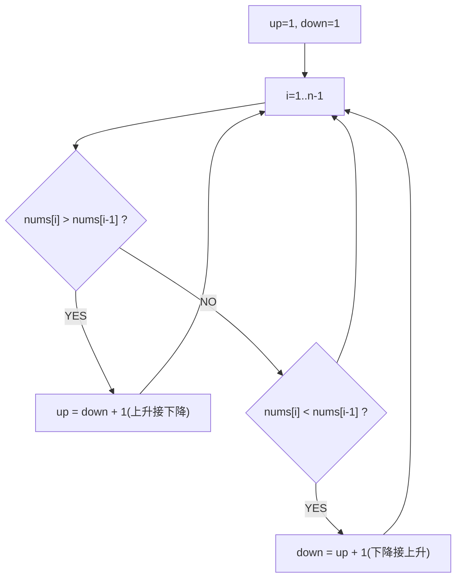

# 贪心算法题

## 149.跳跃游戏

# 跳跃游戏（Jump Game）

> LeetCode 55 · ⭐⭐ · 贪心

## 01. 题目

数组每个元素表示最大跳跃长度。判断能否从0跳到末尾。`[2,3,1,1,4]` → true。

## 02. 题目分析



**贪心选择**：每一步维护"当前能到达的最远位置"。若 `i > reach` 说明跳不到 i。

```
nums=[2,3,1,1,4]
i=0: reach=max(0,0+2)=2
i=1: reach=max(2,1+3)=4 ≥ n-1 → true
```

## 03. 代码

**Java**：
```java
public boolean canJump(int[] nums) {
    int reach = 0;
    for (int i = 0; i < nums.length; i++) {
        if (i > reach) return false;
        reach = Math.max(reach, i + nums[i]);
    }
    return true;
}
```

**Python**：
```python
def canJump(self, nums):
    reach = 0
    for i, n in enumerate(nums):
        if i > reach: return False
        reach = max(reach, i + n)
    return True
```

**C++**：
```cpp
bool canJump(vector<int>& nums) {
    int reach=0;
    for(int i=0;i<nums.size();i++){ if(i>reach) return false; reach=max(reach,i+nums[i]); }
    return true;
}
```

**复杂度**：O(N)/O(1)。

## 04. 总结

| 核心 | 说明 |
|------|------|
| `reach` | 维护当前能到达的最远下标 |
| `i > reach` | 无法到达当前位置→失败 |
| 贪心正确性 | 每次都选能跳最远的 |

**相关**：[150 跳跃II](150.跳跃游戏II.md)

---

## 150.跳跃游戏II

# 跳跃游戏 II（Jump Game II）

> LeetCode 45 · ⭐⭐ · 贪心

## 01. 题目

求最少跳跃次数到达末尾。`[2,3,1,1,4]` → 2（0→1→4）。

## 02. 题目分析



**curEnd**：当前跳跃能覆盖的最远边界。当 i 到达 curEnd 时，必须再跳一次。

```
nums=[2,3,1,1,4]
i=0: farthest=2, i==curEnd(0) → jumps=1, curEnd=2
i=1: farthest=4, i≠curEnd → 继续
i=2: farthest=4, i==curEnd(2) → jumps=2, curEnd=4 ≥ n-1 → 结束
```

## 03. 代码

**Java**：
```java
public int jump(int[] nums) {
    int jumps = 0, curEnd = 0, farthest = 0;
    for (int i = 0; i < nums.length - 1; i++) {
        farthest = Math.max(farthest, i + nums[i]);
        if (i == curEnd) { jumps++; curEnd = farthest; }
    }
    return jumps;
}
```

**Python**：
```python
def jump(self, nums):
    jumps = cur_end = farthest = 0
    for i in range(len(nums) - 1):
        farthest = max(farthest, i + nums[i])
        if i == cur_end: jumps += 1; cur_end = farthest
    return jumps
```

**C++**：
```cpp
int jump(vector<int>& nums) {
    int jumps=0, curEnd=0, farthest=0;
    for(int i=0;i<nums.size()-1;i++){ farthest=max(farthest,i+nums[i]); if(i==curEnd){ jumps++; curEnd=farthest; } }
    return jumps;
}
```

**复杂度**：O(N)/O(1)。

## 04. L001 vs L002

| | L001 能否到达 | L002 最少步数 |
|------|:---:|:---:|
| 返回值 | bool | int |
| 关键变量 | reach | jumps+curEnd+farthest |
| 额外条件 | — | `i==curEnd` 触发跳跃 |

**相关**：[149 跳跃游戏](149.跳跃游戏.md)

---

## 151.分发饼干

# 分发饼干（Assign Cookies）

> LeetCode 455 · ⭐ · 排序+贪心

## 01. 题目

每个孩子有胃口 `g[i]`，每块饼干有大小 `s[j]`。`s[j]≥g[i]` 时满足该孩子。最多满足几个？

`g=[1,2,3], s=[1,1]` → 1。

## 02. 题目分析



**贪心策略**：最小饼干满足最小胃口的孩子。

## 03. 代码

**Java**：
```java
public int findContentChildren(int[] g, int[] s) {
    Arrays.sort(g); Arrays.sort(s);
    int i = 0;
    for (int j = 0; i < g.length && j < s.length; j++)
        if (s[j] >= g[i]) i++;
    return i;
}
```

**Python**：
```python
def findContentChildren(self, g, s):
    g.sort(); s.sort(); i = 0
    for x in s:
        if i < len(g) and x >= g[i]: i += 1
    return i
```

**C++**：
```cpp
int findContentChildren(vector<int>& g, vector<int>& s) {
    sort(g.begin(),g.end()); sort(s.begin(),s.end());
    int i=0; for(int j=0;i<g.size()&&j<s.size();j++) if(s[j]>=g[i]) i++;
    return i;
}
```

**复杂度**：O(NlogN)/O(1)。

## 04. 总结

**贪心核心**：排序 → 最小匹配最小。O(NlogN)。

**相关**：[154 合并区间](154.合并区间.md)

---

## 152.无重叠区间

# 无重叠区间（Non-overlapping Intervals）

> LeetCode 435 · ⭐⭐ · 区间调度贪心

## 01. 题目

最少移除几个区间使剩余不重叠。`[[1,2],[2,3],[3,4],[1,3]]` → 1（移除[1,3]）。

## 02. 题目分析



**为什么按 end 排序？** 选择最早结束的区间，为后面的区间留下最多空间——这是区间调度问题的标准贪心策略。

## 03. 代码

**Java**：
```java
public int eraseOverlapIntervals(int[][] intervals) {
    Arrays.sort(intervals, (a, b) -> a[1] - b[1]);
    int end = intervals[0][1], remove = 0;
    for (int i = 1; i < intervals.length; i++) {
        if (intervals[i][0] < end) remove++;
        else end = intervals[i][1];
    }
    return remove;
}
```

**Python**：
```python
def eraseOverlapIntervals(self, intervals):
    intervals.sort(key=lambda x: x[1])
    end, cnt = intervals[0][1], 0
    for s, e in intervals[1:]:
        if s < end: cnt += 1
        else: end = e
    return cnt
```

**C++**：
```cpp
int eraseOverlapIntervals(vector<vector<int>>& ins) {
    sort(ins.begin(),ins.end(),[](auto&a,auto&b){return a[1]<b[1];});
    int end=ins[0][1],cnt=0;
    for(int i=1;i<ins.size();i++){ if(ins[i][0]<end) cnt++; else end=ins[i][1]; }
    return cnt;
}
```

**复杂度**：O(NlogN)/O(1)。

## 04. 区间三题对比

| | 无重叠(152) | 引爆气球(153) | 合并区间(154) |
|------|:---:|:---:|:---:|
| 排序 | end | end | **start** |
| 条件 | `start < end` | `start > end` | `start <= end` |
| 操作 | 跳过计数 | 新箭 | 合并取max end |

**核心**：L152/L153 按 end 贪心，L154 按 start 排以便从前向后合并。

**相关**：[153 引爆气球](153.用最少数量的箭引爆气球.md)、[154 合并区间](154.合并区间.md)

---

## 153.用最少数量的箭引爆气球

# 用最少数量的箭引爆气球（Minimum Arrows）

> LeetCode 452 · ⭐⭐ · 贪心区间

## 01. 题目

`[[10,16],[2,8],[1,6],[7,12]]` → 2（x=6和x=11各一箭）。气球边界接触也算引爆。

## 02. 分析

与 L152 同框架，但重叠定义不同：`start > end` 才需新箭。

```java
public int findMinArrowShots(int[][] points) {
    Arrays.sort(points, (a, b) -> Integer.compare(a[1], b[1])); // 防溢出
    int end = points[0][1], arrows = 1;
    for (int i = 1; i < points.length; i++)
        if (points[i][0] > end) { arrows++; end = points[i][1]; }
    return arrows;
}
```

**Python**：
```python
def findMinArrowShots(self, points):
    points.sort(key=lambda x: x[1])
    end, arrows = points[0][1], 1
    for s, e in points[1:]:
        if s > end: arrows += 1; end = e
    return arrows
```

**注意**：`Integer.compare` 防溢出（`[[Integer.MIN_VALUE, Integer.MAX_VALUE]]`）。

**复杂度**：O(NlogN)/O(1)。

**相关**：[152 无重叠区间](152.无重叠区间.md)

---

## 154.合并区间

# 合并区间（Merge Intervals）

> LeetCode 56 · ⭐⭐ · 排序+贪心

## 01. 题目

`[[1,3],[2,6],[8,10],[15,18]]` → `[[1,6],[8,10],[15,18]]`

## 02. 分析



**与 L152/L153 不同**：按 **start** 排序（不是 end），因为需要从前向后合并。

## 03. 代码

**Java**：
```java
public int[][] merge(int[][] intervals) {
    Arrays.sort(intervals, (a, b) -> a[0] - b[0]);
    List<int[]> res = new ArrayList<>();
    for (int[] in : intervals) {
        if (res.isEmpty() || res.get(res.size() - 1)[1] < in[0])
            res.add(in);
        else
            res.get(res.size() - 1)[1] = Math.max(res.get(res.size() - 1)[1], in[1]);
    }
    return res.toArray(new int[res.size()][]);
}
```

**Python**：
```python
def merge(self, intervals):
    intervals.sort(key=lambda x: x[0])
    res = [intervals[0]]
    for s, e in intervals[1:]:
        if s > res[-1][1]: res.append([s, e])
        else: res[-1][1] = max(res[-1][1], e)
    return res
```

**C++**：
```cpp
vector<vector<int>> merge(vector<vector<int>>& ins) {
    sort(ins.begin(),ins.end());
    vector<vector<int>> res;
    for(auto& in:ins){ if(res.empty()||res.back()[1]<in[0]) res.push_back(in); else res.back()[1]=max(res.back()[1],in[1]); }
    return res;
}
```

**复杂度**：O(NlogN)/O(N)。

**相关**：[152 无重叠区间](152.无重叠区间.md)

---

## 156.加油站

# 加油站（Gas Station）

> LeetCode 134 · ⭐⭐ · 贪心

## 01. 题目

环形路线，`gas[i]` 加油量，`cost[i]` 消耗量。找能绕一圈的起点。

`gas=[1,2,3,4,5], cost=[3,4,5,1,2]` → 3。

## 02. 题目分析



**核心**：若从 A 出发到不了 B，则 A~B 之间任一点出发也到不了 B。所以直接跳过这段。

## 03. 代码

**Java**：
```java
public int canCompleteCircuit(int[] gas, int[] cost) {
    int total = 0, tank = 0, start = 0;
    for (int i = 0; i < gas.length; i++) {
        int diff = gas[i] - cost[i];
        total += diff; tank += diff;
        if (tank < 0) { start = i + 1; tank = 0; }
    }
    return total >= 0 ? start : -1;
}
```

**Python**：
```python
def canCompleteCircuit(self, gas, cost):
    total = tank = start = 0
    for i in range(len(gas)):
        diff = gas[i] - cost[i]
        total += diff; tank += diff
        if tank < 0: start = i + 1; tank = 0
    return start if total >= 0 else -1
```

**C++**：
```cpp
int canCompleteCircuit(vector<int>& gas, vector<int>& cost) {
    int total=0,tank=0,start=0;
    for(int i=0;i<gas.size();i++){ int diff=gas[i]-cost[i]; total+=diff; tank+=diff; if(tank<0){ start=i+1; tank=0; } }
    return total>=0?start:-1;
}
```

**复杂度**：O(N)/O(1)。

## 04. 总结

| 核心 | 说明 |
|------|------|
| `total` | 总油量差，`total>=0` 才有解 |
| `tank` | 当前段剩余油量，<0 则重置 |
| 贪心 | 跳过不可达的段 |

**相关**：[157 摆动序列](157.摆动序列.md)

---

## 157.摆动序列

# 摆动序列（Wiggle Subsequence）

> LeetCode 376 · ⭐⭐ · 贪心 / DP

## 01. 题目

最长的交替增减子序列长度。`[1,7,4,9,2,5]` → 6（全部交替）。`[1,17,5,10,13,15,10,5,16,8]` → 7。

## 02. 题目分析



**核心**：`up` 以上升结尾的最长摆动，`down` 以下降结尾的最长摆动。

```
nums=[1,7,4,9,2,5]
i=1: 7>1 → up=down+1=2
i=2: 4<7 → down=up+1=3
i=3: 9>4 → up=down+1=4
i=4: 2<9 → down=up+1=5
i=5: 5>2 → up=down+1=6
→ max(up,down)=6
```

## 03. 代码

**Java**：
```java
public int wiggleMaxLength(int[] nums) {
    if (nums.length < 2) return nums.length;
    int up = 1, down = 1;
    for (int i = 1; i < nums.length; i++) {
        if (nums[i] > nums[i - 1]) up = down + 1;
        else if (nums[i] < nums[i - 1]) down = up + 1;
    }
    return Math.max(up, down);
}
```

**Python**：
```python
def wiggleMaxLength(self, nums):
    up = down = 1
    for i in range(1, len(nums)):
        if nums[i] > nums[i-1]: up = down + 1
        elif nums[i] < nums[i-1]: down = up + 1
    return max(up, down)
```

**C++**：
```cpp
int wiggleMaxLength(vector<int>& nums) {
    int up=1,down=1;
    for(int i=1;i<nums.size();i++){ if(nums[i]>nums[i-1]) up=down+1; else if(nums[i]<nums[i-1]) down=up+1; }
    return max(up,down);
}
```

**复杂度**：O(N)/O(1)。

## 04. 总结

| 核心 | 说明 |
|------|------|
| 双状态DP | `up` 和 `down` 交替更新 |
| 贪心 | 相邻相等不更新（忽略平台） |
| 空间优化 | O(N)→O(1) |

**相关**：[149 跳跃游戏](149.跳跃游戏.md)

---
