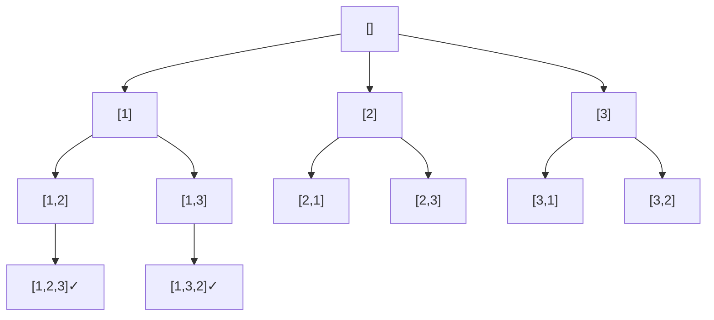
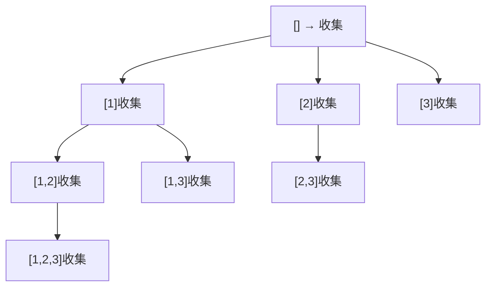
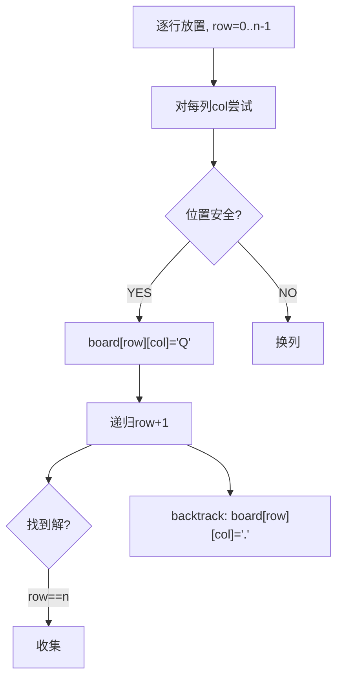

# 回溯算法题

## 159.全排列

# 全排列（Permutations）

> LeetCode 46 · ⭐⭐ · 回溯模板

## 01. 题目

`[1,2,3]` → `[[1,2,3],[1,3,2],[2,1,3],[2,3,1],[3,1,2],[3,2,1]]`

## 02. 题目分析

### 回溯决策树



### 回溯通用模板

```java
void backtrack(路径, 选择列表) {
    if (终止条件) { 收集结果; return; }
    for (选择 : 选择列表) {
        做选择;
        backtrack(路径, 新选择列表);
        撤销选择;
    }
}
```

## 03. 代码

**Java**：
```java
List<List<Integer>> res = new ArrayList<>();
public List<List<Integer>> permute(int[] nums) {
    backtrack(nums, new ArrayList<>(), new boolean[nums.length]);
    return res;
}
void backtrack(int[] nums, List<Integer> path, boolean[] used) {
    if (path.size() == nums.length) { res.add(new ArrayList<>(path)); return; }
    for (int i = 0; i < nums.length; i++) {
        if (used[i]) continue;
        path.add(nums[i]); used[i] = true;
        backtrack(nums, path, used);
        path.remove(path.size() - 1); used[i] = false;
    }
}
```

**Python**：
```python
def permute(self, nums):
    res = []
    def dfs(path, used):
        if len(path) == len(nums): res.append(path[:]); return
        for i, n in enumerate(nums):
            if not used[i]: used[i] = True; path.append(n); dfs(path, used); path.pop(); used[i] = False
    dfs([], [False]*len(nums)); return res
```

**C++**：
```cpp
vector<vector<int>> permute(vector<int>& nums) {
    vector<vector<int>> res; vector<int> path; vector<bool> used(nums.size());
    function<void()> dfs=[&]{ if(path.size()==nums.size()){ res.push_back(path); return; }
        for(int i=0;i<nums.size();i++){ if(used[i]) continue; used[i]=true; path.push_back(nums[i]); dfs(); path.pop_back(); used[i]=false; } };
    dfs(); return res;
}
```

**复杂度**：O(N·N!)/O(N)。

## 04. 回溯题型对比

| 类型 | used/start | 特点 |
|------|:---:|------|
| 全排列(159) | `used[]`数组 | 顺序重要 |
| 子集(161) | `start`索引 | 每步收集 |
| 组合(165) | `start`索引 | 固定长度 |

**相关**：[160 全排列II](160.全排列II.md)、[161 子集](161.子集.md)

---

## 160.全排列II

# 全排列 II（含重复）

> LeetCode 47 · ⭐⭐ · 回溯+排序去重

## 01. 题目

`[1,1,2]` → `[[1,1,2],[1,2,1],[2,1,1]]`

## 02. 分析

**去重核心**：排序 + `i>0 && nums[i]==nums[i-1] && !used[i-1]`。

`!used[i-1]` 保证同层去重（非同一树枝的重复使用）。

## 03. 代码

**Java**：
```java
public List<List<Integer>> permuteUnique(int[] nums) {
    Arrays.sort(nums);
    List<List<Integer>> res = new ArrayList<>();
    backtrack(nums, new ArrayList<>(), new boolean[nums.length], res);
    return res;
}
void backtrack(int[] nums, List<Integer> path, boolean[] used, List<List<Integer>> res) {
    if (path.size() == nums.length) { res.add(new ArrayList<>(path)); return; }
    for (int i = 0; i < nums.length; i++) {
        if (used[i] || (i > 0 && nums[i] == nums[i-1] && !used[i-1])) continue;
        path.add(nums[i]); used[i] = true;
        backtrack(nums, path, used, res);
        path.remove(path.size()-1); used[i] = false;
    }
}
```

**Python**：
```python
def permuteUnique(self, nums):
    nums.sort(); res = []
    def dfs(path, used):
        if len(path) == len(nums): res.append(path[:]); return
        for i in range(len(nums)):
            if used[i] or (i>0 and nums[i]==nums[i-1] and not used[i-1]): continue
            used[i]=True; path.append(nums[i]); dfs(path,used); path.pop(); used[i]=False
    dfs([],[False]*len(nums)); return res
```

**C++**：
```cpp
vector<vector<int>> permuteUnique(vector<int>& nums) {
    sort(nums.begin(),nums.end()); vector<vector<int>> res; vector<int> path; vector<bool> used(nums.size());
    function<void()> dfs=[&]{ if(path.size()==nums.size()){ res.push_back(path); return; }
        for(int i=0;i<nums.size();i++){ if(used[i]||(i>0&&nums[i]==nums[i-1]&&!used[i-1])) continue;
            used[i]=true; path.push_back(nums[i]); dfs(); path.pop_back(); used[i]=false; } };
    dfs(); return res;
}
```

**复杂度**：O(N·N!)/O(N)。

| 去重类型 | 条件 |
|---------|------|
| 全排列去重 | `!used[i-1]`(同层) |
| 子集/组合去重 | `i > start`(同层) |

**相关**：[159 全排列](159.全排列.md)

---

## 161.子集

# 子集（Subsets）

> LeetCode 78 · ⭐⭐ · 回溯 / 位运算

## 01. 题目

`[1,2,3]` → `[[],[1],[2],[1,2],[3],[1,3],[2,3],[1,2,3]]`

## 02. 分析

与全排列的区别：①用 `start` 控制不回头 ②**每步都收集结果**。



## 03. 代码

**Java**：
```java
List<List<Integer>> res = new ArrayList<>();
public List<List<Integer>> subsets(int[] nums) { backtrack(nums,0,new ArrayList<>()); return res; }
void backtrack(int[] nums, int start, List<Integer> path) {
    res.add(new ArrayList<>(path));           // 每步收集
    for (int i = start; i < nums.length; i++) {
        path.add(nums[i]); backtrack(nums, i+1, path); path.remove(path.size()-1);
    }
}
```

**Python**：
```python
def subsets(self, nums):
    res = []
    def dfs(start, path): res.append(path[:]); [dfs(i+1, path+[nums[i]]) for i in range(start, len(nums))]
    dfs(0, [])
    return res
```

**C++**：
```cpp
vector<vector<int>> subsets(vector<int>& nums) { vector<vector<int>> res; vector<int> path;
    function<void(int)> dfs=[&](int s){ res.push_back(path);
        for(int i=s;i<nums.size();i++){ path.push_back(nums[i]); dfs(i+1); path.pop_back(); } };
    dfs(0); return res; }
```

**复杂度**：O(N·2^N)/O(N)。

## 04. 回溯三类对比

| | 全排列 | 子集 | 组合 |
|------|:---:|:---:|:---:|
| 收集时机 | path.size()==n | **每步** | path.size()==k |
| 循环起点 | 0(start无效) | start | start |
| used | 需要 | 不需要 | 不需要 |

**相关**：[162 子集II](162.子集II.md)、[165 组合](165.组合.md)

---

## 162.子集II

# 子集 II（含重复）

> LeetCode 90 · ⭐⭐ · 回溯+排序去重

## 01. 题目

`[1,2,2]` → `[[],[1],[1,2],[1,2,2],[2],[2,2]]`

## 02. 代码

在子集模板上加：排序 + `i>start && nums[i]==nums[i-1]`（同层去重）。

**Java**：
```java
public List<List<Integer>> subsetsWithDup(int[] nums) {
    Arrays.sort(nums);
    List<List<Integer>> res = new ArrayList<>();
    backtrack(nums, 0, new ArrayList<>(), res); return res;
}
void backtrack(int[] nums, int start, List<Integer> path, List<List<Integer>> res) {
    res.add(new ArrayList<>(path));
    for (int i = start; i < nums.length; i++) {
        if (i > start && nums[i] == nums[i-1]) continue;
        path.add(nums[i]); backtrack(nums, i+1, path, res); path.remove(path.size()-1);
    }
}
```

**Python**：
```python
def subsetsWithDup(self, nums):
    nums.sort(); res = []
    def dfs(start, path): res.append(path[:]); [dfs(i+1, path+[nums[i]]) for i in range(start, len(nums)) if not (i>start and nums[i]==nums[i-1])]
    dfs(0, []); return res
```

**复杂度**：O(N·2^N)/O(N)。

**相关**：[161 子集](161.子集.md)、[160 全排列II](160.全排列II.md)

---

## 163.组合总和

# 组合总和（Combination Sum）

> LeetCode 39 · ⭐⭐ · 回溯+可重复选取

## 01. 题目

`candidates=[2,3,6,7], target=7` → `[[2,2,3],[7]]`（元素可无限重复）。

## 02. 分析

与子集同框架，区别：①终止条件 `remain==0` ②下次递归 start 不+1。

**Java**：
```java
List<List<Integer>> res = new ArrayList<>();
public List<List<Integer>> combinationSum(int[] cand, int target) { backtrack(cand,target,0,new ArrayList<>()); return res; }
void backtrack(int[] cand, int remain, int start, List<Integer> path) {
    if (remain == 0) { res.add(new ArrayList<>(path)); return; }
    if (remain < 0) return;
    for (int i = start; i < cand.length; i++) {
        path.add(cand[i]); backtrack(cand, remain-cand[i], i, path); path.remove(path.size()-1);
    }
}
```

**Python**：
```python
def combinationSum(self, cand, target):
    res = []
    def dfs(remain, start, path):
        if remain == 0: res.append(path[:]); return
        if remain < 0: return
        for i in range(start, len(cand)): path.append(cand[i]); dfs(remain-cand[i], i, path); path.pop()
    dfs(target, 0, []); return res
```

**复杂度**：O(N^(T/M))。**关键**：`backtrack(..., i, ...)` 不+1 表示可重复。

**相关**：[164 组合总和II](164.组合总和II.md)

---

## 164.组合总和II

# 组合总和 II（不可重复+去重）

> LeetCode 40 · ⭐⭐ · 回溯+剪枝去重

## 01. 题目

`candidates=[10,1,2,7,6,1,5], target=8` → `[[1,1,6],[1,2,5],[1,7],[2,6]]`（每个数只能用一次）。

## 02. 代码

M005 去掉可重复 + 加去重。关键：①`start+1` ②排序+`i>start && nums[i]==nums[i-1]`。

**Java**：
```java
public List<List<Integer>> combinationSum2(int[] cand, int target) {
    Arrays.sort(cand); List<List<Integer>> res = new ArrayList<>();
    backtrack(cand, target, 0, new ArrayList<>(), res); return res;
}
void backtrack(int[] cand, int remain, int start, List<Integer> path, List<List<Integer>> res) {
    if (remain == 0) { res.add(new ArrayList<>(path)); return; }
    for (int i = start; i < cand.length; i++) {
        if (cand[i] > remain) break;                     // 剪枝
        if (i > start && cand[i] == cand[i-1]) continue; // 去重
        path.add(cand[i]); backtrack(cand, remain-cand[i], i+1, path, res); path.remove(path.size()-1);
    }
}
```

**Python**：
```python
def combinationSum2(self, cand, target):
    cand.sort(); res = []
    def dfs(remain, start, path):
        if remain == 0: res.append(path[:]); return
        for i in range(start, len(cand)):
            if cand[i] > remain: break
            if i > start and cand[i] == cand[i-1]: continue
            path.append(cand[i]); dfs(remain-cand[i], i+1, path); path.pop()
    dfs(target, 0, []); return res
```

**复杂度**：O(N·2^N)。**剪枝**：`cand[i] > remain` 可提前 break。

**相关**：[163 组合总和](163.组合总和.md)

---

## 165.组合

# 组合（Combinations） / 电话号码字母组合 / 分割回文串

## 165 组合 (77)

`n=4, k=2` → `[[1,2],[1,3],[1,4],[2,3],[2,4],[3,4]]`

```java
List<List<Integer>> res = new ArrayList<>();
public List<List<Integer>> combine(int n, int k) { backtrack(n,k,1,new ArrayList<>()); return res; }
void backtrack(int n, int k, int start, List<Integer> path) {
    if (path.size() == k) { res.add(new ArrayList<>(path)); return; }
    for (int i = start; i <= n - (k - path.size()) + 1; i++) { // 剪枝
        path.add(i); backtrack(n, k, i+1, path); path.remove(path.size()-1);
    }
}
```

**Python**：
```python
def combine(self, n, k):
    res = []
    def dfs(start, path):
        if len(path) == k: res.append(path[:]); return
        for i in range(start, n - (k - len(path)) + 2): path.append(i); dfs(i+1, path); path.pop()
    dfs(1, []); return res
```

**复杂度**：O(C(n,k)·k)。**剪枝**：`i <= n-(k-len)-1`。

## 166 电话号码字母组合 (17)

`digits="23"` → `["ad","ae","af","bd","be","bf","cd","ce","cf"]`

```java
String[] map = {"","","abc","def","ghi","jkl","mno","pqrs","tuv","wxyz"};
public List<String> letterCombinations(String digits) {
    List<String> res = new ArrayList<>(); if(digits.isEmpty()) return res;
    backtrack(digits,0,new StringBuilder(),res); return res;
}
void backtrack(String d, int i, StringBuilder sb, List<String> res) {
    if(i==d.length()){ res.add(sb.toString()); return; }
    for(char c:map[d.charAt(i)-'0'].toCharArray()){ sb.append(c); backtrack(d,i+1,sb,res); sb.deleteCharAt(sb.length()-1); }
}
```

**Python**：
```python
def letterCombinations(self, digits):
    if not digits: return []
    mp = {'2':'abc','3':'def','4':'ghi','5':'jkl','6':'mno','7':'pqrs','8':'tuv','9':'wxyz'}
    res = []
    def dfs(i, s):
        if i == len(digits): res.append(s); return
        for c in mp[digits[i]]: dfs(i+1, s+c)
    dfs(0, ''); return res
```

**复杂度**：O(4^N·N)/O(N)。

## 167 分割回文串 (131)

`s="aab"` → `[["a","a","b"],["aa","b"]]`

```java
List<List<String>> res = new ArrayList<>();
public List<List<String>> partition(String s) { backtrack(s,0,new ArrayList<>()); return res; }
void backtrack(String s, int start, List<String> path) {
    if (start == s.length()) { res.add(new ArrayList<>(path)); return; }
    for (int i = start; i < s.length(); i++)
        if (isPal(s, start, i)) { path.add(s.substring(start, i+1)); backtrack(s, i+1, path); path.remove(path.size()-1); }
}
boolean isPal(String s, int l, int r) { while (l < r) if (s.charAt(l++) != s.charAt(r--)) return false; return true; }
```

**Python**：
```python
def partition(self, s):
    res = []
    def dfs(start, path):
        if start == len(s): res.append(path[:]); return
        for i in range(start, len(s)):
            sub = s[start:i+1]
            if sub == sub[::-1]: path.append(sub); dfs(i+1, path); path.pop()
    dfs(0, []); return res
```

**相关**：[159 全排列](159.全排列.md)

---

## 166.电话号码的字母组合

# M008 电话号码的字母组合

> LeetCode 17 · ⭐⭐ · 回溯

## 01. 题目

`digits = "23"` → `["ad","ae","af","bd","be","bf","cd","ce","cf"]`

## 02. 分析

每个数字映射到一组字母。回溯时对当前数字的每个字母做选择。

## 03. 代码

**Java**：
```java
String[] map = {"","","abc","def","ghi","jkl","mno","pqrs","tuv","wxyz"};
public List<String> letterCombinations(String digits) {
    List<String> res = new ArrayList<>();
    if (digits.isEmpty()) return res;
    backtrack(digits, 0, new StringBuilder(), res);
    return res;
}
void backtrack(String digits, int i, StringBuilder sb, List<String> res) {
    if (i == digits.length()) { res.add(sb.toString()); return; }
    for (char c : map[digits.charAt(i) - '0'].toCharArray()) {
        sb.append(c); backtrack(digits, i + 1, sb, res); sb.deleteCharAt(sb.length() - 1);
    }
}
```

**Python**：
```python
def letterCombinations(self, digits):
    if not digits: return []
    mp = {'2':'abc','3':'def','4':'ghi','5':'jkl','6':'mno','7':'pqrs','8':'tuv','9':'wxyz'}
    res = []
    def dfs(i, s):
        if i == len(digits): res.append(s); return
        for c in mp[digits[i]]: dfs(i+1, s+c)
    dfs(0, '')
    return res
```

**复杂度**：O(4^N·N)/O(N)。

**相关**：[M003 子集](M003-子集.md)

---

## 167.分割回文串

# M009 分割回文串 / M010 复原IP / M012 解数独

## M009 分割回文串 (131)

```java
List<List<String>> res=new ArrayList<>();
public List<List<String>> partition(String s) { backtrack(s,0,new ArrayList<>()); return res; }
void backtrack(String s,int start,List<String> path){ if(start==s.length()){ res.add(new ArrayList<>(path)); return; } for(int i=start;i<s.length();i++){ if(isPal(s,start,i)){ path.add(s.substring(start,i+1)); backtrack(s,i+1,path); path.remove(path.size()-1); } } }
boolean isPal(String s,int l,int r){ while(l<r) if(s.charAt(l++)!=s.charAt(r--)) return false; return true; }
```

## M010 复原IP地址 (93)

```java
List<String> ipRes=new ArrayList<>();
public List<String> restoreIpAddresses(String s) { backtrack(s,0,new ArrayList<>()); return ipRes; }
void backtrack(String s,int start,List<String> segs){ if(segs.size()==4&&start==s.length()){ ipRes.add(String.join(".",segs)); return; } if(segs.size()==4||start==s.length()) return; for(int i=1;i<=3&&start+i<=s.length();i++){ String seg=s.substring(start,start+i); if((seg.length()>1&&seg.charAt(0)=='0')||Integer.parseInt(seg)>255) continue; segs.add(seg); backtrack(s,start+i,segs); segs.remove(segs.size()-1); } }
```

## M012 解数独 (37)

```java
public void solveSudoku(char[][] board) { solve(board); }
boolean solve(char[][] b){ for(int i=0;i<9;i++) for(int j=0;j<9;j++) if(b[i][j]=='.'){ for(char c='1';c<='9';c++){ if(isValid(b,i,j,c)){ b[i][j]=c; if(solve(b)) return true; b[i][j]='.'; } } return false; } return true; }
boolean isValid(char[][] b,int r,int c,char v){ for(int k=0;k<9;k++) if(b[r][k]==v||b[k][c]==v||b[r/3*3+k/3][c/3*3+k%3]==v) return false; return true; }
```

---

## 169.N皇后

# N 皇后（N-Queens）

> LeetCode 51 · ⭐⭐⭐ · 回溯+约束

## 01. 题目

n×n 棋盘放 n 个皇后，不能同行/同列/同对角线。n=4 有 2 种方案。

## 02. 题目分析



**约束检测**：只需检查上方、左上对角、右上对角（下方还没放）。

## 03. 代码

**Java**：
```java
public List<List<String>> solveNQueens(int n) {
    List<List<String>> res = new ArrayList<>();
    char[][] board = new char[n][n];
    for (char[] row : board) Arrays.fill(row, '.');
    backtrack(res, board, 0);
    return res;
}
void backtrack(List<List<String>> res, char[][] b, int row) {
    if (row == b.length) { List<String> list = new ArrayList<>(); for (char[] r : b) list.add(new String(r)); res.add(list); return; }
    for (int col = 0; col < b.length; col++) {
        if (!valid(b, row, col)) continue;
        b[row][col] = 'Q'; backtrack(res, b, row + 1); b[row][col] = '.';
    }
}
boolean valid(char[][] b, int row, int col) {
    for (int i = 0; i < row; i++) if (b[i][col] == 'Q') return false; // 同列
    for (int i=row-1,j=col-1; i>=0&&j>=0; i--,j--) if(b[i][j]=='Q') return false; // 左上
    for (int i=row-1,j=col+1; i>=0&&j<b.length; i--,j++) if(b[i][j]=='Q') return false; // 右上
    return true;
}
```

**Python**：
```python
def solveNQueens(self, n):
    res, b = [], [['.']*n for _ in range(n)]
    def valid(r, c):
        for i in range(r):
            if b[i][c]=='Q': return False
            if c-(r-i)>=0 and b[i][c-(r-i)]=='Q': return False
            if c+(r-i)<n and b[i][c+(r-i)]=='Q': return False
        return True
    def dfs(r):
        if r==n: res.append([''.join(row) for row in b]); return
        for c in range(n):
            if valid(r,c): b[r][c]='Q'; dfs(r+1); b[r][c]='.'
    dfs(0); return res
```

**复杂度**：O(N!)/O(N²)。

**相关**：[170 解数独](170.解数独.md)

---

## 170.解数独

# 解数独（Sudoku Solver）

> LeetCode 37 · ⭐⭐⭐ · 回溯+约束

## 01. 题目

填充 9×9 数独空白格（`.`），每行/列/3×3宫数字 1-9 不重复。

## 02. 题目分析

```mermaid
flowchart TD
    A["遍历所有格子"] --> B{"找到空白 '.'?"}
    B -->|YES| C["尝试'1'到'9'"]
    C --> D{"合法?"}
    D -->|YES| E["填入 → 递归"]
    E --> F{"递归成功?"}
    F -->|YES| G["true(找到解)"]
    F -->|NO| H["撤销 → 尝试下一个"]
    D -->|NO| H
    B -->|NO(全填满)| I["true(找到解)"]
```

**合法判断**：`(r/3*3 + k/3, c/3*3 + k%3)` 定位 3×3 宫。

## 03. 代码

**Java**：
```java
public void solveSudoku(char[][] board) { solve(board); }
boolean solve(char[][] b) {
    for (int i = 0; i < 9; i++)
        for (int j = 0; j < 9; j++)
            if (b[i][j] == '.') {
                for (char c = '1'; c <= '9'; c++) {
                    if (valid(b, i, j, c)) {
                        b[i][j] = c;
                        if (solve(b)) return true;
                        b[i][j] = '.';
                    }
                }
                return false; // 所有数字都不行
            }
    return true; // 全部填满
}
boolean valid(char[][] b, int r, int c, char v) {
    for (int k = 0; k < 9; k++)
        if (b[r][k] == v || b[k][c] == v || b[r/3*3 + k/3][c/3*3 + k%3] == v)
            return false;
    return true;
}
```

**Python**：
```python
def solveSudoku(self, b):
    def valid(r, c, v):
        for k in range(9):
            if b[r][k]==v or b[k][c]==v or b[r//3*3+k//3][c//3*3+k%3]==v: return False
        return True
    def solve():
        for i in range(9):
            for j in range(9):
                if b[i][j]=='.':
                    for v in '123456789':
                        if valid(i,j,v): b[i][j]=v; return solve() or (b[i].__setitem__(j,'.') or False)
                    return False
        return True
    solve()
```

**复杂度**：O(9^m)，m为空位数。

## 04. N皇后 vs 解数独

| | N皇后 | 解数独 |
|------|:---:|:---:|
| 回溯模式 | 逐行 | 逐格 |
| 约束检测 | 三条线 | 行+列+宫 |
| 终止条件 | row==n | 全部填满 |
| 难度 | ⭐⭐⭐ | ⭐⭐⭐ |

**相关**：[169 N皇后](169.N皇后.md)

---
