# P001 整数反转

> LeetCode 7 · ⭐ · 数学模拟 · 溢出判断

## 01. 题目描述

给定一个 32 位有符号整数 `x`，返回 `x` 翻转后的数字。若翻转后超出 `[-2³¹, 2³¹-1]`，返回 0。

```
输入：x = 123
输出：321

输入：x = -123
输出：-321

输入：x = 120
输出：21
```

| 约束 | 值 |
|:---|:---|
| 范围 | `-2³¹ ≤ x ≤ 2³¹-1` |
| 溢出 | 直接返回 0 |

## 02. 题目分析

### 2.1 核心公式

逐位取模 + 拼接：`rev = rev * 10 + x % 10`，然后 `x /= 10`。

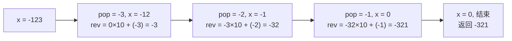

### 2.2 唯一难点：溢出判断

Java 中 `Integer.MAX_VALUE = 2147483647`，`Integer.MIN_VALUE = -2147483648`。

**正向溢出**：`rev > MAX/10`，或 `rev == MAX/10 && pop > 7`。
**负向溢出**：`rev < MIN/10`，或 `rev == MIN/10 && pop < -8`。

### 2.3 溢出手推验证

以 `x = 1534236469` 为例（恰好会溢出）：

| 步 | x | pop | rev (上一步) | rev > MAX/10? | rev×10+pop | 溢出? |
|:---:|:---:|:---:|:---:|:---:|:---|:---:|
| 1 | 153423646 | 9 | 0 | 否 | 9 | 否 |
| 2 | 15342364 | 6 | 9 | 否 | 96 | 否 |
| … | … | … | … | … | … | … |
| 9 | 1 | 4 | 964632435 | `964632435 > 214748364` ✅ | — | **是，返回 0** |

## 03. 解法一：逐位反转 + 溢出检查

### Java

```java
public int reverse(int x) {
    int rev = 0;
    while (x != 0) {
        int pop = x % 10;
        x /= 10;
        // 正向溢出
        if (rev > Integer.MAX_VALUE / 10 || (rev == Integer.MAX_VALUE / 10 && pop > 7))
            return 0;
        // 负向溢出
        if (rev < Integer.MIN_VALUE / 10 || (rev == Integer.MIN_VALUE / 10 && pop < -8))
            return 0;
        rev = rev * 10 + pop;
    }
    return rev;
}
```

### Python

```python
def reverse(self, x: int) -> int:
    rev = 0
    INT_MAX, INT_MIN = 2**31 - 1, -2**31
    while x != 0:
        # Python 中负数取模规则不同，统一处理
        if x > 0:
            pop = x % 10
        else:
            pop = x % -10  # 保持符号一致
        x = (x - pop) // 10 if x > 0 else (x + abs(pop)) // 10
        if rev > INT_MAX // 10 or (rev == INT_MAX // 10 and pop > 7):
            return 0
        if rev < INT_MIN // 10 or (rev == INT_MIN // 10 and pop < -8):
            return 0
        rev = rev * 10 + pop
    return rev

# 简化版（利用 Python 大整数不溢出，最后再判）
def reverse_simple(self, x: int) -> int:
    sign = -1 if x < 0 else 1
    rev = int(str(abs(x))[::-1]) * sign
    return rev if -2**31 <= rev <= 2**31 - 1 else 0
```

### C++

```cpp
int reverse(int x) {
    int rev = 0;
    while (x != 0) {
        int pop = x % 10;
        x /= 10;
        if (rev > INT_MAX / 10 || (rev == INT_MAX / 10 && pop > 7)) return 0;
        if (rev < INT_MIN / 10 || (rev == INT_MIN / 10 && pop < -8)) return 0;
        rev = rev * 10 + pop;
    }
    return rev;
}
```

## 04. 复杂度分析

| 指标 | 值 |
|:---|:---|
| 时间 | O(log₁₀N)，约 10 次迭代 |
| 空间 | O(1) |

## 05. 题型总结

| 相关题 | 区别 |
|------|------|
| [P002 回文数](202.回文数.md) | 反转一半 + 不用判溢出 |
| A019 字符串相乘 | 大数乘法模拟 |
| A020 字符串转整数 | 自动机处理前缀 + 溢出 |

---

**核心公式**：`rev = rev * 10 + pop`。溢出时机：`rev > MAX/10` 时无论 pop 多少都会溢出。

---

# P002 回文数

> LeetCode 9 · ⭐ · 反转一半 · 数字直觉

## 01. 题目描述

判断一个整数是否是回文数（正序倒序相同）。**不能转为字符串**。

```
输入：121  →  true
输入：-121 →  false（负号不匹配）
输入：10   →  false（末尾为 0 的非零数不可能是回文）
```

| 约束 | 值 |
|:---|:---|
| 范围 | `-2³¹ ≤ x ≤ 2³¹-1` |
| 要求 | 不使用额外字符串空间 |

## 02. 题目分析

### 2.1 核心洞察

回文 = 反转数字是否等于原数。P001 中我们做了**全反转**，但这里只需**反转一半**——与 P001 相同的思路但更巧妙。

**为什么可以只反转一半？**
- 当原数 `x ≤ 反转值 rev` 时，证明已经过半
- 最终比较：偶数位 `x == rev`，奇数位 `x == rev/10`

### 2.2 提前排除

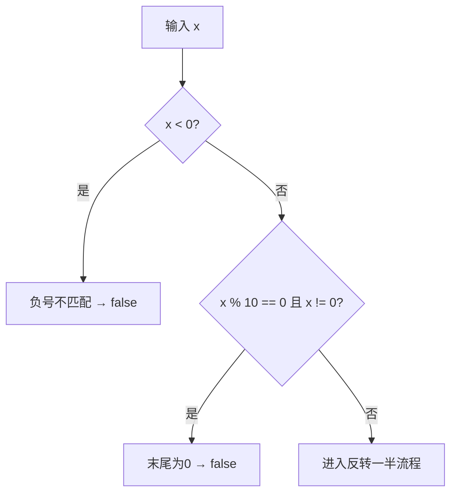

### 2.3 反转一半流程

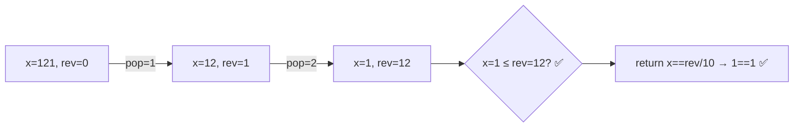

## 03. 手推演示

以 `x = 12321`（奇数位）为例：

| 步 | x | rev | x > rev? | 操作 |
|:---:|:---:|:---:|:---:|------|
| 初始 | 12321 | 0 | ✅ | — |
| 1 | 1232 | 1 | ✅ | pop=1, x/=10, rev=0×10+1 |
| 2 | 123 | 12 | ✅ | pop=2, x/=10, rev=1×10+2 |
| 3 | 12 | 123 | ❌（x≤rev） | 停止 |

结果：`x == rev/10` → `12 == 12` ✅

以 `x = 1221`（偶数位）为例：

| 步 | x | rev | x > rev? | 操作 |
|:---:|:---:|:---:|:---:|------|
| 初始 | 1221 | 0 | ✅ | — |
| 1 | 122 | 1 | ✅ | pop=1 |
| 2 | 12 | 12 | ❌（x≤rev） | 停止 |

结果：`x == rev` → `12 == 12` ✅

## 04. 解法一：反转一半

### Java

```java
public boolean isPalindrome(int x) {
    // 提前排除：负数、末尾为0的非零数
    if (x < 0 || (x % 10 == 0 && x != 0)) return false;

    int rev = 0;
    while (x > rev) {
        rev = rev * 10 + x % 10;
        x /= 10;
    }
    // 偶数位: x == rev, 奇数位: x == rev/10
    return x == rev || x == rev / 10;
}
```

### Python

```python
def isPalindrome(self, x: int) -> bool:
    if x < 0 or (x % 10 == 0 and x != 0):
        return False

    rev = 0
    while x > rev:
        rev = rev * 10 + x % 10
        x //= 10
    return x == rev or x == rev // 10
```

### C++

```cpp
bool isPalindrome(int x) {
    if (x < 0 || (x % 10 == 0 && x != 0)) return false;

    int rev = 0;
    while (x > rev) {
        rev = rev * 10 + x % 10;
        x /= 10;
    }
    return x == rev || x == rev / 10;
}
```

## 05. 解法对比

| 解法 | 时间 | 空间 | 说明 |
|------|:---:|:---:|------|
| 转字符串+双指针 | O(N) | O(N) | 最简单但不合题意 |
| 全反转 | O(logN) | O(1) | 可能溢出，需判溢 |
| **反转一半** | O(logN) | O(1) | 不溢出，最优 |

## 06. P001 与 P002 对比

| 维度 | P001 整数反转 | P002 回文数 |
|------|:---:|:---:|
| 反转范围 | 全部 | 一半 |
| 溢出风险 | 有，需判溢 | 无（x > rev 自然停止） |
| 符号处理 | 有负号 | 负数直接排除 |
| 末尾零 | 自然处理(→0) | 需提前排除 |

## 07. 复杂度与总结

| 指标 | 值 |
|:---|:---|
| 时间 | O(log₁₀N)，约 5 次迭代 |
| 空间 | O(1) |

**本质**：数字回文的判定可以"不翻完"——只需对比一半，即避开了溢出问题。

---

**相关**：[P001 整数反转](201.整数反转.md) · [P004 字符串相加](204.字符串相加.md) · [121 验证回文串](../15.双指针算法题/121.验证回文串.md)

---

# P003 罗马数字转整数

> LeetCode 13 · ⭐ · 规则模拟 · 哈希表

## 01. 题目描述

给定一个罗马数字字符串 `s`，返回对应的整数值。

| 罗马数字 | I | V | X | L | C | D | M |
|:---:|:---:|:---:|:---:|:---:|:---:|:---:|:---:|
| 值 | 1 | 5 | 10 | 50 | 100 | 500 | 1000 |

**特殊规则**：小数字在大数字左边时做减法。
```
I 在 V/X 左边 → IV(4), IX(9)
X 在 L/C 左边 → XL(40), XC(90)
C 在 D/M 左边 → CD(400), CM(900)
```

```
输入：s = "LVIII" → 58（L=50, V=5, III=3）
输入：s = "MCMXCIV" → 1994（M=1000, CM=900, XC=90, IV=4）
```

## 02. 题目分析

### 2.1 规则统一

**为什么映射表只需要 7 个字符？** 因为特殊值（IV/IX/XL等）本质上就是"小数字在大左边 = 减法"这条规则的表达式。

核心决策逻辑：

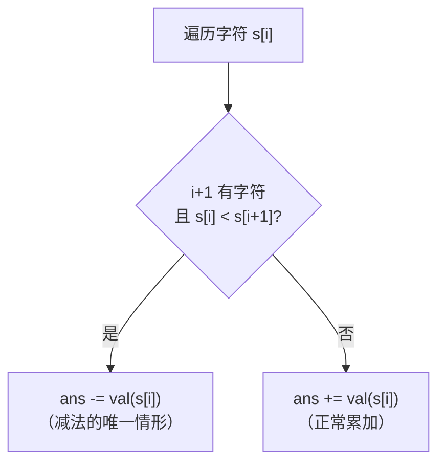

### 2.2 手推验证

以 `s = "MCMXCIV"` 为例：

| i | 字符 | 值 | s[i+1] | 比较 | 操作 | ans |
|:---:|:---:|:---:|:---:|:---:|:---:|:---:|
| 0 | M | 1000 | C(100) | 1000 > 100 | +1000 | 1000 |
| 1 | C | 100 | M(1000) | **100 < 1000** | **-100** | 900 |
| 2 | M | 1000 | X(10) | 1000 > 10 | +1000 | 1900 |
| 3 | X | 10 | C(100) | **10 < 100** | **-10** | 1890 |
| 4 | C | 100 | I(1) | 100 > 1 | +100 | 1990 |
| 5 | I | 1 | V(5) | **1 < 5** | **-1** | 1989 |
| 6 | V | 5 | — | — | +5 | **1994** |

只有 3 次减法（CM=900, XC=90, IV=4），其余全是加法。完美吻合。

## 03. 解法一：逐位比较（三语）

### Java

```java
public int romanToInt(String s) {
    Map<Character, Integer> map = new HashMap<>();
    map.put('I', 1); map.put('V', 5);  map.put('X', 10);
    map.put('L', 50); map.put('C', 100); map.put('D', 500);
    map.put('M', 1000);

    int ans = 0, n = s.length();
    for (int i = 0; i < n; i++) {
        int cur = map.get(s.charAt(i));
        if (i + 1 < n && cur < map.get(s.charAt(i + 1))) {
            ans -= cur;  // 唯一减法的情形
        } else {
            ans += cur;
        }
    }
    return ans;
}
```

### Python

```python
def romanToInt(self, s: str) -> int:
    d = {'I': 1, 'V': 5, 'X': 10, 'L': 50, 'C': 100, 'D': 500, 'M': 1000}
    ans = 0
    for i in range(len(s)):
        cur = d[s[i]]
        if i + 1 < len(s) and cur < d[s[i + 1]]:
            ans -= cur
        else:
            ans += cur
    return ans
```

### C++

```cpp
int romanToInt(string s) {
    unordered_map<char, int> m = {{'I',1},{'V',5},{'X',10},{'L',50},
                                   {'C',100},{'D',500},{'M',1000}};
    int ans = 0;
    for (int i = 0; i < s.size(); i++) {
        int cur = m[s[i]];
        if (i + 1 < s.size() && cur < m[s[i + 1]]) ans -= cur;
        else ans += cur;
    }
    return ans;
}
```

## 04. 解法对比

| 解法 | 时间 | 空间 | 说明 |
|------|:---:|:---:|------|
| 逐位比较 | O(N) | O(1) | 最优，单一规则覆盖所有特例 |
| 预处理双字符 | O(N) | O(1) | 枚举 IV/IX/XL 等，代码冗长 |

## 05. 复杂度与总结

| 指标 | 值 |
|:---|:---|
| 时间 | O(N) |
| 空间 | O(1)，7对映射 |

**本质**：罗马数字的"小左大右=减法"规则是精心设计的——每个字符最多被它右边第一个更大字符"吸收"，不会产生嵌套歧义。

---

**相关**：[P001 整数反转](201.整数反转.md) · [P004 字符串相加](204.字符串相加.md)

---

# P004 字符串相加

> LeetCode 415 · ⭐ · 大数模拟加法 · 进位双指针

## 01. 题目描述

给定两个非负整数字符串 `num1` 和 `num2`，返回它们的和（字符串），**不能使用 BigInteger**。

```
输入：num1 = "11", num2 = "123"
输出："134"

输入：num1 = "456", num2 = "77"
输出："533"
```

| 约束 | 值 |
|:---|:---|
| 长度 | `1 ≤ len ≤ 10⁴` |
| 内容 | 仅含 `'0'~'9'`，无前导零 |

## 02. 题目分析

### 2.1 核心公式

模拟竖式加法：从最低位开始，逐位相加，`carry` 进位。

```
   num1[i]  (当前位，无则 0)
 + num2[j]  (当前位，无则 0)
 + carry    (来自上一位)
───────────
   sum      → 当前位 = sum % 10，进位 = sum / 10
```

### 2.2 从右向左的流程

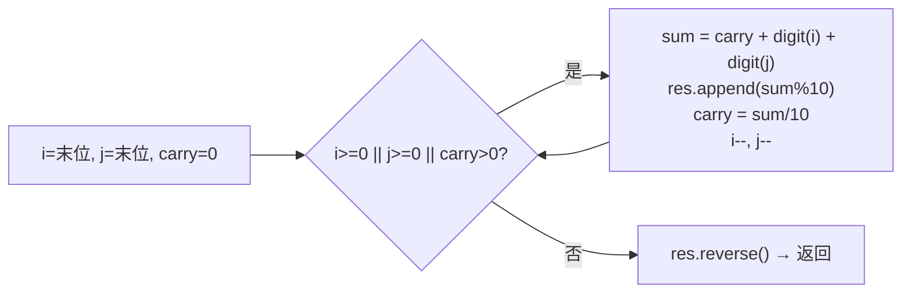

### 2.3 手推演示

以 `"456" + "77"` 为例：

| 步 | i | j | a[i] | b[j] | carry(上) | sum | 当前位 | carry(新) | res |
|:---:|:---:|:---:|:---:|:---:|:---:|:---:|:---:|:---:|:---:|
| 1 | 2 | 1 | 6 | 7 | 0 | 13 | 3 | 1 | "3" |
| 2 | 1 | 0 | 5 | 7 | 1 | 13 | 3 | 1 | "33" |
| 3 | 0 | -1 | 4 | 0 | 1 | 5 | 5 | 0 | "335" |
| 4 | -1 | -1 | 0 | 0 | 0 | 0 | — | — | 结束 |

反转后：`"335"` → `"533"` ✅

## 03. 解法一：双指针 + 进位模拟

### Java

```java
public String addStrings(String a, String b) {
    StringBuilder sb = new StringBuilder();
    int i = a.length() - 1, j = b.length() - 1, carry = 0;

    while (i >= 0 || j >= 0 || carry > 0) {
        int sum = carry;
        if (i >= 0) sum += a.charAt(i--) - '0';
        if (j >= 0) sum += b.charAt(j--) - '0';
        sb.append(sum % 10);
        carry = sum / 10;
    }
    return sb.reverse().toString();
}
```

### Python

```python
def addStrings(self, a: str, b: str) -> str:
    i, j, carry, res = len(a) - 1, len(b) - 1, 0, []

    while i >= 0 or j >= 0 or carry:
        s = carry
        if i >= 0:
            s += ord(a[i]) - 48
            i -= 1
        if j >= 0:
            s += ord(b[j]) - 48
            j -= 1
        res.append(str(s % 10))
        carry = s // 10

    return ''.join(reversed(res))
```

### C++

```cpp
string addStrings(string a, string b) {
    int i = a.size() - 1, j = b.size() - 1, carry = 0;
    string res;

    while (i >= 0 || j >= 0 || carry) {
        int sum = carry;
        if (i >= 0) sum += a[i--] - '0';
        if (j >= 0) sum += b[j--] - '0';
        res += (sum % 10) + '0';
        carry = sum / 10;
    }
    reverse(res.begin(), res.end());
    return res;
}
```

## 04. 复杂度与总结

| 指标 | 值 |
|:---|:---|
| 时间 | O(max(m, n)) |
| 空间 | O(max(m, n))，结果字符串 |

**本质**：大数运算的核心模板。掌握这个，字符串相乘（A019）、链表两数相加（B013）都迎刃而解。

| 相关题 | 联系 |
|------|------|
| [A019 字符串相乘](../07.数组算法题/019-A-字符串相乘.md) | 多了一层累加，依然竖式模拟 |
| [B013 两数相加](../08.链表算法题/013-B-两数相加.md) | 链表版大数加法 |
| [P001 整数反转](201.整数反转.md) | 都有"逐位+进位"思想 |

---

# P005 多数元素

> LeetCode 169 · ⭐ · Boyer-Moore 投票算法

## 01. 题目描述

给定大小为 `n` 的数组，找出**出现次数超过 ⌊n/2⌋** 的多数元素。题目保证多数元素一定存在。

```
输入：[3, 2, 3]       → 3
输入：[2, 2, 1, 1, 1, 2, 2] → 2
```

| 约束 | 值 |
|:---|:---|
| n | `1 ≤ n ≤ 5×10⁴` |
| 元素范围 | `-10⁹ ≤ nums[i] ≤ 10⁹` |
| 保证 | 多数元素一定存在（> n/2） |

## 02. 题目分析

### 2.1 三种思路对比

| 解法 | 时间 | 空间 | 思路 |
|------|:---:|:---:|------|
| 哈希计数 | O(N) | O(N) | 统计频率，找最大 |
| 排序取中 | O(NlogN) | O(1) | 中位数一定是多数元素 |
| **Boyer-Moore** | O(N) | O(1) | 不同元素两两抵消 |

### 2.2 Boyer-Moore 核心思想

如果多数元素数量 > n/2，那么用多数元素去"消灭"其他元素后，必然还有剩余。

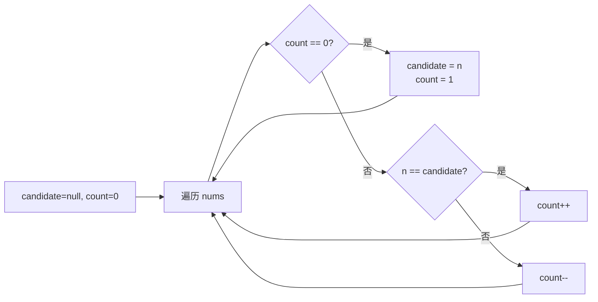

## 03. 手推验证

以 `nums = [2,2,1,1,1,2,2]` 为例：

| 步 | n | count | candidate | 操作 | 说明 |
|:---:|:---:|:---:|:---:|:---:|------|
| 初始 | — | 0 | — | — | — |
| 1 | 2 | 1 | 2 | count==0→设候选 | 2 成为候选 |
| 2 | 2 | 2 | 2 | n==candidate→count++ | 2 又一票 |
| 3 | 1 | 1 | 2 | n≠candidate→count-- | 1 抵消一票 |
| 4 | 1 | 0 | 2 | n≠candidate→count-- | 1 再抵消，count=0 |
| 5 | 1 | 1 | 1 | count==0→设候选 | 1 成为新候选 |
| 6 | 2 | 0 | 1 | n≠candidate→count-- | 2 抵消一票，count=0 |
| 7 | 2 | 1 | 2 | count==0→设候选 | 2 重新成为候选 |

最终 `candidate = 2`，确实是多数元素 ✅。

**为什么正确？** 因为多数元素数量 > n/2，假设有 m 个多数和 k 个少数，m > k。少数最多消灭 k 个多数，剩余 m-k > 0 个多数必定存活。

## 04. 解法一：Boyer-Moore 投票

### Java

```java
public int majorityElement(int[] nums) {
    int candidate = 0, count = 0;
    for (int n : nums) {
        if (count == 0) {
            candidate = n;
        }
        count += (n == candidate) ? 1 : -1;
    }
    return candidate;
}
```

### Python

```python
def majorityElement(self, nums: List[int]) -> int:
    candidate = count = 0
    for n in nums:
        if count == 0:
            candidate = n
        count += 1 if n == candidate else -1
    return candidate
```

### C++

```cpp
int majorityElement(vector<int>& nums) {
    int candidate = 0, count = 0;
    for (int n : nums) {
        if (count == 0) candidate = n;
        count += (n == candidate) ? 1 : -1;
    }
    return candidate;
}
```

## 05. 解法二：分治法

对于不完全确定多数元素是否存在的场景，可用分治：

```java
private int majorityRec(int[] nums, int l, int r) {
    if (l == r) return nums[l];
    int m = l + (r - l) / 2;
    int left = majorityRec(nums, l, m);
    int right = majorityRec(nums, m + 1, r);
    if (left == right) return left;
    int lcnt = count(nums, l, r, left), rcnt = count(nums, l, r, right);
    return lcnt > rcnt ? left : right;
}
```

## 06. 题型扩展

### Boyer-Moore 泛化：求出现次数 > ⌊n/3⌋ 的元素

LeetCode 229：最多 2 个候选，同时维护 `c1,c2,cnt1,cnt2`：

```java
public List<Integer> majorityElement229(int[] nums) {
    int c1 = 0, c2 = 0, cnt1 = 0, cnt2 = 0;
    for (int n : nums) {
        if (n == c1) cnt1++;
        else if (n == c2) cnt2++;
        else if (cnt1 == 0) { c1 = n; cnt1 = 1; }
        else if (cnt2 == 0) { c2 = n; cnt2 = 1; }
        else { cnt1--; cnt2--; }
    }
    // 第二遍验证
    cnt1 = cnt2 = 0;
    for (int n : nums) {
        if (n == c1) cnt1++;
        else if (n == c2) cnt2++;
    }
    List<Integer> res = new ArrayList<>();
    if (cnt1 > nums.length / 3) res.add(c1);
    if (cnt2 > nums.length / 3) res.add(c2);
    return res;
}
```

## 07. 复杂度与总结

| 解法 | 时间 | 空间 |
|------|:---:|:---:|
| 哈希 | O(N) | O(N) |
| 排序取中 | O(NlogN) | O(1) |
| **Boyer-Moore** | O(N) | O(1) |

**本质**：多数元素的"数量优势"让它可以存活到最后。"不同元素互相抵消"是数学定理，不是直觉。

---

**相关**：[P006 前缀积](206.除自身以外数组的乘积.md) · [O005 位运算次数统计](../21.位运算算法题/195.位1的个数.md)

---

# P006 除自身以外数组的乘积

> LeetCode 238 · ⭐⭐ · 前缀积 + 后缀积 · 空间 O(1)

## 01. 题目描述

给定整数数组 `nums`，返回数组 `answer`，其中 `answer[i]` = `nums` 中除 `nums[i]` 外全部元素的乘积。**不能使用除法**，时间复杂度 O(N)。

```
输入：[1, 2, 3, 4]
输出：[24, 12, 8, 6]
解释：24=2×3×4, 12=1×3×4, 8=1×2×4, 6=1×2×3
```

| 约束 | 值 |
|:---|:---|
| n | `2 ≤ n ≤ 10⁵` |
| 乘积 | 保证 32 位 |
| 禁止 | 除法运算 |
| 要求 | O(N) 时间 |

## 02. 题目分析

### 2.1 核心公式

`answer[i] = (nums[0]×...×nums[i-1]) × (nums[i+1]×...×nums[n-1])`

即 **左侧乘积 × 右侧乘积**。

### 2.2 两趟遍历流程

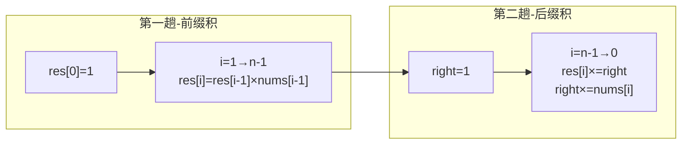

### 2.3 手推演示

以 `nums = [1, 2, 3, 4]` 为例：

**第一趟（前缀积）**：

| i | 公式 | res[i] |
|:---:|------|:---:|
| 0 | — | 1 |
| 1 | res[0]×nums[0] = 1×1 | 1 |
| 2 | res[1]×nums[1] = 1×2 | 2 |
| 3 | res[2]×nums[2] = 2×3 | 6 |

此时 `res = [1, 1, 2, 6]`，分别存了左侧积（相当于 `[×, 1, 1×2, 1×2×3]`）。

**第二趟（后缀积）**，`right` 从右往左累计：

| i | right | res[i] ×= right | right ×= nums[i] | res |
|:---:|:---:|:---:|:---:|:---|
| 3 | 1 | 6×1 = **6** | 1×4 = 4 | [1,1,2,**6**] |
| 2 | 4 | 2×4 = **8** | 4×3 = 12 | [1,1,**8**,6] |
| 1 | 12 | 1×12 = **12** | 12×2 = 24 | [1,**12**,8,6] |
| 0 | 24 | 1×24 = **24** | 24×1 = 24 | [**24**,12,8,6] |

最终 `[24, 12, 8, 6]` ✅

## 03. 解法一：前缀积 + 后缀积（三语）

### Java

```java
public int[] productExceptSelf(int[] nums) {
    int n = nums.length;
    int[] res = new int[n];

    // 第一趟：前缀积
    res[0] = 1;
    for (int i = 1; i < n; i++) {
        res[i] = res[i - 1] * nums[i - 1];
    }

    // 第二趟：后缀积
    int right = 1;
    for (int i = n - 1; i >= 0; i--) {
        res[i] *= right;
        right *= nums[i];
    }
    return res;
}
```

### Python

```python
def productExceptSelf(self, nums: List[int]) -> List[int]:
    n = len(nums)
    res = [1] * n

    # 第一趟：前缀积
    for i in range(1, n):
        res[i] = res[i - 1] * nums[i - 1]

    # 第二趟：后缀积
    right = 1
    for i in range(n - 1, -1, -1):
        res[i] *= right
        right *= nums[i]
    return res
```

### C++

```cpp
vector<int> productExceptSelf(vector<int>& nums) {
    int n = nums.size();
    vector<int> res(n, 1);

    // 第一趟：前缀积
    for (int i = 1; i < n; i++)
        res[i] = res[i - 1] * nums[i - 1];

    // 第二趟：后缀积
    int right = 1;
    for (int i = n - 1; i >= 0; i--) {
        res[i] *= right;
        right *= nums[i];
    }
    return res;
}
```

## 04. 前缀积思想扩展

`前缀和` / `前缀积` / `前缀异或` 是同一个模板：

```java
// 前缀和
prefix[i] = prefix[i-1] + nums[i]
// 前缀积
prefix[i] = prefix[i-1] * nums[i]
// 前缀异或
prefix[i] = prefix[i-1] ^ nums[i]
```

| 相关题 | 变体 |
|------|------|
| A014 和为K的子数组 | 前缀和 + 哈希 |
| E016 路径总和III | 树上前缀和 |
| O001 只出现一次的数字 | 异或的前缀思想 |

## 05. 复杂度与总结

| 指标 | 值 |
|:---|:---|
| 时间 | O(N)，两趟遍历 |
| 空间 | O(1)，输出数组不计 |

**本质**：左右分治的思想——无法直接"除 self"，就拆成"左侧 × 右侧"。两趟扫描分别积累一个方向的乘积。

---

**相关**：[P005 多数元素](205.多数元素.md) · [P007 下一个排列](207.下一个排列.md)

---

# P007 下一个排列

> LeetCode 31 · ⭐⭐ · 字典序 · 原地操作

## 01. 题目描述

将数组原地重排为字典序中的**下一个更大的排列**。若已是最大排列，则返回最小排列。

```
输入：[1, 2, 3] → [1, 3, 2]
输入：[3, 2, 1] → [1, 2, 3]  （已是最大，返回最小）
输入：[1, 1, 5] → [1, 5, 1]
```

## 02. 题目分析

### 2.1 四步法

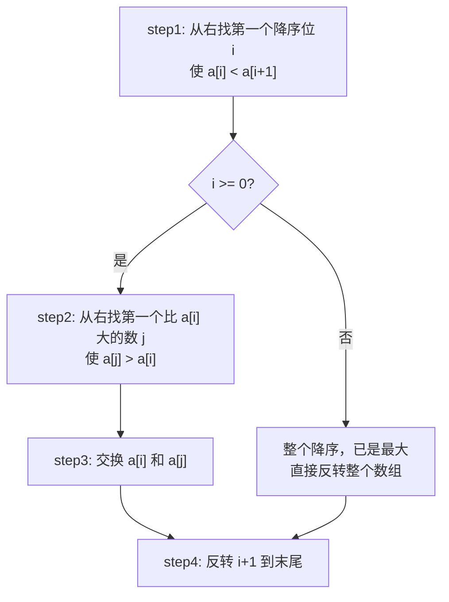

### 2.2 手推验证

以 `[1, 2, 3, 0, 2, 1]` 为例：

| 步骤 | 数组 | 说明 |
|:---:|------|------|
| 初始 | `[1, 2, 3, 0, 2, 1]` | — |
| **step1** | 从右找满足 `a[i] < a[i+1]` 的 i | i=3：`a[3]=0 < a[4]=2` ✅ |
| 标记 | `[1, 2, 3, [0], 2, 1]` | i=3 |
| **step2** | 从右找 `a[j] > a[3]=0` | j=5：a[5]=1>0 × → j=4：a[4]=2>0 ✅ |
| **step3** | 交换 i,j | `[1, 2, 3, 2, 0, 1]` |
| **step4** | 反转 i+1 到末尾 | `[:4]` 不变 + `reverse([0,1])` = `[1,0]` → `[1, 2, 3, 2, 1, 0]` |

最终 `[1, 2, 3, 2, 1, 0]` ✅

## 03. 解法一：四步法（三语）

### Java

```java
public void nextPermutation(int[] nums) {
    int n = nums.length;

    // step1: 找第一个降序位 i
    int i = n - 2;
    while (i >= 0 && nums[i] >= nums[i + 1]) i--;

    if (i >= 0) {
        // step2: 找右边比 a[i] 大的最小数 j
        int j = n - 1;
        while (nums[j] <= nums[i]) j--;
        // step3: 交换
        swap(nums, i, j);
    }

    // step4: 反转 i+1 到末尾
    reverse(nums, i + 1, n - 1);
}

private void swap(int[] a, int i, int j) {
    int t = a[i]; a[i] = a[j]; a[j] = t;
}

private void reverse(int[] a, int l, int r) {
    while (l < r) swap(a, l++, r--);
}
```

### Python

```python
def nextPermutation(self, nums: List[int]) -> None:
    n = len(nums)

    # step1
    i = n - 2
    while i >= 0 and nums[i] >= nums[i + 1]:
        i -= 1

    if i >= 0:
        # step2
        j = n - 1
        while nums[j] <= nums[i]:
            j -= 1
        # step3
        nums[i], nums[j] = nums[j], nums[i]

    # step4
    nums[i + 1:] = reversed(nums[i + 1:])
```

### C++

```cpp
void nextPermutation(vector<int>& nums) {
    int n = nums.size(), i = n - 2;
    while (i >= 0 && nums[i] >= nums[i + 1]) i--;

    if (i >= 0) {
        int j = n - 1;
        while (nums[j] <= nums[i]) j--;
        swap(nums[i], nums[j]);
    }
    reverse(nums.begin() + i + 1, nums.end());
}
```

## 04. 为什么四步法正确？

- **step1**：右侧降序说明已达"最大子排列"，需要从前面的位置（i）增大
- **step2**：选比 a[i] 大的最小数 j，保证增量最小（下一个）
- **step3**：交换后 i 位置变大
- **step4**：i 右侧变为升序（最小排列），整体取最小增量

## 05. 复杂度与总结

| 指标 | 值 |
|:---|:---|
| 时间 | O(N)，最多扫描两次 |
| 空间 | O(1)，原地 |

**本质**：字典序不是随机的——它在字典中按"升序"排列。下一个排列 = 在某个位置"进位"，然后让后面的部分变为最小。

| 相关题 | 联系 |
|------|------|
| [M001 全排列](全排列.md) | 回溯生成所有排列 |
| [P005 多数元素](205.多数元素.md) | 数学思维 |

---

# P008 旋转图像

> LeetCode 48 · ⭐⭐ · 矩阵变换 · 转置 + 水平翻转

## 01. 题目描述

将 n×n 矩阵**原地顺时针旋转 90°**。

```
输入：[[1,2,3],[4,5,6],[7,8,9]]
输出：[[7,4,1],[8,5,2],[9,6,3]]
```

## 02. 题目分析

### 2.1 分解为两步

顺时针 90° = **转置** + **水平翻转**（每行反转）。

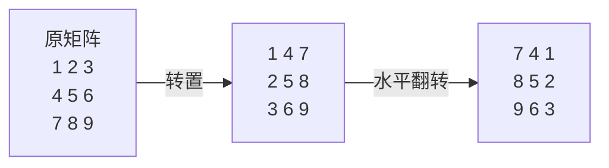

验证：`(i,j) → (j,i) → (j, n-1-i)` = 顺时针 90° 的目标位置。

### 2.2 旋转方向的数学推导

| 操作 | 公式 | 物理含义 |
|------|------|------|
| 转置 | `(i,j) → (j,i)` | 沿主对角线对折 |
| 水平翻转 | `(i,j) → (i, n-1-j)` | 沿垂直中线镜像 |
| **顺时针90°** | `(i,j) → (j, n-1-i)` | 转置 + 水平翻转 |
| 逆时针90° | `(i,j) → (n-1-j, i)` | 转置 + 垂直翻转 |

## 03. 手推演示

以 4×4 为例：

```
原矩阵：
[ 1  2  3  4]
[ 5  6  7  8]
[ 9 10 11 12]
[13 14 15 16]

转置后（对角线对折）：
[ 1  5  9 13]
[ 2  6 10 14]
[ 3  7 11 15]
[ 4  8 12 16]

水平翻转后（顺时针90°）：
[13  9  5  1]
[14 10  6  2]
[15 11  7  3]
[16 12  8  4]
```

## 04. 解法一：转置 + 水平翻转（三语）

### Java

```java
public void rotate(int[][] matrix) {
    int n = matrix.length;

    // 转置：j 从 i+1 开始，只交换上半三角
    for (int i = 0; i < n; i++) {
        for (int j = i + 1; j < n; j++) {
            int tmp = matrix[i][j];
            matrix[i][j] = matrix[j][i];
            matrix[j][i] = tmp;
        }
    }

    // 水平翻转：每行只交换前 n/2 列
    for (int i = 0; i < n; i++) {
        for (int j = 0; j < n / 2; j++) {
            int tmp = matrix[i][j];
            matrix[i][j] = matrix[i][n - 1 - j];
            matrix[i][n - 1 - j] = tmp;
        }
    }
}
```

### Python

```python
def rotate(self, matrix: List[List[int]]) -> None:
    n = len(matrix)

    # 转置
    for i in range(n):
        for j in range(i + 1, n):
            matrix[i][j], matrix[j][i] = matrix[j][i], matrix[i][j]

    # 水平翻转
    for i in range(n):
        matrix[i].reverse()
```

### C++

```cpp
void rotate(vector<vector<int>>& m) {
    int n = m.size();

    for (int i = 0; i < n; i++)
        for (int j = i + 1; j < n; j++)
            swap(m[i][j], m[j][i]);

    for (int i = 0; i < n; i++)
        reverse(m[i].begin(), m[i].end());
}
```

## 05. 解法二：一次性旋转（四数轮换）

也可以不分解，直接旋转四个角——每次处理一圈：

```java
public void rotate(int[][] m) {
    int n = m.length;
    for (int i = 0; i < n / 2; i++) {
        for (int j = i; j < n - 1 - i; j++) {
            int tmp = m[i][j];
            m[i][j] = m[n - 1 - j][i];
            m[n - 1 - j][i] = m[n - 1 - i][n - 1 - j];
            m[n - 1 - i][n - 1 - j] = m[j][n - 1 - i];
            m[j][n - 1 - i] = tmp;
        }
    }
}
```

但两步法更直观、更易记。

## 06. 复杂度与总结

| 指标 | 值 |
|:---|:---|
| 时间 | O(N²) |
| 空间 | O(1)，原地 |

**本质**：矩阵旋转不是"换个视角看"——而是两个原子操作（转置 + 翻转）的复合。

| 所有旋转 | 公式 | 操作 |
|------|------|------|
| 顺时针 90° | `(j, n-1-i)` | 转置 + 水平翻转 |
| 逆时针 90° | `(n-1-j, i)` | 转置 + 垂直翻转 |
| 180° | `(n-1-i, n-1-j)` | 水平 + 垂直翻转 |

---

**相关**：[P009 螺旋矩阵](209.螺旋矩阵.md) · [P010 搜索二维矩阵II](210.搜索二维矩阵II.md)

---

# P009 螺旋矩阵

> LeetCode 54 · ⭐⭐ · 四边界法 · 边界控制

## 01. 题目描述

按**顺时针螺旋顺序**返回 m×n 矩阵的所有元素。

```
输入：[[1,2,3],[4,5,6],[7,8,9]]
输出：[1,2,3,6,9,8,7,4,5]

输入：[[1,2,3,4],[5,6,7,8],[9,10,11,12]]
输出：[1,2,3,4,8,12,11,10,9,5,6,7]
```

## 02. 题目分析

### 2.1 核心公式

维护四个边界 `top, bottom, left, right`。每走完一条边就向中心缩进一步。

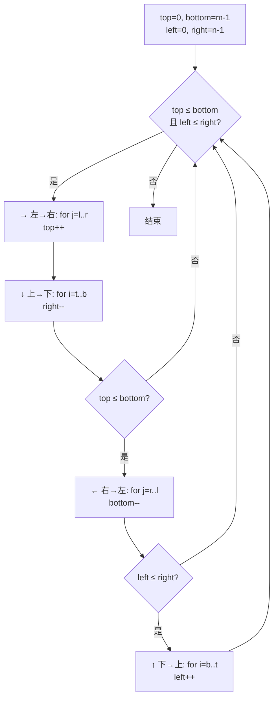

### 2.2 关键陷阱：单行/单列处理

中间的两条边（← 和 ↑）需要 `if` 判边界，防止重复遍历。

**为什么需要 if？** 当只剩一行/列时，→ 和 ← 会遍历同一行。

以 `[[1,2,3,4]]` 为例：
- `→` 遍历 `[1,2,3,4]`，top++, top > bottom
- `↓` 跳过（top > bottom）
- `←` 需要 `if(top≤bottom)` 判否 → **跳过** ✅

## 03. 手推演示

以 `[[1,2,3],[4,5,6],[7,8,9]]` 为例：

| 步 | 方向 | 区间 | 输出 | 边界收缩 | t:b:l:r |
|:---:|:---:|------|------|------|:---:|
| 0 | — | — | [] | — | 0:2:0:2 |
| 1 | → | l→r | [1,2,3] | t++ | 1:2:0:2 |
| 2 | ↓ | t→b | [1,2,3,6,9] | r-- | 1:2:0:1 |
| 3 | ← | r→l | [1,2,3,6,9,8,7] | b-- | 1:1:0:1 |
| 4 | ↑(判) | b→t | [1,2,3,6,9,8,7,4] | l++ | 1:1:1:1 |
| 5 | →(判) | l→r | [1,2,3,6,9,8,7,4,5] | — | 2:1:1:1 |

最终 `[1,2,3,6,9,8,7,4,5]` ✅

## 04. 解法一：四边界收缩（三语）

### Java

```java
public List<Integer> spiralOrder(int[][] matrix) {
    List<Integer> res = new ArrayList<>();
    int top = 0, bottom = matrix.length - 1;
    int left = 0, right = matrix[0].length - 1;

    while (top <= bottom && left <= right) {
        // → 左到右
        for (int j = left; j <= right; j++) res.add(matrix[top][j]);
        top++;

        // ↓ 上到下
        for (int i = top; i <= bottom; i++) res.add(matrix[i][right]);
        right--;

        // ← 右到左（判边界）
        if (top <= bottom) {
            for (int j = right; j >= left; j--) res.add(matrix[bottom][j]);
            bottom--;
        }

        // ↑ 下到上（判边界）
        if (left <= right) {
            for (int i = bottom; i >= top; i--) res.add(matrix[i][left]);
            left++;
        }
    }
    return res;
}
```

### Python

```python
def spiralOrder(self, matrix: List[List[int]]) -> List[int]:
    res = []
    top, bottom = 0, len(matrix) - 1
    left, right = 0, len(matrix[0]) - 1

    while top <= bottom and left <= right:
        # → 左到右
        for j in range(left, right + 1):
            res.append(matrix[top][j])
        top += 1

        # ↓ 上到下
        for i in range(top, bottom + 1):
            res.append(matrix[i][right])
        right -= 1

        # ← 右到左
        if top <= bottom:
            for j in range(right, left - 1, -1):
                res.append(matrix[bottom][j])
            bottom -= 1

        # ↑ 下到上
        if left <= right:
            for i in range(bottom, top - 1, -1):
                res.append(matrix[i][left])
            left += 1

    return res
```

### C++

```cpp
vector<int> spiralOrder(vector<vector<int>>& m) {
    vector<int> res;
    int t = 0, b = m.size() - 1, l = 0, r = m[0].size() - 1;

    while (t <= b && l <= r) {
        for (int j = l; j <= r; j++) res.push_back(m[t][j]);
        t++;
        for (int i = t; i <= b; i++) res.push_back(m[i][r]);
        r--;
        if (t <= b) {
            for (int j = r; j >= l; j--) res.push_back(m[b][j]);
            b--;
        }
        if (l <= r) {
            for (int i = b; i >= t; i--) res.push_back(m[i][l]);
            l++;
        }
    }
    return res;
}
```

## 05. 复杂度与总结

| 指标 | 值 |
|:---|:---|
| 时间 | O(m×n) |
| 空间 | O(1)，输出不计 |

**本质**：螺旋遍历 = 四个方向的边界逐渐向中心收缩。"判边界 if"是关键，防止单行/列重复。

**相关**：[P008 旋转图像](208.旋转图像.md) · [P010 搜索二维矩阵II](210.搜索二维矩阵II.md) · 螺旋矩阵 II（生成版，LeetCode 59）

---

# P010 搜索二维矩阵 II

> LeetCode 240 · ⭐⭐ · Z字形搜索 · O(m+n)

## 01. 题目描述

在一个 m×n 矩阵中搜索 target。**每行升序、每列升序**。

```
输入：
[[1,  4,  7,  11, 15],
 [2,  5,  8,  12, 19],
 [3,  6,  9,  16, 22],
 [10, 13, 14, 17, 24],
 [18, 21, 23, 26, 30]]
target = 5 → true
target = 20 → false
```

## 02. 题目分析

### 2.1 为什么从右上角开始？

右上角 `matrix[0][n-1]` 是**一个天然的决策点**：
- 它所在行的左侧全部 < 它
- 它所在列的下方全部 > 它

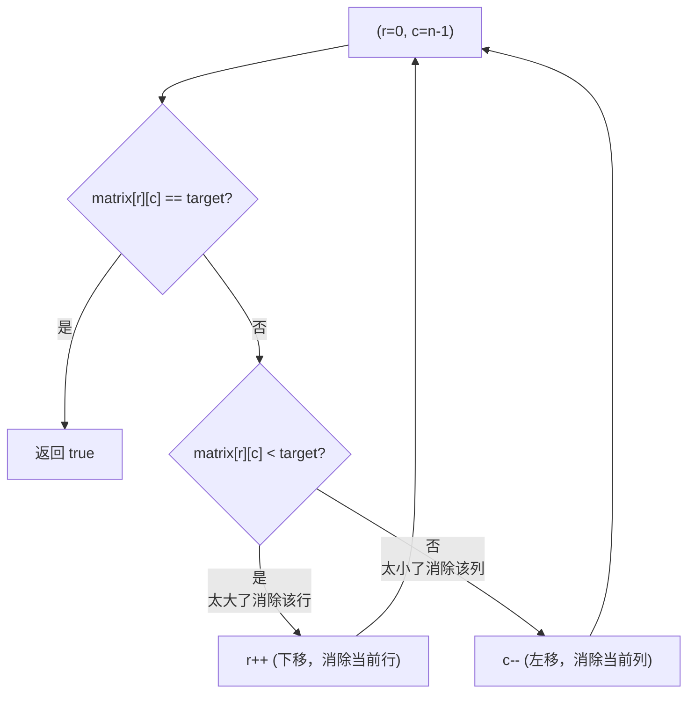

### 2.2 手推演示

以搜索 `target = 5`：

| 步 | r | c | 当前值 | 比较 | 操作 | 消除 |
|:---:|:---:|:---:|:---:|:---:|:---:|------|
| 1 | 0 | 4 | 15 | 15 > 5 | c-- | 第 4 列 |
| 2 | 0 | 3 | 11 | 11 > 5 | c-- | 第 3 列 |
| 3 | 0 | 2 | 7 | 7 > 5 | c-- | 第 2 列 |
| 4 | 0 | 1 | 4 | 4 < 5 | r++ | 第 0 行 |
| 5 | 1 | 1 | 5 | **5 == 5** | — | **找到！** |

以搜索 `target = 20`：

| 步 | r | c | 当前值 | 比较 | 操作 |
|:---:|:---:|:---:|:---:|:---:|:---:|
| 1 | 0 | 4 | 15 | 15 < 20 | r++ |
| 2 | 1 | 4 | 19 | 19 < 20 | r++ |
| 3 | 2 | 4 | 22 | 22 > 20 | c-- |
| 4 | 2 | 3 | 16 | 16 < 20 | r++ |
| 5 | 3 | 3 | 17 | 17 < 20 | r++ |
| 6 | 4 | 3 | 26 | 26 > 20 | c-- |
| 7 | 4 | 2 | 23 | 23 > 20 | c-- |
| 8 | 4 | 1 | 21 | 21 > 20 | c-- |
| 9 | 4 | 0 | 18 | 18 < 20 | r++ |

r=5 越界 → false。

每次比较消除**一整行或一整列**，最多 m+n 步。

## 03. 解法一：右上角 Z 字搜索（三语）

### Java

```java
public boolean searchMatrix(int[][] matrix, int target) {
    int r = 0, c = matrix[0].length - 1;

    while (r < matrix.length && c >= 0) {
        int cur = matrix[r][c];
        if (cur == target) return true;
        if (cur < target) r++;   // 当前行太小 → 下移
        else               c--;  // 当前列太大 → 左移
    }
    return false;
}
```

### Python

```python
def searchMatrix(self, matrix: List[List[int]], target: int) -> bool:
    r, c = 0, len(matrix[0]) - 1

    while r < len(matrix) and c >= 0:
        cur = matrix[r][c]
        if cur == target:
            return True
        if cur < target:
            r += 1
        else:
            c -= 1
    return False
```

### C++

```cpp
bool searchMatrix(vector<vector<int>>& m, int target) {
    int r = 0, c = m[0].size() - 1;

    while (r < m.size() && c >= 0) {
        int cur = m[r][c];
        if (cur == target) return true;
        if (cur < target) r++;
        else              c--;
    }
    return false;
}
```

## 04. 解法对比

| 解法 | 时间 | 空间 | 说明 |
|------|:---:|:---:|------|
| 暴力搜索 | O(mn) | O(1) | 无视行列有序条件 |
| 逐行二分 | O(mlogn) | O(1) | 有序条件用了一半 |
| **Z字搜索** | **O(m+n)** | O(1) | 充分利用行列有序 |

### 为什么 O(m+n) 是最优？

每次比较消除一行或一列，共 m 行 + n 列需要消除，所以最坏 m+n 步。

## 05. 复杂度与总结

| 指标 | 值 |
|:---|:---|
| 时间 | O(m+n) |
| 空间 | O(1) |

**本质**：不要"搜索整个二维空间"——利用每个位置作为"剪枝锚点"。右上角的特殊地位可以同时回答"该往左还是往下"的问题。

| 矩阵搜索题型 | 解法 | 条件 |
|------|------|------|
| 全局升序 + 行首>行尾 | 全局二分 O(log(mn)) | LeetCode 74 |
| 行列各自升序 | **Z字搜索 O(m+n)** | LeetCode 240 |
| 无特殊条件 | 暴力 O(mn) | — |

---

**相关**：[P008 旋转图像](208.旋转图像.md) · [P009 螺旋矩阵](209.螺旋矩阵.md) · [E013 验证二叉搜索树](../11.二叉树算法题/078.验证二叉搜索树.md)

---
