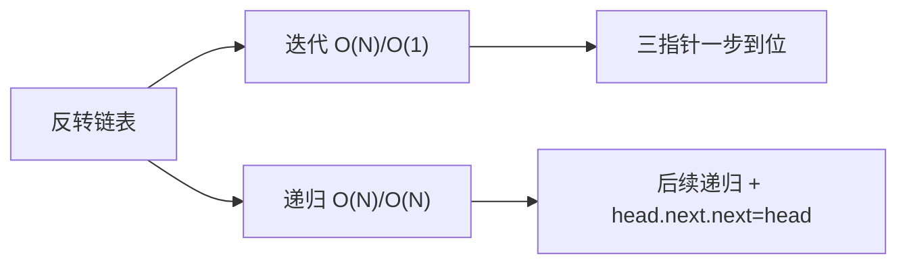
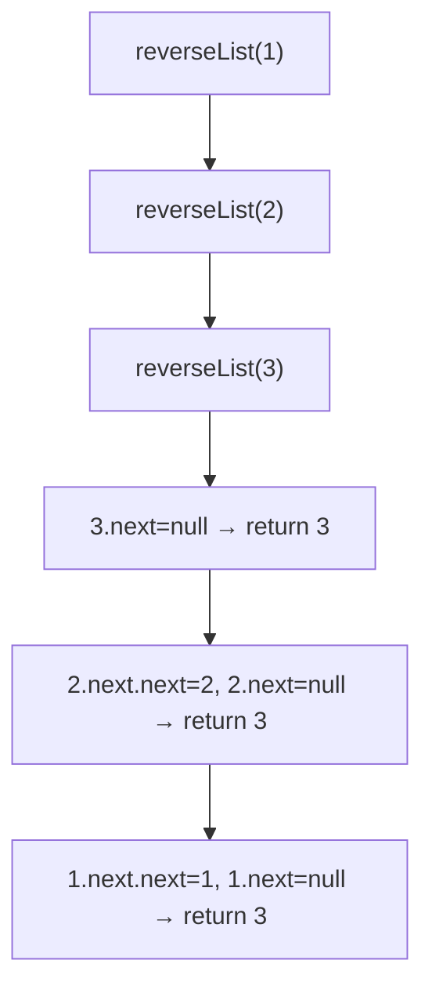
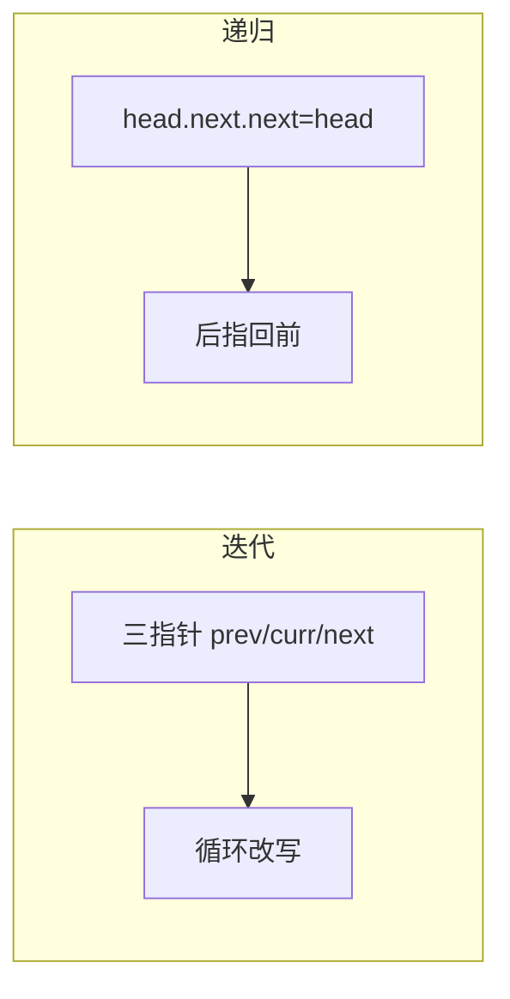

# B001 反转链表（Reverse Linked List）

> LeetCode 206 · ⭐ · 指针操作 / 递归
>
> 链表操作的"Hello World"。迭代和递归两种写法必须烂熟于心。这道题的美妙在于：4 行迭代代码蕴含了链表指针操作的全部精髓。

---

## 01. 题目描述

反转一个单链表。

**示例**：

```
输入：1 → 2 → 3 → 4 → 5 → NULL
输出：5 → 4 → 3 → 2 → 1 → NULL
```

**进阶**：分别用迭代和递归实现。

---

## 02. 题目分析：指针翻转的本质

### 2.1 核心操作

链表的反转本质是**逐个翻转每个节点的 `next` 指针方向**：

```
原链表：  prev  ←  curr  →  next
                  ↓
反转后：  prev  ←  curr  ←  next
```

### 2.2 为什么需要三个指针？

| 指针 | 作用 | 丢失后果 |
|------|------|---------|
| `prev` | 当前节点应指向的新方向 | — |
| `curr` | 正在处理的节点 | — |
| `next` | 暂存下一个节点 | 丢失后半条链！ |

关键：改方向前**必须先保存 next**，否则断链。

### 2.3 解法概览



---

## 03. 解法一：迭代（三指针）

### 3.1 手推演示

```
初始：prev=null, curr=1
      1 → 2 → 3 → null

第1步：next=2, 1.next=null(prev), prev=1, curr=2
      1 → null    2 → 3 → null

第2步：next=3, 2.next=1(prev), prev=2, curr=3
      2 → 1 → null    3 → null

第3步：next=null, 3.next=2(prev), prev=3, curr=null
      3 → 2 → 1 → null

curr=null → 结束，返回 prev(3)
```

### 3.2 代码

**Java**：
```java
public ListNode reverseList(ListNode head) {
    ListNode prev = null, curr = head;
    while (curr != null) {
        ListNode next = curr.next;   // ① 暂存下一个
        curr.next = prev;            // ② 翻转指针
        prev = curr;                 // ③ prev 前进
        curr = next;                 // ④ curr 前进
    }
    return prev;
}
```

**Python**：
```python
def reverseList(self, head: Optional[ListNode]) -> Optional[ListNode]:
    prev, cur = None, head
    while cur:
        nxt = cur.next
        cur.next = prev
        prev, cur = cur, nxt
    return prev
```

**C++**：
```cpp
ListNode* reverseList(ListNode* head) {
    ListNode *prev = nullptr, *cur = head;
    while (cur) {
        ListNode *nxt = cur->next;
        cur->next = prev;
        prev = cur; cur = nxt;
    }
    return prev;
}
```

**复杂度**：时间 O(N)，一次遍历。空间 O(1)，仅三个指针变量。

---

## 04. 解法二：递归

### 4.1 递归思路

不要试图"在脑中展开递归调用栈"。从语义理解：

```
reverseList(head) = 反转以 head 为头的链表，返回新头
```

递归到最后一个节点，逐层让 `head.next.next = head`（让后一个节点指回自己）。



### 4.2 代码

**Java**：
```java
public ListNode reverseList(ListNode head) {
    if (head == null || head.next == null) return head;   // 终止
    ListNode newHead = reverseList(head.next);             // 递归反转后续
    head.next.next = head;                                 // 后指回前
    head.next = null;                                      // 断开原链
    return newHead;
}
```

**Python**：
```python
def reverseList(self, head: Optional[ListNode]) -> Optional[ListNode]:
    if not head or not head.next: return head
    new_head = self.reverseList(head.next)
    head.next.next = head
    head.next = None
    return new_head
```

**C++**：
```cpp
ListNode* reverseList(ListNode* head) {
    if (!head || !head.next) return head;
    ListNode* newHead = reverseList(head->next);
    head->next->next = head;
    head->next = nullptr;
    return newHead;
}
```

**复杂度**：时间 O(N)，空间 O(N)（递归栈深度）。

---

## 05. 两解法对比

| 维度 | 迭代 | 递归 |
|------|:---:|:---:|
| 时间复杂度 | O(N) | O(N) |
| 空间复杂度 | **O(1)** | O(N) |
| 代码行数 | 8 行 | 7 行 |
| 栈溢出风险 | 无 | **长链表易溢出** |
| 思维难度 | ⭐⭐ | ⭐⭐⭐ |
| 面试推荐 | **首选** | 加分项 |

---

## 06. 总结



| 核心启示 | 说明 |
|---------|------|
| 三指针法 | prev/curr/next 是链表操作的黄金搭档 |
| 先存后改 | 改指针前必须先保存 next，防止断链 |
| 递归语义 | 相信递归——它返回的是已反转的后续链表 |
| 反转是基础 | B002/B003/B010/B014 都依赖反转操作 |

**相关题目**：[B002 反转链表II](002-B-反转链表II.md)、[B003 K个一组翻转](003-B-K个一组翻转链表.md)
