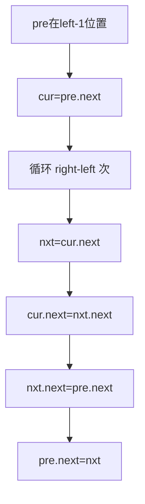

# B002 反转链表 II（区间反转）

> LeetCode 92 · ⭐⭐ · 穿针引线（头插法）

## 01. 题目

`1→2→3→4→5, left=2, right=4` → `1→4→3→2→5`

## 02. 题目分析

### 头插法（穿针引线）

核心思路：固定 `pre` 指向 left 前驱，然后每次把 `cur.next` 插入到 `pre` 后面。



### 手推演示

```
dummy→1→2→3→4→5, left=2, right=4

pre=1, cur=2

轮1: nxt=3, cur.next=4, nxt.next=pre.next=2, pre.next=3
     dummy→1→3→2→4→5

轮2: nxt=4, cur.next=5, nxt.next=pre.next=3, pre.next=4
     dummy→1→4→3→2→5  ← 完成！
```

## 03. 代码

**Java**：
```java
public ListNode reverseBetween(ListNode head, int left, int right) {
    ListNode dummy = new ListNode(0, head);
    ListNode pre = dummy;
    for (int i = 1; i < left; i++) pre = pre.next;   // 走到 left-1
    ListNode cur = pre.next;
    for (int i = 0; i < right - left; i++) {
        ListNode nxt = cur.next;
        cur.next = nxt.next;
        nxt.next = pre.next;
        pre.next = nxt;
    }
    return dummy.next;
}
```

**Python**：
```python
def reverseBetween(self, head, left, right):
    dummy = ListNode(0, head); pre = dummy
    for _ in range(left - 1): pre = pre.next
    cur = pre.next
    for _ in range(right - left):
        nxt = cur.next; cur.next = nxt.next
        nxt.next = pre.next; pre.next = nxt
    return dummy.next
```

**C++**：
```cpp
ListNode* reverseBetween(ListNode* head, int left, int right) {
    ListNode dummy(0, head), *pre = &dummy;
    for (int i = 1; i < left; i++) pre = pre->next;
    ListNode *cur = pre->next;
    for (int i = 0; i < right - left; i++) {
        ListNode *nxt = cur->next; cur->next = nxt->next;
        nxt->next = pre->next; pre->next = nxt;
    }
    return dummy.next;
}
```

**复杂度**：O(N)/O(1)。

## 04. B001/B002/B003 对比

| | B001 全反转 | B002 区间 | B003 K组 |
|------|:---:|:---:|:---:|
| 方法 | 三指针 | **头插法** | 分组+B001 |
| 核心 | prev/cur/next | 插到pre后 | 判别长度+反转 |

**相关**：[B001 反转链表](001-B-反转链表.md)、[B003 K组](003-B-K个一组翻转链表.md)
