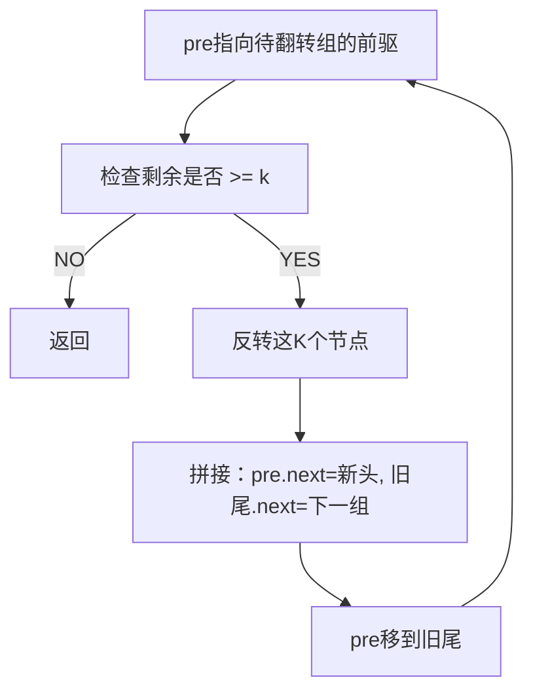

# B003 K 个一组翻转链表

> LeetCode 25 · ⭐⭐⭐ · 分组反转

## 01. 题目

`1→2→3→4→5, k=2` → `2→1→4→3→5`；`k=3` → `3→2→1→4→5`

## 02. 题目分析



## 03. 代码

**Java**：
```java
public ListNode reverseKGroup(ListNode head, int k) {
    ListNode dummy = new ListNode(0, head), pre = dummy;
    while (head != null) {
        ListNode tail = pre;
        for (int i = 0; i < k; i++) {     // ① 检查是否够K个
            tail = tail.next;
            if (tail == null) return dummy.next;
        }
        ListNode nxt = tail.next;          // ② 暂存下一组头
        ListNode[] rev = reverse(head, tail);
        pre.next = rev[0];                 // ③ 接新头
        rev[1].next = nxt;                 // ④ 旧尾接下一组
        pre = rev[1];                      // ⑤ 移动pre
        head = nxt;
    }
    return dummy.next;
}
ListNode[] reverse(ListNode head, ListNode tail) {
    ListNode prev = tail.next, cur = head;
    while (prev != tail) {
        ListNode nxt = cur.next; cur.next = prev; prev = cur; cur = nxt;
    }
    return new ListNode[]{tail, head};
}
```

**Python**：
```python
def reverseKGroup(self, head, k):
    def reverse(h, t):
        prev, cur = t.next, h
        while prev != t: nxt = cur.next; cur.next = prev; prev = cur; cur = nxt
        return t, h
    dummy = ListNode(0, head); pre = dummy
    while head:
        tail = pre
        for _ in range(k):
            tail = tail.next
            if not tail: return dummy.next
        nxt = tail.next; h, t = reverse(head, tail)
        pre.next = h; t.next = nxt; pre = t; head = nxt
    return dummy.next
```

**复杂度**：O(N)/O(1)。

**相关**：[B001 反转链表](001-B-反转链表.md)
