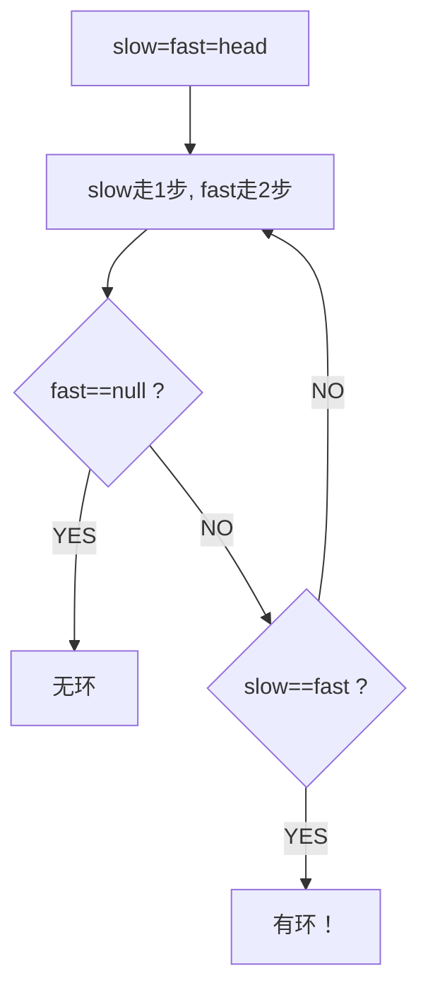
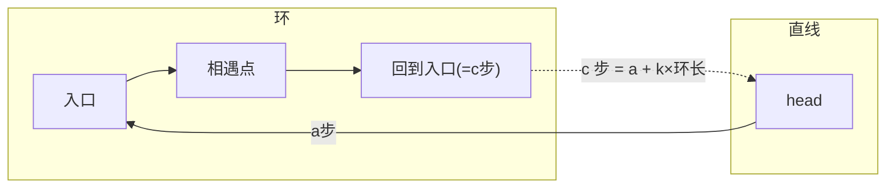

# B004 环形链表 / B005 环形链表 II（找入口）

> LeetCode 141/142 · ⭐/⭐⭐ · 快慢指针（Floyd 判圈算法）

## B004 环形链表 (141)

### 01. 题目

判断链表是否有环。`3→2→0→-4→2↺` → true。

### 02. 题目分析



**为什么快指针一定追得上慢指针？** fast 每次比 slow 多走 1 步，两者距离每次缩小 1——必相遇。

### 03. 代码

```java
public boolean hasCycle(ListNode head) {
    ListNode slow = head, fast = head;
    while (fast != null && fast.next != null) {
        slow = slow.next; fast = fast.next.next;
        if (slow == fast) return true;
    }
    return false;
}
```

**Python**：
```python
def hasCycle(self, head): slow=fast=head; return any((slow:=slow.next, fast:=fast.next.next)[-1]==slow for _ in iter(int,1) if fast and fast.next) or False
```

**复杂度**：O(N)/O(1)。

---

## B005 环形链表 II（找环入口）(142)

### 01. 题目

返回环的入口节点。无环返回 null。

### 02. 题目分析：三步走

```
步骤1：快慢指针找相遇点（同 B004）
步骤2：一个指针从 head 出发，一个从相遇点出发
步骤3：两指针同步前进，相遇处即为环入口
```

### 数学证明

设 head→入口距离 `a`，入口→相遇点距离 `b`，相遇点→入口距离 `c`（环长 = b+c）。

```
慢指针路程 = a + b
快指针路程 = a + b + n(b+c) = 2(a+b)
→ a = c + (n-1)(b+c)
→ a 和 c 相差整数倍环长
→ head 出发和相遇点出发，同步前进，必在入口相遇
```



### 03. 代码

**Java**：
```java
public ListNode detectCycle(ListNode head) {
    ListNode slow = head, fast = head;
    while (fast != null && fast.next != null) {
        slow = slow.next; fast = fast.next.next;
        if (slow == fast) {
            ListNode p = head;
            while (p != slow) { p = p.next; slow = slow.next; }
            return p;
        }
    }
    return null;
}
```

**Python**：
```python
def detectCycle(self, head):
    slow = fast = head
    while fast and fast.next:
        slow, fast = slow.next, fast.next.next
        if slow == fast:
            p = head
            while p != slow: p, slow = p.next, slow.next
            return p
    return None
```

**C++**：
```cpp
ListNode *detectCycle(ListNode *head) {
    ListNode *slow=head,*fast=head;
    while(fast&&fast->next){ slow=slow->next; fast=fast->next->next; if(slow==fast){ ListNode *p=head; while(p!=slow){ p=p->next; slow=slow->next; } return p; } }
    return nullptr;
}
```

**复杂度**：O(N)/O(1)。

### 04. 快慢指针题型总结

| 题目 | 快慢指针用途 |
|------|------------|
| B004 | 判环（相遇即true） |
| B005 | 找环入口（数学推导） |
| B010 | 回文链表（找中点+反转） |
| B011 | 排序链表（找中点分割） |
| B014 | 重排链表（找中点） |

**相关**：[B010 回文链表](010-B-回文链表.md)、[B014 重排链表](014-B-重排链表.md)
