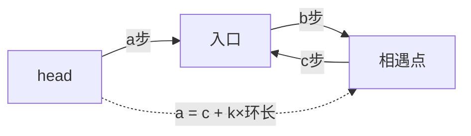

# B005 环形链表 II（找环入口）

> LeetCode 142 · ⭐⭐ · 快慢指针+数学推导

## 01. 题目

如果有环，返回环的入口节点；无环返回 null。

## 02. 题目分析

### 三步走

```
步骤1：快慢指针找相遇点（同 B004）
步骤2：一个指针从 head 出发，一个从相遇点出发
步骤3：两指针同步前进，相遇处即为入口
```

### 数学证明

设 head→入口距离 `a`，入口→相遇点距离 `b`，相遇点→入口距离 `c`。

```
慢指针路程 = a + b
快指针路程 = a + b + n(b+c) = 2(a+b)
→ a = c + (n-1)(b+c)
→ a 和 c 相差整数倍环长
→ head 出发和相遇点出发，相遇在入口
```



## 03. 代码

**Java**：
```java
public ListNode detectCycle(ListNode head) {
    ListNode slow = head, fast = head;
    while (fast != null && fast.next != null) {
        slow = slow.next; fast = fast.next.next;
        if (slow == fast) {
            ListNode p = head;
            while (p != slow) { p = p.next; slow = slow.next; }
            return p;
        }
    }
    return null;
}
```

**Python**：
```python
def detectCycle(self, head):
    slow = fast = head
    while fast and fast.next:
        slow, fast = slow.next, fast.next.next
        if slow == fast:
            p = head
            while p != slow: p, slow = p.next, slow.next
            return p
    return None
```

**C++**：
```cpp
ListNode *detectCycle(ListNode *head) {
    ListNode *slow=head,*fast=head;
    while(fast&&fast->next){
        slow=slow->next; fast=fast->next->next;
        if(slow==fast){ ListNode *p=head; while(p!=slow){ p=p->next; slow=slow->next; } return p; }
    }
    return nullptr;
}
```

**复杂度**：O(N)/O(1)。

## 04. 总结

| 核心 | 说明 |
|------|------|
| Floyd判圈 | slow走1步, fast走2步, 有环必相遇 |
| 入口公式 | a = c + k(b+c)，两指针同步走 |
| O(1)空间 | 不需哈希表，纯指针操作 |

**相关**：[B004 环形链表](004-B-环形链表.md)
